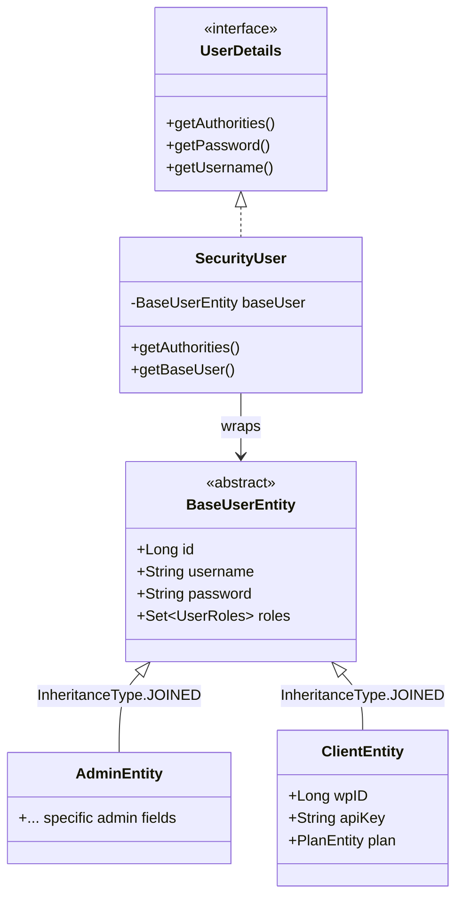
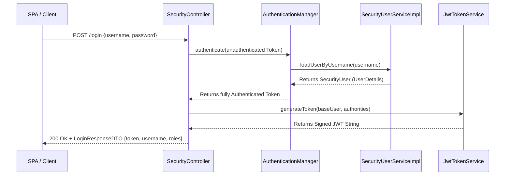
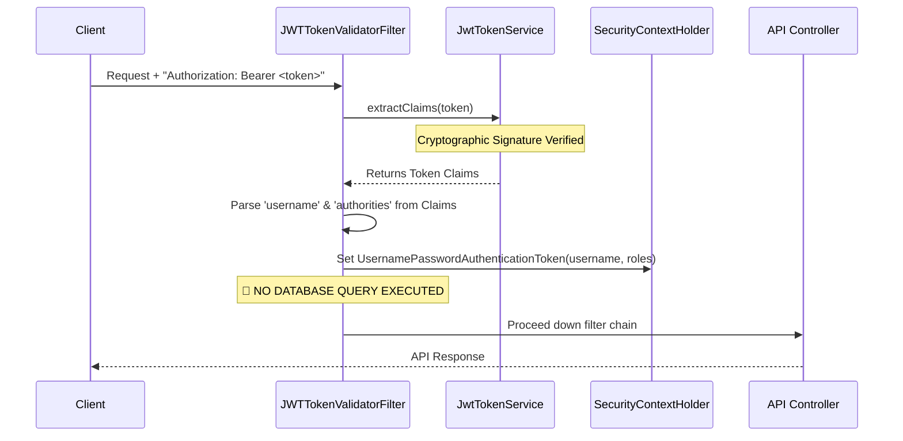

# Login and Security Architecture

## Table of Contents
1. [Executive Summary](#executive-summary)
2. [Core Domain Model](#core-domain-model)
3. [Security Configuration & Filter Chain](#security-configuration--filter-chain)
4. [The Login Flow (Authentication)](#the-login-flow-authentication)
5. [JWT Token Management](#jwt-token-management)
6. [Stateless Request Validation (Authorization)](#stateless-request-validation-authorization)
7. [Service-Level Authorization & User Context](#service-level-authorization--user-context)
8. [Secret and Environment Management](#secret-and-environment-management)
9. [Component Reference](#component-reference)

---

## Executive Summary

The WP Manager application employs a robust, stateless security architecture based on **Spring Security** and **JSON Web Tokens (JWT)**. Designed for performance and security, the system eliminates unnecessary database queries during token validation, strictly manages cryptographic secrets with a "fail-fast" approach, and implements a modernized JSON-based login flow tailored for Single Page Applications (SPAs).

### Key Architectural Pillars
- **Statelessness**: The application maintains zero session state (`SessionCreationPolicy.STATELESS`). Every request is authenticated entirely via the provided JWT.
- **Optimized Validation**: Token validation is 100% self-contained. The system reconstructs user roles directly from JWT claims, resulting in **zero database hits** for standard authenticated requests.
- **Separation of Concerns**: Security responsibilities are strictly divided. Controllers orchestrate the login, the `AuthenticationManager` verifies credentials, and the `JwtTokenService` exclusively handles cryptographic token operations.
- **Polymorphic Domain**: A unified `BaseUserEntity` allows the security layer to authenticate multiple user types (e.g., `AdminEntity`, `ClientEntity`) transparently.

---

## Core Domain Model

The architecture utilizes a JPA inheritance strategy to manage different types of users while presenting a unified interface to Spring Security.



1. **`BaseUserEntity`**: The foundational abstract JPA entity containing core authentication fields (username, password, roles, account status flags). It uses `InheritanceType.JOINED` to map subclasses.
2. **`AdminEntity` & `ClientEntity`**: Domain-specific implementations extending `BaseUserEntity`.
3. **`SecurityUser`**: An adapter class that implements Spring Security's `UserDetails` interface. It wraps a `BaseUserEntity` instance, perfectly decoupling the JPA domain model from Spring Security's strict contract.

---

## Security Configuration & Filter Chain

The `SecurityConfig` is the central hub for defining how HTTP requests are processed, secured, and rejected.

### The Filter Chain Shape

```mermaid
flowchart TD
    Req[Incoming HTTP Request] --> CORS[CORS Filter]
    CORS --> JWT[JWTTokenValidatorFilter]
    JWT --> BAF[BasicAuthenticationFilter (Disabled)]
    BAF --> Dispatcher[Spring Dispatcher Servlet]
    Dispatcher --> Controllers[API Endpoints]
```

- **Stateless Policy**: `sessionCreationPolicy(SessionCreationPolicy.STATELESS)` dictates that Spring will not create or use HTTP Sessions.
- **`JWTTokenValidatorFilter`**: Injected *before* the standard `BasicAuthenticationFilter`. It intercepts all requests (except `/login`), validates the JWT, and establishes the `SecurityContext`.
- **CORS Configuration**: Restricts access explicitly to the trusted frontend (`http://localhost:3000`), explicitly defines allowed methods (`GET, POST, PUT, DELETE`), and exposes the `Authorization` header so the SPA can read the token.

### Standardized Exception Handling
Instead of returning Spring's default HTML error pages, the configuration utilizes custom handlers (`authenticationEntryPoint` and `accessDeniedHandler`) to return strictly structured JSON responses (`ErrorHTTPRes`) for 401 Unauthorized and 403 Forbidden errors.

---

## The Login Flow (Authentication)

The application utilizes a modern, JSON-based login process orchestrated by the `SecurityController`.



1. **Request Reception**: The `/login` endpoint receives a JSON `LoginForm`.
2. **Delegated Authentication**: The Controller passes an unauthenticated token to the `AuthenticationManager`. Under the hood, this triggers `SecurityUserServiceImpl` to query the database, retrieve the user, and verify the hashed password using `BCryptPasswordEncoder`.
3. **Token Generation**: Upon success, the Controller passes the authenticated `SecurityUser` to the `JwtTokenService` to craft the token.
4. **Structured Response**: A `LoginResponseDTO` containing the generated token and core user details is returned to the client.

---

## JWT Token Management

The `JwtTokenService` is the sole authority for cryptographic token operations.

### Fail-Fast Secret Management
The application strictly enforces the presence of a cryptographic secret. In `JwtTokenService`:
```java
@Value("${tk.key}") // Property resolved from environment
private String secretFromEnv;
```
There is **no fallback default**. If the environment variable mapping to this property is missing, the Spring Application Context will deliberately fail to start. This "fail-fast" mechanism prevents accidental deployments with insecure, hardcoded default keys.

### Token Structure
When generating a token, the service injects critical state directly into the JWT payload (claims):
- `subject`: Standard JWT subject identifier.
- `id`: The user's database ID.
- `username`: The user's unique username.
- `authorities`: A serialized list of the user's roles (e.g., `[{"authority": "ROLE_ADMIN"}]`).
- `expiration`: Set to 24 hours from the time of issue.

---

## Stateless Request Validation (Authorization)

The `JWTTokenValidatorFilter` represents a major performance optimization in the architecture.



**How it works:**
1. **Extraction**: Extracts the `Bearer` token from the `Authorization` header.
2. **Cryptographic Validation**: Delegates to `JwtTokenService.extractClaims()`. If the token is expired, tampered with, or signed with a different key, this throws an exception, instantly returning a 401 Unauthorized response.
3. **Stateless Rehydration**: Instead of querying the database to find the user's roles, the filter parses the `username` and the `authorities` directly from the validated JWT claims.
4. **Context Population**: It creates a `UsernamePasswordAuthenticationToken` using just the string `username` as the Principal and the parsed authorities, then injects this into the `SecurityContext`.

**Result**: Protected endpoints that simply require a role check (e.g., `@PreAuthorize("hasRole('ADMIN')")`) execute with zero database overhead.

---

## Service-Level Authorization & User Context

While the filter is stateless, specific business logic often requires the actual JPA entity (e.g., to manipulate relationships like a client's favorite list).

This is handled smoothly by `AuthUserUtil`, which provides **On-Demand DB Queries**.

### Mechanism
1. `AuthUserUtil.getAuthUsername()` safely extracts the username (String) from the current stateless `SecurityContext`.
2. When a service calls `getAuthUserClientEntity()` or `getAuthUserAdminEntity()`, the utility uses that username to query the respective repository.

### Benefits
- **Performance**: The database is only queried *when a service explicitly asks for the JPA entity*, rather than on every single API request hitting the server.
- **Consistency**: Role-based access control annotations (`@PreAuthorize`) function natively against the Spring Security context populated by the JWT filter, requiring no custom logic in the controllers.

---

## Secret and Environment Management

For the system to function, the environment must provide the cryptographic signing key.

### Required Variables
- `TK_KEY` (or the specific environment variable mapped in `application.properties` to `ApplicationConstants.TK_ENV_KEY`): **Mandatory.** Must be a highly secure, randomly generated string (minimum 32 characters, preferably generated via OpenSSL or a secure password manager).

### CORS and Origin Restrictions
The application specifically trusts `http://localhost:3000` (the typical React SPA default). In production environments, this `SecurityConfig` CORS configuration must be updated to reflect the actual production domain of the frontend application to prevent Cross-Site Request Forgery (CSRF) and unauthorized access.

---

## Component Reference

For AI models and developers navigating the codebase, here is the mapping of architectural concepts to physical files:

### Configuration & Entry Points
- `src/main/java/com/wpmanager/configuration/security/SecurityConfig.java`: Central filter chain, CORS, and exception handling.
- `src/main/java/com/wpmanager/configuration/security/SecurityController.java`: The `/login` endpoint orchestration.
- `src/main/java/com/wpmanager/configuration/security/LoginForm.java` & `LoginResponseDTO.java`: DTOs for the login contract.

### JWT & Filters
- `src/main/java/com/wpmanager/configuration/filter/JwtTokenService.java`: Cryptographic token generation and parsing; fail-fast secret enforcement.
- `src/main/java/com/wpmanager/configuration/filter/JWTTokenValidatorFilter.java`: Stateless interception and Spring Security Context population.

### Domain & Database
- `src/main/java/com/wpmanager/shared/models/baseUser/BaseUserEntity.java`: Root abstract entity.
- `src/main/java/com/wpmanager/shared/securityUser/SecurityUser.java`: `UserDetails` adapter.
- `src/main/java/com/wpmanager/shared/securityUser/SecurityUserServiceImpl.java`: `UserDetailsService` implementation for the login phase.
- `src/main/java/com/wpmanager/shared/tools/AuthUserUtil.java`: On-demand entity loading utility for services.