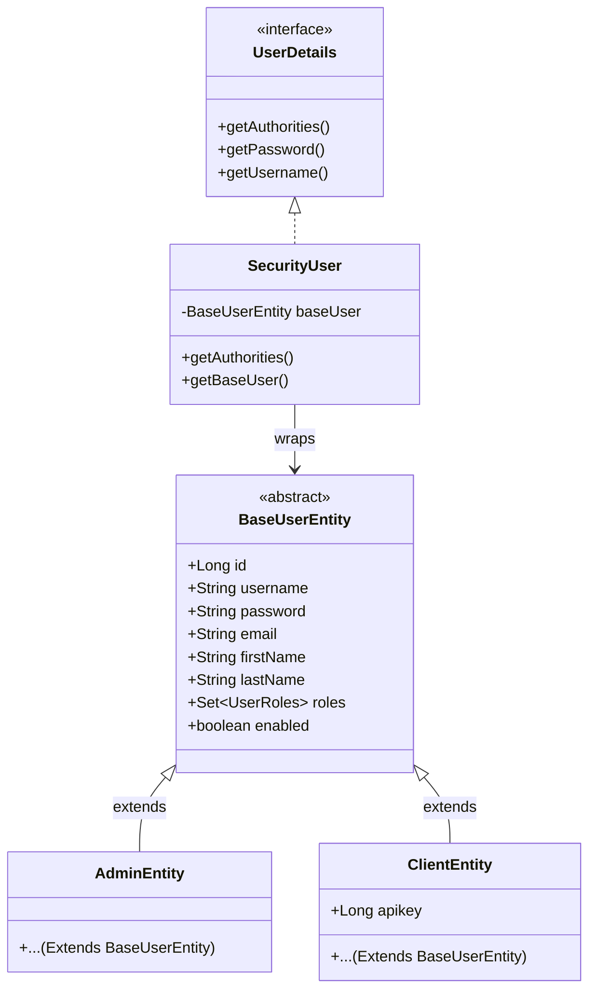

# Reusable Login System Architecture

## Table of Contents
1. [Overview](#overview)
2. [Domain Model (User Hierarchy)](#domain-model-user-hierarchy)
3. [Authentication (The Login Flow)](#authentication-the-login-flow)
4. [Authorization (Stateless JWT Validation)](#authorization-stateless-jwt-validation)
5. [Configuration and Environment Variables](#configuration-and-environment-variables)

---

## Overview

This project is a standalone, reusable authentication server. It was extracted and refactored from a larger application to provide a generalized, robust, and stateless security layer based on **Spring Security** and **JSON Web Tokens (JWT)**.

Its primary design goal is to serve as a foundational template for new applications requiring secure, multi-role user management without session overhead (`SessionCreationPolicy.STATELESS`).

## Domain Model (User Hierarchy)

The system leverages JPA Inheritance (`InheritanceType.JOINED`) to allow multiple user types to share a single authentication process while maintaining their own distinct database schemas for extra attributes.

### Core Components:
1. **`BaseUserEntity`**: The foundational abstract entity mapping the `base_user` table. It contains standard authentication fields (username, password, roles, account flags).
2. **Sub-Entities (`AdminEntity`, `ClientEntity`)**: Specific user implementations that extend `BaseUserEntity`. They can be freely modified or expanded based on the domain needs of the application adopting this module.
3. **`SecurityUser`**: Adapts `BaseUserEntity` into Spring Security's `UserDetails` contract.

## Authentication (The Login Flow)

The application handles login strictly via a REST API endpoint tailored for frontend clients (SPAs, mobile apps, etc.).

1. **Request Reception**: `SecurityController` listens for `POST /login` with a JSON body containing `username` and `password` (mapped to `LoginForm`).
2. **Verification**: `AuthenticationManager.authenticate()` is invoked. This delegates to `SecurityUserServiceImpl`, which fetches the `BaseUserEntity` from the database and verifies the password hashes.
3. **Token Generation**: Upon valid credentials, `JwtTokenService` generates a signed JWT. The token encapsulates:
   - Subject (`UP_TK` by default)
   - User ID
   - Username
   - Roles / Authorities
4. **Response**: The server returns a `LoginResponseDTO` containing the generated token, the username, and the user's roles. It also exposes the token in the `Authorization` HTTP header.

## Authorization (Stateless JWT Validation)

All secured requests are intercepted by the `JWTTokenValidatorFilter`, which validates the token and establishes the `SecurityContext`.

1. **Stateless Setup**: `SecurityConfig` completely disables HTTP sessions. 
2. **Extraction**: `JWTTokenValidatorFilter` checks for the `Bearer <token>` in the `Authorization` header.
3. **Validation & Context Population**: 
   - `JwtTokenService.extractClaims()` cryptographically verifies the token using the secret key.
   - The filter rehydrates the `UsernamePasswordAuthenticationToken` using the roles/authorities directly embedded inside the JWT.
   - **Crucially:** No database queries are performed during token validation, maximizing performance on authenticated requests.

## Configuration and Environment Variables

The auth server mandates strict environment-based configuration for cryptographic operations.

| Environment Variable / Property | Description | Source Code Reference |
|---|---|---|
| `TK_KEY` | **Mandatory.** The secret key used to sign and verify JWT tokens. Must be at least 32 characters long. Set via the environment for fail-fast startup behavior. | `ApplicationConstants.TK_ENV_KEY`, `JwtTokenService` |
| `file.signature.secret` | **Mandatory.** Used by `FileSigner` (if file upload validation modules are utilized). Also strictly validated on application boot to prevent insecure defaults. | `FileSigner.java` |

### CORS Details
By default, `SecurityConfig` is configured to interact with a standard local React application:
- **Allowed Origin:** `http://localhost:3000`
- **Exposed Headers:** `Authorization`
When deploying, remember to update the `CorsConfigurationSource` to reflect your target production domains.
