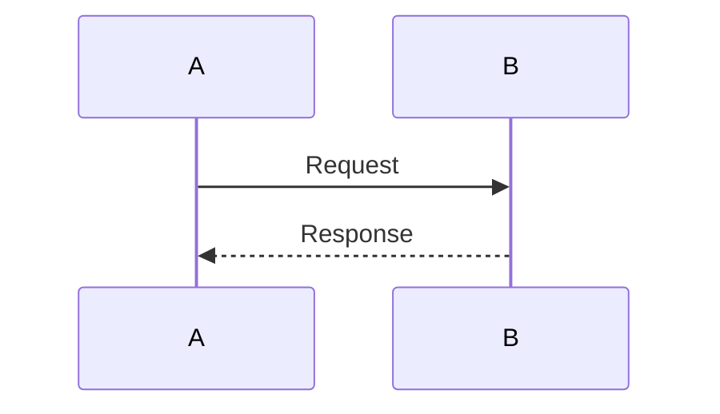
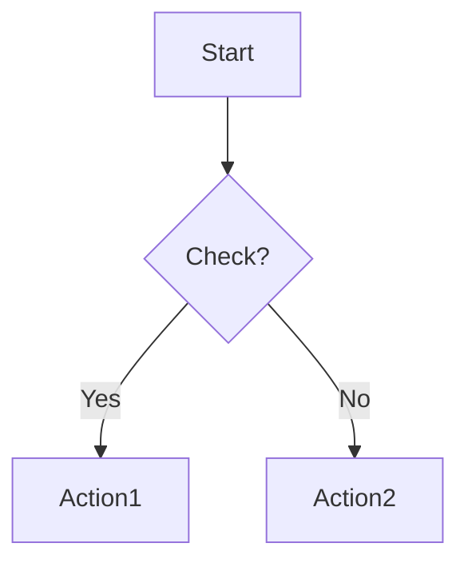
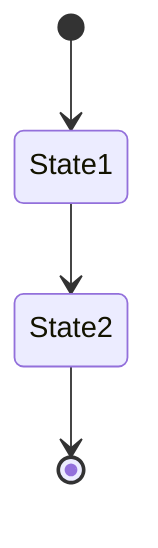

# System/Process Documentation Rules

## Purpose

Docs files explain how systems, workflows, and processes work in the application.

- Describe **systems and workflows**, not individual code files
- Explain how multiple components work together
- Show the flow of actions through the system
- Include diagrams (Mermaid.js) for visual representation

---

## Required Structure

```markdown
## Table of Contents
1. [Overview](#overview)
2. [Key Entities](#key-entities)
3. [Architecture](#architecture)
4. [Process Flow](#process-flow)
[... more sections ...]

---

## Overview
[High-level explanation in easy-to-understand language]

### Core Concepts
[Key concepts explained]

---

## Key Entities
[List and explain all entities involved]

### 1. EntityName
[Description with links to code]

---

## [System Name] Architecture
[Detailed architecture explanation]

### Diagrams
```mermaid
flowchart TD
    [Diagram here]
```

---

## [Process Name] Flow
[Step-by-step process explanation]

### Step 1: [Step Name]
**Location**: [Link to code file:line]
[Explanation]

---

## Technical Implementation Details
[Deep dive into technical aspects]

---

## Related Files
[Complete list of all related files organized by type]

### Controllers
- [Link to file] - Description

### Services
- [Link to file] - Description

[... etc ...]
```

---

## Requirements

- Use **easy-to-understand language**
- Include **Mermaid.js diagrams** for complex flows
- Link to **all related code files** in `docs/Code/` directory
- Reference actual source code files by showing the path from project root with line numbers when referencing specific implementations: `src/main/java/com/wpmanager/path/to/File.java:123`
- Organize related files by component type (Controllers, Services, Entities, etc.)
- Don't describe how a single code file works (that's for `docs/Code/`)
- Focus on **how the system works as a whole**

---

## Link Requirements

- Link to code explanation files using Obsidian syntax: `[[PluginService-java]]`
- Reference actual source code files by showing the path from project root: `src/main/java/com/wpmanager/path/to/File.java:123`
- Link to related process documentation: `[[Other Process Documentation]]`

---

## Diagram Requirements

Use Mermaid.js for visualizations:

**Sequence Diagrams** - For showing interactions between components:


**Flowcharts** - For showing process flows:


**State Diagrams** - For showing state transitions:


---

## Organization by Component Type

Always organize related files by their role:

### Controllers
- List REST controllers

### Services
- List business logic services

### Repositories
- List data access repositories

### Entities
- List domain models

### DTOs
- List data transfer objects

### Utilities
- List helper classes