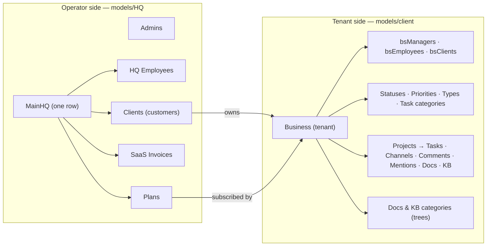

# Overview and Design Philosophy — BugTracker

#doc #explanation #ref-bugtracker #architecture

**Project:** `BugTracker/` · **Stack:** Spring Boot 2.7.0, Java 17 (effective) · **Index:** [[Docs/BugTracker/BugTracker-Index]]

## Summary

BugTracker is the backend of a **two-sided project-management SaaS**. One side, `models/HQ`, is the
operator: a single *MainHQ* that sells *plans* to *clients*, employs *HQ employees* and *admins*, and
issues SaaS *invoices*. The other side, `models/client`, is the tenant workspace: every customer
*Business* owns its own users, projects, tasks, channels, comments, documents, knowledge base and its own
configurable statuses, priorities, types and task categories. The code is the oldest and largest of the
three reference projects (341 main Java files, about 17.7k lines, 32 JPA entities, 29 feature modules).
The one idea to take away: **every entity gets the same ten-file module plugged into a generic CRUD and
filtering framework**, and the business value lives in the domain model, not in the framework.

## Why It Is Built This Way

### Stated intent

The code states little intent outright. What it does state:

- The project was generated from Spring Initializr as "BugTracker" (`BugTracker/pom.xml:11-15`) and still
  ships the Initializr `HELP.md` (`BugTracker/HELP.md`).
- The token issuer is named `"ProjectManager"`
  (`BugTracker/src/main/java/com/bgsystem/bugtracker/configuration/filter/JWTTokenGeneratorFilter.java:54`),
  which matches what the domain actually is: a project manager, not only a bug tracker.
- Service comments narrate each insert step ("Check if the associated business exists", "Start setting the
  external entities to the task")
  (`BugTracker/src/main/java/com/bgsystem/bugtracker/models/client/project/bsPrTask/bsPrTaskServiceImplements.java:75-110`).
- Three services carry comments that admit a workaround: "Bug: is necessary to sout the roles … to return
  the correct DTO" (`BugTracker/src/main/java/com/bgsystem/bugtracker/models/HQ/admin/AdminServiceImplements.java:70-71`).

### Inferred design philosophy

Read from the structure, five principles recur:

1. **Maximal convention.** Every entity has the same file set — Controller, Entity, Form, DTO, MiniDTO,
   ListDTO, Mapper, Predicate, Repository, ServiceImplements — for example the ten files under
   `BugTracker/src/main/java/com/bgsystem/bugtracker/models/client/project/bsPrTask/`. A developer never
   decides *where* code goes; only *what* goes in each slot.
2. **Generic CRUD with override hooks.** `DefaultController` publishes eight endpoints once
   (`BugTracker/src/main/java/com/bgsystem/bugtracker/shared/controller/DefaultController.java:25-81`), and
   `DefaultServiceImplements` gives every module a default for each operation that a module overrides when it
   needs real behavior (`BugTracker/src/main/java/com/bgsystem/bugtracker/shared/service/DefaultServiceImplements.java:33-162`).
   Most modules override only `insert`.
3. **Rich filtering for grid UIs.** Every module can be queried with a JSON filter/sort/page request
   (`BugTracker/src/main/java/com/bgsystem/bugtracker/shared/models/pageableRequest/PageableRequest.java:19-51`),
   translated to QueryDSL by a reflective base class plus a per-module predicate for association fields
   (`BugTracker/src/main/java/com/bgsystem/bugtracker/shared/models/listRequest/CommonPathExpression.java:13-53`).
4. **Tenant-configurable taxonomies.** Status, priority, type and task category are entities owned by a
   Business, not enums (`BugTracker/src/main/java/com/bgsystem/bugtracker/models/client/bsStatus/bsStatusEntity.java`),
   so each tenant defines its own workflow vocabulary.
5. **Denormalized counters for list views.** Entities carry `xxxCount` columns (for example
   `taskCount`, `bsPrTaskCount`) recomputed by an `updateListFields` hook before list DTOs are built
   (`BugTracker/src/main/java/com/bgsystem/bugtracker/shared/service/DefaultServiceImplements.java:127-162`),
   so a grid can show "12 tasks" without the client counting.

Security follows the same "one place" idea: a single filter chain requires authentication for every
request, and a Basic login returns a JWT that later requests present
(`BugTracker/src/main/java/com/bgsystem/bugtracker/configuration/security/SecurityConfig.java:32-45`).

### Lineage

BugTracker is the **ancestor** of the generic CRUD stack that wpmanager and `backend/` inherited. The
three `DefaultController` classes share the same shape — abstract, generic, constructor-injected
service, `GET /{id}`, `GET ""`, `POST`, `PUT /{id}`, `DELETE /{id}`:

- BugTracker: five type parameters `<DTO, MINIDTO, LISTDTO, FORM, ID>` and eight endpoints, including
  `POST /list`, `POST /page` and `POST /page-list-view`
  (`BugTracker/src/main/java/com/bgsystem/bugtracker/shared/controller/DefaultController.java:17-81`).
- wpmanager: four type parameters `<DTO, MINIDTO, FORM, ID>` — the list tier and the three list/page
  endpoints are gone (`wpmanager/src/main/java/com/wpmanager/shared/defaultImplements/DefaultController.java:14-45`).
- `backend/`: back to five type parameters with a single `POST /list` that returns `Page<LISTDTO>`
  (`backend/src/main/java/com/agentForgeBackend/shared/defaultImplements/DefaultController.java:17-39`).

The base `update` that loads the entity and saves it without applying the form appears in all three
(`BugTracker/src/main/java/com/bgsystem/bugtracker/shared/service/DefaultServiceImplements.java:55-65`,
`wpmanager/src/main/java/com/wpmanager/shared/defaultImplements/DefaultServiceImplements.java:60-62`),
so that defect is inherited, not introduced later. wpmanager adds an explicit rollback list for its checked
exceptions (`wpmanager/src/main/java/com/wpmanager/shared/defaultImplements/DefaultServiceImplements.java:17-22`),
which BugTracker lacks. BugTracker's filter engine — a reflective `CommonPathExpression` plus a hand-written
`XPredicate` per module — is the predecessor of `backend/`'s whitelist-based `shared/query` engine
(`backend/src/main/java/com/agentForgeBackend/shared/query/QueryableField.java`). What BugTracker has and its
descendants dropped: the HQ/tenant domain, the collaboration features and the denormalized counters.

## How It Works

A typical request: an Angular front end on `http://localhost:4200`
(`BugTracker/src/main/java/com/bgsystem/bugtracker/configuration/security/SecurityConfig.java:47-56`) calls
`GET /login` with HTTP Basic, receives a JWT in the `Authorization` response header, and sends it on every
later call such as `POST /bs_pr_task/page-list-view` with a filter body. The generic controller forwards to
the module's service, which runs the QueryDSL predicate, refreshes counters and maps entities to list DTOs.

### Stack

| Area | Choice | Source |
|---|---|---|
| Framework | Spring Boot 2.7.0 (parent POM) | `BugTracker/pom.xml:5-10` |
| Language level | `java.version` 11, but compiler `source`/`target` 17 | `BugTracker/pom.xml:16-18`, `BugTracker/pom.xml:183-190` |
| Persistence | Spring Data JPA, Hibernate 5.6 (managed by Boot 2.7), `javax.persistence` | `BugTracker/pom.xml:29-32`, `BugTracker/src/main/java/com/bgsystem/bugtracker/shared/models/user/User.java:7` |
| Database | MySQL (runtime driver) | `BugTracker/pom.xml:72-76`, `BugTracker/src/main/resources/application.properties:5` |
| Querying | QueryDSL 5 (`com.querydsl`) with `apt-maven-plugin` | `BugTracker/pom.xml:136-144`, `BugTracker/pom.xml:154-169` |
| Security | Spring Security 5.7, JJWT 0.11.2 | `BugTracker/pom.xml:49-52`, `BugTracker/pom.xml:108-126` |
| Boilerplate | Lombok | `BugTracker/pom.xml:82-86` |
| Tests | `spring-boot-starter-test`, one test | `BugTracker/src/test/java/com/bgsystem/bugtracker/BugTrackerApplicationTests.java:6-13` |

## Key Components

| Component | Path | Responsibility |
|---|---|---|
| Application | `BugTracker/src/main/java/com/bgsystem/bugtracker/BugTrackerApplication.java` | Boot entry point |
| Generic CRUD stack | `BugTracker/src/main/java/com/bgsystem/bugtracker/shared/controller/`, `BugTracker/src/main/java/com/bgsystem/bugtracker/shared/service/` | Eight endpoints and default service behavior for every module |
| Filter engine | `BugTracker/src/main/java/com/bgsystem/bugtracker/shared/models/listRequest/` | JSON filter → QueryDSL `BooleanExpression` |
| Operator domain | `BugTracker/src/main/java/com/bgsystem/bugtracker/models/HQ/` | MainHQ, admins, HQ employees, plans, clients, SaaS invoices |
| Tenant domain | `BugTracker/src/main/java/com/bgsystem/bugtracker/models/client/` | Business and everything a tenant owns |
| Security | `BugTracker/src/main/java/com/bgsystem/bugtracker/configuration/` | Filter chain, Basic login, JWT issue and validation |
| Seeder | `BugTracker/src/main/java/com/bgsystem/bugtracker/shared/tools/firstInstallCheck.java` | Creates MainHQ, admin, plan, client and business on an empty database |

## Conventions and Rules

- Tenant-side packages and classes carry a `bs` prefix (business) and project-scoped ones `bsPr`
  (`BugTracker/src/main/java/com/bgsystem/bugtracker/models/client/project/bsPrTask/bsPrTaskEntity.java:27`);
  many class names therefore start with a lower-case letter.
- Every module follows the ten-file set; see [[Docs/BugTracker/Explanations/03-Package-Structure-and-Module-Anatomy]].
- Associations travel as `Long` ids in Forms and as MiniDTOs in responses; see
  [[Docs/BugTracker/Explanations/05-DTO-Tiers-and-Mapping]].
- Anything tenant-owned references `BusinessEntity` through a mandatory `business` many-to-one
  (`BugTracker/src/main/java/com/bgsystem/bugtracker/models/client/project/bsPrTask/bsPrTaskEntity.java:54-56`).

## How to Replicate

1. Create a Boot project with web, security, data-jpa, validation, Lombok, QueryDSL and JJWT
   ([[Docs/BugTracker/Explanations/02-Build-Tooling-and-Dependencies]]).
2. Build the shared generic stack and filter engine first
   ([[Docs/BugTracker/Explanations/04-Generic-CRUD-Framework]],
   [[Docs/BugTracker/Explanations/06-Dynamic-Filtering-and-Pagination]]).
3. Model the operator side, then the tenant root `Business`, then tenant modules
   ([[Docs/BugTracker/Explanations/07-Domain-Model]]).
4. Wire security and seeding ([[Docs/BugTracker/Explanations/10-Authentication-and-Authorization]],
   [[Docs/BugTracker/Explanations/13-Configuration-and-Bootstrap]]).
5. Follow the full recipe in [[Docs/BugTracker/Explanations/14-Recipe-Build-a-Project-This-Way]].

## Known Limitations

The overall posture has three structural gaps, each detailed in the reviews: authorization is
authentication-only ([[Docs/BugTracker/Reviews/01-Security-and-Multi-Tenancy-Review#BT-R01-01|BT-R01-01]]),
nothing isolates one tenant's data from another
([[Docs/BugTracker/Reviews/01-Security-and-Multi-Tenancy-Review#BT-R01-02|BT-R01-02]]), and the base `update`
ignores the request body ([[Docs/BugTracker/Reviews/02-CRUD-Framework-and-API-Design-Review#BT-R02-01|BT-R02-01]]).
The whole review set is summarized in [[Docs/BugTracker/Reviews/00-Review-Summary]].

## Related Documents

- [[Docs/BugTracker/BugTracker-Index]]
- [[Docs/BugTracker/Explanations/03-Package-Structure-and-Module-Anatomy]]
- [[Docs/BugTracker/Explanations/07-Domain-Model]]
- [[Docs/BugTracker/Reviews/00-Review-Summary]]
- [[Docs/backend/Explanations/01-Overview-and-Design-Philosophy]] — the descendant project
