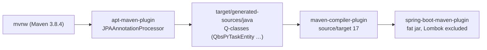

# Build, Tooling and Dependencies — BugTracker

#doc #explanation #ref-bugtracker #build

**Project:** `BugTracker/` · **Stack:** Spring Boot 2.7.0, Java 17 (effective) · **Index:** [[Docs/BugTracker/BugTracker-Index]]

## Summary

BugTracker is a single-module Maven project on the Spring Boot 2.7.0 parent, built with the Maven wrapper
(Maven 3.8.4). The POM declares twelve Spring Boot starters, of which six are used by code; the rest are
Initializr leftovers. QueryDSL Q-classes are generated by the old `com.mysema.maven:apt-maven-plugin` into
`target/generated-sources/java`. The one idea to take away: **the effective language level is Java 17
(set on the compiler plugin), even though the `java.version` property says 11**, and the code depends on it.

## Why It Is Built This Way

No build intent is written down; `BugTracker/HELP.md` is the unmodified Initializr help page. The POM
reads as an Initializr project with "everything that might be useful" ticked (batch, quartz, mail,
web-services, data-rest, data-jdbc), to which the developer later added JJWT and QueryDSL by hand — the
QueryDSL block even carries a hand-written comment "QueryDSL Dependecy" (`BugTracker/pom.xml:135`) and a
commented-out JPA metamodel generator (`BugTracker/pom.xml:128-132`), which suggests the developer tried
the JPA Criteria metamodel before settling on QueryDSL.

## How It Works

### Build pipeline

- The wrapper pins Maven 3.8.4 (`BugTracker/.mvn/wrapper/maven-wrapper.properties:1`).
- `apt-maven-plugin` 1.1.3 runs `com.querydsl.apt.jpa.JPAAnnotationProcessor` in the `process` goal and
  writes Q-classes to `target/generated-sources/java` (`BugTracker/pom.xml:154-169`). The generated tree
  exists in the last build output, e.g.
  `BugTracker/target/generated-sources/java/com/bgsystem/bugtracker/models/client/project/bsPrTask/QbsPrTaskEntity.java`.
- The compiler plugin overrides the language level to 17 (`BugTracker/pom.xml:183-190`); the
  `java.version` property is 11 (`BugTracker/pom.xml:16-18`). The Boot parent maps `java.version` to the
  compiler's `release`/`source` defaults, but the explicit plugin configuration wins for compilation.
- The Boot plugin excludes Lombok from the fat jar (`BugTracker/pom.xml:171-182`).

### Evidence that Java 16+ is required

- A `switch` expression with arrow labels (Java 14+):
  `BugTracker/src/main/java/com/bgsystem/bugtracker/shared/models/listRequest/CommonPathExpression.java:120-125`.
- `Stream.toList()` (Java 16+):
  `BugTracker/src/main/java/com/bgsystem/bugtracker/shared/service/DefaultServiceImplements.java:83-85`.
- The last compiled classes are class-file version 61 (Java 17), e.g.
  `BugTracker/target/classes/com/bgsystem/bugtracker/BugTrackerApplication.class`, while the last recorded
  test run was on Java 16.0.2 (`BugTracker/target/surefire-reports/TEST-com.bgsystem.bugtracker.BugTrackerApplicationTests.xml:49`).

The code would not compile at the declared `java.version` 11.

### Dependencies — used or unused

Checked by searching `BugTracker/src` for each library's packages.

| Dependency | Declared at | Used? | Evidence |
|---|---|---|---|
| `spring-boot-starter-web` | `BugTracker/pom.xml:57-60` | Used | every `@RestController` |
| `spring-boot-starter-data-jpa` | `BugTracker/pom.xml:29-32` | Used | `javax.persistence` entities, `JpaRepository` (`BugTracker/src/main/java/com/bgsystem/bugtracker/shared/repository/DefaultRepository.java:8`) |
| `spring-boot-starter-security` | `BugTracker/pom.xml:49-52` | Used | `BugTracker/src/main/java/com/bgsystem/bugtracker/configuration/security/SecurityConfig.java` |
| `spring-boot-starter-validation` | `BugTracker/pom.xml:53-56` | Used, lightly | `@Valid` on controller bodies, 15 constraints in Forms |
| `querydsl-jpa` / `querydsl-apt` | `BugTracker/pom.xml:136-144` | Used | `QuerydslPredicateExecutor` (`BugTracker/src/main/java/com/bgsystem/bugtracker/shared/repository/DefaultRepository.java:8`) |
| `jjwt-api` / `-impl` / `-jackson` 0.11.2 | `BugTracker/pom.xml:108-126` | Used | `Jwts.builder()` and `Jwts.parserBuilder()` in the two filters |
| `mysql-connector-java` | `BugTracker/pom.xml:72-76` | Used (runtime) | `BugTracker/src/main/resources/application.properties:5` |
| `lombok` | `BugTracker/pom.xml:82-86` | Used | everywhere |
| `spring-boot-starter-data-rest` | `BugTracker/pom.xml:33-36` | No code reference; **active at runtime** through auto-configuration | see [[Docs/BugTracker/Reviews/01-Security-and-Multi-Tenancy-Review#BT-R01-07\|BT-R01-07]] |
| `spring-boot-starter-batch` **2.7.5** | `BugTracker/pom.xml:20-24` | Unused | no `org.springframework.batch` import |
| `spring-boot-starter-quartz` | `BugTracker/pom.xml:45-48` | Unused | no Quartz import |
| `spring-boot-starter-mail` | `BugTracker/pom.xml:41-44` | Unused | no mail import |
| `spring-boot-starter-web-services` | `BugTracker/pom.xml:61-64` | Unused | no `org.springframework.ws` import |
| `spring-boot-starter-data-jdbc`, `spring-boot-starter-jdbc` | `BugTracker/pom.xml:25-28`, `BugTracker/pom.xml:37-40` | Unused directly (JPA brings JDBC anyway) | no `JdbcTemplate` or Spring Data JDBC repository |
| `h2` (runtime) | `BugTracker/pom.xml:102-106` | Unused | no H2 configuration; tests use MySQL |
| `spring-boot-configuration-processor` | `BugTracker/pom.xml:77-81` | Unused | no `@ConfigurationProperties` |
| `spring-boot-devtools` | `BugTracker/pom.xml:66-71` | Development only | optional, runtime scope |
| `spring-batch-test`, `spring-security-test` | `BugTracker/pom.xml:92-101` | Unused | the only test has no security or batch code |

`spring-boot-starter-batch` is the only dependency with an explicit version, `2.7.5`, overriding the
Boot 2.7.0 BOM (`BugTracker/pom.xml:20-24`).

## Key Components

| Component | Path | Responsibility |
|---|---|---|
| POM | `BugTracker/pom.xml` | Parent, dependencies, APT and compiler plugins |
| Maven wrapper | `BugTracker/mvnw`, `BugTracker/.mvn/wrapper/maven-wrapper.properties` | Reproducible Maven 3.8.4 |
| Generated Q-classes | `BugTracker/target/generated-sources/java` | QueryDSL metamodel used by predicates |
| IntelliJ module | `BugTracker/BugTracker.iml` | IDE metadata committed with the project |

## Conventions and Rules

- Build with `./mvnw` from `BugTracker/`; Q-classes appear only after `generate-sources` has run, so an
  IDE must mark `target/generated-sources/java` as a source root.
- Every predicate references its Q-class (`QbsPrTaskEntity.bsPrTaskEntity`), so entity changes require a
  rebuild before predicates compile.
- Dependency versions come from the Boot BOM except JJWT (not managed) and the batch starter override.

## How to Replicate

1. Start from `spring-boot-starter-parent` and add only web, security, data-jpa, validation, Lombok, the
   database driver, `querydsl-jpa`, `querydsl-apt` and the three JJWT artifacts.
2. Generate Q-classes. BugTracker's way is `apt-maven-plugin` with `JPAAnnotationProcessor` writing to
   `target/generated-sources/java`, as in `BugTracker/pom.xml:154-169`.
3. Set one Java level and use it everywhere (property and compiler plugin agree).
4. Add the Maven wrapper.

## Known Limitations

- End of OSS support for Boot 2.7 and the `javax` namespace:
  [[Docs/BugTracker/Reviews/08-Build-Dependencies-and-Configuration-Review#BT-R08-01|BT-R08-01]],
  [[Docs/BugTracker/Reviews/08-Build-Dependencies-and-Configuration-Review#BT-R08-02|BT-R08-02]].
- Java 11 property vs compiler 17: [[Docs/BugTracker/Reviews/08-Build-Dependencies-and-Configuration-Review#BT-R08-03|BT-R08-03]].
- Unused starters and the batch override:
  [[Docs/BugTracker/Reviews/08-Build-Dependencies-and-Configuration-Review#BT-R08-04|BT-R08-04]],
  [[Docs/BugTracker/Reviews/08-Build-Dependencies-and-Configuration-Review#BT-R08-05|BT-R08-05]].
- Unmaintained APT plugin: [[Docs/BugTracker/Reviews/08-Build-Dependencies-and-Configuration-Review#BT-R08-09|BT-R08-09]].

## Related Documents

- [[Docs/BugTracker/Explanations/01-Overview-and-Design-Philosophy]]
- [[Docs/BugTracker/Explanations/13-Configuration-and-Bootstrap]]
- [[Docs/BugTracker/Reviews/08-Build-Dependencies-and-Configuration-Review]]
- [[Docs/BugTracker/Reviews/09-Testing-Review]]
