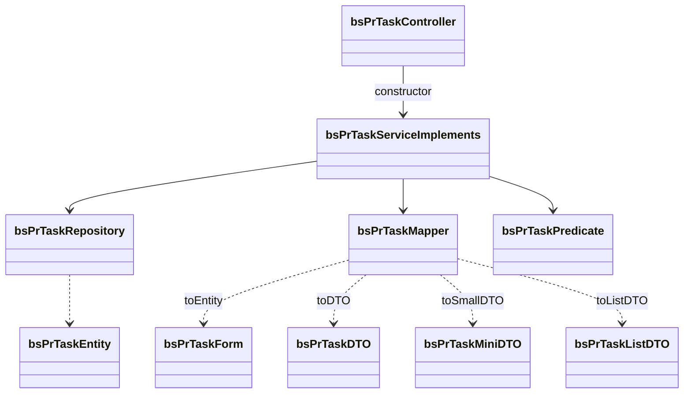

# Package Structure and Module Anatomy — BugTracker

#doc #explanation #ref-bugtracker #architecture

**Project:** `BugTracker/` · **Stack:** Spring Boot 2.7.0, Java 17 (effective) · **Index:** [[Docs/BugTracker/BugTracker-Index]]

## Summary

All code lives under `com.bgsystem.bugtracker` in four top-level packages: `configuration` (security),
`exeptions` (sic), `models` (features) and `shared` (framework). `models` splits into the operator side
`HQ` and the tenant side `client`, with a nested `client/project` for project-scoped features. Every
feature is a **module**: one package, ten files, one per role. There are 29 feature modules, two more
modules under `shared/models` (`user`, `geo/country`) and a few orphans. The one idea to take away: **the
module is the unit of everything** — the catalogue below is the only place every module appears, because
the explanations describe the pattern once.

## Why It Is Built This Way

Inferred: a fixed file set makes the project navigable by convention and lets the generic base classes
do the wiring. Adding an entity is a mechanical exercise of copying a sibling module and renaming. The
cost of that choice — ten files per entity whether it needs them or not — is weighed in
[[Docs/BugTracker/Reviews/02-CRUD-Framework-and-API-Design-Review#BT-R02-03|BT-R02-03]].

## How It Works

### Package tree (Java file counts)

```
com.bgsystem.bugtracker                      341 files in total
├── BugTrackerApplication                    1
├── configuration                            4
│   ├── filter      JWTTokenGeneratorFilter, JWTTokenValidatorFilter
│   └── security    SecurityConfig, SecurityConstant
├── exeptions                                7   5 checked exceptions, ErrorResponseBody, GlobalExceptionHandler
├── models
│   ├── HQ                                   60  6 modules: admin, client, employee, invoice, mainHQ, plan
│   ├── client                               233
│   │   ├── bsClient … business              14 modules + bsFile (3 files, orphan)
│   │   └── project                          90  9 modules: bsPrChannel … bsPrTask
│   └── Test                                 1   testController
└── shared                                   35
    ├── controller   DefaultController
    ├── mapper       DefaultMapper
    ├── repository   DefaultRepository
    ├── service      DefaultService, DefaultServiceImplements, EntityFactory
    ├── tools        firstInstallCheck, MentionGenerator
    └── models
        ├── listRequest      CommonPathExpression, FilterRequest, FilterOperator
        ├── pageableRequest  PageableRequest, SortInfo
        ├── user             User (JOINED root) module + LoginController
        ├── securityUser     SecurityUser, SecurityUserServiceImplements
        ├── role             Role (enum)
        └── geo              country (8-file module), state (empty directory)
```

### The ten-file module (`bsPrTask`)



| File | Role | Example |
|---|---|---|
| `XController` | `@RestController` + `@RequestMapping`, extends `DefaultController`, usually empty | `BugTracker/src/main/java/com/bgsystem/bugtracker/models/client/project/bsPrTask/bsPrTaskController.java:7-15` |
| `XEntity` | JPA entity, Lombok builder, `business` many-to-one on the tenant side | `BugTracker/src/main/java/com/bgsystem/bugtracker/models/client/project/bsPrTask/bsPrTaskEntity.java:20-87` |
| `XForm` | Request body; associations as `Long` ids | `BugTracker/src/main/java/com/bgsystem/bugtracker/models/client/project/bsPrTask/bsPrTaskForm.java:10-46` |
| `XDTO` | Detail response; associations as MiniDTOs | `BugTracker/src/main/java/com/bgsystem/bugtracker/models/client/project/bsPrTask/bsPrTaskDTO.java:15-53` |
| `XMiniDTO` | Scalar-only summary, embedded in other DTOs and returned by `insert` | `BugTracker/src/main/java/com/bgsystem/bugtracker/models/client/project/bsPrTask/bsPrTaskMiniDTO.java:7-31` |
| `XListDTO` | Grid row; DTO plus counters | `BugTracker/src/main/java/com/bgsystem/bugtracker/models/client/project/bsPrTask/bsPrTaskListDTO.java:17-55` |
| `XMapper` | Hand-written `DefaultMapper` implementation, `@Service`, `@Lazy` constructor | `BugTracker/src/main/java/com/bgsystem/bugtracker/models/client/project/bsPrTask/bsPrTaskMapper.java:15-50` |
| `XPredicate` | Extends `CommonPathExpression`, adds association filter paths | `BugTracker/src/main/java/com/bgsystem/bugtracker/models/client/project/bsPrTask/bsPrTaskPredicate.java:12-41` |
| `XRepository` | Extends `DefaultRepository`, derived finders only, annotated `@Service` | `BugTracker/src/main/java/com/bgsystem/bugtracker/models/client/project/bsPrTask/bsPrTaskRepository.java:12-17` |
| `XServiceImplements` | Extends `DefaultServiceImplements`, overrides `insert` and sometimes more | `BugTracker/src/main/java/com/bgsystem/bugtracker/models/client/project/bsPrTask/bsPrTaskServiceImplements.java:24-143` |

### Module catalogue

Built from `@RequestMapping` in each controller and `@Override` in each `*ServiceImplements`
(searched, not hand-collected). Routes are shown normalized with a leading `/`; the ten marked † are
declared **without** the leading slash in code (Spring adds it). "Overrides" lists base-service methods
the module replaces; every module also inherits the eight base endpoints of
[[Docs/BugTracker/Explanations/04-Generic-CRUD-Framework]]. A module **without** `update` in its
overrides uses the base no-op `update`.

| # | Module (under `models/`) | Route | Entity | Overrides | Extra endpoints |
|---|---|---|---|---|---|
| 1 | `HQ/admin` | `/admin` | `AdminEntity` (extends `User`) | `insert`, `delete` | — |
| 2 | `HQ/client` | `/client` | `ClientEntity` (extends `User`) | `insert`, `delete`, `update` | — |
| 3 | `HQ/employee` | `/employee` | `EmployeeEntity` (extends `User`) | `insert`, `delete` | — |
| 4 | `HQ/invoice` | `/invoice` | `InvoiceEntity` | `insert` | — |
| 5 | `HQ/mainHQ` | `/mainHQ` | `MainHQEntity` | `insert` | — |
| 6 | `HQ/plan` | `/plan` | `PlanEntity` | `insert` | — |
| 7 | `client/bsClient` | `/bs_client` | `bsClientEntity` (extends `User`) | `insert`, `updateListFields` | — |
| 8 | `client/bsDoc` | `/bs_doc` | `bsDocEntity` | `insert`, `update` | — |
| 9 | `client/bsDocsCategory` | `/bs_docs_category` | `bsDocsCategoryEntity` | `insert`, `update`, `updateListFields` | — |
| 10 | `client/bsEmployee` | `/bs_employee` | `bsEmployeeEntity` (extends `User`) | `insert` | — |
| 11 | `client/bsGeneralSettings` | `/bs_general_settings` | `bsGeneralSettingsEntity` | none | — |
| 12 | `client/bsInvoice` | `/bs_invoice` † | `bsInvoiceEntity` | `insert` | — |
| 13 | `client/bsKB` | `/bs_kb` | `bsKBEntity` | `insert`, `update` | — |
| 14 | `client/bsKBCategory` | `/bs_kb_category` | `bsKBCategoryEntity` | `insert`, `update`, `updateListFields` | — |
| 15 | `client/bsManager` | `/bs_manager` | `bsManagerEntity` (extends `User`) | `insert` | — |
| 16 | `client/bsPriority` | `/bs_priority` | `bsPriorityEntity` | `insert`, `update`, `delete`, `updateListFields` | `PUT /update-order` |
| 17 | `client/bsStatus` | `/bs_status` | `bsStatusEntity` | `insert`, `update`, `delete`, `updateListFields` | — |
| 18 | `client/bsTaskCategory` | `/bs_task_category` | `bsTaskCategoryEntity` | `insert`, `update`, `delete`, `updateListFields` | `GET /is-empty` |
| 19 | `client/bsType` | `/bs_type` † | `bsTypeEntity` | `insert`, `update`, `delete`, `updateListFields` | — |
| 20 | `client/business` | `/business` | `BusinessEntity` | `insert`, `delete`, `getAll`, `update` (delegates to base), `getPageableListView`, `updateListFields` | — |
| 21 | `client/project/bsPrChannel` | `/bs_pr_channel` † | `bsPrChannelEntity` | `insert`, `updateListFields` | — |
| 22 | `client/project/bsPrComment` | `/bs_pr_comment` † | `bsPrCommentEntity` | `insert`, `updateListFields` | `GET /pageable/{channel}/{page}/{size}` |
| 23 | `client/project/bsPrDocs` | `/bs_pr_docs` † | `bsPrDocsEntity` | `insert` | — |
| 24 | `client/project/bsPrDocsCategory` | `/bs_pr_docs_category` † | `bsPrDocsCategoryEntity` | `insert`, `updateListFields` | — |
| 25 | `client/project/bsPrKB` | `/bs_pr_kb` † | `bsPrKBEntity` | `insert` | — |
| 26 | `client/project/bsPrKBCategory` | `/bs_pr_kb_category` † | `bsPrKBCategoryEntity` | `insert`, `updateListFields` | — |
| 27 | `client/project/bsPrMention` | `/bs_pr_mention` † | `bsPrMentionEntity` | `insert` | — |
| 28 | `client/project/bsProject` | `/bs_project` † | `bsProjectEntity` | `insert`, `updateListFields` | — |
| 29 | `client/project/bsPrTask` | `/bs_pr_task` | `bsPrTaskEntity` | `insert` | — |

Modules under `shared/models` follow the same pattern:

| Module | Route | Entity | Overrides | Extra endpoints |
|---|---|---|---|---|
| `shared/models/user` | `/user` | `User` (JOINED root) | `insert` | `LoginController`: `GET /login`, `GET /login/test` |
| `shared/models/geo/country` | `/country` | `countryEntity` | none | `POST /bulk_add`; eight files, `countryDTO` used for all three DTO tiers |

Sources: the routes are at `BugTracker/src/main/java/com/bgsystem/bugtracker/models/client/bsInvoice/bsInvoiceController.java:8`,
`BugTracker/src/main/java/com/bgsystem/bugtracker/models/client/project/bsPrTask/bsPrTaskController.java:8` and the
matching line of each other controller; the extra endpoints are at
`BugTracker/src/main/java/com/bgsystem/bugtracker/models/client/bsPriority/bsPriorityController.java:24`,
`BugTracker/src/main/java/com/bgsystem/bugtracker/models/client/bsTaskCategory/bsTaskCategoryController.java:20`,
`BugTracker/src/main/java/com/bgsystem/bugtracker/models/client/project/bsPrComment/bsPrCommentController.java:22`,
`BugTracker/src/main/java/com/bgsystem/bugtracker/shared/models/geo/country/countryController.java:25-29` and
`BugTracker/src/main/java/com/bgsystem/bugtracker/shared/models/user/LoginController.java:25-40`.

Resulting counts: 20 of the 29 feature modules (plus `user` and `country`) keep the base no-op `update`;
9 implement a real update (`HQ/client`, `bsDoc`, `bsDocsCategory`, `bsKB`, `bsKBCategory`, `bsPriority`,
`bsStatus`, `bsTaskCategory`, `bsType`); `business` overrides `update` only to call the base
(`BugTracker/src/main/java/com/bgsystem/bugtracker/models/client/business/BusinessServiceImplements.java:96-99`).

### Orphans and leftovers

- `models/client/bsFile` has only an entity and two DTOs — no repository, service or controller — but the
  entity is mapped, so `ddl-auto=update` creates table `bs_file`
  (`BugTracker/src/main/java/com/bgsystem/bugtracker/models/client/bsFile/bsFileEntity.java:8-32`).
- `shared/models/geo/state` is an empty directory
  (`BugTracker/src/main/java/com/bgsystem/bugtracker/shared/models/geo/state`).
- `models/Test/testController` exposes `GET /test/a` and `POST /test/b`
  (`BugTracker/src/main/java/com/bgsystem/bugtracker/models/Test/testController.java:10-21`).
- `shared/service/EntityFactory` is a 205-line `@Service` with a repository per entity; no class references
  it (`BugTracker/src/main/java/com/bgsystem/bugtracker/shared/service/EntityFactory.java:35-36`).

## Key Components

| Component | Path | Responsibility |
|---|---|---|
| Feature modules, operator side | `BugTracker/src/main/java/com/bgsystem/bugtracker/models/HQ` | 6 modules |
| Feature modules, tenant side | `BugTracker/src/main/java/com/bgsystem/bugtracker/models/client` | 14 modules + `project` |
| Project-scoped modules | `BugTracker/src/main/java/com/bgsystem/bugtracker/models/client/project` | 9 modules |
| Framework | `BugTracker/src/main/java/com/bgsystem/bugtracker/shared` | Generic stack, filter engine, user root, tools |
| Security | `BugTracker/src/main/java/com/bgsystem/bugtracker/configuration` | Filter chain and JWT filters |

## Conventions and Rules

- **Naming.** Tenant modules use the prefix `bs` (business); project-scoped ones `bsPr`. Operator modules
  use PascalCase (`AdminEntity`); tenant modules keep the prefix in lower case (`bsPrTaskEntity`), so 233
  of the 341 top-level types have lower-case names. The seeder is `firstInstallCheck`, also lower case.
- **Routes** are snake_case with the same prefix (`/bs_pr_task`), except `/mainHQ` (camelCase).
- **Suffixes** are fixed: `Controller`, `Entity`, `Form`, `DTO`, `MiniDTO`, `ListDTO`, `Mapper`,
  `Predicate`, `Repository`, `ServiceImplements`.
- **Annotations.** Controllers `@RestController`; services, mappers, predicates and 28 of the 31 concrete
  repositories `@Service` (e.g. `BugTracker/src/main/java/com/bgsystem/bugtracker/models/client/project/bsPrTask/bsPrTaskRepository.java:12`).
- **Injection.** Controllers and services use constructor injection; mappers add `@Lazy` on the
  constructor (or on fields in four HQ mappers) — see [[Docs/BugTracker/Explanations/05-DTO-Tiers-and-Mapping]].
- **Where logic goes.** Validation, reference resolution and both-sides linking live in
  `XServiceImplements.insert`; mappers copy scalars only; predicates only know filter paths.

## How to Replicate

1. Create packages `configuration`, `models/HQ`, `models/client`, `models/client/project`, `shared`.
2. For each entity, create the ten files named in the table above in its own package.
3. Make the controller a one-constructor subclass of `DefaultController`, annotated with a snake_case route.
4. Make the service a subclass of `DefaultServiceImplements`, passing repository, mapper and predicate to
   `super`, and override `insert` (and `update`, `delete`, `updateListFields` when needed).
5. Add a catalogue row for the new module.

## Known Limitations

- Ten files per entity regardless of need: [[Docs/BugTracker/Reviews/02-CRUD-Framework-and-API-Design-Review#BT-R02-03|BT-R02-03]],
  [[Docs/BugTracker/Reviews/02-CRUD-Framework-and-API-Design-Review#BT-R02-04|BT-R02-04]].
- Route inconsistency: [[Docs/BugTracker/Reviews/02-CRUD-Framework-and-API-Design-Review#BT-R02-06|BT-R02-06]].
- Dead code and orphans: [[Docs/BugTracker/Reviews/10-Code-Hygiene-Review#BT-R10-02|BT-R10-02]].
- Lower-case class names and `@Service` repositories:
  [[Docs/BugTracker/Reviews/10-Code-Hygiene-Review#BT-R10-03|BT-R10-03]],
  [[Docs/BugTracker/Reviews/10-Code-Hygiene-Review#BT-R10-04|BT-R10-04]].

## Related Documents

- [[Docs/BugTracker/Explanations/04-Generic-CRUD-Framework]]
- [[Docs/BugTracker/Explanations/05-DTO-Tiers-and-Mapping]]
- [[Docs/BugTracker/Explanations/09-Service-Layer-Patterns]]
- [[Docs/BugTracker/Reviews/02-CRUD-Framework-and-API-Design-Review]]
- [[Docs/BugTracker/Reviews/10-Code-Hygiene-Review]]
