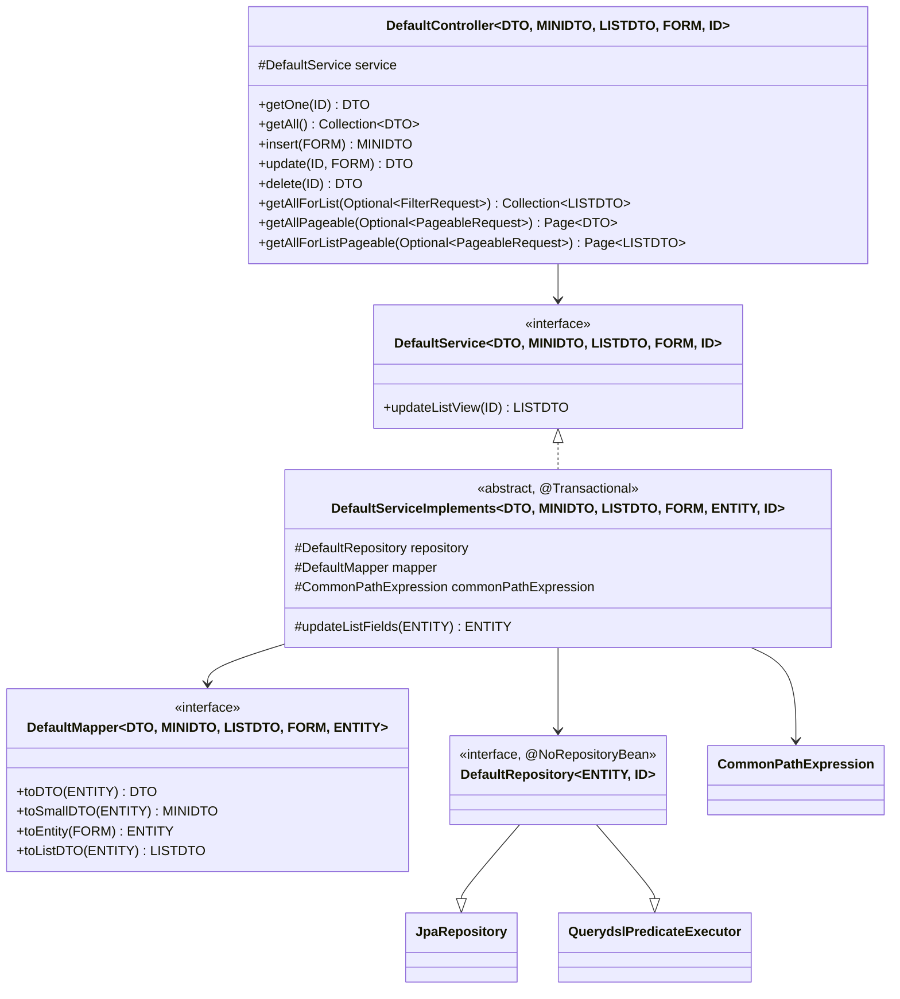

# Generic CRUD Framework — BugTracker

#doc #explanation #ref-bugtracker #architecture #api-design

**Project:** `BugTracker/` · **Stack:** Spring Boot 2.7.0, Java 17 (effective) · **Index:** [[Docs/BugTracker/BugTracker-Index]]

## Summary

Four generic types in `shared/` — `DefaultController`, `DefaultService` / `DefaultServiceImplements`,
`DefaultMapper` and `DefaultRepository` — give every module eight REST endpoints and a default
implementation of each operation. A module supplies concrete type arguments (DTO, MiniDTO, ListDTO, Form,
Entity, ID), a mapper and a predicate, and overrides only what differs. The base class also carries an
`updateListFields` hook that list endpoints call on every entity before mapping, which is how the
denormalized counters are kept fresh. The one idea to take away: **the base `update` loads and re-saves the
entity without applying the form**, so a module that does not override `update` cannot change data through
`PUT`.

## Why It Is Built This Way

Inferred: write the controller and the obvious service logic once, and let 31 modules differ only where
their domain requires it. The three DTO tiers exist because the same entity is shown in three places — a
detail page (DTO), a reference inside another object (MiniDTO) and a grid row (ListDTO) — and the base
stack has one slot per tier. `insert` returns a MiniDTO because the caller usually only needs the new id
and name.

## How It Works

### Types and type parameters



Sources: `BugTracker/src/main/java/com/bgsystem/bugtracker/shared/controller/DefaultController.java:17-23`,
`BugTracker/src/main/java/com/bgsystem/bugtracker/shared/service/DefaultService.java:11-31`,
`BugTracker/src/main/java/com/bgsystem/bugtracker/shared/service/DefaultServiceImplements.java:19-31`,
`BugTracker/src/main/java/com/bgsystem/bugtracker/shared/mapper/DefaultMapper.java:3-13`,
`BugTracker/src/main/java/com/bgsystem/bugtracker/shared/repository/DefaultRepository.java:7-10`.

### Inherited endpoints

| Method and path | Controller → service | Default behavior |
|---|---|---|
| `GET /{id}` | `getOne` | `findById` → `toDTO`, else `ElementNotFoundException` |
| `GET ""` and `GET /` | `getAll` | `findAll()` → `toDTO`, collected into a `Set` |
| `POST` | `insert` (`@Valid` body) | `toEntity` → `save` → `toSmallDTO` |
| `PUT /{id}` | `update` (`@Valid` body) | `findById` → `save` **unchanged** → `toDTO` |
| `DELETE /{id}` | `delete` | `findById` → `delete` → `toDTO` of the deleted entity |
| `POST /list` | `getAllListView` | `findAll()` → `toListDTO`; the filter argument is not used |
| `POST /page` | `getPageable` | filter + sort + page → `Page<DTO>`; empty body → `400` |
| `POST /page-list-view` | `getPageableListView` | as `/page`, plus `updateListFields` on each row → `Page<ListDTO>` |

All return `200 OK` via `ResponseEntity.ok`
(`BugTracker/src/main/java/com/bgsystem/bugtracker/shared/controller/DefaultController.java:25-81`). The
default implementations are at
`BugTracker/src/main/java/com/bgsystem/bugtracker/shared/service/DefaultServiceImplements.java:33-157`.

The base `update`, quoted in full:

`BugTracker/src/main/java/com/bgsystem/bugtracker/shared/service/DefaultServiceImplements.java:55-65`
```java
    @Override
    @Transactional
    public DTO update(ID id, FORM uform) throws ElementNotFoundException, InvalidInsertDeails {

        ENTITY toUpdate = repository.findById(id).orElseThrow(ElementNotFoundException::new);

        repository.save(toUpdate);

        return mapper.toDTO(toUpdate);

    }
```

### The `updateListFields` hook

`updateListFields(ENTITY)` returns the entity unchanged in the base class
(`BugTracker/src/main/java/com/bgsystem/bugtracker/shared/service/DefaultServiceImplements.java:160-162`).
Modules override it to recompute counters from their collections, e.g.
`bsStatusEntity.setTaskCount(tasks.size())`
(`BugTracker/src/main/java/com/bgsystem/bugtracker/models/client/bsStatus/bsStatusServiceImplements.java:99-106`).
It runs:

1. on every row of `POST /page-list-view`, before `toListDTO`
   (`BugTracker/src/main/java/com/bgsystem/bugtracker/shared/service/DefaultServiceImplements.java:125-141`);
2. in `updateListView(id)`, which also saves the entity
   (`BugTracker/src/main/java/com/bgsystem/bugtracker/shared/service/DefaultServiceImplements.java:147-157`) —
   declared on the service interface but not exposed by any controller;
3. explicitly in `Business.insert` and in the seeder
   (`BugTracker/src/main/java/com/bgsystem/bugtracker/models/client/business/BusinessServiceImplements.java:77`,
   `BugTracker/src/main/java/com/bgsystem/bugtracker/shared/tools/firstInstallCheck.java:189`).

It does **not** run for `GET /{id}`, `GET ""`, `POST /page` or `POST /list`, which therefore show the counter
values last stored in the database.

### Transactions

`DefaultServiceImplements` is annotated `@Transactional` at class level and again on most methods
(`BugTracker/src/main/java/com/bgsystem/bugtracker/shared/service/DefaultServiceImplements.java:19`,
`BugTracker/src/main/java/com/bgsystem/bugtracker/shared/service/DefaultServiceImplements.java:33-35`). The
attribute is the default: read-write, `REQUIRED`, rollback only on unchecked exceptions. Module
services carry no `@Transactional` of their own; because the annotation is `@Inherited` and Spring resolves
it through the class hierarchy, their overriding methods (`insert`, `update`, …) run in the same default
transaction. How this interacts with checked exceptions is described in
[[Docs/BugTracker/Explanations/08-Persistence-and-Transactions]].

### Override points

| Override | Used by | Typical content |
|---|---|---|
| `insert` | 29 of 31 services (not `bsGeneralSettings`, `country`) | validate form, resolve `Long` ids, link both sides, save parents |
| `update` | 10 services (one of them, `business`, only delegates) | copy non-null fields, re-link associations |
| `delete` | 8 services | guard ("has tasks"), unlink, reorder |
| `updateListFields` | 13 services | recompute counters |
| `getAll`, `getPageableListView`, `delete`, `insert` | `business` only | add `@PreAuthorize` and delegate to `super` |

Counts come from the catalogue in [[Docs/BugTracker/Explanations/03-Package-Structure-and-Module-Anatomy]].

## Key Components

| Component | Path | Responsibility |
|---|---|---|
| `DefaultController` | `BugTracker/src/main/java/com/bgsystem/bugtracker/shared/controller/DefaultController.java` | Eight endpoints |
| `DefaultService` | `BugTracker/src/main/java/com/bgsystem/bugtracker/shared/service/DefaultService.java` | Service contract, declares checked exceptions |
| `DefaultServiceImplements` | `BugTracker/src/main/java/com/bgsystem/bugtracker/shared/service/DefaultServiceImplements.java` | Default behavior, transactions, `updateListFields` hook |
| `DefaultMapper` | `BugTracker/src/main/java/com/bgsystem/bugtracker/shared/mapper/DefaultMapper.java` | Four mapping functions per entity |
| `DefaultRepository` | `BugTracker/src/main/java/com/bgsystem/bugtracker/shared/repository/DefaultRepository.java` | `JpaRepository` + `QuerydslPredicateExecutor` |

## Conventions and Rules

- Type-argument order is always `DTO, MINIDTO, LISTDTO, FORM, [ENTITY,] ID`, and `ID` is `Long`.
- A controller constructor takes the concrete service type (not the interface) and passes it to `super`
  (`BugTracker/src/main/java/com/bgsystem/bugtracker/models/client/project/bsPrTask/bsPrTaskController.java:11-13`).
- A service constructor passes `(repository, mapper, predicate)` to `super` and keeps its own typed
  references for extra repositories
  (`BugTracker/src/main/java/com/bgsystem/bugtracker/models/client/project/bsPrTask/bsPrTaskServiceImplements.java:43-63`).
- `insert` returns the MiniDTO; `update` and `delete` return the DTO.
- Service methods declare the base checked exceptions even when they cannot throw them.

## How to Replicate

1. `shared/repository/DefaultRepository<ENTITY, ID>` extending `JpaRepository` and
   `QuerydslPredicateExecutor`, annotated `@NoRepositoryBean`.
2. `shared/mapper/DefaultMapper<DTO, MINIDTO, LISTDTO, FORM, ENTITY>` with `toDTO`, `toSmallDTO`, `toEntity`,
   `toListDTO`.
3. `shared/service/DefaultService<DTO, MINIDTO, LISTDTO, FORM, ID>` and the abstract, `@Transactional`
   `DefaultServiceImplements<…, ENTITY, ID>` holding repository, mapper and `CommonPathExpression`, with
   a protected `updateListFields` hook.
4. `shared/controller/DefaultController<DTO, MINIDTO, LISTDTO, FORM, ID>` with the eight mappings above.
5. Per module, subclass controller and service as in
   [[Docs/BugTracker/Explanations/14-Recipe-Build-a-Project-This-Way]].

## Known Limitations

- Base `update` ignores the form: [[Docs/BugTracker/Reviews/02-CRUD-Framework-and-API-Design-Review#BT-R02-01|BT-R02-01]].
- Client-supplied `id` on insert turns `save` into a merge: [[Docs/BugTracker/Reviews/02-CRUD-Framework-and-API-Design-Review#BT-R02-02|BT-R02-02]].
- `POST /list` ignores its filter: [[Docs/BugTracker/Reviews/05-Filter-Engine-Review#BT-R05-05|BT-R05-05]].
- `getAll` is unbounded: [[Docs/BugTracker/Reviews/02-CRUD-Framework-and-API-Design-Review#BT-R02-05|BT-R02-05]].
- List views write to the database: [[Docs/BugTracker/Reviews/04-Performance-and-Fetching-Review#BT-R04-03|BT-R04-03]].
- Checked exceptions do not roll back: [[Docs/BugTracker/Reviews/07-Error-Handling-and-Validation-Review#BT-R07-02|BT-R07-02]].

## Related Documents

- [[Docs/BugTracker/Explanations/03-Package-Structure-and-Module-Anatomy]]
- [[Docs/BugTracker/Explanations/05-DTO-Tiers-and-Mapping]]
- [[Docs/BugTracker/Explanations/06-Dynamic-Filtering-and-Pagination]]
- [[Docs/BugTracker/Explanations/09-Service-Layer-Patterns]]
- [[Docs/BugTracker/Reviews/02-CRUD-Framework-and-API-Design-Review]]
