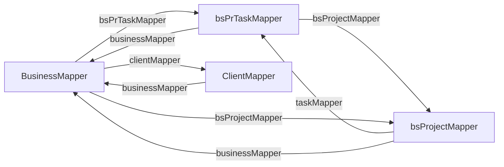

# DTO Tiers and Mapping — BugTracker

#doc #explanation #ref-bugtracker #api-design

**Project:** `BugTracker/` · **Stack:** Spring Boot 2.7.0, Java 17 (effective) · **Index:** [[Docs/BugTracker/BugTracker-Index]]

## Summary

Each module has one request type and three response types: a **Form** (input, associations as `Long`
ids), a **DTO** (detail view, associations as MiniDTOs), a **MiniDTO** (scalars only, used as an embedded
reference and as the `insert` response) and a **ListDTO** (grid row: DTO fields plus denormalized counters).
Mappers are hand-written Spring beans implementing `DefaultMapper`. Because a DTO embeds other modules'
MiniDTOs, each mapper depends on other mappers; those dependencies form cycles, which the code breaks with
`@Lazy` injection in 28 files. The one idea to take away: **MiniDTOs contain no associations, which is what
stops the object graph from recursing when entities reference each other.**

## Why It Is Built This Way

Inferred from how the tiers are used: the front end has three kinds of screens — detail, embedded
reference, data grid — and each gets exactly the shape it needs. Returning only a MiniDTO from `insert`
keeps create responses small. Hand-written mappers were chosen over a generator (no MapStruct in the POM,
`BugTracker/pom.xml`), which keeps every mapping explicit at the cost of volume: the 31 mappers total
about 3,200 lines.

## How It Works

### The four tiers, from `bsPrTask`

| Tier | Fields (abridged) | Source |
|---|---|---|
| `bsPrTaskForm` | `id`, `name`, `description`, dates, flags, and `Long business, project, category, type, priority, status, invoice` | `BugTracker/src/main/java/com/bgsystem/bugtracker/models/client/project/bsPrTask/bsPrTaskForm.java:14-46` |
| `bsPrTaskDTO` | scalars + `BusinessMiniDTO business`, `bsProjectMiniDTO project`, `bsStatusMiniDTO status`, … | `BugTracker/src/main/java/com/bgsystem/bugtracker/models/client/project/bsPrTask/bsPrTaskDTO.java:21-53` |
| `bsPrTaskMiniDTO` | scalars only (`id`, `name`, `description`, dates, flags) | `BugTracker/src/main/java/com/bgsystem/bugtracker/models/client/project/bsPrTask/bsPrTaskMiniDTO.java:13-31` |
| `bsPrTaskListDTO` | DTO fields + `Long channelCount` | `BugTracker/src/main/java/com/bgsystem/bugtracker/models/client/project/bsPrTask/bsPrTaskListDTO.java:21-55` |

For aggregate roots the ListDTO replaces collections with counts. `BusinessDTO` carries fifteen
`Set<…MiniDTO>` collections (`BugTracker/src/main/java/com/bgsystem/bugtracker/models/client/business/BusinessDTO.java:54-82`),
while `BusinessListDTO` carries the same names as `Long` counters
(`BugTracker/src/main/java/com/bgsystem/bugtracker/models/client/business/BusinessListDTO.java:35-63`).

### Forms carry ids; services resolve them

`toEntity` copies only scalars; the associations in the Form are ignored by the mapper
(`BugTracker/src/main/java/com/bgsystem/bugtracker/models/client/project/bsPrTask/bsPrTaskMapper.java:99-117`).
The service then loads each referenced entity by id and sets it
(`BugTracker/src/main/java/com/bgsystem/bugtracker/models/client/project/bsPrTask/bsPrTaskServiceImplements.java:75-110`).
Note that `toEntity` does copy `form.getId()` into the entity; 29 of the 31 mappers do this.

### MiniDTO embedding

`toDTO` and `toListDTO` call the other modules' `toSmallDTO`:

`BugTracker/src/main/java/com/bgsystem/bugtracker/models/client/project/bsPrTask/bsPrTaskMapper.java:59-75`
```java
        return bsPrTaskDTO.builder()
                .id(entity.getId())
                .name(entity.getName())
                .description(entity.getDescription())
                .created(entity.getCreated())
                .dueDate(entity.getDueDate())
                .isInternal(entity.getIsInternal())
                .isOverDue(entity.getIsOverDue())
                .isDone(entity.getIsDone())
                .business(businessMapper.toSmallDTO(entity.getBusiness()))
                .category(bsTaskCategoryMapper.toSmallDTO(entity.getCategory()))
                .project(bsProjectMapper.toSmallDTO(entity.getProject()))
                .type(bsTypeMapper.toSmallDTO(entity.getType()))
                .priority(bsPriorityMapper.toSmallDTO(entity.getPriority()))
                .status(bsStatusMapper.toSmallDTO(entity.getStatus()))
                .invoice(bsInvoiceMapper.toSmallDTO(entity.getInvoice()))
                .build();
```

Every mapper method starts with `if (entity == null) return null;`, so optional associations map to `null`
(`BugTracker/src/main/java/com/bgsystem/bugtracker/models/client/project/bsPrTask/bsPrTaskMapper.java:55-57`).

### Mapper cycles and `@Lazy`

Mapper A needs mapper B for B's MiniDTO, and B needs A for A's MiniDTO. One real cycle among many:



Sources: `BugTracker/src/main/java/com/bgsystem/bugtracker/models/client/business/BusinessMapper.java:59-87`,
`BugTracker/src/main/java/com/bgsystem/bugtracker/models/client/project/bsPrTask/bsPrTaskMapper.java:18-50`,
`BugTracker/src/main/java/com/bgsystem/bugtracker/models/client/project/bsProject/bsProjectMapper.java:22-41`,
`BugTracker/src/main/java/com/bgsystem/bugtracker/models/HQ/client/ClientMapper.java:15-21`.

Constructor injection would fail on such a cycle at start-up. The code puts `@Lazy` on the mapper
constructor (`BugTracker/src/main/java/com/bgsystem/bugtracker/models/client/project/bsPrTask/bsPrTaskMapper.java:32-34`),
so Spring injects lazy-resolution proxies for every parameter. Four HQ mappers use `@Lazy @Autowired` on
fields instead (`BugTracker/src/main/java/com/bgsystem/bugtracker/models/HQ/client/ClientMapper.java:15-21`).
27 mappers and one service carry `@Lazy`, 28 files in total.

### Mappers are `@Service` beans

`@Service public class bsPrTaskMapper implements DefaultMapper<…>`
(`BugTracker/src/main/java/com/bgsystem/bugtracker/models/client/project/bsPrTask/bsPrTaskMapper.java:15-16`).
They hold no state other than injected mappers.

## Key Components

| Component | Path | Responsibility |
|---|---|---|
| `DefaultMapper` | `BugTracker/src/main/java/com/bgsystem/bugtracker/shared/mapper/DefaultMapper.java` | The four mapping functions |
| Module mapper | `BugTracker/src/main/java/com/bgsystem/bugtracker/models/client/project/bsPrTask/bsPrTaskMapper.java` | Scalar copy + MiniDTO embedding |
| Aggregate mapper | `BugTracker/src/main/java/com/bgsystem/bugtracker/models/client/business/BusinessMapper.java` | 18 injected mappers, collections → MiniDTO sets or counts |

## Conventions and Rules

- MiniDTOs never contain associations; DTOs and ListDTOs embed only MiniDTOs.
- Forms reference associations by `Long` id with the association's name (`business`, `project`), and
  many-valued ones as `Set<Long>` (`BugTracker/src/main/java/com/bgsystem/bugtracker/models/client/bsType/bsTypeForm.java:22`).
- DTOs use Lombok `@Data @Builder @AllArgsConstructor @NoArgsConstructor`; mappers build with `.builder()`.
- `toEntity` never resolves associations; that is the service's job.
- Every mapper depending on another mapper takes `@Lazy` on its constructor.

## How to Replicate

1. For entity `X`, create `XForm` (scalars + `Long` ids), `XMiniDTO` (scalars), `XDTO` (scalars +
   MiniDTOs of associations) and `XListDTO` (DTO fields + counters).
2. Create `@Service class XMapper implements DefaultMapper<XDTO, XMiniDTO, XListDTO, XForm, XEntity>`
   injecting the mappers of every association through a `@Lazy @Autowired` constructor.
3. Implement the four methods with a null guard and the builder; do not map associations in `toEntity`.

## Known Limitations

- `toEntity` copies the client-supplied id: [[Docs/BugTracker/Reviews/02-CRUD-Framework-and-API-Design-Review#BT-R02-02|BT-R02-02]].
- Mapper volume fails the deletion test: [[Docs/BugTracker/Reviews/02-CRUD-Framework-and-API-Design-Review#BT-R02-04|BT-R02-04]].
- `@Lazy` hides the dependency cycles: [[Docs/BugTracker/Reviews/10-Code-Hygiene-Review#BT-R10-05|BT-R10-05]].
- `BusinessListDTO.invoices` is filled from the wrong counter: [[Docs/BugTracker/Reviews/04-Performance-and-Fetching-Review#BT-R04-04|BT-R04-04]].

## Related Documents

- [[Docs/BugTracker/Explanations/04-Generic-CRUD-Framework]]
- [[Docs/BugTracker/Explanations/09-Service-Layer-Patterns]]
- [[Docs/BugTracker/Reviews/02-CRUD-Framework-and-API-Design-Review]]
