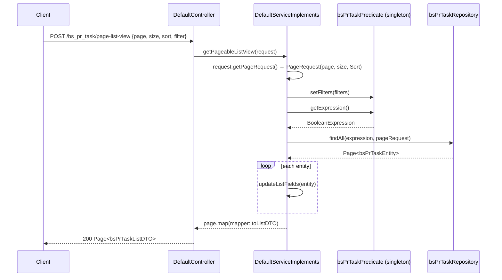

# Dynamic Filtering and Pagination — BugTracker

#doc #explanation #ref-bugtracker #api-design #persistence

**Project:** `BugTracker/` · **Stack:** Spring Boot 2.7.0, Java 17 (effective) · **Index:** [[Docs/BugTracker/BugTracker-Index]]

## Summary

`POST /{module}/page` and `POST /{module}/page-list-view` accept a JSON body with page number, page size,
sort list and an optional list of field filters. A reflective base class, `CommonPathExpression`, turns
each filter on a **scalar** field into a QueryDSL expression by inspecting the entity field's Java type and
the filter value; each module's `XPredicate` subclass adds hand-written paths for **association** fields
(`status.name`, `project.id`). Operations on one field are OR-ed; different fields are AND-ed. The one idea
to take away: **the request contract is rich and grid-friendly, but the engine trusts the client** — any
entity field can be filtered or sorted, and the predicate object that holds the filters is a shared
singleton.

## Why It Is Built This Way

Inferred: a data-grid front end needs filtering on arbitrary columns, including columns that come from a
related entity, without a new endpoint per column. Reflection covers every scalar column for free;
association columns need explicit QueryDSL paths, so they are listed per module. The date format
`dd/MM/yyyy` matches what a European UI would display
(`BugTracker/src/main/java/com/bgsystem/bugtracker/shared/models/listRequest/CommonPathExpression.java:230-240`).

## How It Works

### Request contract

`PageableRequest { int page; int size; List<SortInfo> sort; Optional<ArrayList<FilterRequest>> filter; }`
(`BugTracker/src/main/java/com/bgsystem/bugtracker/shared/models/pageableRequest/PageableRequest.java:19-27`),
`SortInfo { String property; Boolean isAscending; }`
(`BugTracker/src/main/java/com/bgsystem/bugtracker/shared/models/pageableRequest/SortInfo.java:12-18`),
`FilterRequest { String field; String type; ArrayList<FilterOperator> operations; }`
(`BugTracker/src/main/java/com/bgsystem/bugtracker/shared/models/listRequest/FilterRequest.java:14-22`),
`FilterOperator { String operator; String value; String field; }`
(`BugTracker/src/main/java/com/bgsystem/bugtracker/shared/models/listRequest/FilterOperator.java:12-20`).
`FilterRequest.type` is never read; `FilterOperator.field` is used only for association filters.

A full request for `POST /bs_pr_task/page`:

```json
{
  "page": 0,
  "size": 20,
  "sort": [ { "property": "dueDate", "isAscending": true } ],
  "filter": [
    { "field": "name",
      "operations": [ { "operator": ":", "value": "login" },
                      { "operator": ":", "value": "signup" } ] },
    { "field": "status",
      "operations": [ { "field": "name", "operator": "=", "value": "Open" } ] },
    { "field": "dueDate",
      "operations": [ { "operator": "<", "value": "31/12/2023" } ] },
    { "field": "isDone",
      "operations": [ { "operator": "=", "value": "true" } ] }
  ]
}
```

Meaning: name contains "login" **or** "signup", **and** status name equals "Open" (case-insensitive),
**and** due date before 31/12/2023, **and** done. An empty `sort` sorts by `id` ascending
(`BugTracker/src/main/java/com/bgsystem/bugtracker/shared/models/pageableRequest/PageableRequest.java:29-51`).

### Operators

| Value kind | Operators | Implementation |
|---|---|---|
| String | `:` contains (ignore case), `=` equals (ignore case), `!=` does not contain | `BugTracker/src/main/java/com/bgsystem/bugtracker/shared/models/listRequest/CommonPathExpression.java:116-126` |
| Number (`Long`, `Integer`, `Double`) | `=`, `!=`, `>`, `>=`, `<`, `<=` | `BugTracker/src/main/java/com/bgsystem/bugtracker/shared/models/listRequest/CommonPathExpression.java:156-179` |
| Date (`dd/MM/yyyy`) | `=` (that day, 24 h window), `>`, `>=`, `<`, `<=` | `BugTracker/src/main/java/com/bgsystem/bugtracker/shared/models/listRequest/CommonPathExpression.java:191-206` |
| Boolean | `=`, `!=` | `BugTracker/src/main/java/com/bgsystem/bugtracker/shared/models/listRequest/CommonPathExpression.java:216-228` |

Any other operator raises the checked `BadOperator`.

### Type inference in `CommonPathExpression`

For a filter on a field **not** listed in `entityFields`, `commonExpressionsSeparator`
(`BugTracker/src/main/java/com/bgsystem/bugtracker/shared/models/listRequest/CommonPathExpression.java:60-97`):

1. reads the field's declared type with `entityClass.getDeclaredField(name)`; a missing field becomes a
   `RuntimeException`;
2. for each operation: if the field type is a `Number` → number path; else if the **value** parses as
   `dd/MM/yyyy` → date path; else if the **value** is `"true"` → boolean path; else → string path;
3. ORs the operations together.

`getExpression` starts from `true` and ANDs one expression per filter
(`BugTracker/src/main/java/com/bgsystem/bugtracker/shared/models/listRequest/CommonPathExpression.java:28-40`).

### Association paths in `XPredicate`

The constructor sets the root `PathBuilder` alias and registers association field names; the override
dispatches each one to a method that switches on `FilterOperator.field`:

`BugTracker/src/main/java/com/bgsystem/bugtracker/models/client/project/bsPrTask/bsPrTaskPredicate.java:17-41`
```java
    public bsPrTaskPredicate() {
        super();
        this.entityPath = new PathBuilder<bsPrTaskEntity>(bsPrTaskEntity.class, "bsPrTaskEntity");
        this.entityFields.add("business");
        this.entityFields.add("category");
        this.entityFields.add("project");
        this.entityFields.add("type");
        this.entityFields.add("priority");
        this.entityFields.add("status");
        this.entityFields.add("invoice");
    }

    @Override
    protected BooleanExpression getCustomPathExpression(FilterRequest filter) throws BadOperator {
        return switch (filter.getField()){
            case "business" -> getBusinessExpression(filter);
            case "category" -> getCategoryExpression(filter);
            case "project" -> getProjectExpression(filter);
            case "type" -> getTypeExpression(filter);
            case "priority" -> getPriorityExpression(filter);
            case "status" -> getStatusExpression(filter);
            case "invoice" -> getInvoiceExpression(filter);
            default -> throw new IllegalArgumentException("Illegal field: " + filter.getField());
        };
    }
```

Each per-association method uses the generated Q-class for typed paths, e.g. `bsPrTaskEntity.status.name`
(`BugTracker/src/main/java/com/bgsystem/bugtracker/models/client/project/bsPrTask/bsPrTaskPredicate.java:85-109`).
Across the project, 23 predicates register between one and nine association fields; eight (the HQ ones,
`user`, `country`, `bsGeneralSettings`) register none and rely only on reflection.

### Sequence



Source: `BugTracker/src/main/java/com/bgsystem/bugtracker/shared/service/DefaultServiceImplements.java:111-145`.

## Key Components

| Component | Path | Responsibility |
|---|---|---|
| `PageableRequest` | `BugTracker/src/main/java/com/bgsystem/bugtracker/shared/models/pageableRequest/PageableRequest.java` | Page, size, sort → `PageRequest` |
| `FilterRequest`, `FilterOperator` | `BugTracker/src/main/java/com/bgsystem/bugtracker/shared/models/listRequest/` | Filter contract |
| `CommonPathExpression` | `BugTracker/src/main/java/com/bgsystem/bugtracker/shared/models/listRequest/CommonPathExpression.java` | Reflection + value-based typing for scalar fields |
| `XPredicate` | e.g. `BugTracker/src/main/java/com/bgsystem/bugtracker/models/client/project/bsPrTask/bsPrTaskPredicate.java` | Association paths |
| `DefaultRepository` | `BugTracker/src/main/java/com/bgsystem/bugtracker/shared/repository/DefaultRepository.java` | `findAll(Predicate, Pageable)` |

## Conventions and Rules

- The `PathBuilder` alias equals the Q-class default variable name (`"bsPrTaskEntity"`), so hand-built and
  generated paths share one root.
- Association filter names equal the entity's association property; the inner `FilterOperator.field` names
  the target's property.
- Dates are always `dd/MM/yyyy` strings; numbers and booleans are strings parsed server-side.
- Predicates are `@Service` singletons injected into the service constructor.

## How to Replicate

1. Create `FilterOperator`, `FilterRequest`, `SortInfo`, `PageableRequest` as above.
2. Create abstract `CommonPathExpression<Entity>` with `entityPath`, `entityFields`, `setFilters`,
   `getExpression` and the typed helpers.
3. Per module, create `XPredicate extends CommonPathExpression<XEntity>`: set `entityPath` to a
   `PathBuilder` whose alias equals the Q-class variable, add association names to `entityFields`, and
   implement `getCustomPathExpression` with a switch per association.
4. Pass the predicate to the service's `super(...)` so `/page` and `/page-list-view` use it.

## Known Limitations

- Singleton predicate with mutable filter state: [[Docs/BugTracker/Reviews/05-Filter-Engine-Review#BT-R05-01|BT-R05-01]].
- Value-based type dispatch (booleans, dates): [[Docs/BugTracker/Reviews/05-Filter-Engine-Review#BT-R05-02|BT-R05-02]].
- Inherited fields cannot be filtered: [[Docs/BugTracker/Reviews/05-Filter-Engine-Review#BT-R05-03|BT-R05-03]].
- Bad dates on association paths: [[Docs/BugTracker/Reviews/05-Filter-Engine-Review#BT-R05-04|BT-R05-04]].
- `POST /list` ignores its filter: [[Docs/BugTracker/Reviews/05-Filter-Engine-Review#BT-R05-05|BT-R05-05]].
- Null `sort` and `Optional` field: [[Docs/BugTracker/Reviews/05-Filter-Engine-Review#BT-R05-06|BT-R05-06]].
- No field or sort whitelist: [[Docs/BugTracker/Reviews/05-Filter-Engine-Review#BT-R05-07|BT-R05-07]].

## Related Documents

- [[Docs/BugTracker/Explanations/04-Generic-CRUD-Framework]]
- [[Docs/BugTracker/Reviews/05-Filter-Engine-Review]]
- [[Docs/backend/Explanations/05-Dynamic-List-Query-Engine]] — the descendant, whitelist-based engine
