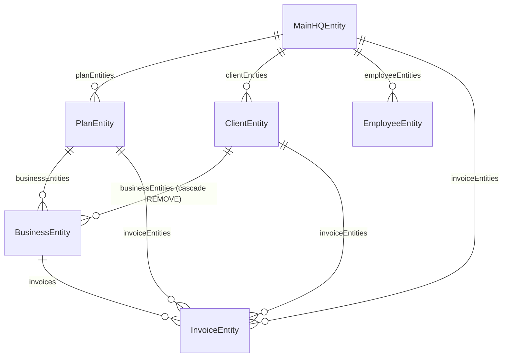
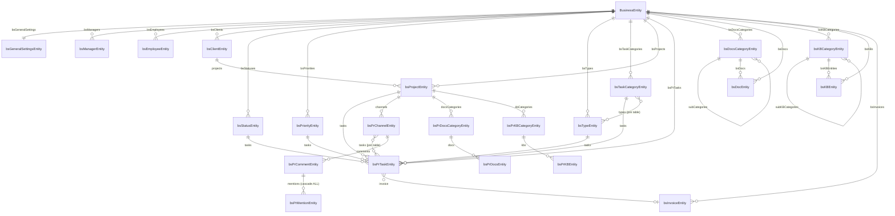
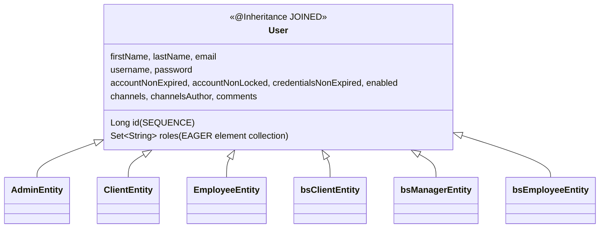

# Domain Model — BugTracker

#doc #explanation #ref-bugtracker #persistence #architecture

**Project:** `BugTracker/` · **Stack:** Spring Boot 2.7.0, Java 17 (effective) · **Index:** [[Docs/BugTracker/BugTracker-Index]]

## Summary

The model has 32 JPA entities in two halves. The **operator (HQ) side** is a single `MainHQ` that owns
plans, clients, HQ employees and SaaS invoices; admins are users without an owner. The **tenant side** is
rooted at `BusinessEntity`: a Business belongs to one HQ client and one plan, and owns fifteen collections —
its users (managers, employees, customer clients), its configurable taxonomies (statuses, priorities, types,
task categories), its projects and tasks, its documents and knowledge base (with tree-shaped categories),
its invoices and its settings. All seven user kinds share one `User` table hierarchy. The one idea to take
away: **the Business is the tenant boundary in the data model** — every tenant entity has a mandatory
`business` reference — but that boundary is structural only (see Known Limitations).

## Why It Is Built This Way

Inferred:

- *Two sides* because the product is a SaaS: the operator bills tenants (`PlanEntity`, `InvoiceEntity`),
  and tenants run projects.
- *Configurable taxonomies as entities* (status, priority, type, task category) so each tenant defines its
  own workflow: statuses have a colour
  (`BugTracker/src/main/java/com/bgsystem/bugtracker/models/client/bsStatus/bsStatusForm.java:20-30`),
  priorities have an order
  (`BugTracker/src/main/java/com/bgsystem/bugtracker/models/client/bsPriority/bsPriorityEntity.java:26-27`),
  types are allowed only for certain task categories.
- *One user hierarchy* so login, uniqueness checks and chat authorship (`author` on channels, comments,
  mentions) can reference any kind of user.
- *Business-level and project-level knowledge*: `bsDoc`/`bsKB` belong to the Business;
  `bsPrDocs`/`bsPrKB` belong to a project.

## How It Works

### Operator (HQ) side

Sources: `BugTracker/src/main/java/com/bgsystem/bugtracker/models/HQ/mainHQ/MainHQEntity.java:30-52`,
`BugTracker/src/main/java/com/bgsystem/bugtracker/models/HQ/client/ClientEntity.java:45-59`,
`BugTracker/src/main/java/com/bgsystem/bugtracker/models/client/business/BusinessEntity.java:61-75`.
`MainHQ` is a singleton by convention: `MainHQServiceImplements.insert` refuses a second row
(`BugTracker/src/main/java/com/bgsystem/bugtracker/models/HQ/mainHQ/MainHQServiceImplements.java:37-42`),
and services fetch it with `findAll().get(0)`
(`BugTracker/src/main/java/com/bgsystem/bugtracker/models/HQ/client/ClientServiceImplements.java:66`).

### Tenant side

Sources: `BugTracker/src/main/java/com/bgsystem/bugtracker/models/client/business/BusinessEntity.java:69-156`,
`BugTracker/src/main/java/com/bgsystem/bugtracker/models/client/project/bsPrTask/bsPrTaskEntity.java:54-84`,
`BugTracker/src/main/java/com/bgsystem/bugtracker/models/client/project/bsPrChannel/bsPrChannelEntity.java:39-70`,
`BugTracker/src/main/java/com/bgsystem/bugtracker/models/client/bsTaskCategory/bsTaskCategoryEntity.java:31-37`.
`bsFileEntity` (a file with url, name and type, many-to-one to Business) is mapped but has no module
(`BugTracker/src/main/java/com/bgsystem/bugtracker/models/client/bsFile/bsFileEntity.java:8-32`).
`countryEntity` is a standalone lookup table.

### The Business aggregate

`BusinessEntity` has a unique `name`, a `taxID`, status flags (`pendingInvoice`, `overDue`, `isActive`),
mandatory `client` and `plan`, a one-to-one `bsGeneralSettings`, and fifteen `@OneToMany(mappedBy = …,
orphanRemoval = true, fetch = FetchType.EAGER)` sets, each paired with a `Long xxxCount` column
(`BugTracker/src/main/java/com/bgsystem/bugtracker/models/client/business/BusinessEntity.java:43-156`). The
set of collections is: HQ `invoices`, `bsClients`, `bsManagers`, `bsEmployees`, `bsStatuses`,
`bsPriorities`, `bsTypes`, `bsDocsCategories`, `bsDocs`, `bsKBCategories`, `bsKBs`, `bsProjects`,
`bsTaskCategories`, `bsPrTasks`, `bsInvoices`.

### The `User` hierarchy

`User` is a concrete entity with `JOINED` inheritance and a `user_roles` element collection
(`BugTracker/src/main/java/com/bgsystem/bugtracker/shared/models/user/User.java:11-66`). The six subclasses are
at `BugTracker/src/main/java/com/bgsystem/bugtracker/models/HQ/admin/AdminEntity.java:16`,
`BugTracker/src/main/java/com/bgsystem/bugtracker/models/HQ/client/ClientEntity.java:27`,
`BugTracker/src/main/java/com/bgsystem/bugtracker/models/HQ/employee/EmployeeEntity.java:21`,
`BugTracker/src/main/java/com/bgsystem/bugtracker/models/client/bsClient/bsClientEntity.java:23`,
`BugTracker/src/main/java/com/bgsystem/bugtracker/models/client/bsManager/bsManagerEntity.java:19`,
`BugTracker/src/main/java/com/bgsystem/bugtracker/models/client/bsEmployee/bsEmployeeEntity.java:20`.
`ClientEntity` and `EmployeeEntity` redeclare their own `@Id` field with `IDENTITY`
(`BugTracker/src/main/java/com/bgsystem/bugtracker/models/HQ/client/ClientEntity.java:29-32`). Subclasses
provide their own Lombok builders with custom names (`adminBuilder`, `clientBuilder`, `employeeBuilder`)
that call the ten-argument `User` constructor
(`BugTracker/src/main/java/com/bgsystem/bugtracker/models/HQ/admin/AdminEntity.java:18-32`).

Each user kind gets a fixed role string on insert: `ROLE_ADMIN`, `ROLE_CLIENT`, `ROLE_EMPLOYEE`,
`ROLE_BS_CLIENT`, `ROLE_BS_MANAGER`, `ROLE_BS_EMPLOYEE`
(`BugTracker/src/main/java/com/bgsystem/bugtracker/models/HQ/admin/AdminServiceImplements.java:54-55`,
`BugTracker/src/main/java/com/bgsystem/bugtracker/models/client/bsManager/bsManagerServiceImplements.java:63-64`).
The `Role` enum lists a different set (`ROLE_BSEMPLOYEE`, `ROLE_BSCLIENT`, no manager) and is not used
(`BugTracker/src/main/java/com/bgsystem/bugtracker/shared/models/role/Role.java:4-8`).

### Self-referencing trees

Business-level document and KB categories form trees: `parentCategory` / `subCategories` and `parentKB` /
`subKBCategories`, with a `level` number and an `isAParent…` flag maintained by the services
(`BugTracker/src/main/java/com/bgsystem/bugtracker/models/client/bsDocsCategory/bsDocsCategoryEntity.java:29-40`,
`BugTracker/src/main/java/com/bgsystem/bugtracker/models/client/bsKBCategory/bsKBCategoryEntity.java:30-41`).
A child created under a parent inherits the parent's Business and gets `level = parent.level + 1`
(`BugTracker/src/main/java/com/bgsystem/bugtracker/models/client/bsDocsCategory/bsDocsCategoryServiceImplements.java:50-67`).
Project-level categories (`bsPrDocsCategory`, `bsPrKBCategory`) are flat.

### Many-to-many relations

| Relation | Owner (join table) | Inverse | Written by |
|---|---|---|---|
| Channel ↔ member | `bsPrChannelEntity.members` (`channel_and_members_relations`) | `User.channels` | channel insert |
| Channel ↔ task | `bsPrChannelEntity.tasks` (`channel_and_task_relations`) | `bsPrTaskEntity.channels` | no code writes it |
| Task category ↔ type | `bsTaskCategoryEntity.types` (`task_category_and_type_relations`) | `bsTypeEntity.taskCategories` | type insert/update/delete, category delete |

Sources: `BugTracker/src/main/java/com/bgsystem/bugtracker/models/client/project/bsPrChannel/bsPrChannelEntity.java:53-70`,
`BugTracker/src/main/java/com/bgsystem/bugtracker/models/client/bsTaskCategory/bsTaskCategoryEntity.java:31-37`,
`BugTracker/src/main/java/com/bgsystem/bugtracker/models/client/bsType/bsTypeServiceImplements.java:117-130`.

## Key Components

| Component | Path | Responsibility |
|---|---|---|
| `MainHQEntity` | `BugTracker/src/main/java/com/bgsystem/bugtracker/models/HQ/mainHQ/MainHQEntity.java` | Operator root |
| `BusinessEntity` | `BugTracker/src/main/java/com/bgsystem/bugtracker/models/client/business/BusinessEntity.java` | Tenant root and aggregate |
| `User` | `BugTracker/src/main/java/com/bgsystem/bugtracker/shared/models/user/User.java` | User hierarchy root |
| `bsProjectEntity` | `BugTracker/src/main/java/com/bgsystem/bugtracker/models/client/project/bsProject/bsProjectEntity.java` | Project root for tasks, channels, docs, KB |
| `bsPrTaskEntity` | `BugTracker/src/main/java/com/bgsystem/bugtracker/models/client/project/bsPrTask/bsPrTaskEntity.java` | The work item |

## Conventions and Rules

- Every tenant entity has `@ManyToOne(optional = false) @JoinColumn(name = "business_entity_id",
  nullable = false) BusinessEntity business` (`BugTracker/src/main/java/com/bgsystem/bugtracker/models/client/bsStatus/bsStatusEntity.java`),
  except project-scoped ones, which reach the Business through their project.
- Tenant vocabularies (status, priority, type, task category) are entities, never enums.
- Parents keep an inverse collection **and** a counter column for each child kind.
- User kinds are subclasses of `User`; each service sets the user's role string on insert.
- Trees carry `level` and a "has children" flag.

## How to Replicate

1. Create `MainHQEntity`, `PlanEntity`, HQ `ClientEntity`, `EmployeeEntity`, `InvoiceEntity`, `AdminEntity`.
2. Create `User` with `@Inheritance(strategy = InheritanceType.JOINED)` and the `user_roles` collection;
   make every user kind a subclass.
3. Create `BusinessEntity` with `client`, `plan`, `bsGeneralSettings` and one inverse set + counter per
   tenant child.
4. For each tenant child, add the mandatory `business` many-to-one.
5. Model taxonomies as entities owned by the Business; model trees with a self-reference, `level` and a
   parent flag.

## Known Limitations

- No tenant isolation enforcement: [[Docs/BugTracker/Reviews/01-Security-and-Multi-Tenancy-Review#BT-R01-02|BT-R01-02]].
- `equals` casts to the wrong class in two entities: [[Docs/BugTracker/Reviews/03-Domain-Model-and-Persistence-Review#BT-R03-01|BT-R03-01]].
- Subclass `@Id` redeclaration: [[Docs/BugTracker/Reviews/03-Domain-Model-and-Persistence-Review#BT-R03-02|BT-R03-02]].
- Builder drops collection and flag initializers: [[Docs/BugTracker/Reviews/03-Domain-Model-and-Persistence-Review#BT-R03-05|BT-R03-05]].
- Roles as raw strings, unused enum: [[Docs/BugTracker/Reviews/03-Domain-Model-and-Persistence-Review#BT-R03-10|BT-R03-10]].
- Cascade-remove chains: [[Docs/BugTracker/Reviews/03-Domain-Model-and-Persistence-Review#BT-R03-11|BT-R03-11]].
- Fifteen EAGER collections: [[Docs/BugTracker/Reviews/04-Performance-and-Fetching-Review#BT-R04-01|BT-R04-01]].
- Tree updates allow cycles: [[Docs/BugTracker/Reviews/06-Service-Layer-Correctness-Review#BT-R06-12|BT-R06-12]].
- Channel ↔ task relation is never written: [[Docs/BugTracker/Reviews/06-Service-Layer-Correctness-Review#BT-R06-10|BT-R06-10]].

## Related Documents

- [[Docs/BugTracker/Explanations/08-Persistence-and-Transactions]]
- [[Docs/BugTracker/Explanations/11-Collaboration-Features]]
- [[Docs/BugTracker/Reviews/03-Domain-Model-and-Persistence-Review]]
- [[Docs/BugTracker/Reviews/04-Performance-and-Fetching-Review]]
