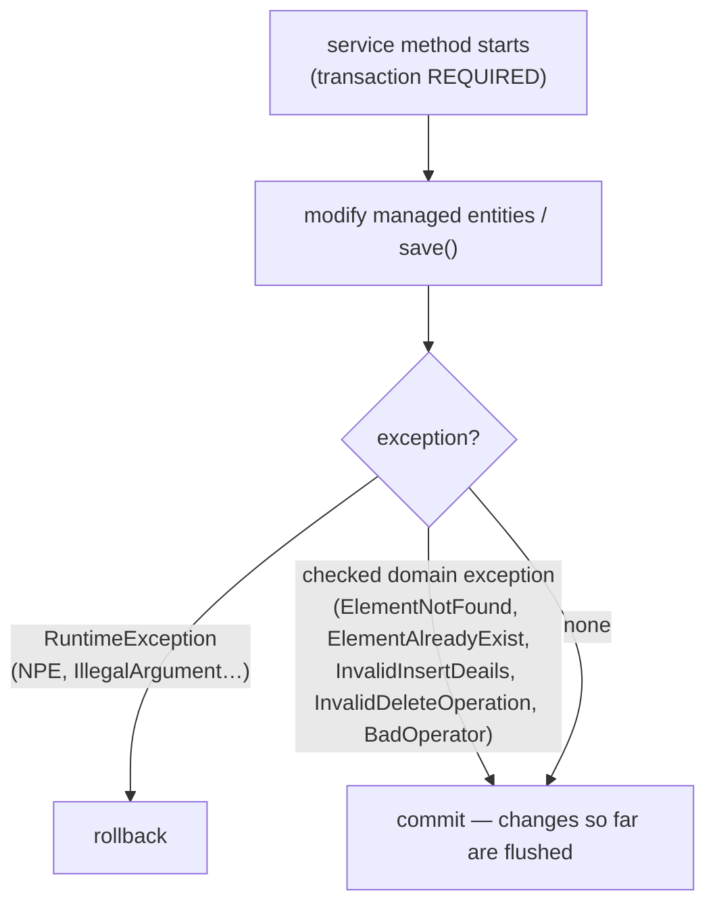

# Persistence and Transactions — BugTracker

#doc #explanation #ref-bugtracker #persistence

**Project:** `BugTracker/` · **Stack:** Spring Boot 2.7.0, Java 17 (effective) · **Index:** [[Docs/BugTracker/BugTracker-Index]]

## Summary

Persistence is Spring Data JPA over Hibernate 5.6 and MySQL, with the schema generated by
`ddl-auto=update`. Every repository extends `DefaultRepository` (JPA + QueryDSL) and declares only derived
finder methods — there is no `@Query` anywhere. Most entities use `GenerationType.SEQUENCE`; the standalone
HQ entities use `IDENTITY`. Relations default to lazy for collections, except the tenant root's fifteen
collections and a few others, which are `EAGER`. Parents store denormalized `xxxCount` columns that list
views recompute. All service methods run in one default read-write transaction per call. The one idea to
take away: **the service layer's checked exceptions do not trigger rollback**, so a method that has already
modified managed entities and then throws a domain exception commits those modifications.

## Why It Is Built This Way

Inferred: derived queries plus QueryDSL cover every read the grid UI needs without writing JPQL;
`ddl-auto=update` lets the schema follow the entities during development; counters avoid counting child
rows on every list request. No migration tool, auditing or optimistic locking was chosen.

## How It Works

### Repositories

`DefaultRepository<ENTITY, ID> extends JpaRepository<ENTITY, ID>, QuerydslPredicateExecutor<ENTITY>`
(`BugTracker/src/main/java/com/bgsystem/bugtracker/shared/repository/DefaultRepository.java:7-10`). Module
repositories add derived finders only, typically returning `Set<X>`:

- uniqueness probes — `findByName`, `findByNameAndBusinessAndCategoryAndProject`
  (`BugTracker/src/main/java/com/bgsystem/bugtracker/models/client/project/bsPrTask/bsPrTaskRepository.java:13-15`);
- existence checks — `existsByNameAndProject` (`BugTracker/src/main/java/com/bgsystem/bugtracker/models/client/project/bsPrKBCategory/bsPrKBCategoryRepository.java`);
- a paged finder — `Page<bsPrCommentEntity> findByChannel(Pageable, bsPrChannelEntity)`
  (`BugTracker/src/main/java/com/bgsystem/bugtracker/models/client/project/bsPrComment/bsPrCommentRepository.java:13`);
- a range finder — `findByPriorityOrderGreaterThan(Integer)`
  (`BugTracker/src/main/java/com/bgsystem/bugtracker/models/client/bsPriority/bsPriorityRepository.java:14`).

28 of the 31 concrete repository interfaces are annotated `@Service`
(`BugTracker/src/main/java/com/bgsystem/bugtracker/shared/models/user/UserRepository.java:10-11`); Spring Data
creates the beans regardless of that annotation.

### Identifier strategies

| Strategy | Entities | Source |
|---|---|---|
| `SEQUENCE` (no named generator) | `User` root and its subclasses without their own `@Id`, and every tenant entity | `BugTracker/src/main/java/com/bgsystem/bugtracker/shared/models/user/User.java:21-23` |
| `IDENTITY` | `MainHQEntity`, `PlanEntity`, `InvoiceEntity` | `BugTracker/src/main/java/com/bgsystem/bugtracker/models/HQ/mainHQ/MainHQEntity.java:22-25` |
| `IDENTITY` **redeclared in a JOINED subclass** | `ClientEntity`, `EmployeeEntity` | `BugTracker/src/main/java/com/bgsystem/bugtracker/models/HQ/client/ClientEntity.java:29-32`, `BugTracker/src/main/java/com/bgsystem/bugtracker/models/HQ/employee/EmployeeEntity.java:23-26` |

The subclass redeclaration shadows `User.id` with a second `id` field and its own Lombok getter.

### Fetch types

| Where | Fetch | Source |
|---|---|---|
| `BusinessEntity`'s 15 `@OneToMany` sets | `EAGER` | `BugTracker/src/main/java/com/bgsystem/bugtracker/models/client/business/BusinessEntity.java:72-156` |
| `bsStatusEntity.tasks` | `EAGER` | `BugTracker/src/main/java/com/bgsystem/bugtracker/models/client/bsStatus/bsStatusEntity.java:33` |
| `bsClientEntity.projects`, `.invoices` | `EAGER` | `BugTracker/src/main/java/com/bgsystem/bugtracker/models/client/bsClient/bsClientEntity.java:53-60` |
| `User.roles` | `EAGER` element collection | `BugTracker/src/main/java/com/bgsystem/bugtracker/shared/models/user/User.java:34-37` |
| every `@ManyToOne` / `@OneToOne` | JPA default `EAGER` (no `fetch` attribute set) | e.g. `BugTracker/src/main/java/com/bgsystem/bugtracker/models/client/project/bsPrTask/bsPrTaskEntity.java:54-80` |
| other collections | JPA default `LAZY` | e.g. `BugTracker/src/main/java/com/bgsystem/bugtracker/models/client/bsPriority/bsPriorityEntity.java:33-34` |

`spring.jpa.open-in-view=false` (`BugTracker/src/main/resources/application.properties:6`), so lazy
collections must be touched inside the service transaction; mappers run inside it because services call
them before returning.

### Denormalized counters

Each parent has a `Long xxxCount` per child collection (for example `bsPriorityEntity.taskCount`,
`BusinessEntity.bsPrTaskCount`). They are recomputed from `collection.size()` by the module's
`updateListFields` override
(`BugTracker/src/main/java/com/bgsystem/bugtracker/models/client/business/BusinessServiceImplements.java:108-129`)
and written back by:

1. `POST /page-list-view`: counters are set on managed entities inside the read-write transaction; Hibernate
   dirty checking flushes any changed value as an `UPDATE` at commit
   (`BugTracker/src/main/java/com/bgsystem/bugtracker/shared/service/DefaultServiceImplements.java:111-145`);
2. `updateListView(id)`, which saves explicitly
   (`BugTracker/src/main/java/com/bgsystem/bugtracker/shared/service/DefaultServiceImplements.java:147-157`);
3. Business insert and the seeder.

Nothing updates a counter when a child is inserted or deleted.

### Transactions and checked exceptions

`DefaultServiceImplements` is `@Transactional` with default attributes
(`BugTracker/src/main/java/com/bgsystem/bugtracker/shared/service/DefaultServiceImplements.java:19`). The
default rollback rule in Spring Framework 5.3 is "roll back on `RuntimeException` or `Error`", verified
with `javap` on `spring-tx-5.3.20.jar` (`DefaultTransactionAttribute.rollbackOn`). All five domain
exceptions extend `Exception` (checked)
(`BugTracker/src/main/java/com/bgsystem/bugtracker/exeptions/ElementNotFoundException.java:3`). So:

Most inserts validate and resolve references before the first `save`, so they usually fail before
writing. Methods that write inside a loop and look references up as they go do not
(`BugTracker/src/main/java/com/bgsystem/bugtracker/models/client/bsType/bsTypeServiceImplements.java:117-130`).

### Schema management and database

`spring.jpa.hibernate.ddl-auto=update` (`BugTracker/src/main/resources/application.properties:1`), MySQL
driver `com.mysql.cj.jdbc.Driver` (`BugTracker/src/main/resources/application.properties:5`); URL,
username and password are literal values in the same file (`BugTracker/src/main/resources/application.properties:2-4`,
values `<redacted>`). There are no migration scripts under `BugTracker/src/main/resources`.

## Key Components

| Component | Path | Responsibility |
|---|---|---|
| `DefaultRepository` | `BugTracker/src/main/java/com/bgsystem/bugtracker/shared/repository/DefaultRepository.java` | JPA + QueryDSL base |
| Module repositories | e.g. `BugTracker/src/main/java/com/bgsystem/bugtracker/models/client/project/bsPrTask/bsPrTaskRepository.java` | Derived finders |
| Transaction boundary | `BugTracker/src/main/java/com/bgsystem/bugtracker/shared/service/DefaultServiceImplements.java` | Class-level `@Transactional` |
| Configuration | `BugTracker/src/main/resources/application.properties` | `ddl-auto`, datasource, OSIV |

## Conventions and Rules

- Only derived query methods; uniqueness probes return `Set` and callers test `size() > 0`.
- Save order in services: save the new entity, then save every parent whose inverse collection was
  modified (`BugTracker/src/main/java/com/bgsystem/bugtracker/models/client/project/bsPrTask/bsPrTaskServiceImplements.java:131-138`).
- Inverse collections are always updated in memory alongside the owning side.
- Counters are refreshed only through `updateListFields`.

## How to Replicate

1. Create `DefaultRepository` as above and one interface per entity with derived finders.
2. Annotate entities with `@GeneratedValue(strategy = GenerationType.SEQUENCE)` (tenant) or `IDENTITY`
   (standalone HQ roots).
3. Add `xxxCount` columns to parents and an `updateListFields` override that sets them from
   `collection.size()`.
4. Put `@Transactional` on the abstract base service.
5. Configure `ddl-auto=update` and `open-in-view=false` — see the review before copying either.

## Known Limitations

- Mixed and redeclared ID strategies: [[Docs/BugTracker/Reviews/03-Domain-Model-and-Persistence-Review#BT-R03-02|BT-R03-02]],
  [[Docs/BugTracker/Reviews/03-Domain-Model-and-Persistence-Review#BT-R03-03|BT-R03-03]].
- No migrations: [[Docs/BugTracker/Reviews/03-Domain-Model-and-Persistence-Review#BT-R03-09|BT-R03-09]].
- No auditing or `@Version`: [[Docs/BugTracker/Reviews/03-Domain-Model-and-Persistence-Review#BT-R03-07|BT-R03-07]].
- EAGER graph, N+1, write-on-read, counter drift:
  [[Docs/BugTracker/Reviews/04-Performance-and-Fetching-Review#BT-R04-01|BT-R04-01]],
  [[Docs/BugTracker/Reviews/04-Performance-and-Fetching-Review#BT-R04-02|BT-R04-02]],
  [[Docs/BugTracker/Reviews/04-Performance-and-Fetching-Review#BT-R04-03|BT-R04-03]],
  [[Docs/BugTracker/Reviews/04-Performance-and-Fetching-Review#BT-R04-04|BT-R04-04]].
- Checked exceptions commit partial work: [[Docs/BugTracker/Reviews/07-Error-Handling-and-Validation-Review#BT-R07-02|BT-R07-02]].

## Related Documents

- [[Docs/BugTracker/Explanations/07-Domain-Model]]
- [[Docs/BugTracker/Explanations/09-Service-Layer-Patterns]]
- [[Docs/BugTracker/Reviews/03-Domain-Model-and-Persistence-Review]]
- [[Docs/BugTracker/Reviews/04-Performance-and-Fetching-Review]]
