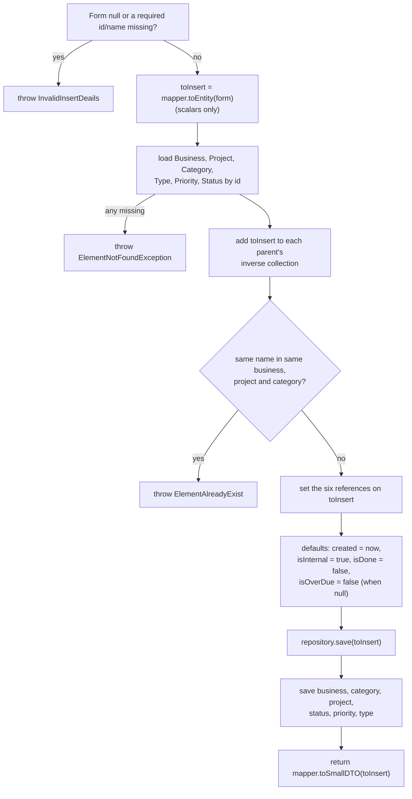

# Service Layer Patterns — BugTracker

#doc #explanation #ref-bugtracker #architecture #persistence

**Project:** `BugTracker/` · **Stack:** Spring Boot 2.7.0, Java 17 (effective) · **Index:** [[Docs/BugTracker/BugTracker-Index]]

## Summary

Module services extend `DefaultServiceImplements` and put all domain rules in overridden methods. The
dominant pattern is the **insert workflow**: null-check the Form, map scalars, load every referenced entity
by id (throwing `ElementNotFoundException` if missing), check uniqueness, link both sides of every
association, set defaults, save the new entity, then save each parent. Updates copy non-null Form fields;
deletes guard against dependent rows and unlink many-to-many relations. Priorities have an explicit
ordering algorithm. The one idea to take away: **services are procedural scripts over anemic entities** —
every invariant (uniqueness, defaults, both-sides linking, ordering) is enforced by the service that
happens to write, and nowhere else.

## Why It Is Built This Way

Inferred: with a generic base class doing the plumbing, the natural place for "the real code" is the
overridden `insert`. Linking both sides by hand keeps the in-memory graph consistent for the mapper that
runs right after, and saving each parent is the developer's way of making sure inverse collections and
counters are persisted (inverse sides are not persisted by JPA, so these saves mostly have no effect on the
relation itself).

## How It Works

### The canonical insert (`bsPrTaskServiceImplements.insert`)

Source: `BugTracker/src/main/java/com/bgsystem/bugtracker/models/client/project/bsPrTask/bsPrTaskServiceImplements.java:65-142`.
The Form's `invoice` id is neither validated nor used
(`BugTracker/src/main/java/com/bgsystem/bugtracker/models/client/project/bsPrTask/bsPrTaskForm.java:44`).

Variations of the same script:

- **User kinds** (admin, HQ client, HQ employee, bsClient, bsManager, bsEmployee): check username and e-mail
  against the module's own repository, encode the password, set the fixed role string, attach the owner
  (MainHQ or Business) (`BugTracker/src/main/java/com/bgsystem/bugtracker/models/client/bsClient/bsClientServiceImplements.java:44-94`).
- **Owner derived from a parent**: a Doc or KB entry takes its Business from its category
  (`BugTracker/src/main/java/com/bgsystem/bugtracker/models/client/bsDoc/bsDocServiceImplements.java:51-63`);
  a comment takes its project from its channel
  (`BugTracker/src/main/java/com/bgsystem/bugtracker/models/client/project/bsPrComment/bsPrCommentServiceImplements.java:69-76`).
- **Side effects**: comment insert generates mentions
  ([[Docs/BugTracker/Explanations/11-Collaboration-Features]]); Business insert creates default general
  settings (`BugTracker/src/main/java/com/bgsystem/bugtracker/models/client/business/BusinessServiceImplements.java:67-79`);
  HQ invoice insert copies the plan price and sets a five-day due date
  (`BugTracker/src/main/java/com/bgsystem/bugtracker/models/HQ/invoice/InvoiceServiceImplements.java:79-105`).

### Uniqueness checks

| Module | Rule | Scope | Source |
|---|---|---|---|
| `bsPrTask` | name per business + project + category | tenant/project | `BugTracker/src/main/java/com/bgsystem/bugtracker/models/client/project/bsPrTask/bsPrTaskServiceImplements.java:99-102` |
| `bsTaskCategory` | name per business | tenant | `BugTracker/src/main/java/com/bgsystem/bugtracker/models/client/bsTaskCategory/bsTaskCategoryServiceImplements.java:49-54` |
| `bsKBCategory` | name per business | tenant | `BugTracker/src/main/java/com/bgsystem/bugtracker/models/client/bsKBCategory/bsKBCategoryServiceImplements.java:43-46` |
| `bsProject` | name per business + client | tenant | `BugTracker/src/main/java/com/bgsystem/bugtracker/models/client/project/bsProject/bsProjectServiceImplements.java:68-70` |
| `bsPrDocs`, `bsPrKBCategory` | title/name per category or project | project | `BugTracker/src/main/java/com/bgsystem/bugtracker/models/client/project/bsPrDocs/bsPrDocsServiceImplements.java:61-63` |
| `bsStatus` | name **or colour** | **global** | `BugTracker/src/main/java/com/bgsystem/bugtracker/models/client/bsStatus/bsStatusServiceImplements.java:42-45` |
| `bsPriority` | name | **global** | `BugTracker/src/main/java/com/bgsystem/bugtracker/models/client/bsPriority/bsPriorityServiceImplements.java:47-50` |
| `bsType` | name | **global** | `BugTracker/src/main/java/com/bgsystem/bugtracker/models/client/bsType/bsTypeServiceImplements.java:50-53` |
| `bsDocsCategory` | name | **global** | `BugTracker/src/main/java/com/bgsystem/bugtracker/models/client/bsDocsCategory/bsDocsCategoryServiceImplements.java:43-45` |
| `bsDoc`, `bsKB` | title | **global** | `BugTracker/src/main/java/com/bgsystem/bugtracker/models/client/bsDoc/bsDocServiceImplements.java:44-46` |
| `Business` | name (also `unique = true` column) | global (intended) | `BugTracker/src/main/java/com/bgsystem/bugtracker/models/client/business/BusinessServiceImplements.java:53-57` |
| user kinds | username / e-mail within the same subclass | per user kind | `BugTracker/src/main/java/com/bgsystem/bugtracker/models/client/bsManager/bsManagerServiceImplements.java:49-54` |

All checks are "read, then insert" with no database constraint behind them (except Business name).

### Priority ordering

- Insert: after adding the new priority to its Business, `priorityOrder = business.getBsPriorities().size()`
  — the new priority goes last (`BugTracker/src/main/java/com/bgsystem/bugtracker/models/client/bsPriority/bsPriorityServiceImplements.java:57-71`).
- `PUT /bs_priority/update-order` takes a set of `{id, priorityOrder}` Forms and writes each order as given
  (`BugTracker/src/main/java/com/bgsystem/bugtracker/models/client/bsPriority/bsPriorityServiceImplements.java:97-111`).
- Delete: every priority with a greater `priorityOrder` is shifted down by one, then the priority is
  deleted (`BugTracker/src/main/java/com/bgsystem/bugtracker/models/client/bsPriority/bsPriorityServiceImplements.java:113-135`).
  The finder `findByPriorityOrderGreaterThan` has no Business parameter
  (`BugTracker/src/main/java/com/bgsystem/bugtracker/models/client/bsPriority/bsPriorityRepository.java:14`).

### Update and delete overrides

| Module | `update` | `delete` |
|---|---|---|
| `HQ/client` | username required; copy names, e-mail, re-encoded password | returns DTO, deletes (roles printed first) |
| `HQ/admin`, `HQ/employee` | base (no-op) | returns DTO, deletes (roles printed first) |
| `bsDoc`, `bsKB` | copy title, content; re-point category | base |
| `bsDocsCategory`, `bsKBCategory` | copy name, description; re-parent (self-parent rejected); recompute `level` | base |
| `bsPriority` | copy name, order | shift later orders, delete |
| `bsStatus` | copy colour, name | refuse when tasks exist |
| `bsTaskCategory` | name required, copy | refuse when tasks exist or a linked type would be left with none; unlink types |
| `bsType` | copy name; diff task categories, unlink removed, link new | refuse when tasks exist; unlink categories |
| `business` | delegates to base (no-op) | base, with `@PreAuthorize` |

Sources: `BugTracker/src/main/java/com/bgsystem/bugtracker/models/HQ/client/ClientServiceImplements.java:79-128`,
`BugTracker/src/main/java/com/bgsystem/bugtracker/models/client/bsDocsCategory/bsDocsCategoryServiceImplements.java:85-122`,
`BugTracker/src/main/java/com/bgsystem/bugtracker/models/client/bsStatus/bsStatusServiceImplements.java:63-97`,
`BugTracker/src/main/java/com/bgsystem/bugtracker/models/client/bsTaskCategory/bsTaskCategoryServiceImplements.java:90-126`,
`BugTracker/src/main/java/com/bgsystem/bugtracker/models/client/bsType/bsTypeServiceImplements.java:86-156`.

### `EntityFactory`

`shared/service/EntityFactory` injects 26 repositories and resolves an entity by a type-name string
(`BugTracker/src/main/java/com/bgsystem/bugtracker/shared/service/EntityFactory.java:35-91`). A search of
`BugTracker/src` finds no reference to it outside its own file: it is **unused**. It is still a Spring bean
and is constructed at start-up.

## Key Components

| Component | Path | Responsibility |
|---|---|---|
| Task service | `BugTracker/src/main/java/com/bgsystem/bugtracker/models/client/project/bsPrTask/bsPrTaskServiceImplements.java` | Canonical insert |
| Priority service | `BugTracker/src/main/java/com/bgsystem/bugtracker/models/client/bsPriority/bsPriorityServiceImplements.java` | Ordering |
| Type service | `BugTracker/src/main/java/com/bgsystem/bugtracker/models/client/bsType/bsTypeServiceImplements.java` | Many-to-many diff |
| Business service | `BugTracker/src/main/java/com/bgsystem/bugtracker/models/client/business/BusinessServiceImplements.java` | Tenant creation, counters, the only `@PreAuthorize` |

## Conventions and Rules

- Validate with explicit `null` checks and throw `InvalidInsertDeails` first.
- Resolve every id with `findById(...).orElseThrow(() -> new ElementNotFoundException("X not found"))`.
- Add the new entity to each parent's inverse collection and set the owning reference.
- Save the new entity, then save each touched parent.
- Return `mapper.toSmallDTO(...)` from `insert`, `mapper.toDTO(...)` from `update` and `delete`.

## How to Replicate

1. Override `insert` in `XServiceImplements` following the flowchart.
2. Put a uniqueness finder in `XRepository` (`findByNameAndBusiness…`) and check it before saving.
3. Override `update` to copy each non-null Form field; re-resolve any association id present.
4. Override `delete` when children must block deletion or many-to-many rows must be unlinked.
5. Override `updateListFields` when the ListDTO shows counters.

## Known Limitations

- Global uniqueness on tenant data: [[Docs/BugTracker/Reviews/06-Service-Layer-Correctness-Review#BT-R06-01|BT-R06-01]].
- Priority delete affects every Business: [[Docs/BugTracker/Reviews/06-Service-Layer-Correctness-Review#BT-R06-02|BT-R06-02]].
- Channel insert fails with members: [[Docs/BugTracker/Reviews/06-Service-Layer-Correctness-Review#BT-R06-03|BT-R06-03]].
- Task category delete throws with several types: [[Docs/BugTracker/Reviews/06-Service-Layer-Correctness-Review#BT-R06-04|BT-R06-04]].
- Type update diff: [[Docs/BugTracker/Reviews/06-Service-Layer-Correctness-Review#BT-R06-05|BT-R06-05]].
- HQ client update lookup: [[Docs/BugTracker/Reviews/06-Service-Layer-Correctness-Review#BT-R06-06|BT-R06-06]].
- `findAll().get(0)` for MainHQ: [[Docs/BugTracker/Reviews/06-Service-Layer-Correctness-Review#BT-R06-07|BT-R06-07]].
- Wrong exception types: [[Docs/BugTracker/Reviews/06-Service-Layer-Correctness-Review#BT-R06-08|BT-R06-08]].
- Print-before-delete workaround: [[Docs/BugTracker/Reviews/06-Service-Layer-Correctness-Review#BT-R06-09|BT-R06-09]].
- Task invoice ignored: [[Docs/BugTracker/Reviews/06-Service-Layer-Correctness-Review#BT-R06-10|BT-R06-10]].
- `EntityFactory` is dead code: [[Docs/BugTracker/Reviews/10-Code-Hygiene-Review#BT-R10-02|BT-R10-02]].

## Related Documents

- [[Docs/BugTracker/Explanations/04-Generic-CRUD-Framework]]
- [[Docs/BugTracker/Explanations/08-Persistence-and-Transactions]]
- [[Docs/BugTracker/Reviews/06-Service-Layer-Correctness-Review]]
