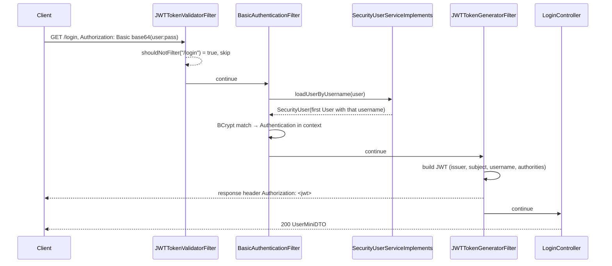
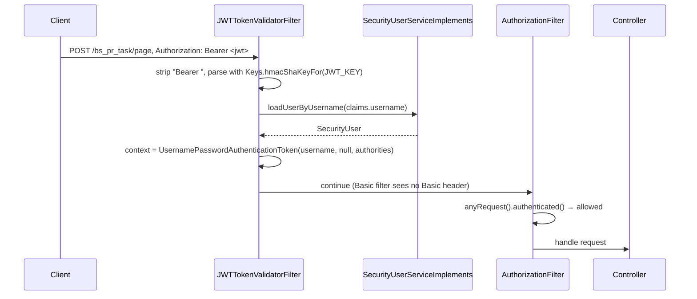

# Authentication and Authorization — BugTracker

#doc #explanation #ref-bugtracker #security

**Project:** `BugTracker/` · **Stack:** Spring Boot 2.7.0, Java 17 (effective) · **Index:** [[Docs/BugTracker/BugTracker-Index]]

## Summary

Login is **HTTP Basic on `GET /login`**. Spring Security's `BasicAuthenticationFilter` checks the
username and BCrypt password through a `UserDetailsService`; a custom `JWTTokenGeneratorFilter`, placed
after it and active only for `/login`, then signs a JWT (JJWT 0.11, HMAC key from a Java constant) and puts
it in the `Authorization` response header. Every other request must carry `Authorization: Bearer <jwt>`;
`JWTTokenValidatorFilter`, placed before the Basic filter, verifies it, reloads the user by the `username`
claim and sets the security context. The filter chain requires authentication for every request and
nothing more. The one idea to take away: **authorization is "is authenticated"** — roles exist as strings
but only one service checks them, and nothing checks which tenant a user belongs to.

## Why It Is Built This Way

Inferred: Basic-then-token is a common tutorial pattern for Angular front ends in the Spring Security 5
era — the browser sends credentials once, then keeps the token. CORS allows the Angular dev server on port
4200 and exposes the `Authorization` header so the front end can read the token
(`BugTracker/src/main/java/com/bgsystem/bugtracker/configuration/security/SecurityConfig.java:47-56`).
Statelessness (`SessionCreationPolicy.STATELESS`) and disabled CSRF follow from using header tokens.

## How It Works

### Filter chain

`BugTracker/src/main/java/com/bgsystem/bugtracker/configuration/security/SecurityConfig.java:32-45`
```java
    @Bean
    SecurityFilterChain defaultSecurityFilterChain(HttpSecurity http) throws Exception {
        http
                .sessionManagement().sessionCreationPolicy(SessionCreationPolicy.STATELESS)
                .and()
                .cors().configurationSource(request -> corsConfiguration())
                .and().csrf().disable()
                .addFilterBefore(new JWTTokenValidatorFilter(securityUserServiceImplements), BasicAuthenticationFilter.class)
                .addFilterAfter(new JWTTokenGeneratorFilter(userRepository), BasicAuthenticationFilter.class)
                .authorizeHttpRequests((auth) -> auth
                        .anyRequest().authenticated()
                ).httpBasic(Customizer.withDefaults());
        return http.build();
    }
```

Both filter classes are also annotated `@Service`
(`BugTracker/src/main/java/com/bgsystem/bugtracker/configuration/filter/JWTTokenGeneratorFilter.java:28-29`,
`BugTracker/src/main/java/com/bgsystem/bugtracker/configuration/filter/JWTTokenValidatorFilter.java:25-26`),
so Spring creates one bean instance of each in addition to the two `new` instances placed in the chain.
Spring Boot 2.7 registers every `javax.servlet.Filter` bean with the servlet container
(`ServletContextInitializerBeans.addAdaptableBeans`, checked with `javap` on `spring-boot-2.7.0.jar`).

### (a) Login



Sources: `BugTracker/src/main/java/com/bgsystem/bugtracker/configuration/filter/JWTTokenGeneratorFilter.java:39-70`,
`BugTracker/src/main/java/com/bgsystem/bugtracker/shared/models/user/LoginController.java:25-35`.
The token is written **without** the `Bearer ` prefix; the client must add it.

### (b) Authenticated request



Source: `BugTracker/src/main/java/com/bgsystem/bugtracker/configuration/filter/JWTTokenValidatorFilter.java:37-78`.
Any exception while parsing or loading is replaced by `BadCredentialsException("Invalid Token received!")`
thrown from the filter (`BugTracker/src/main/java/com/bgsystem/bugtracker/configuration/filter/JWTTokenValidatorFilter.java:66-68`).

### Token claims

| Claim | Value | Source |
|---|---|---|
| `iss` | `"ProjectManager"` | `BugTracker/src/main/java/com/bgsystem/bugtracker/configuration/filter/JWTTokenGeneratorFilter.java:54` |
| `sub` | constant `"JWT Token"` | `BugTracker/src/main/java/com/bgsystem/bugtracker/configuration/filter/JWTTokenGeneratorFilter.java:54` |
| `username` | the user's username | `BugTracker/src/main/java/com/bgsystem/bugtracker/configuration/filter/JWTTokenGeneratorFilter.java:55` |
| `authorities` | list of role strings | `BugTracker/src/main/java/com/bgsystem/bugtracker/configuration/filter/JWTTokenGeneratorFilter.java:56` |
| `iat` / `exp` | now / now + 900,000,000 ms (about 10.4 days) | `BugTracker/src/main/java/com/bgsystem/bugtracker/configuration/filter/JWTTokenGeneratorFilter.java:57-58` |
| signing key | HMAC-SHA from `SecurityConstant.JWT_KEY` (value `<redacted>`) | `BugTracker/src/main/java/com/bgsystem/bugtracker/configuration/security/SecurityConstant.java:5` |

The validator reads only `username`; the `authorities` claim is ignored and roles are reloaded from the
database on every request (`BugTracker/src/main/java/com/bgsystem/bugtracker/configuration/filter/JWTTokenValidatorFilter.java:58-62`).
The issuer is not checked. JJWT 0.11's `Jwts.parserBuilder().setSigningKey(key).build().parseClaimsJws(jwt)`
rejects unsigned and expired tokens.

### `SecurityUser` and the user store

`SecurityUserServiceImplements.loadUserByUsername` calls `userRepository.findByUsername` (a `Set<User>`
across all seven user kinds), throws `UsernameNotFoundException` only if the set is `null`, and returns the
first element (`BugTracker/src/main/java/com/bgsystem/bugtracker/shared/models/securityUser/SecurityUserServiceImplements.java:20-33`).
`SecurityUser` adapts `User`: authorities are `SimpleGrantedAuthority(role)` for each stored role string;
`isAccountNonExpired`, `isAccountNonLocked`, `isCredentialsNonExpired` and `isEnabled` return `true`
(`BugTracker/src/main/java/com/bgsystem/bugtracker/shared/models/securityUser/SecurityUser.java:21-56`).
In Spring Security 5.7 these four methods are abstract on `UserDetails` (checked with `javap` on
`spring-security-core-5.7.1.jar`), so the class must implement them; it ignores the matching columns on
`User` (`BugTracker/src/main/java/com/bgsystem/bugtracker/shared/models/user/User.java:56-66`).

### Roles

Roles are plain strings in the `user_roles` table. Each user service assigns one fixed string on insert
(`ROLE_ADMIN`, `ROLE_CLIENT`, `ROLE_EMPLOYEE`, `ROLE_BS_CLIENT`, `ROLE_BS_MANAGER`, `ROLE_BS_EMPLOYEE`); the
generic `POST /user` stores whatever `roles` the Form contains
(`BugTracker/src/main/java/com/bgsystem/bugtracker/shared/models/user/UserForm.java:32`,
`BugTracker/src/main/java/com/bgsystem/bugtracker/shared/models/user/UserMapper.java:45-52`).

### Method security

`@EnableGlobalMethodSecurity(prePostEnabled = true)` is on the security configuration
(`BugTracker/src/main/java/com/bgsystem/bugtracker/configuration/security/SecurityConfig.java:25`). The only
`@PreAuthorize` annotations in the code are on four methods of `BusinessServiceImplements`:
`insert`, `delete`, `getAll` and `getPageableListView`, all `hasAnyRole('CLIENT', 'ADMIN')`
(`BugTracker/src/main/java/com/bgsystem/bugtracker/models/client/business/BusinessServiceImplements.java:45-106`).
`hasAnyRole` adds the `ROLE_` prefix, so these match `ROLE_CLIENT` and `ROLE_ADMIN`. Because `insert` is
protected, the seeder, which runs without an authenticated user, does not call it and repeats its logic
instead (`BugTracker/src/main/java/com/bgsystem/bugtracker/shared/tools/firstInstallCheck.java:162-194`).
`AccessDeniedException` from these checks is turned into a 403 by `GlobalExceptionHandler`
([[Docs/BugTracker/Explanations/12-Error-Handling]]).

### CORS

Allowed origin `http://localhost:4200`, all methods and headers, credentials allowed, `Authorization`
exposed, max age 3600 s (`BugTracker/src/main/java/com/bgsystem/bugtracker/configuration/security/SecurityConfig.java:47-56`).

## Key Components

| Component | Path | Responsibility |
|---|---|---|
| `SecurityConfig` | `BugTracker/src/main/java/com/bgsystem/bugtracker/configuration/security/SecurityConfig.java` | Chain, CORS, `PasswordEncoder` (BCrypt) |
| `SecurityConstant` | `BugTracker/src/main/java/com/bgsystem/bugtracker/configuration/security/SecurityConstant.java` | Key, header name, `Bearer ` prefix |
| `JWTTokenGeneratorFilter` | `BugTracker/src/main/java/com/bgsystem/bugtracker/configuration/filter/JWTTokenGeneratorFilter.java` | Issue token on `/login` |
| `JWTTokenValidatorFilter` | `BugTracker/src/main/java/com/bgsystem/bugtracker/configuration/filter/JWTTokenValidatorFilter.java` | Verify token on every other path |
| `SecurityUser`, `SecurityUserServiceImplements` | `BugTracker/src/main/java/com/bgsystem/bugtracker/shared/models/securityUser/` | `UserDetails` adapter and loader |
| `LoginController` | `BugTracker/src/main/java/com/bgsystem/bugtracker/shared/models/user/LoginController.java` | Returns the logged-in user's MiniDTO |

## Conventions and Rules

- Passwords are encoded with the `PasswordEncoder` bean in each user service before mapping.
- Every user kind is a `User` subclass so `findByUsername` on `UserRepository` finds all of them.
- The role string is set by the service, never by the caller — except in `UserServiceImplements`.
- Method-level rules use `@PreAuthorize` on service methods (one service so far).

## How to Replicate

1. `SecurityConfig` with a `SecurityFilterChain` bean: stateless, CORS source, CSRF off, `httpBasic`,
   `anyRequest().authenticated()`, a `BCryptPasswordEncoder` bean.
2. `SecurityConstant` with header name and `Bearer ` prefix; the key belongs in configuration, not a constant.
3. `JWTTokenGeneratorFilter extends OncePerRequestFilter`, active only for `/login`, added after
   `BasicAuthenticationFilter`, writing the token to the `Authorization` header.
4. `JWTTokenValidatorFilter extends OncePerRequestFilter`, skipped for `/login`, added before
   `BasicAuthenticationFilter`, setting the context from the `username` claim.
5. `SecurityUser implements UserDetails` and a `UserDetailsService` over `UserRepository.findByUsername`.
6. `LoginController` at `GET /login` returning the principal's MiniDTO.

## Known Limitations

- Authentication-only authorization: [[Docs/BugTracker/Reviews/01-Security-and-Multi-Tenancy-Review#BT-R01-01|BT-R01-01]].
- No tenant isolation: [[Docs/BugTracker/Reviews/01-Security-and-Multi-Tenancy-Review#BT-R01-02|BT-R01-02]].
- Hardcoded key and credentials: [[Docs/BugTracker/Reviews/01-Security-and-Multi-Tenancy-Review#BT-R01-03|BT-R01-03]].
- Role assignment through `POST /user`: [[Docs/BugTracker/Reviews/01-Security-and-Multi-Tenancy-Review#BT-R01-04|BT-R01-04]].
- Duplicate usernames across user kinds: [[Docs/BugTracker/Reviews/01-Security-and-Multi-Tenancy-Review#BT-R01-06|BT-R01-06]].
- Filter defects and double registration: [[Docs/BugTracker/Reviews/01-Security-and-Multi-Tenancy-Review#BT-R01-08|BT-R01-08]],
  [[Docs/BugTracker/Reviews/01-Security-and-Multi-Tenancy-Review#BT-R01-09|BT-R01-09]].
- Token lifetime and revocation: [[Docs/BugTracker/Reviews/01-Security-and-Multi-Tenancy-Review#BT-R01-10|BT-R01-10]].
- Account flags ignored: [[Docs/BugTracker/Reviews/01-Security-and-Multi-Tenancy-Review#BT-R01-11|BT-R01-11]].
- Loader exception type: [[Docs/BugTracker/Reviews/01-Security-and-Multi-Tenancy-Review#BT-R01-12|BT-R01-12]].

## Related Documents

- [[Docs/BugTracker/Explanations/12-Error-Handling]]
- [[Docs/BugTracker/Explanations/13-Configuration-and-Bootstrap]]
- [[Docs/BugTracker/Reviews/01-Security-and-Multi-Tenancy-Review]]
- [[Docs/backend/Explanations/07-Authentication-and-Authorization]] — the descendant's JSON-login design
