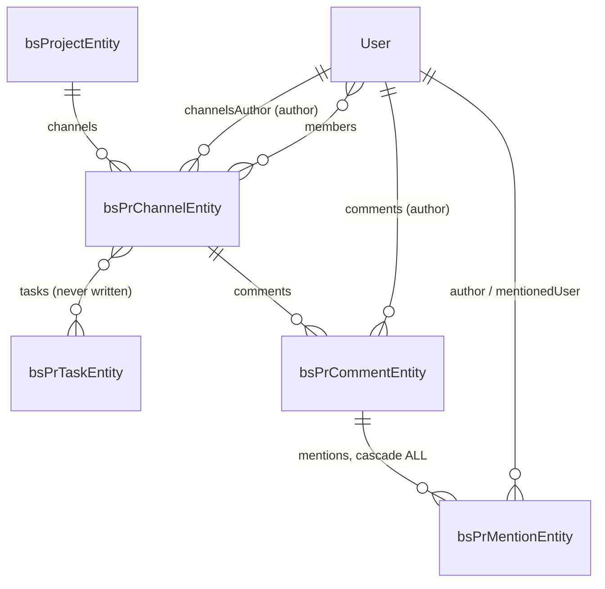
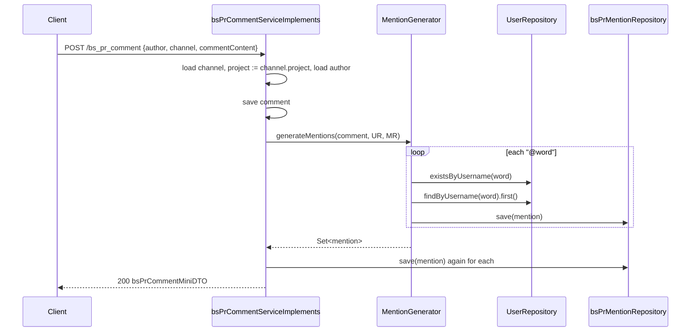

# Collaboration Features — BugTracker

#doc #explanation #ref-bugtracker #architecture

**Project:** `BugTracker/` · **Stack:** Spring Boot 2.7.0, Java 17 (effective) · **Index:** [[Docs/BugTracker/BugTracker-Index]]

## Summary

Each project has **channels** (chat rooms with an author, members and an optional public flag), channels
have **comments**, and a comment that contains `@username` produces **mentions** that link the comment's
author to the mentioned user. Comments are read newest-first through a dedicated paged endpoint. Channels
were also meant to be linked to tasks through a many-to-many table, but no code writes that relation. The
one idea to take away: **mentions are derived data** — they are generated from comment text at insert
time by a static helper, not entered by the user (although a direct `POST /bs_pr_mention` also exists).

## Why It Is Built This Way

Inferred: a project-management product needs discussion next to the work items. Storing mentions as rows
(rather than parsing text on read) makes "comments that mention me" a simple query and lets a UI show
notifications. Making the author a `User` (the hierarchy root) lets any kind of user — HQ or tenant — post.

## How It Works

### Model



Sources: `BugTracker/src/main/java/com/bgsystem/bugtracker/models/client/project/bsPrChannel/bsPrChannelEntity.java:21-72`,
`BugTracker/src/main/java/com/bgsystem/bugtracker/models/client/project/bsPrComment/bsPrCommentEntity.java:20-50`,
`BugTracker/src/main/java/com/bgsystem/bugtracker/models/client/project/bsPrMention/bsPrMentionEntity.java:17-38`.
Comment text is up to 2,000 characters (`BugTracker/src/main/java/com/bgsystem/bugtracker/models/client/project/bsPrComment/bsPrCommentEntity.java:26-27`).

### Channel insert

The Form carries `name`, `author` (user id), `project` (id) and optional `members` (set of user ids),
`isPublic` and `creationDate`. The service loads the project and author, loads each member and adds the
channel to the member's `channels` and the member to the channel's `members`, checks
`existsByNameAndProject`, defaults `isPublic = true` and `creationDate = now`, then saves channel, project,
author and members (`BugTracker/src/main/java/com/bgsystem/bugtracker/models/client/project/bsPrChannel/bsPrChannelServiceImplements.java:42-104`).

### Comment insert and mention generation

The service loads the channel and takes the project from it, loads the author by the id in the Form, sets
`commentDate = now`, saves the comment, then asks `MentionGenerator` for mentions and saves each again
(`BugTracker/src/main/java/com/bgsystem/bugtracker/models/client/project/bsPrComment/bsPrCommentServiceImplements.java:59-112`).

`BugTracker/src/main/java/com/bgsystem/bugtracker/shared/tools/MentionGenerator.java:16-46`
```java
    public static Set<bsPrMentionEntity> generateMentions(bsPrCommentEntity comment, UserRepository userRepository, bsPrMentionRepository mentionRepository){

        List<String> users = Arrays.asList(comment.getCommentContent().split(" "))
                .stream()
                .filter(word -> word.startsWith("@"))
                .collect(Collectors.toList());

        users =  users.stream().map(user -> user.substring(1)).collect(Collectors.toList());

        Set<bsPrMentionEntity> mentions = new HashSet<>();

        for (String user : users){
            Boolean userExist = userRepository.existsByUsername(user);

            if (userExist){

                bsPrMentionEntity mention = new bsPrMentionEntity();

                mention.setAuthor(comment.getAuthor());

                mention.setMentionedUser(userRepository.findByUsername(user).iterator().next());

                mention.setMentionDate(comment.getCommentDate());

                mention.setComment(comment);

                mentionRepository.save(mention);
```

Parsing rules as implemented: words are split on single spaces only; a word counts when it starts with `@`;
the rest of the word, including trailing punctuation (`@anna,`), is the username; the user is looked up in
the whole `User` table, not only the channel's members or the same Business.



### Direct mention insert

`POST /bs_pr_mention` accepts `author`, `mentionedUser` and `comment` ids, rejects self-mentions, and returns
the existing row when the same triple already exists
(`BugTracker/src/main/java/com/bgsystem/bugtracker/models/client/project/bsPrMention/bsPrMentionServiceImplements.java:39-82`).

### Reading comments

`GET /bs_pr_comment/pageable/{channel}/{page}/{size}` loads the channel and returns
`findByChannel(PageRequest.of(page, size, Sort.by("commentDate").descending()), channel)` mapped to DTOs,
returning only the page content (no totals)
(`BugTracker/src/main/java/com/bgsystem/bugtracker/models/client/project/bsPrComment/bsPrCommentController.java:22-27`,
`BugTracker/src/main/java/com/bgsystem/bugtracker/models/client/project/bsPrComment/bsPrCommentServiceImplements.java:114-124`).
The controller receives the same service twice, once for `super` and once as `extraService`
(`BugTracker/src/main/java/com/bgsystem/bugtracker/models/client/project/bsPrComment/bsPrCommentController.java:16-20`).

### Channel ↔ task

`bsPrChannelEntity.tasks` owns the `channel_and_task_relations` join table and `bsPrTaskEntity.channels`
is its inverse (`BugTracker/src/main/java/com/bgsystem/bugtracker/models/client/project/bsPrChannel/bsPrChannelEntity.java:64-70`,
`BugTracker/src/main/java/com/bgsystem/bugtracker/models/client/project/bsPrTask/bsPrTaskEntity.java:83-87`).
No service, mapper or Form reads or writes either side, and `bsPrTaskEntity.channelCount` is never computed.

## Key Components

| Component | Path | Responsibility |
|---|---|---|
| Channel module | `BugTracker/src/main/java/com/bgsystem/bugtracker/models/client/project/bsPrChannel/` | Rooms, members |
| Comment module | `BugTracker/src/main/java/com/bgsystem/bugtracker/models/client/project/bsPrComment/` | Messages, paged read |
| Mention module | `BugTracker/src/main/java/com/bgsystem/bugtracker/models/client/project/bsPrMention/` | Mention rows |
| `MentionGenerator` | `BugTracker/src/main/java/com/bgsystem/bugtracker/shared/tools/MentionGenerator.java` | `@username` parsing |

## Conventions and Rules

- Authors are passed as user ids in the Form.
- A comment's project is always its channel's project.
- Mentions are created by the comment service; the mention module is for manual creation and reads.
- Comment reads for a chat view use the dedicated path-variable endpoint, not `/page`.

## How to Replicate

1. Create `bsPrChannel` (author, project, members join table), `bsPrComment` (author, channel, project,
   mentions with cascade), `bsPrMention` (comment, author, mentionedUser) modules.
2. Add `MentionGenerator.generateMentions(comment, userRepository, mentionRepository)` and call it after
   saving a comment.
3. Add `Page<bsPrCommentEntity> findByChannel(Pageable, bsPrChannelEntity)` and the paged `GET` endpoint.

## Known Limitations

- Author taken from the request body: [[Docs/BugTracker/Reviews/01-Security-and-Multi-Tenancy-Review#BT-R01-05|BT-R01-05]].
- Channel insert with members throws and its uniqueness check uses a null project:
  [[Docs/BugTracker/Reviews/06-Service-Layer-Correctness-Review#BT-R06-03|BT-R06-03]].
- Channel ↔ task relation never written: [[Docs/BugTracker/Reviews/06-Service-Layer-Correctness-Review#BT-R06-10|BT-R06-10]].
- Mentions saved twice, naive parsing: [[Docs/BugTracker/Reviews/06-Service-Layer-Correctness-Review#BT-R06-11|BT-R06-11]].
- Comment controller deviations: [[Docs/BugTracker/Reviews/02-CRUD-Framework-and-API-Design-Review#BT-R02-09|BT-R02-09]].

## Related Documents

- [[Docs/BugTracker/Explanations/07-Domain-Model]]
- [[Docs/BugTracker/Explanations/09-Service-Layer-Patterns]]
- [[Docs/BugTracker/Reviews/06-Service-Layer-Correctness-Review]]
