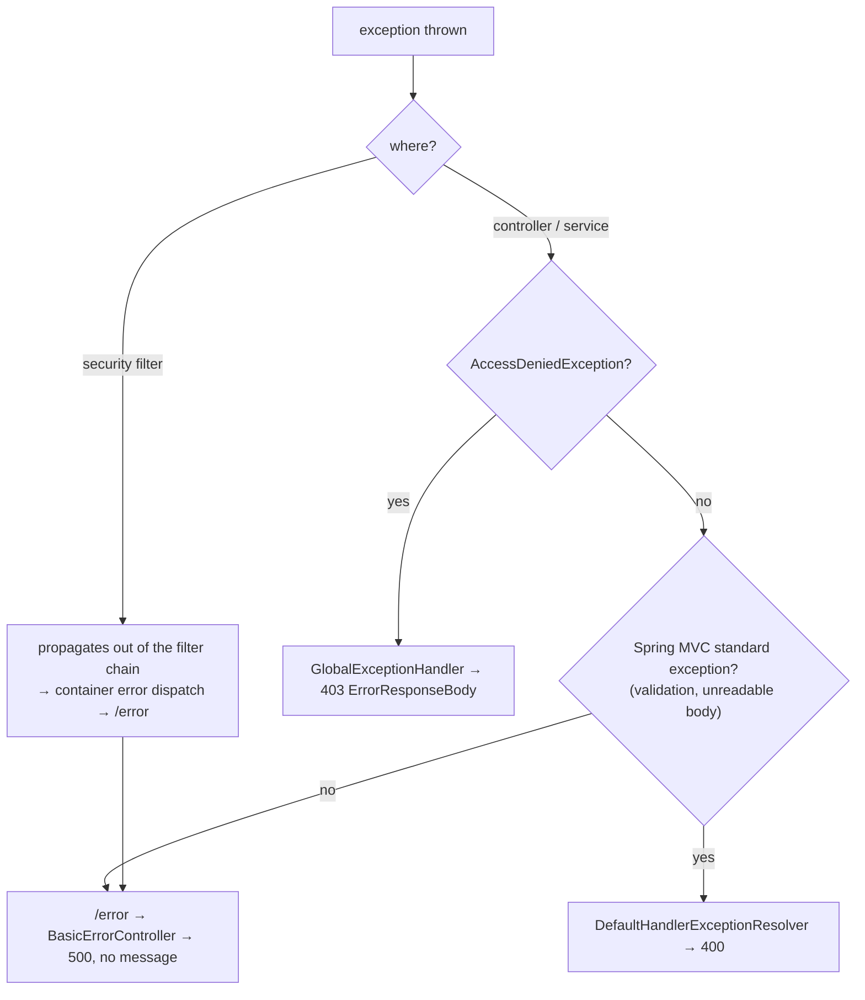

# Error Handling — BugTracker

#doc #explanation #ref-bugtracker #error-handling

**Project:** `BugTracker/` · **Stack:** Spring Boot 2.7.0, Java 17 (effective) · **Index:** [[Docs/BugTracker/BugTracker-Index]]

## Summary

The package `exeptions` (sic) holds five **checked** domain exceptions, an `ErrorResponseBody` class and a
`@ControllerAdvice` whose only handler maps `AccessDeniedException` to a 403 with that body. Every other
exception — including all five domain exceptions — is left to Spring Boot 2.7's default error handling,
which answers with status 500 and a body that omits the exception message. The one idea to take away:
**"not found", "already exists" and "invalid input" all reach the client as an undifferentiated
`500 Internal Server Error`**, with the carefully written messages discarded.

## Why It Is Built This Way

Inferred: the exceptions were designed as a vocabulary for the service layer (their default messages read
like user-facing text), and the advice was started for the one case that had a visible symptom in the UI
(the Business `@PreAuthorize`). The mapping for the domain exceptions was never added. Checked exceptions
force every signature in the generic stack to declare them, which suggests the author intended callers to
handle them.

## How It Works

### Exception inventory

| Exception | Default message | Thrown for | Source |
|---|---|---|---|
| `ElementNotFoundException` | "This element doesn't exist" | missing id; also a self-parent category | `BugTracker/src/main/java/com/bgsystem/bugtracker/exeptions/ElementNotFoundException.java:3-10` |
| `ElementAlreadyExist` | "Element already exist" | uniqueness probe hit; also some missing ids | `BugTracker/src/main/java/com/bgsystem/bugtracker/exeptions/ElementAlreadyExist.java:3-10` |
| `InvalidInsertDeails` | "The details are not valid, …" | missing required Form fields | `BugTracker/src/main/java/com/bgsystem/bugtracker/exeptions/InvalidInsertDeails.java:3-10` |
| `InvalidDeleteOperation` | "Can't be deleted" | dependent rows exist | `BugTracker/src/main/java/com/bgsystem/bugtracker/exeptions/InvalidDeleteOperation.java:3-13` |
| `BadOperator` | "Bad operator" | unknown filter operator or number type | `BugTracker/src/main/java/com/bgsystem/bugtracker/exeptions/BadOperator.java:3-10` |

All extend `java.lang.Exception` directly; there is no common base class.

### The handler and the body

`BugTracker/src/main/java/com/bgsystem/bugtracker/exeptions/GlobalExceptionHandler.java:12-27`
```java
@ControllerAdvice
public class GlobalExceptionHandler {

    @ExceptionHandler(AccessDeniedException.class)
    public ResponseEntity<?> handleAccessDeniedException(AccessDeniedException e, HttpServletRequest request){
        ErrorResponseBody errorResponseBody = ErrorResponseBody.builder()
                .message("You do not have the required permissions to perform this action")
                .error("Forbidden")
                .path(request.getRequestURI())
                .status(HttpStatus.FORBIDDEN.value())
                .timestamp(LocalDateTime.now())
                .trace(e.getLocalizedMessage())
                .build();
        return new ResponseEntity<>(errorResponseBody, HttpStatus.FORBIDDEN);
    }
}
```

`ErrorResponseBody` has `error`, `message`, `path`, `status`, `timestamp` (`LocalDateTime`) and `trace`
(`BugTracker/src/main/java/com/bgsystem/bugtracker/exeptions/ErrorResponseBody.java:12-21`).

### What a client actually receives

Boot 2.7's `BasicErrorController` renders unhandled exceptions. Its defaults — `include-message`,
`include-stacktrace` and `include-binding-errors` all `NEVER` — were verified with `javap` on
`spring-boot-autoconfigure-2.7.0.jar` (`ErrorProperties` constructor). No `server.error.*` property is set
(`BugTracker/src/main/resources/application.properties:1-6`).

| Situation | Status | Body |
|---|---|---|
| `ElementNotFoundException` (e.g. `GET /bs_pr_task/999`) | 500 | Boot default: `timestamp`, `status`, `error: "Internal Server Error"`, `path` — no message |
| `ElementAlreadyExist`, `InvalidInsertDeails`, `InvalidDeleteOperation`, `BadOperator` | 500 | same |
| `NullPointerException`, `IllegalArgumentException`, `ConcurrentModificationException` from services | 500 | same |
| `@Valid` failure on one of the 15 annotated Form fields | 400 | Boot default, without field errors |
| Malformed JSON body | 400 | Boot default |
| `POST /page` or `/page-list-view` without a body | 400 | empty (`ResponseEntity.badRequest().build()`) |
| `@PreAuthorize` denial on a Business method | 403 | `ErrorResponseBody` |
| Wrong Basic credentials on `/login` | 401 | Spring Security Basic entry point (`WWW-Authenticate`) |
| Missing or invalid `Authorization` header on any other path | 500 (*needs runtime verification*) | the filter throws before Spring Security's exception translation |

Sources for the controller paths: `BugTracker/src/main/java/com/bgsystem/bugtracker/shared/controller/DefaultController.java:61-81`;
for the filter: `BugTracker/src/main/java/com/bgsystem/bugtracker/configuration/filter/JWTTokenValidatorFilter.java:40-68`.



## Key Components

| Component | Path | Responsibility |
|---|---|---|
| Domain exceptions | `BugTracker/src/main/java/com/bgsystem/bugtracker/exeptions/` | Five checked exceptions |
| `GlobalExceptionHandler` | `BugTracker/src/main/java/com/bgsystem/bugtracker/exeptions/GlobalExceptionHandler.java` | 403 for `AccessDeniedException` |
| `ErrorResponseBody` | `BugTracker/src/main/java/com/bgsystem/bugtracker/exeptions/ErrorResponseBody.java` | Error JSON shape |

## Conventions and Rules

- Services throw one of the five domain exceptions with a specific message; controllers declare and rethrow.
- Every method of the generic stack declares the checked exceptions of its operation
  (`BugTracker/src/main/java/com/bgsystem/bugtracker/shared/service/DefaultService.java:13-29`).
- Not-found is thrown with `orElseThrow(ElementNotFoundException::new)` or a lambda with a message.

## How to Replicate

1. Create the exception classes in one package (BugTracker's are checked; see the review).
2. Create `ErrorResponseBody` with `error`, `message`, `path`, `status`, `timestamp`.
3. Create a `@ControllerAdvice` with one `@ExceptionHandler` per exception and the status it should produce.

## Known Limitations

- Domain exceptions become 500: [[Docs/BugTracker/Reviews/07-Error-Handling-and-Validation-Review#BT-R07-01|BT-R07-01]].
- Checked exceptions do not roll back: [[Docs/BugTracker/Reviews/07-Error-Handling-and-Validation-Review#BT-R07-02|BT-R07-02]].
- Validation is mostly manual: [[Docs/BugTracker/Reviews/07-Error-Handling-and-Validation-Review#BT-R07-03|BT-R07-03]].
- Checked exceptions without a base class: [[Docs/BugTracker/Reviews/07-Error-Handling-and-Validation-Review#BT-R07-04|BT-R07-04]].
- Custom body instead of `ProblemDetail`: [[Docs/BugTracker/Reviews/07-Error-Handling-and-Validation-Review#BT-R07-05|BT-R07-05]].
- Security filter errors become 500: [[Docs/BugTracker/Reviews/01-Security-and-Multi-Tenancy-Review#BT-R01-08|BT-R01-08]].
- `trace` exposes exception text: [[Docs/BugTracker/Reviews/01-Security-and-Multi-Tenancy-Review#BT-R01-13|BT-R01-13]].

## Related Documents

- [[Docs/BugTracker/Explanations/08-Persistence-and-Transactions]]
- [[Docs/BugTracker/Explanations/10-Authentication-and-Authorization]]
- [[Docs/BugTracker/Reviews/07-Error-Handling-and-Validation-Review]]
