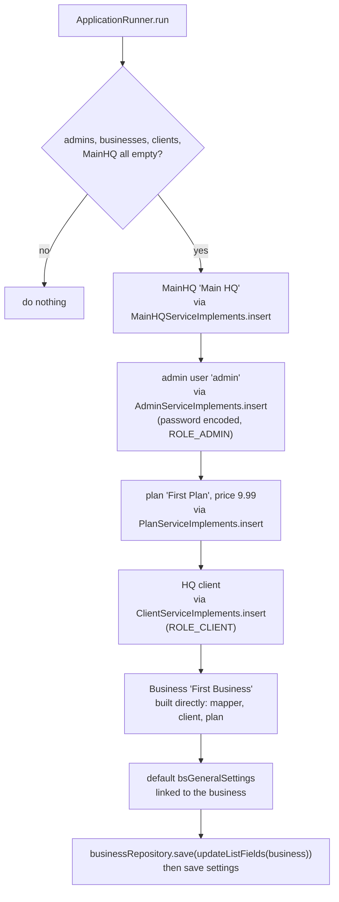

# Configuration and Bootstrap — BugTracker

#doc #explanation #ref-bugtracker #configuration

**Project:** `BugTracker/` · **Stack:** Spring Boot 2.7.0, Java 17 (effective) · **Index:** [[Docs/BugTracker/BugTracker-Index]]

## Summary

The whole runtime configuration is six lines of `application.properties`: schema auto-update, a MySQL
datasource with literal credentials, the driver class and `open-in-view=false`. There are no profiles, no
environment-variable placeholders and no `@Value` or `@ConfigurationProperties` injection; everything else
(JWT key, token lifetime, CORS origin, default tenant settings) is a Java literal. On start-up an
`ApplicationRunner` seeds an empty database with the MainHQ, a first admin, a first plan, a first client and
a first business with default general settings. The one idea to take away: **configuration and secrets
live in source code**, so every environment runs the same values.

## Why It Is Built This Way

Inferred: the project was a single-developer build running against a local MySQL. A seeder removes the
chicken-and-egg problem of a multi-tenant system — nobody can log in to create the first admin — and gives a
demo tenant immediately.

## How It Works

### Properties

| Key | Purpose | Value | Source |
|---|---|---|---|
| `spring.jpa.hibernate.ddl-auto` | Schema follows entities | `update` | `BugTracker/src/main/resources/application.properties:1` |
| `spring.datasource.url` | MySQL URL | `<redacted>` | `BugTracker/src/main/resources/application.properties:2` |
| `spring.datasource.username` | DB user | `<redacted>` | `BugTracker/src/main/resources/application.properties:3` |
| `spring.datasource.password` | DB password | `<redacted>` | `BugTracker/src/main/resources/application.properties:4` |
| `spring.datasource.driver-class-name` | Driver | `com.mysql.cj.jdbc.Driver` | `BugTracker/src/main/resources/application.properties:5` |
| `spring.jpa.open-in-view` | No session in the view layer | `false` | `BugTracker/src/main/resources/application.properties:6` |

No `application-*.properties` or YAML files exist (`BugTracker/src/main/resources`), and the test tree has
no resources, so tests use the same database.

### Configuration held in code

| Setting | Where | Value |
|---|---|---|
| JWT signing key | `BugTracker/src/main/java/com/bgsystem/bugtracker/configuration/security/SecurityConstant.java:5` | `<redacted>` |
| JWT header and prefix | `BugTracker/src/main/java/com/bgsystem/bugtracker/configuration/security/SecurityConstant.java:6-7` | `Authorization`, `Bearer ` |
| Token lifetime | `BugTracker/src/main/java/com/bgsystem/bugtracker/configuration/filter/JWTTokenGeneratorFilter.java:58` | 900,000,000 ms |
| CORS origin | `BugTracker/src/main/java/com/bgsystem/bugtracker/configuration/security/SecurityConfig.java:49` | `http://localhost:4200` |
| Default general settings for a new Business | `BugTracker/src/main/java/com/bgsystem/bugtracker/models/client/business/BusinessServiceImplements.java:68-73` | demo address, e-mail, website |
| HQ invoice due date | `BugTracker/src/main/java/com/bgsystem/bugtracker/models/HQ/invoice/InvoiceServiceImplements.java:103` | now + 5 days |
| Seed users and their passwords | `BugTracker/src/main/java/com/bgsystem/bugtracker/shared/tools/firstInstallCheck.java:124-149` | passwords `<redacted>` (lines 132 and 146) |

### Seeding sequence (`firstInstallCheck`)

`firstInstallCheck implements ApplicationRunner` and runs after the context starts. It treats the database
as new when the admin, business, HQ client and MainHQ tables are all empty
(`BugTracker/src/main/java/com/bgsystem/bugtracker/shared/tools/firstInstallCheck.java:85-96`).

Sources: `BugTracker/src/main/java/com/bgsystem/bugtracker/shared/tools/firstInstallCheck.java:98-194`.
The business step does not call `BusinessServiceImplements.insert`, which is guarded by `@PreAuthorize`
and would fail without an authenticated user; it repeats that method's logic instead
(`BugTracker/src/main/java/com/bgsystem/bugtracker/shared/tools/firstInstallCheck.java:162-194`). Each step
prints its result with `System.out.println` (`BugTracker/src/main/java/com/bgsystem/bugtracker/shared/tools/firstInstallCheck.java:100-114`).

## Key Components

| Component | Path | Responsibility |
|---|---|---|
| `application.properties` | `BugTracker/src/main/resources/application.properties` | Only configuration file |
| `SecurityConstant` | `BugTracker/src/main/java/com/bgsystem/bugtracker/configuration/security/SecurityConstant.java` | Security literals |
| `firstInstallCheck` | `BugTracker/src/main/java/com/bgsystem/bugtracker/shared/tools/firstInstallCheck.java` | First-run seeding |

## Conventions and Rules

- No profiles; one configuration for every environment.
- Seed data goes through the module services where possible, so passwords are encoded and roles assigned
  the same way as through the API.
- The seeder is idempotent only by the "all four tables empty" check.

## How to Replicate

1. Put datasource, `ddl-auto` and OSIV settings in `application.properties` — using `${ENV_VAR}`
   placeholders, not literals.
2. Create `shared/tools/firstInstallCheck implements ApplicationRunner` that checks for an empty database and
   creates MainHQ → admin → plan → client → business → settings through the services.
3. Read the admin password from configuration.

## Known Limitations

- Literal secrets: [[Docs/BugTracker/Reviews/01-Security-and-Multi-Tenancy-Review#BT-R01-03|BT-R01-03]].
- No profiles, hardcoded settings: [[Docs/BugTracker/Reviews/08-Build-Dependencies-and-Configuration-Review#BT-R08-07|BT-R08-07]].
- `ddl-auto=update`: [[Docs/BugTracker/Reviews/03-Domain-Model-and-Persistence-Review#BT-R03-09|BT-R03-09]].
- Console printing: [[Docs/BugTracker/Reviews/10-Code-Hygiene-Review#BT-R10-01|BT-R10-01]].

## Related Documents

- [[Docs/BugTracker/Explanations/02-Build-Tooling-and-Dependencies]]
- [[Docs/BugTracker/Explanations/10-Authentication-and-Authorization]]
- [[Docs/BugTracker/Reviews/08-Build-Dependencies-and-Configuration-Review]]
