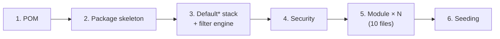

# Recipe: Build a Project This Way — BugTracker

#doc #explanation #ref-bugtracker #architecture

**Project:** `BugTracker/` · **Stack:** Spring Boot 2.7.0, Java 17 (effective) · **Index:** [[Docs/BugTracker/BugTracker-Index]]

## Summary

This recipe answers "how do I build a new project — and a new tenant-scoped module — the BugTracker way?"
It reproduces the project's actual conventions step by step, with minimal sketches in the project's style.
Wherever a step copies a pattern that a review flagged, a `> ⚠️ Review:` callout says what goes wrong and
links the finding, so the recipe can be followed faithfully *or* corrected deliberately. The one idea to
take away: **the BugTracker way is "shared generic stack first, then one ten-file module per entity, with
all rules in the service's `insert`"**.

## Why It Is Built This Way

See [[Docs/BugTracker/Explanations/01-Overview-and-Design-Philosophy]]: maximal convention, generic CRUD with
override hooks, grid-oriented filtering, tenant-configurable taxonomies and denormalized counters.

## How It Works

The recipe has six stages; stage 5 is the per-module loop.



The detailed steps are in **How to Replicate** below.

## Key Components

| Component | Path | Responsibility |
|---|---|---|
| Reference module | `BugTracker/src/main/java/com/bgsystem/bugtracker/models/client/project/bsPrTask/` | The ten files to copy |
| Generic stack | `BugTracker/src/main/java/com/bgsystem/bugtracker/shared/` | Base classes |
| Security | `BugTracker/src/main/java/com/bgsystem/bugtracker/configuration/` | Chain and filters |
| Seeder | `BugTracker/src/main/java/com/bgsystem/bugtracker/shared/tools/firstInstallCheck.java` | First-run data |

## Conventions and Rules

- One package per entity, ten files, fixed suffixes; tenant modules prefixed `bs`, project modules `bsPr`.
- Forms reference associations by `Long` id; DTOs embed MiniDTOs; ListDTOs add counters.
- The service's `insert` validates, resolves ids, links both sides, sets defaults, saves child then parents.
- Every tenant entity has a mandatory `business` many-to-one.

## How to Replicate

### 1. POM essentials (only what the code uses)

Parent `spring-boot-starter-parent`; starters `web`, `security`, `data-jpa`, `validation`; `lombok`; the database
driver; `querydsl-jpa` + `querydsl-apt`; `jjwt-api`, `jjwt-impl`, `jjwt-jackson` 0.11.x; the
`apt-maven-plugin` block for Q-classes (`BugTracker/pom.xml:154-169`) and a compiler level that matches
`java.version`.

> ⚠️ Review: do not copy the unused starters, the Boot 2.7 line or the Java-level mismatch —
> [[Docs/BugTracker/Reviews/08-Build-Dependencies-and-Configuration-Review#BT-R08-01|BT-R08-01]],
> [[Docs/BugTracker/Reviews/08-Build-Dependencies-and-Configuration-Review#BT-R08-03|BT-R08-03]],
> [[Docs/BugTracker/Reviews/08-Build-Dependencies-and-Configuration-Review#BT-R08-04|BT-R08-04]].

### 2. Package skeleton

```
com.acme.app
├── configuration/{filter,security}
├── exceptions
├── models/HQ/<operator modules>          ← MainHQ, plan, client, admin, employee, invoice
├── models/client/<tenant modules>        ← business, bsStatus, bsPriority, …
├── models/client/project/<project modules>
└── shared/{controller,service,mapper,repository,tools,models/{listRequest,pageableRequest,user,securityUser}}
```

### 3. Recreate the Default* stack and the filter engine

Create `DefaultRepository`, `DefaultMapper`, `DefaultService`, `DefaultServiceImplements` (with the
`updateListFields` hook) and `DefaultController` as described in
[[Docs/BugTracker/Explanations/04-Generic-CRUD-Framework]]; then `FilterRequest`, `FilterOperator`,
`SortInfo`, `PageableRequest` and `CommonPathExpression` as in
[[Docs/BugTracker/Explanations/06-Dynamic-Filtering-and-Pagination]].

> ⚠️ Review: the base `update` ignores the form
> ([[Docs/BugTracker/Reviews/02-CRUD-Framework-and-API-Design-Review#BT-R02-01|BT-R02-01]]) — give `DefaultMapper`
> an `updateEntity(form, entity)` and call it. The predicate stores filters in a singleton field
> ([[Docs/BugTracker/Reviews/05-Filter-Engine-Review#BT-R05-01|BT-R05-01]]) — pass filters as a method argument.
> Checked exceptions do not roll back ([[Docs/BugTracker/Reviews/07-Error-Handling-and-Validation-Review#BT-R07-02|BT-R07-02]]).

### 4. Security wiring

`SecurityConfig` (stateless, CORS, CSRF off, Basic, `anyRequest().authenticated()`, BCrypt), the two JWT
filters, `SecurityUser` and `SecurityUserServiceImplements`, and `LoginController` at `GET /login`
([[Docs/BugTracker/Explanations/10-Authentication-and-Authorization]]).

> ⚠️ Review: this gives authentication without authorization or tenant isolation
> ([[Docs/BugTracker/Reviews/01-Security-and-Multi-Tenancy-Review#BT-R01-01|BT-R01-01]],
> [[Docs/BugTracker/Reviews/01-Security-and-Multi-Tenancy-Review#BT-R01-02|BT-R01-02]]); the key must come from
> configuration ([[Docs/BugTracker/Reviews/01-Security-and-Multi-Tenancy-Review#BT-R01-03|BT-R01-03]]); do not
> annotate the filters as beans ([[Docs/BugTracker/Reviews/01-Security-and-Multi-Tenancy-Review#BT-R01-09|BT-R01-09]]).

### 5. Add one tenant-scoped module end to end — `bsPrMilestone`

A milestone belongs to a Business and a project and counts its tasks. Package
`models/client/project/bsPrMilestone/`.

**5.1 Entity** — `bsPrMilestoneEntity.java`

```java
@Table(name = "bs_pr_milestone")
@Entity @AllArgsConstructor @NoArgsConstructor @Builder @Getter @Setter
public class bsPrMilestoneEntity {
    @Id @GeneratedValue(strategy = GenerationType.SEQUENCE)
    private Long id;
    @Column private String name;
    @Column private Date dueDate;
    @ManyToOne(optional = false) @JoinColumn(name = "business_entity_id", nullable = false)
    private BusinessEntity business;
    @ManyToOne(optional = false) @JoinColumn(name = "bs_project_id", nullable = false)
    private bsProjectEntity project;
    @OneToMany(mappedBy = "milestone")
    @Builder.Default private Set<bsPrTaskEntity> tasks = new LinkedHashSet<>();
    @Column private Long taskCount;
}
```

Add `@OneToMany(mappedBy = "business") Set<bsPrMilestoneEntity> bsPrMilestones` + `Long bsPrMilestoneCount`
to `BusinessEntity`, and `@ManyToOne bsPrMilestoneEntity milestone` to `bsPrTaskEntity`.

> ⚠️ Review: BugTracker omits `@Builder.Default` ([[Docs/BugTracker/Reviews/03-Domain-Model-and-Persistence-Review#BT-R03-05|BT-R03-05]])
> and makes Business collections EAGER ([[Docs/BugTracker/Reviews/04-Performance-and-Fetching-Review#BT-R04-01|BT-R04-01]]) — keep the new one LAZY.

**5.2 Form, DTO, MiniDTO, ListDTO**

```java
@Data @Validated @AllArgsConstructor @NoArgsConstructor
public class bsPrMilestoneForm { private Long id; private String name; private Date dueDate; private Long business; private Long project; }

@Data @AllArgsConstructor @NoArgsConstructor @Builder
public class bsPrMilestoneMiniDTO { private Long id; private String name; private Date dueDate; }

@Data @AllArgsConstructor @NoArgsConstructor @Builder
public class bsPrMilestoneDTO { private Long id; private String name; private Date dueDate;
    private BusinessMiniDTO business; private bsProjectMiniDTO project; }

@Data @AllArgsConstructor @NoArgsConstructor @Builder
public class bsPrMilestoneListDTO { private Long id; private String name; private Date dueDate;
    private bsProjectMiniDTO project; private Long taskCount; }
```

> ⚠️ Review: the Form's `id` turns `POST` into a merge
> ([[Docs/BugTracker/Reviews/02-CRUD-Framework-and-API-Design-Review#BT-R02-02|BT-R02-02]]), and `business` in the
> Form is how tenants reach each other's data ([[Docs/BugTracker/Reviews/01-Security-and-Multi-Tenancy-Review#BT-R01-02|BT-R01-02]]).
> Prefer Bean Validation to manual checks ([[Docs/BugTracker/Reviews/07-Error-Handling-and-Validation-Review#BT-R07-03|BT-R07-03]]).

**5.3 Repository**

```java
@Service
public interface bsPrMilestoneRepository extends DefaultRepository<bsPrMilestoneEntity, Long> {
    boolean existsByNameAndProject(String name, bsProjectEntity project);
}
```

**5.4 Mapper**

```java
@Service
public class bsPrMilestoneMapper implements DefaultMapper<bsPrMilestoneDTO, bsPrMilestoneMiniDTO, bsPrMilestoneListDTO, bsPrMilestoneForm, bsPrMilestoneEntity> {
    private final BusinessMapper businessMapper;
    private final bsProjectMapper projectMapper;
    @Lazy @Autowired
    public bsPrMilestoneMapper(BusinessMapper businessMapper, bsProjectMapper projectMapper) {
        this.businessMapper = businessMapper; this.projectMapper = projectMapper;
    }
    public bsPrMilestoneDTO toDTO(bsPrMilestoneEntity e) { if (e == null) return null;
        return bsPrMilestoneDTO.builder().id(e.getId()).name(e.getName()).dueDate(e.getDueDate())
            .business(businessMapper.toSmallDTO(e.getBusiness())).project(projectMapper.toSmallDTO(e.getProject())).build(); }
    public bsPrMilestoneMiniDTO toSmallDTO(bsPrMilestoneEntity e) { if (e == null) return null;
        return bsPrMilestoneMiniDTO.builder().id(e.getId()).name(e.getName()).dueDate(e.getDueDate()).build(); }
    public bsPrMilestoneEntity toEntity(bsPrMilestoneForm f) { if (f == null) return null;
        return bsPrMilestoneEntity.builder().name(f.getName()).dueDate(f.getDueDate()).build(); }
    public bsPrMilestoneListDTO toListDTO(bsPrMilestoneEntity e) { if (e == null) return null;
        return bsPrMilestoneListDTO.builder().id(e.getId()).name(e.getName()).dueDate(e.getDueDate())
            .project(projectMapper.toSmallDTO(e.getProject())).taskCount(e.getTaskCount()).build(); }
}
```

> ⚠️ Review: `@Lazy` hides mapper cycles ([[Docs/BugTracker/Reviews/10-Code-Hygiene-Review#BT-R10-05|BT-R10-05]]).

**5.5 Predicate**

```java
@Service
public class bsPrMilestonePredicate extends CommonPathExpression<bsPrMilestoneEntity> {
    private final QbsPrMilestoneEntity m = QbsPrMilestoneEntity.bsPrMilestoneEntity;
    public bsPrMilestonePredicate() {
        this.entityPath = new PathBuilder<>(bsPrMilestoneEntity.class, "bsPrMilestoneEntity");
        this.entityFields.add("project");
    }
    @Override
    protected BooleanExpression getCustomPathExpression(FilterRequest filter) throws BadOperator {
        BooleanExpression exp = null;
        for (FilterOperator op : filter.getOperations()) {
            switch (op.getField()) {
                case "id" -> exp = addOrExpression(exp, getNumberPathBooleanExpression(m.project.id, op));
                case "name" -> exp = addOrExpression(exp, getStringPathBooleanExpression(m.project.name, op));
                default -> throw new IllegalArgumentException("Illegal field: " + op.getField());
            }
        }
        return exp;
    }
}
```

> ⚠️ Review: no field whitelist ([[Docs/BugTracker/Reviews/05-Filter-Engine-Review#BT-R05-07|BT-R05-07]]).

**5.6 Service** — the canonical insert plus the counter hook

```java
@Service
public class bsPrMilestoneServiceImplements extends DefaultServiceImplements<bsPrMilestoneDTO, bsPrMilestoneMiniDTO, bsPrMilestoneListDTO, bsPrMilestoneForm, bsPrMilestoneEntity, Long> {
    private final BusinessRepository businessRepository;
    private final bsProjectRepository projectRepository;
    private final bsPrMilestoneRepository milestoneRepository;
    public bsPrMilestoneServiceImplements(bsPrMilestoneRepository repository, bsPrMilestoneMapper mapper, bsPrMilestonePredicate predicate,
                                          BusinessRepository businessRepository, bsProjectRepository projectRepository) {
        super(repository, mapper, predicate);
        this.businessRepository = businessRepository; this.projectRepository = projectRepository; this.milestoneRepository = repository;
    }
    @Override
    public bsPrMilestoneMiniDTO insert(bsPrMilestoneForm form) throws ElementNotFoundException, ElementAlreadyExist, InvalidInsertDeails {
        if (form == null || form.getName() == null || form.getBusiness() == null || form.getProject() == null)
            throw new InvalidInsertDeails("Invalid insert details");
        bsPrMilestoneEntity toInsert = mapper.toEntity(form);
        BusinessEntity business = businessRepository.findById(form.getBusiness()).orElseThrow(() -> new ElementNotFoundException("Business not found"));
        bsProjectEntity project = projectRepository.findById(form.getProject()).orElseThrow(() -> new ElementNotFoundException("Project not found"));
        if (milestoneRepository.existsByNameAndProject(form.getName(), project)) throw new ElementAlreadyExist("Milestone already exists");
        toInsert.setBusiness(business); toInsert.setProject(project);
        business.getBsPrMilestones().add(toInsert);
        repository.save(toInsert); businessRepository.save(business);
        return mapper.toSmallDTO(toInsert);
    }
    @Override
    protected bsPrMilestoneEntity updateListFields(bsPrMilestoneEntity e) {
        e.setTaskCount(e.getTasks() == null ? 0 : (long) e.getTasks().size()); return e;
    }
}
```

> ⚠️ Review: override `update` too, or `PUT` does nothing
> ([[Docs/BugTracker/Reviews/02-CRUD-Framework-and-API-Design-Review#BT-R02-01|BT-R02-01]]); check that the project
> belongs to the same Business and to the caller's tenant ([[Docs/BugTracker/Reviews/01-Security-and-Multi-Tenancy-Review#BT-R01-02|BT-R01-02]]);
> counters recomputed on read are written back and drift
> ([[Docs/BugTracker/Reviews/04-Performance-and-Fetching-Review#BT-R04-03|BT-R04-03]],
> [[Docs/BugTracker/Reviews/04-Performance-and-Fetching-Review#BT-R04-04|BT-R04-04]]).

**5.7 Controller**

```java
@RestController
@RequestMapping("/bs_pr_milestone")
public class bsPrMilestoneController extends DefaultController<bsPrMilestoneDTO, bsPrMilestoneMiniDTO, bsPrMilestoneListDTO, bsPrMilestoneForm, Long> {
    public bsPrMilestoneController(bsPrMilestoneServiceImplements service) { super(service); }
}
```

**5.8** Add `.bsPrMilestones(...)`/counter lines to `BusinessMapper` and `BusinessServiceImplements.updateListFields`,
and a row to the module catalogue in [[Docs/BugTracker/Explanations/03-Package-Structure-and-Module-Anatomy]].

### 6. Seeding

Add the new data to `firstInstallCheck` if a demo tenant needs it: create through the module service so
validation and linking run, in dependency order MainHQ → admin → plan → client → business → settings →
tenant data ([[Docs/BugTracker/Explanations/13-Configuration-and-Bootstrap]]).

> ⚠️ Review: seed passwords must come from configuration
> ([[Docs/BugTracker/Reviews/01-Security-and-Multi-Tenancy-Review#BT-R01-03|BT-R01-03]]).

## Known Limitations

The recipe reproduces BugTracker faithfully, so it inherits every limitation flagged in the callouts above;
the consolidated list is in [[Docs/BugTracker/Reviews/00-Review-Summary]]. It was not compiled against the
project; it is a pattern sketch.

## Related Documents

- [[Docs/BugTracker/BugTracker-Index]]
- [[Docs/BugTracker/Explanations/03-Package-Structure-and-Module-Anatomy]]
- [[Docs/BugTracker/Explanations/09-Service-Layer-Patterns]]
- [[Docs/BugTracker/Reviews/00-Review-Summary]]
- [[Docs/backend/Explanations/11-Recipe-Build-a-Project-This-Way]] — the descendant's recipe
