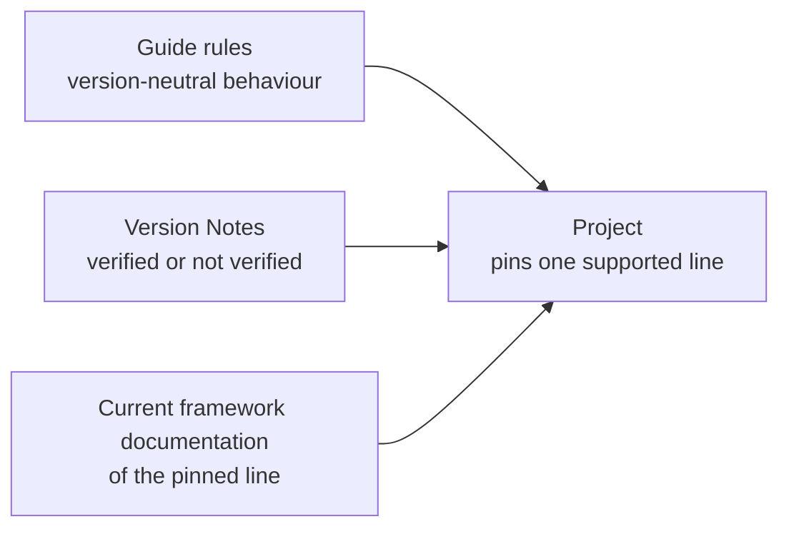

# Principles and Baseline

#doc #guide #architecture #build #draft

**Guide:** [[Docs/Guide/Guide-Index]] · **Conventions:** [[Docs/Guide/Guide-Conventions]]

## Purpose

This document states the design principles every other Guide document applies, and the version baseline a
project built from the Guide stands on. The principles are few: a module has one responsibility, hides a
lot behind a small interface, and makes the unsafe case impossible instead of forbidden. The baseline is a
support policy, not a version number: a project runs on a Spring Boot line that is still supported, and
everything that depends on that line is looked up when the code is written. Read this document first; the
others assume it.

## Design

### The unit of design is the module

A **module** is anything with an interface and an implementation: a Platform Module, a Feature Module, a
class. Its **interface** is everything a caller must know to use it correctly — the entry points, the
invariants, the order of calls, the error modes. The Guide states each Platform Module as a **Module
Contract**: interface, invariants, error modes, and how it interacts with other modules. It never states
one as code.

The design rules are the SOLID principles together with the deep-module test: SOLID says how modules
relate, depth says whether a module earns its place. Four questions decide whether a module is well
shaped. Every Guide document answers them for the modules
it defines.

| Question | Principle | Rule |
|---|---|---|
| Can its job be said in one sentence without "and"? | One responsibility | G01-01 |
| Is its interface much smaller than what it hides? Would deleting it push its work into every caller? | Deep module, deletion test | G01-02 |
| Does something really vary behind its interface? | A seam needs two adapters | G01-03 |
| Can a caller forget the step that keeps it safe? | Fail closed by construction | G01-04 |

A fifth principle is about decisions, not modules: every decision and every setting has exactly one owner
(G01-05).

### What "fail closed by construction" means in this Guide

The reference projects were not careless. Their defects are steps that someone had to remember: add the
authorization annotation, filter by owner, open the transaction in the right place. The Guide removes the
step where it can.

| Safety property | How the convention makes the unsafe case impossible | Stated in |
|---|---|---|
| Authorization | The CRUD base cannot be constructed without an Access Policy, and a policy with no matching rule denies | G04-01, G04-08 |
| Row visibility | Every query takes a Row Scope; there is no entry point without one | G04-09 |
| The actor | Every entry point takes the actor as a parameter | G04-02 |
| Lost updates | A write without a precondition is refused | G04-12 |
| Layout | A forbidden dependency fails the build | G02-11 |

### The version baseline

- **Rules are version-neutral.** A rule names a product or a standard (PostgreSQL, Flyway, MapStruct,
  RFC 9457, JWT) and the names this convention defines (`CurrentUser`, `RowScope`). It never names a
  framework class, method, annotation or property.
- **The floor moves with support.** A project is built on a Spring Boot line that is under open-source
  support on the day the project is built, with Java 21 or newer. On 2026-10-04 that means the 4.x
  generation; every 3.x line has ended.
- **One line per project.** A project pins one Spring Boot line and takes its dependency versions from
  that line.
- **Version Notes carry the rest.** Class names, annotations and property names live in the Version Notes
  of each document. A note marked `verified on <line>` cites its proof. A note marked `not verified` is
  the author's best knowledge: whoever implements the rule looks the detail up in the documentation of
  the pinned line.

### How rules are cited

A rule is cited by its Rule ID. The Base Project and the Skill never restate a rule; they cite it. Inside
a project, the type-level documentation of each Platform Module names the Rule IDs the module implements
(G01-09), so a reviewer can walk from code to rule and back. The format of a rule, its evidence and the
four ID families are defined in [[Docs/Guide/Guide-Conventions]].

## Rules

### G01-01
**Rule:** A module has one responsibility: what it does can be said in one sentence without "and". A
second responsibility is a second module.
**Why:** A module with several jobs grows a wide interface and many collaborators, and every change to one
job risks the others.
**Evidence:** WP-R07-04, WP-R07-03 · ADR-014
**Differs from references:** wpmanager's plugin service took 17 constructor dependencies for four jobs
(catalogue, categories, upload, cascade delete) and was copied into a theme service that then diverged.

### G01-02
**Rule:** A Platform Module passes the deletion test: removing it would force every caller to re-create
what it did. Its interface is small against what it hides — one to four entry points; the CRUD base is
the one stated exception, with the six operations of a resource.
**Why:** A module whose interface costs as much as its implementation gives no leverage. Callers end up
overriding it, and the rules it should hold scatter.
**Evidence:** WP-R02-06, BT-R02-03, BT-R02-04, WP-R04-05 · ADR-005, ADR-011
**Differs from references:** The reference CRUD base was deep for routing and shallow for validation,
relations and authorization; wpmanager overrode 29 of its 60 method slots. The idempotency state keeper
exposed five methods that callers had to call in the right order.

### G01-03
**Rule:** A port is introduced only where at least two adapters exist; a test adapter counts. Where the
framework already provides the port, the project adds no wrapper around it.
**Why:** A port with one adapter is indirection that hides nothing, and an adapter that cannot do its job
is a broken seam.
**Evidence:** WP-R05-05 · ADR-006, ADR-013
**Differs from references:** wpmanager put the storage port on a JPA entity with one real adapter; the
second adapter returned nothing and every caller used it without a check.

### G01-04
**Rule:** A safety property — authorization, row visibility, the actor of an operation, a transaction
boundary, a write precondition, a required secret — is enforced by a signature, a constructor or a
start-up check. It is never left to a step a developer must remember.
**Why:** A remembered step is forgotten on the next feature, and nothing fails when it is.
**Evidence:** BE-R01-01, WP-R01-03, WP-R01-11, WP-R01-15 · ADR-005, ADR-006
**Differs from references:** All three projects relied on an annotation being present on each operation.
In `backend/` the switch that makes those annotations work was lost when a service was deleted, and no
build or test failed.

### G01-05
**Rule:** Every decision and every setting has exactly one owner: one module that states it, and one
place where its value is defined.
**Why:** A decision stated twice drifts. The two copies then disagree, and callers see two behaviours for
one condition.
**Evidence:** WP-R09-05, BE-R05-02, WP-R08-07, BE-R04-05 · ADR-006
**Differs from references:** The upload size limit was defined in two places, the error body was built in
four, and the same conflict returned 409 on create and 400 on update.

### G01-06
**Rule:** A project is built on a Spring Boot line that is under open-source support on the day it is
built, with Java 21 or newer. A line that has reached its end of support is never the baseline.
**Why:** An unsupported line gets no security fixes for the framework or for the libraries it manages.
**Evidence:** BT-R08-01, BT-R08-02 · ADR-003
**Differs from references:** BugTracker runs the first patch of a line whose open-source support ended in
2023. The other two run a line that has ended since.

### G01-07
**Rule:** A project pins exactly one Spring Boot line and takes its dependency versions from that line. A
version that departs from the line is written with its reason next to it.
**Why:** A silent override runs a combination nobody tested, and nobody remembers why it is there.
**Evidence:** BE-R07-04, BT-R08-05, BT-R08-03, WP-R09-06 · ADR-003
**Differs from references:** The reference builds pinned a test plugin below the managed version, repeated
a managed version by hand, overrode one starter, and declared one Java version while compiling with
another.

### G01-08
**Rule:** Version-specific detail — class names, annotations, property names, default values — is taken
from the current documentation of the line the project pins, at the time the code is written. It is never
taken from memory, from an older project or from the text of a rule.
**Why:** Names change between generations. A name that no longer exists is often ignored without an
error, so the code looks right and does nothing.
**Evidence:** BE-R07-05, WP-R09-04, BT-R01-14, BT-R08-09 · ADR-002, ADR-003
**Differs from references:** `backend/` carried a logging setting from an older generation that no longer
had any effect, and wpmanager set a property the framework does not define.

### G01-09
**Rule:** The type-level documentation of each Platform Module names the Rule IDs the module implements
and restates no rule.
**Why:** Documentation that restates a rule drifts from it. A citation cannot drift: it either resolves
or it does not.
**Evidence:** WP-R11-04 · ADR-001
**Differs from references:** wpmanager kept its own documentation vault, and that vault contradicts the
code today.

## Differs From the Reference Projects

- The reference projects have no written convention; each one is the previous one, copied, and the one
  vault that documents a project contradicts its code (WP-R11-04). The Guide is the convention, the
  projects are its evidence ([[ADRs/ADR-001-guide-is-the-source-of-truth|ADR-001]]), and code cites rules
  instead of restating them (G01-09).
- Safety depended on remembered steps (BE-R01-01, WP-R01-03). The Guide makes the unsafe case fail to
  compile, fail to start or fail the build (G01-04).
- Modules were shallow where the work is hard (WP-R02-06, BT-R02-03) and wide where it is easy
  (WP-R07-04). The Guide measures every Platform Module against G01-01 and G01-02.
- A seam existed with one working adapter (WP-R05-05). The Guide requires two (G01-03).
- The version was whatever the project started on, and it stayed there (BT-R08-01). The Guide sets a
  moving floor (G01-06) and one pinned line (G01-07).
- Framework names were carried from project to project (BE-R07-05, WP-R09-04). The Guide requires a
  lookup in the current documentation (G01-08).

## Version Notes

- **verified on 4.1.x** — this line manages Spring Framework 7.0.x, Spring Security 7.1.x, Spring Data
  4.1.x, Hibernate ORM 7.4.x, Jakarta Persistence 3.2, Flyway 12.x, Jackson 3.1.x, JUnit Jupiter 6.0.x and
  Testcontainers 2.0.x. A note about one of these libraries cites the documentation of that version.
  Evidence: https://docs.spring.io/spring-boot/4.1/appendix/dependency-versions/coordinates.html
- **verified on 4.1.x** — MapStruct, ArchUnit and springdoc-openapi are not in this line's managed set; a
  project that uses them pins their versions itself and states the reason (G01-07).
  Evidence: https://docs.spring.io/spring-boot/4.1/appendix/dependency-versions/coordinates.html
- **verified on 2.7.x** — open-source support for this line ended on 2023-06-30. Evidence: BT-R08-01
- **not verified** — current-docs lookup at execution time: which Spring Boot line is the current
  general-availability line, and the end date of its open-source support. The source is the Spring Boot
  support page; the answer changes about every six months.

## Related Documents

- [[Docs/Guide/02-Project-Layout-and-Module-Boundaries]] — where modules live and which may depend on
  which.
- [[Docs/Guide/04-CRUD-Base-and-Service-Hooks]] — the module where G01-02 and G01-04 are applied hardest.
- [[ADRs/ADR-001-guide-is-the-source-of-truth|ADR-001]] — the Guide is the source of truth.
- [[ADRs/ADR-002-code-free-skill-and-reference-base-project|ADR-002]] — contracts, not code.
- [[ADRs/ADR-003-version-baseline-as-a-support-policy|ADR-003]] — the support policy.
- [[ADRs/ADR-016-guide-document-format-and-rule-ids|ADR-016]] — the document format and the Rule IDs.
