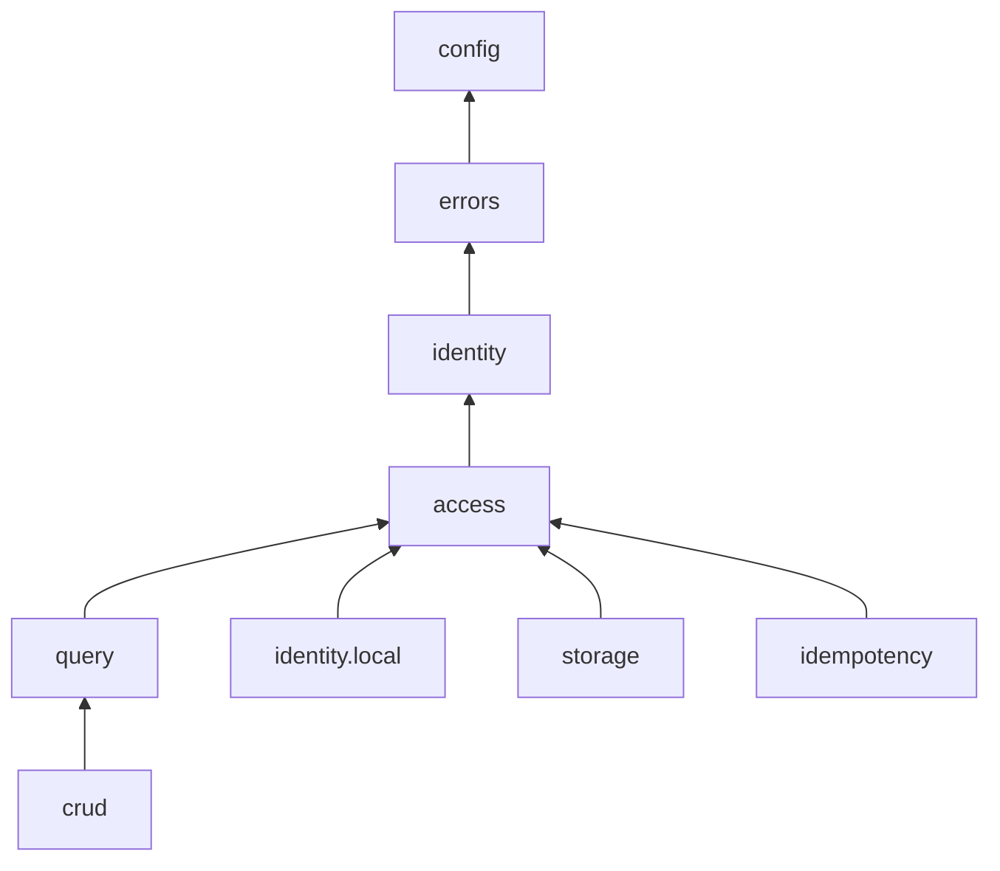
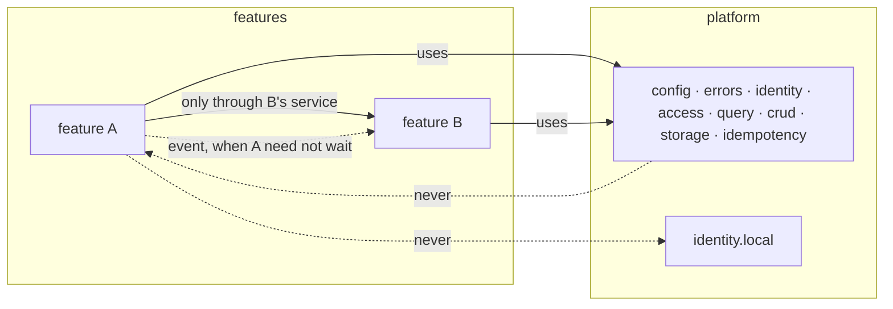

# Project Layout and Module Boundaries

#doc #guide #architecture #testing #draft

**Guide:** [[Docs/Guide/Guide-Index]] · **Conventions:** [[Docs/Guide/Guide-Conventions]]

## Purpose

This document fixes where code lives and which code may depend on which. A project has two package roots:
`platform`, the shared modules every feature uses, and `features`, one package per Feature Module.
Dependencies point one way — features use the platform, the platform never knows a feature — and the
build fails when they do not. The one idea to take away: the layout is not a suggestion a reviewer
defends, it is a set of tests.

## Design

### The package tree

```
<root>/
├── <Application>            the application entry type; nothing else lives in the root
├── platform/
│   ├── config/              typed settings and start-up validation
│   ├── errors/              the domain exception hierarchy and the one error writer
│   ├── identity/            who the caller is: token verification, CurrentUser, user records
│   │   └── local/           the removable local Token Issuer
│   ├── access/              who may do what: URL rules, the Access Policy contract, Action, RowScope
│   ├── query/               the list engine, Query Profile, PageResponse
│   ├── crud/                the CRUD base controller and service
│   ├── storage/             object storage, uploads, download tickets
│   └── idempotency/         the Idempotency Guard
└── features/
    └── <feature>/           one package per Feature Module
```

`config`, `errors`, `identity`, `access`, `query` and `crud` exist in every project. `identity.local`
exists while the project issues its own tokens. `storage` and `idempotency` exist when a feature uses
them.

### Dependencies between Platform Modules



An arrow means "may depend on", and it is transitive: `crud` may use `query`, `access`, `identity`,
`errors` and `config`.

| Module | Responsibility | May depend on |
|---|---|---|
| `config` | Typed, validated settings | — |
| `errors` | One failure model from domain to wire | `config` |
| `identity` | Turn a verified token into a `CurrentUser` | `config`, `errors` |
| `access` | Decide who may do what to which rows | `config`, `errors`, `identity` |
| `query` | Run a filtered, sorted, paged list safely | `config`, `errors`, `identity`, `access` |
| `crud` | Give a feature its six operations | `config`, `errors`, `identity`, `access`, `query` |
| `identity.local` | Issue the project's own tokens | `config`, `errors`, `identity`, `access` |
| `storage` | Store, record and serve binary objects | `config`, `errors`, `identity`, `access` |
| `idempotency` | Make a non-repeatable request safe to retry | `config`, `errors`, `identity`, `access` |

The three side modules — `identity.local`, `storage`, `idempotency` — never depend on `query` or `crud`,
and `query` and `crud` never depend on them. `RowScope` lives in `access` because it is the answer to an
authorization question; `query` only applies it.

### Dependencies of a Feature Module



- A feature uses Platform Modules through their interfaces.
- A feature talks to another feature through that feature's service. It may use the shapes that service
  takes and returns and the events the feature publishes. It never touches the other feature's
  repository, mapper, Query Profile, Access Policy or controller.
- When the caller does not need the result, the owning feature publishes an application event and the
  other feature listens. The publisher does not know its listeners.
- An entity may hold an association to another feature's entity. Reading through it is allowed. Changing
  the other entity is a call to its service.
- Entities stop at the service. A controller receives a Request and returns a Response or a Summary
  ([[Docs/Guide/03-Feature-Module-Anatomy]]).

### Where the actor enters

The current-user provider reads the caller from the request. It is used in exactly two kinds of place:
the HTTP edge (a controller, a request interceptor) and adapters. From there the actor travels as a
parameter (G04-02). A service that needs the actor and has no parameter for it cannot compile — which is
the point.

### Architecture tests

Every rule below except G02-08 is checked by a test that reads the compiled code. The tests run with the
ordinary test run, so a forbidden import fails the same build as a failing unit test.

| Test | Enforces |
|---|---|
| Every type sits in `platform.<module>`, in `features.<feature>` or is the application entry type | G02-01 |
| `platform` does not depend on `features` | G02-02 |
| Platform Modules follow the dependency table | G02-03 |
| Nothing outside `platform.identity.local` depends on it | G02-04 |
| No method-security annotation on a type or member in `features` | G02-05 |
| The current-user provider is used only by controllers, interceptors and adapters | G02-06 |
| A feature does not depend on another feature's repository, mapper, Query Profile, Access Policy or controller | G02-07 |
| No controller method takes or returns an entity type | G02-09 |
| Packages are free of cycles; no lazy injection | G02-10 |

G02-08 is the one rule a test cannot read from the code: a write through an association looks like any
other call. It is checked in review.

## Rules

### G02-01
**Rule:** Code lives under two package roots: `<root>.platform.<module>` for Platform Modules and
`<root>.features.<feature>` for Feature Modules. Every type belongs to exactly one of them; only the
application entry type sits in the root package.
**Why:** With one obvious place for everything, new code does not start a second convention.
**Evidence:** BE-R09-07, WP-R07-05 · ADR-004
**Differs from references:** The reference projects used a `shared/` package and a `models/` package with
no rule about what goes where; configuration, tools and exceptions sat in further top-level packages.

### G02-02
**Rule:** No type in `platform` depends on a type in `features`.
**Why:** A platform that knows a feature cannot be reused or reasoned about without it, and every new
feature becomes an edit to shared code.
**Evidence:** BE-R09-07 · ADR-004
**Differs from references:** A shared tool in `backend/` imported the admin and client entities and
repositories and had one method per user type.

### G02-03
**Rule:** A Platform Module depends on another Platform Module only in the direction of this document's
dependency table, and `config` depends on none. A new edge is a change to this document.
**Why:** Without a direction, shared code grows into one unit that can only be changed as a whole.
**Evidence:** WP-R07-05, BT-R10-05 · ADR-004
**Differs from references:** The reference `shared/` package had no internal structure, so nothing
limited what a shared class could reach.

### G02-04
**Rule:** Nothing outside `platform.identity.local` depends on a type inside it.
**Why:** The module is meant to be deleted when login moves to an external identity provider. One import
from outside turns that deletion into a rewrite.
**Evidence:** ADR-004, ADR-006
**Differs from references:** The reference projects mixed token issuing, token checking and user lookup in
one security package; none of it could be removed alone.

### G02-05
**Rule:** No method-security annotation appears on a type or a member in `features`. A feature states its
authorization only in its Access Policy.
**Why:** An annotation on each operation is a remembered step: the inherited operations cannot carry a
per-feature rule, and a forgotten annotation leaves the operation open.
**Evidence:** WP-R01-03, WP-R01-11, WP-R01-15 · ADR-004, ADR-005
**Differs from references:** The reference base service allowed every inherited operation to any
authenticated caller, and features added role annotations method by method — some of them on objects the
framework never saw.

### G02-06
**Rule:** The current-user provider is used only at the HTTP edge and in adapters. Service code and
feature code receive the actor as a parameter.
**Why:** An ambient lookup returns nothing in scheduled and background work, and it lets code act without
saying for whom.
**Evidence:** BE-R09-07, BT-R01-05 · ADR-004, ADR-006
**Differs from references:** The reference projects read the caller from a static security context inside
shared tools and services; BugTracker also took authors from the request body.

### G02-07
**Rule:** Of another feature, a feature uses only its service, the shapes that service takes and returns,
and the events it publishes — never its repository, mapper, Query Profile, Access Policy or controller. A
side effect the caller does not need to wait for is an application event published by the feature that
owns the change.
**Why:** A call to another feature's repository skips that feature's validation, authorization and
invariants, and it ties the caller to the other feature's tables.
**Evidence:** WP-R07-05 · ADR-004
**Differs from references:** wpmanager's plugin service used the category, author, downloadable and
website repositories directly.

### G02-08
**Rule:** An entity may hold an association to another feature's entity. Every write to that entity goes
through the service of the feature that owns it.
**Why:** The association is needed for joins and filters. A write through it would change another
feature's rows without that feature's rules.
**Evidence:** WP-R07-05, WP-R02-05 · ADR-004
**Differs from references:** Reference services read and wrote other modules' rows through those
modules' repositories, and one inherited delete route removed a row without the clean-up its owner
performs.

### G02-09
**Rule:** A controller never accepts and never returns an entity. Entities are not serialised and not
deserialised anywhere at the HTTP edge.
**Why:** An entity on the wire exposes every column, including the ones a caller must not see or set.
**Evidence:** BE-R01-03, WP-R01-05 · ADR-004
**Differs from references:** The reference controllers used DTOs, but a repository-export library on the
classpath was set to publish the entities themselves, password hashes included. The reviews rate that
exposure as likely, not as confirmed at run time.

### G02-10
**Rule:** The dependency graph between packages has no cycle. Lazy injection is never used to hide one.
**Why:** A cycle means two modules are one module. Hiding it moves the failure from start-up to the first
request that walks the cycle.
**Evidence:** BT-R10-05, WP-R07-05 · ADR-004, ADR-012
**Differs from references:** BugTracker marked 27 mappers as lazily injected to break mapper cycles;
wpmanager did the same in eleven constructors.

### G02-11
**Rule:** Every rule of this document that can be read from the compiled code is enforced by an
architecture test that runs with the project's ordinary test run, and a violation fails the build. The
architecture-test table of this document names the one rule that cannot.
**Why:** A layout that only a reviewer defends erodes one import at a time.
**Evidence:** BE-R09-07, WP-R07-05 · ADR-004
**Differs from references:** None of the reference projects had an architecture test; each violation
above was found by reading.

## Differs From the Reference Projects

- `shared/` plus `models/`, with no direction, became `platform` plus `features` with a direction
  (G02-01, G02-02; BE-R09-07).
- The platform gained an inner structure with its own direction (G02-03); the reference `shared/` had
  none (WP-R07-05).
- The local login can be deleted (G02-04; ADR-006). In the reference projects it could not be separated
  from token checking.
- Authorization left the annotations (G02-05; WP-R01-03, WP-R01-11, WP-R01-15).
- The actor became a parameter (G02-06; BE-R09-07, BT-R01-05).
- Features stopped reaching into each other (G02-07, G02-08; WP-R07-05, WP-R02-05).
- Cycles are a build failure, not something to annotate away (G02-10; BT-R10-05).
- All of it that code can show is tested (G02-11; BE-R09-07). The reference projects enforced none of it.

## Version Notes

- **verified on 4.1.x** — ArchUnit 1.5 states a package dependency rule as
  `noClasses().that().resideInAPackage("..platform..").should().dependOnClassesThat().resideInAPackage("..features..")`
  and a cycle rule as `slices().matching("..features.(*)..").should().beFreeOfCycles()`.
  Evidence: https://github.com/TNG/ArchUnit/blob/v1.5.1/docs/userguide/004_What_to_Check.adoc
- **verified on 4.1.x** — ArchUnit 1.5 runs under the JUnit 5 and JUnit 6 engines with `@AnalyzeClasses`
  on the test class and `@ArchTest` on each rule.
  Evidence: https://github.com/TNG/ArchUnit/blob/v1.5.1/docs/userguide/009_JUnit_Support.adoc
- **not verified** — current-docs lookup at execution time: that ArchUnit 1.5 reads the class files of a
  project built on this line with the project's Java version. No test proves it yet.
- **not verified** — current-docs lookup at execution time: the full list of method-security annotations
  that G02-05 bans (`@PreAuthorize`, `@PostAuthorize`, `@PreFilter`, `@PostFilter`, `@Secured` and the
  `jakarta.annotation.security` annotations are the author's list for Spring Security 7.1).
- **not verified** — current-docs lookup at execution time: the application-event API of G02-07
  (`ApplicationEventPublisher`; a listener that runs after the publisher's transaction commits).
- **not verified** — current-docs lookup at execution time: how lazy injection is spelled (`@Lazy` on a
  constructor parameter or a field), so the architecture test of G02-10 can ban it.

## Related Documents

- [[Docs/Guide/01-Principles-and-Baseline]] — the principles this layout applies.
- [[Docs/Guide/03-Feature-Module-Anatomy]] — what is inside one `features.<feature>` package.
- [[Docs/Guide/04-CRUD-Base-and-Service-Hooks]] — `platform.crud` and the Access Policy contract.
- `08-Identity-Authentication-and-Authorization` — planned: `platform.identity`, `platform.access`, the
  URL rules and the single method-security switch.
- `13-Testing-Strategy` — planned: where the architecture tests sit among the other test layers.
- [[ADRs/ADR-004-platform-and-features-package-layout|ADR-004]] — the layout decision and its seven
  dependency rules.
- [[ADRs/ADR-006-identity-current-user-seam-and-removable-local-issuer|ADR-006]] — why the local Token
  Issuer is removable.
