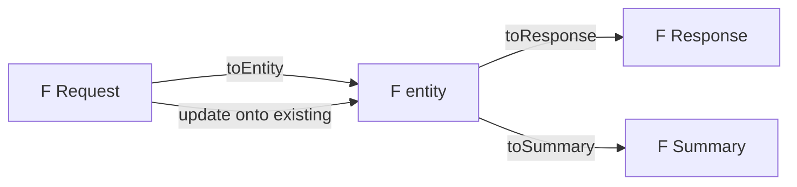
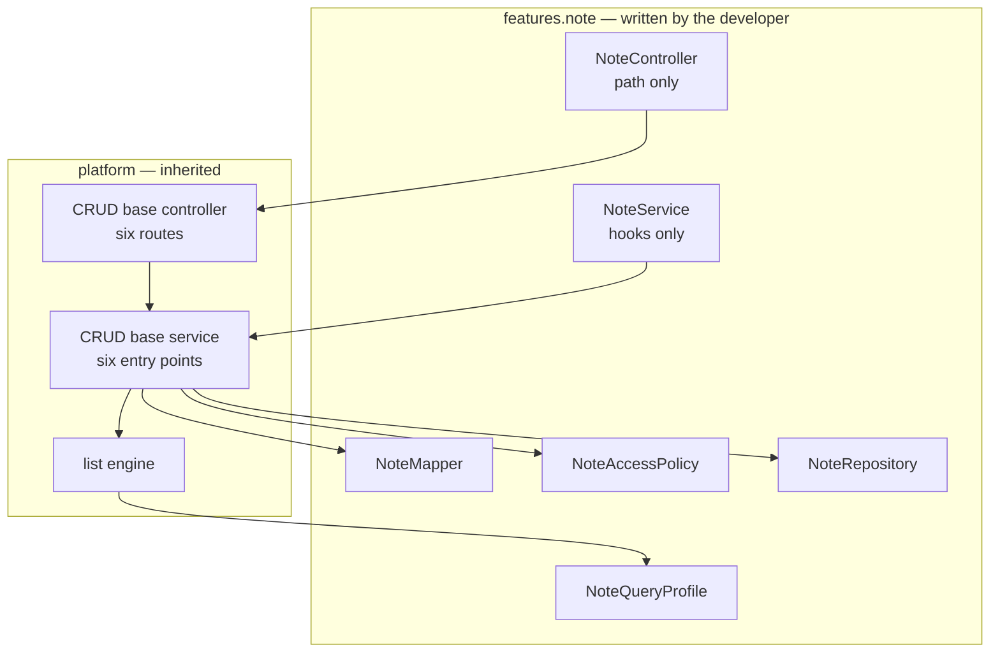

# Feature Module Anatomy

#doc #guide #architecture #api-design #draft

**Guide:** [[Docs/Guide/Guide-Index]] · **Conventions:** [[Docs/Guide/Guide-Conventions]]

## Purpose

A Feature Module is the unit a developer adds when the application gains a resource: one package with a
fixed set of files, each with one job. This document names those files, says what each one may contain,
and says when a feature should not use the CRUD base at all. The one idea to take away: a feature supplies
its data shapes and its rules — nothing else. Everything a feature would otherwise copy from the last
feature lives in the platform.

## Design

### The file set

A Feature Module is the package `<root>.features.<feature>`. `<F>` is the entity name.

| File | Role | Contains | Never contains |
|---|---|---|---|
| `<F>` | Entity | Persistent state; the server-owned concurrency token; audit fields | Input constraints |
| `<F>Repository` | Persistence access | Finder methods the service needs | Business rules |
| `<F>Request` | Create and update input | The client-writable fields, with their input constraints | An id, an owner, a concurrency token, an audit field |
| `<F>Response` | Detail output; also the create and update response | The fields a caller may read, with the id | A secret; another feature's full entity |
| `<F>Summary` | List-row output | The fields a list shows | Collections that need a query per row |
| `<F>Mapper` | Shape conversion | Four generated operations (below) | A repository; another feature's mapper; a business rule |
| `<F>QueryProfile` | Field whitelist for lists | The filterable and sortable fields, default sort, bounds | Row visibility |
| `<F>AccessPolicy` | Authorization | Role rules, entity-conditioned rules, the Row Scope | Anything that is not "who may do what to which rows" |
| `<F>Service` | Use cases | The service hooks; feature-specific operations | Routing; shape conversion written by hand |
| `<F>Controller` | Routing | The resource path; feature-specific routes | A business rule; an entity in a signature |
| `V<n>__<feature>.sql` | Schema | The feature's tables and constraints | — |

The migration file sits with the other migrations, not in the feature package; `07-Domain-Model-and-Persistence`
(planned) states the migration rules.

### The three shapes and the mapper

- `toEntity(request)` builds a new entity. The id, the owner, the concurrency token and the audit fields
  are listed as ignored — visibly, in the mapper.
- `update(request, entity)` writes every Request field onto an existing entity, with the same ignored
  fields. It is what makes the generic update real (G04-04).
- `toResponse(entity)` and `toSummary(entity)` build the two outputs.

The mapper is generated at build time, and a target field with no source fails the build (G03-06). A
field that needs a lookup — an id that must become an entity, the owner taken from the actor — is not the
mapper's job. The service resolves it in its relation hook
([[Docs/Guide/04-CRUD-Base-and-Service-Hooks]]).

### What a CRUD feature writes, and what it gets

### When to opt out of the CRUD base

The CRUD base fits a feature that is a resource with identity: it can be fetched by id, listed, created,
replaced and deleted. A feature opts out when that is not what it is:

- it is an action or a process, not a stored resource (a report, an import, a login);
- it has no identity of its own (a single settings object; a pure link between two resources);
- it is append-only or read-only by nature, so most of the six operations make no sense;
- more than half of the six entry points would have to be replaced wholesale.

A feature that only wants to refuse one operation does not opt out: it gives that action no rule in its
Access Policy, and the base denies it (G04-08).

An opt-out feature is a plain service and a plain controller in the same package layout. It keeps
everything else: an Access Policy consulted at every entry point, the actor as a parameter, the list
engine for anything it lists, the platform's errors, and the API contract of
[[Docs/Guide/05-API-Contract]] (G03-09).

## Rules

### G03-01
**Rule:** A Feature Module is one package, `<root>.features.<feature>`, that holds this document's file
set; a file is left out only when its role does not exist in the feature (no list — no Summary and no
Query Profile). A further file is added only for something the set has no role for: an event, a value
type, the input or output of a feature-specific operation.
**Why:** A fixed set makes a feature cheap to write and makes every feature readable by anyone who has
read one.
**Evidence:** BE-R02-06, BT-R02-03 · ADR-004, ADR-005
**Differs from references:** The reference module was ten files with four data shapes and six type
parameters, even for an entity that overrode nothing.

### G03-02
**Rule:** Each file is named `<F>` plus its role suffix exactly as in the file set. Type names are upper
camel case; package names are lower case; the feature package is the entity name in the singular.
**Why:** A name that follows no pattern is found by nobody, and a wrong name is copied into the next
project.
**Evidence:** BE-R09-03, BT-R10-03, WP-R11-01, BE-R09-02
**Differs from references:** BugTracker has 233 types whose names start in lower case; a misspelled
package name travelled from wpmanager into `backend/`; one service alone carried an `Impl` suffix.

### G03-03
**Rule:** A feature exposes its entity through exactly three shapes: Request (create and update input),
Response (detail output, and the response of create and update) and Summary (list row).
**Why:** Each extra shape is another class and another mapping to keep in step, and the copies drift.
**Evidence:** BE-R02-06, BE-R04-03, BT-R02-03 · ADR-005
**Differs from references:** The reference projects had four shapes — Form, DTO, MiniDTO, ListDTO. In
`backend/` two of them were field-for-field the same, and the mappers filled different fields in each.

### G03-04
**Rule:** The Request carries only fields the client may write. It has no id, no owner, no concurrency
token and no audit field, and the same Request type is used for create and for update.
**Why:** A field in the input is a field the client controls. An id lets a create overwrite a row; an
owner or an author lets a caller act as someone else.
**Evidence:** BT-R02-02, BT-R01-04, BT-R01-05 · ADR-005
**Differs from references:** BugTracker's forms carried an id that turned a create into an overwrite,
roles the caller could grant itself, and the author of a comment.

### G03-05
**Rule:** Input constraints are declared on the Request. The entity declares none.
**Why:** A constraint on the entity is checked when the row is written — too late for a clear answer —
and leaves the input unchecked at the boundary.
**Evidence:** BE-R03-07, WP-R08-03, BT-R07-03 · ADR-009
**Differs from references:** The reference projects put size constraints on entities and almost none on
forms, then validated by hand in services.

### G03-06
**Rule:** The mapper is generated by MapStruct and has four operations: Request to a new entity, Request
onto an existing entity, entity to Response, entity to Summary. A target field with no mapping fails the
build, and server-controlled fields are listed as ignored in the two Request mappings.
**Why:** A hand-written mapper compiles when a field is forgotten, and the field stays empty until a
user notices.
**Evidence:** BE-R04-03, WP-R07-07, BE-R02-01 · ADR-012
**Differs from references:** The reference mappers were written by hand: fields returned as null, a
field set from the wrong source, and no operation that updates an existing entity.

### G03-07
**Rule:** A mapper depends on no repository and on no other feature's mapper. A value that needs a
lookup is resolved by the service, in its relation hook.
**Why:** Mappers that call each other form cycles, and a mapper that queries hides database work inside a
conversion.
**Evidence:** WP-R07-05, BT-R10-05 · ADR-012
**Differs from references:** Reference mappers called other mappers and repositories; one depended on 18
others, several of which depended back on it.

### G03-08
**Rule:** Every Feature Module declares exactly one Access Policy, and one that lists rows declares
exactly one Query Profile. Both hold whether or not the feature uses the CRUD base.
**Why:** A feature without a policy has no stated authorization, and a list without a profile can be
filtered and sorted by any column.
**Evidence:** WP-R01-03, BT-R05-07 · ADR-005, ADR-011
**Differs from references:** The reference projects had neither: authorization was an annotation per
method, and BugTracker's lists accepted any field name.

### G03-09
**Rule:** A feature that does not fit the CRUD base is a plain service and controller that still consults
its Access Policy at every entry point, takes the actor as a parameter, lists through the list engine
with a Row Scope and uses the platform's errors. The service's type-level documentation states that the
feature opts out and why.
**Why:** A feature forced into the base overrides most of it, and an opt-out with its own rules for
authorization or paging brings back the defects the base removes.
**Evidence:** WP-R02-06, BT-R02-09, WP-R02-05 · ADR-005
**Differs from references:** The reference projects had no opt-out. Features that did not fit overrode the
base method by method, or added a second route beside the inherited one.

### G03-10
**Rule:** Business rules live in the service — in its hooks or in feature-specific operations. A
controller only routes (it resolves the actor, calls one service entry point and returns the result), and
a mapper only converts.
**Why:** A rule in a controller or a mapper is skipped by every caller that does not go through that
controller or that mapper.
**Evidence:** BE-R03-01, BE-R04-02 · ADR-012
**Differs from references:** Reference invariants were scattered over services and mappers, and a
missing input surfaced as a null-pointer failure inside a mapper.

## Differs From the Reference Projects

- Ten files and four shapes became the file set of this document with three shapes (G03-01, G03-03;
  BE-R02-06, BT-R02-03).
- The input lost every field the server owns (G03-04; BT-R02-02, BT-R01-04, BT-R01-05).
- Constraints moved from the entity to the Request (G03-05; BE-R03-07).
- Mappers are generated and cannot skip a field (G03-06; BE-R04-03, WP-R07-07), and they no longer call
  each other (G03-07; BT-R10-05).
- Two files are new: the Access Policy and, since `backend/`, the Query Profile (G03-08; WP-R01-03,
  BT-R05-07).
- A feature may opt out of the base, openly and with the same guarantees (G03-09; WP-R02-06).
- Names follow one pattern (G03-02; BE-R09-03, BT-R10-03).

## Version Notes

- **verified on 4.1.x** — in MapStruct 1.6 an unmapped target property fails the build with
  `unmappedTargetPolicy = ReportingPolicy.ERROR`; an operation that writes onto an existing object marks
  that parameter with `@MappingTarget`; in such an operation a source property that is null sets the
  target property to null by default. Evidence: https://mapstruct.org/documentation/1.6/reference/html/
- **not verified** — current-docs lookup at execution time: that MapStruct 1.6 builds on this line with
  the project's Java version, and the order of annotation processors when another processor is present.
- **not verified** — current-docs lookup at execution time: the repository base type and the query
  capability the list engine needs from it; the choice is recorded in `06-Query-Engine` (planned).
- **not verified** — current-docs lookup at execution time: the constraint annotations of the Request
  (`jakarta.validation`) and how the controller triggers them.

## Related Documents

- [[Docs/Guide/02-Project-Layout-and-Module-Boundaries]] — where the package sits and what it may import.
- [[Docs/Guide/04-CRUD-Base-and-Service-Hooks]] — what the service and the controller inherit.
- [[Docs/Guide/05-API-Contract]] — what the routes look like on the wire.
- `06-Query-Engine` — planned: the Query Profile in full.
- `07-Domain-Model-and-Persistence` — planned: the entity, the concurrency token, migrations.
- `15-Recipe-Add-a-Feature` — planned: this document as a step-by-step walk.
- [[ADRs/ADR-005-deepened-crud-base-with-access-policy|ADR-005]] — three shapes, hooks, the Access Policy.
- [[ADRs/ADR-012-mapstruct-mapping-with-unmapped-target-errors|ADR-012]] — generated mappers.
