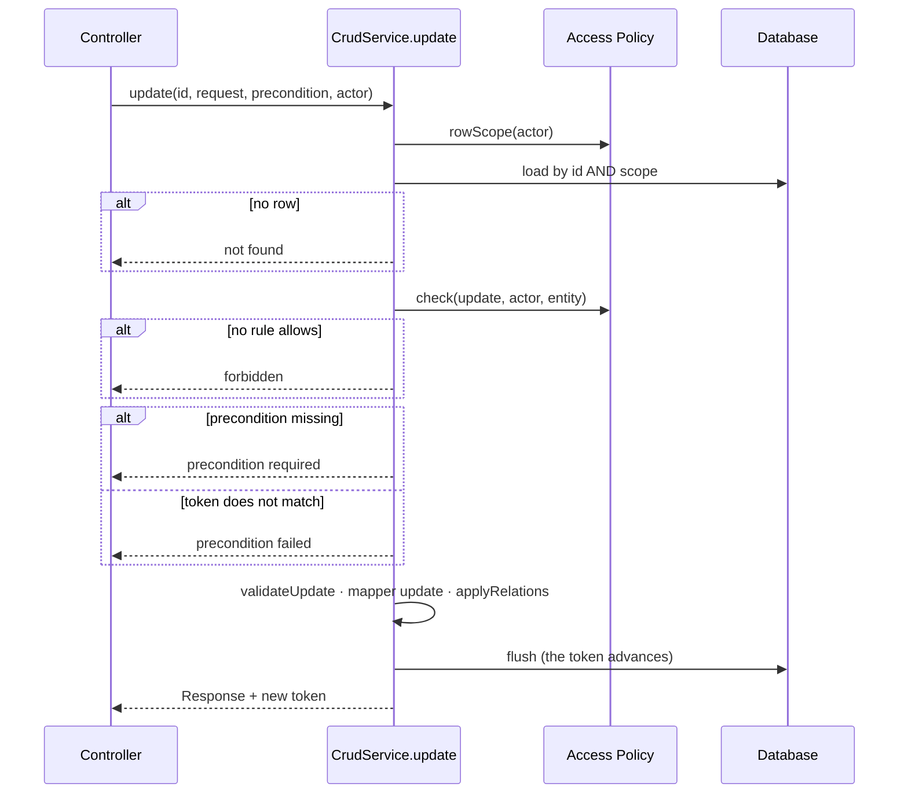

# CRUD Base and Service Hooks

#doc #guide #architecture #security #api-design #draft

**Guide:** [[Docs/Guide/Guide-Index]] · **Conventions:** [[Docs/Guide/Guide-Conventions]]

## Purpose

The CRUD base gives every Feature Module six operations — get, list, search, create, update, delete —
with correct semantics, so a feature supplies only its rules. This document is the contract of that base:
its entry points, the hooks a feature fills in, the Access Policy that decides who may do what to which
rows, and the three guarantees the base gives without being asked: every query is scoped, every write is
conditional, every entry point names its actor. The one idea to take away: a feature never re-implements
an operation to add a rule. It fills a hook or writes a policy rule, and the base does the rest in a
fixed order.

## Design

### Interface

Design sketch in Java-like notation. It fixes names and shapes of this convention, not framework syntax.

```java
// platform.crud
abstract class CrudService<REQ, RES, SUM, E, ID> {

  // the feature supplies four collaborators: repository, mapper, Query Profile, Access Policy

  Versioned<RES>    get(ID id, CurrentUser actor);
  PageResponse<SUM> list(ListRequest request, CurrentUser actor);
  PageResponse<SUM> search(ListRequest request, CurrentUser actor);
  Versioned<RES>    create(REQ request, CurrentUser actor);
  Versioned<RES>    update(ID id, REQ request, WritePrecondition precondition, CurrentUser actor);
  void              delete(ID id, WritePrecondition precondition, CurrentUser actor);

  // hooks — the only things a feature overrides; all default to "do nothing"
  protected void validateCreate(REQ request) {}
  protected void validateUpdate(REQ request, E current) {}
  protected void applyRelations(REQ request, E entity, CurrentUser actor) {}
  protected void beforeDelete(E entity) {}
}

// platform.access — one implementation per feature: <F>AccessPolicy
interface AccessPolicy<E> {
  void     check(Action action, CurrentUser actor, E entityOrNull);  // no rule allows it → forbidden
  RowScope rowScope(CurrentUser actor);                              // which rows this actor may see
}

enum Action { get, list, search, create, update, delete, download }
```

- `Versioned<RES>` is the Response together with the entity's current concurrency token. The controller
  turns the token into the validator a client sends back.
- `WritePrecondition` is what the client said about the version it expects: *this token* (one or more),
  *any version* (the explicit unconditional write), or *nothing*. The controller builds it from the
  request; the service evaluates it.
- `RowScope` is a technology-neutral value: `ownedBy(ownerPath, actor)`, `all()`, `none()` or
  `system(actor)`. It is defined in `platform.access`; [[Docs/Guide/06-Query-Engine]] states how the
  list engine applies and composes it.
- `ListRequest` and `PageResponse` belong to `platform.query`; `PageResponse` is specified in
  [[Docs/Guide/05-API-Contract]].

### What each entry point does

| Entry point | Target row | Steps, in order | Transaction |
|---|---|---|---|
| `get` | yes | scoped load → `check(get, actor, entity)` → Response with token | read-only |
| `list`, `search` | no | `check(list or search, actor, none)` → list engine with the Query Profile and `rowScope(actor)` → page of Summaries | read-only |
| `create` | no | `check(create, actor, none)` → `validateCreate` → mapper builds the entity → `applyRelations` → save → Response with token | read-write |
| `update` | yes | scoped load → `check(update, actor, entity)` → precondition → `validateUpdate` → mapper writes every Request field onto the entity → `applyRelations` → Response with the new token | read-write |
| `delete` | yes | scoped load → `check(delete, actor, entity)` → precondition → `beforeDelete` → delete | read-write |

"Scoped load" means: load the row by id **and** the Row Scope in one query. A row the actor may not see
is not found, exactly like a row that does not exist.



### Hooks

| Hook | Called | Receives | Use it for | Never for |
|---|---|---|---|---|
| `validateCreate` | before the entity is built | the Request | A rule about the input that needs other data: "the due date is not before the project starts" | Who may create |
| `validateUpdate` | after the precondition, before the mapper | the Request and the current entity | A rule about the change: "a closed order cannot change" | Who may update |
| `applyRelations` | after the mapper, on create and update | the Request, the entity, the actor | Turn ids into entities; set the owner from the actor on create | A decision to allow or deny |
| `beforeDelete` | after the precondition, before the delete | the entity | An invariant: "an order with payments is never deleted"; clean-up the delete needs | Who may delete |

Only `applyRelations` receives the actor, and only to record ownership. The three other hooks do not
receive it, so a rule that depends on the caller cannot be written in them. It goes in the Access Policy.

A failed rule in a hook is a domain exception: a business rule violation or a state conflict
([[Docs/Guide/09-Errors-and-Validation]]). It is unchecked, so the transaction rolls back.

### The Access Policy

One file per feature answers one question: *who may do what to which rows*.

- `check(action, actor, entityOrNull)` holds the role rules and the rules that depend on both the actor
  and the row. The base calls it exactly once per entry point. The entity is present for `get`, `update`,
  `delete` and `download`, and absent for `list`, `search` and `create`.
- `rowScope(actor)` holds row visibility. It must answer for every actor, including the system actor.
- A feature carries no method-security annotation (G02-05); the policy is the only place its
  authorization is written.
- A policy that has no rule for an action denies it. A feature that does not offer an operation simply
  gives it no rule.
- The system actor, `CurrentUser.system()`, is an ordinary actor. A feature with scheduled work writes a
  narrow rule for it; a feature with none denies it like anyone else.

Rules that do **not** depend on the actor are not authorization. "A row in state X is never deleted" is
an invariant and belongs in a hook.

### Conditional writes

Every entity the base manages carries a concurrency token that only the persistence layer writes. The
base hands it out with every single-row answer and asks for it back on every write to an existing row.

| The client says | Outcome |
|---|---|
| the current token | the write runs; the token advances |
| an older token | precondition failed — nothing is written |
| nothing | precondition required — nothing is written |
| "any version" | the write runs unconditionally |

Two writes can pass the comparison at the same moment. The persistence layer then refuses the second one
when it is flushed, and the base reports that refusal as the same precondition failure. A client sees one
meaning for "someone changed it first".

### The base controller

The base controller maps six routes onto the six entry points. It resolves the actor once, builds the
`WritePrecondition`, lets the framework validate the Request, and shapes the answer. Paths, status codes
and headers are in [[Docs/Guide/05-API-Contract]].

### Depth

Deleting the base would put six routes, six service operations and the scope, policy, precondition and
transaction wiring back into every feature. That is the leverage. The base is the wrong shape if features
still replace its operations, so the convention measures it (G04-20).

## Rules

### G04-01
**Rule:** The CRUD base has six entry points — get, list, search, create, update, delete — and a feature
supplies exactly four collaborators: repository, mapper, Query Profile and Access Policy. The base cannot
be constructed without an Access Policy.
**Why:** If the policy is optional, the feature that forgets it is open. A required collaborator is a
compile error, not a review comment.
**Evidence:** WP-R01-03, WP-R02-06 · ADR-005
**Differs from references:** The reference base took a repository, a mapper and query helpers and had no
authorization collaborator; its default rule was "any authenticated caller".

### G04-02
**Rule:** Every entry point receives the actor as an explicit parameter. Scheduled, background and
bootstrap work passes the system actor, which goes through the same Access Policy as any other actor.
**Why:** Code that reads the caller from the surroundings acts for nobody when there is no request, and
it lets input decide who the author is.
**Evidence:** BT-R01-05, BE-R09-07 · ADR-005, ADR-006
**Differs from references:** The reference services read the caller from a static context or took it
from the request body; there was no way to run as the system.

### G04-03
**Rule:** The server assigns the id on create. An id supplied by the client is never used.
**Why:** With a client-supplied id, a create silently becomes an overwrite of an existing row.
**Evidence:** BT-R02-02 · ADR-005
**Differs from references:** 29 of BugTracker's 31 mappers copied the form's id into the new entity.

### G04-04
**Rule:** Update writes every Request field onto the entity through the mapper; a field the Request
leaves out takes its empty value. The base has no partial update and never reports success for an update
it did not apply.
**Why:** An update that returns success and discards the input is the most damaging defect a generic
base can have: every feature inherits it and no caller can see it.
**Evidence:** BE-R02-01, BT-R02-01, WP-R02-01 · ADR-005, ADR-012
**Differs from references:** In all three projects the base update loaded the entity, saved it unchanged
and returned 200.

### G04-05
**Rule:** A feature customises the base only through its four hooks — validate on create, validate on
update, apply relations, before delete. It does not override an entry point to add a rule.
**Why:** An overridden entry point loses the base's order of checks, and the next feature copies the
override instead of the base.
**Evidence:** WP-R02-06, WP-R07-03 · ADR-005
**Differs from references:** The reference base had no hooks. wpmanager overrode create in 11 of 12
services and update in 9; the plugin and theme services became diverging copies.

### G04-06
**Rule:** A rule that depends on the caller lives in the Access Policy; a rule that does not — an
invariant of the data — lives in a hook. The validate and before-delete hooks do not receive the actor,
and apply-relations receives it only to record ownership.
**Why:** If hooks could see the caller, authorization would live in two places again, and the two would
drift.
**Evidence:** WP-R01-03, BT-R01-05 · ADR-005
**Differs from references:** Reference services mixed role checks, ownership checks and data invariants
in the body of each overridden method.

### G04-07
**Rule:** The Access Policy is the feature's single authorization module, with two operations: check
(action, actor, entity or none) and row scope (actor). The base consults check exactly once per entry
point, and the actions are the six entry points plus download.
**Why:** Authorization spread over URL rules, annotations, hooks and query filters cannot be read, tested
or changed as one thing.
**Evidence:** WP-R01-03, BE-R01-01, BT-R01-01, WP-R01-01 · ADR-005
**Differs from references:** None of the reference projects had a place that states a feature's
authorization. One enforced nothing, one enforced only a login, and the third annotated methods one by
one.

### G04-08
**Rule:** The Access Policy denies when no rule matches. There is no default that lets an authenticated
caller through.
**Why:** A permissive default turns every forgotten rule into an open operation.
**Evidence:** WP-R01-03, BT-R01-01 · ADR-005
**Differs from references:** wpmanager's base allowed every inherited operation to any logged-in caller,
so a client could delete administrators.

### G04-09
**Rule:** The Row Scope of the actor is part of every get, list, search, update and delete query and is
applied before paging, so totals and page counts count only rows the actor may see. No entry point runs
without a scope.
**Why:** A filter applied after the query returns pages with holes and totals that reveal hidden rows; a
filter that is optional is forgotten.
**Evidence:** WP-R01-03, BT-R01-02 · ADR-005, ADR-008
**Differs from references:** The reference projects had no row visibility at all: any caller who could
call an operation could call it on any row.

### G04-10
**Rule:** A row outside the actor's Row Scope is reported as not found, never as forbidden.
**Why:** "Forbidden" tells the caller the row exists.
**Evidence:** WP-R01-03 · ADR-005
**Differs from references:** The reference projects had no row visibility: an operation ran on any row
or was refused by role, so a caller could always tell that a row exists.

### G04-11
**Rule:** An entry point that targets a row evaluates in this order: authenticate; load the row through
the Row Scope (absent — not found); consult the Access Policy with the loaded row (no rule — forbidden);
evaluate the write precondition (missing — precondition required; stale — precondition failed); run the
hooks and write. An entry point with no target row consults the policy with no entity and proceeds.
**Why:** A fixed order gives each failure one meaning. A precondition evaluated before the scope would
tell a caller that a hidden row exists.
**Evidence:** WP-R01-03, BT-R03-07 · ADR-018, ADR-013
**Differs from references:** The reference projects had none of these checks; the order is new.

### G04-12
**Rule:** Every entity the base manages carries a concurrency token that only the persistence layer
writes; get, create and update return it, and the Request carries no version. Update and delete require
the client's precondition: a stale token fails, a missing precondition fails, and an explicit "any
version" is the only unconditional write.
**Why:** Without it, two people who edit the same row overwrite each other and neither is told.
**Evidence:** BT-R03-07 · ADR-005
**Differs from references:** None of the reference projects had optimistic locking; the last write won
silently.

### G04-13
**Rule:** A concurrent write that the persistence layer refuses at flush time is reported as the same
precondition failure as a stale token.
**Why:** The comparison and the flush are two moments. Without this rule the race between them surfaces
as a different error — or as a server error — for the same situation.
**Evidence:** BT-R03-07 · ADR-005, ADR-009
**Differs from references:** The reference projects had no concurrency control, so the second writer
was never told anything.

### G04-14
**Rule:** Rows the base manages are not changed in bulk outside the base — unless the bulk statement
includes the concurrency token in its condition and checks the number of rows it changed.
**Why:** A bulk statement bypasses the token, so it overwrites concurrent edits and leaves the token
unchanged for the next writer.
**Evidence:** BT-R03-07, BT-R06-02 · ADR-005
**Differs from references:** BugTracker reordered priorities across many rows with no version check, and
one of those reorders touched every tenant's rows.

### G04-15
**Rule:** Transactions are declared per entry point, on the six base operations only, read-only for get,
list and search. A service operation a feature adds is not transactional unless it declares it, and one
that performs more than one write declares it.
**Why:** A class-wide transaction makes every added operation transactional by default, which is how a
slow external call ends up inside a database transaction.
**Evidence:** WP-R03-02, WP-R03-06, WP-R03-05 · ADR-005
**Differs from references:** The reference base service was transactional as a whole. wpmanager uploaded
files of up to 100 MB to remote storage inside that transaction.

### G04-16
**Rule:** No entry point and no hook declares a checked exception. A failure is an unchecked domain
exception, so the transaction of the entry point rolls back.
**Why:** A checked exception does not roll the transaction back by default, so a request that fails can
leave half of its writes committed. It also forces every signature to list every failure.
**Evidence:** BE-R02-07, BT-R07-04, BT-R07-02 · ADR-009
**Differs from references:** The reference base declared up to five checked exceptions per operation and
had to repeat them in its rollback list; BugTracker committed partial work when one was thrown.

### G04-17
**Rule:** List and search are always paged and always run by the list engine with the feature's Query
Profile and the policy's Row Scope. The base has no operation that returns all rows.
**Why:** An unpaged list loads the whole table into one answer.
**Evidence:** BE-R02-03, BT-R02-05, WP-R02-03 · ADR-011
**Differs from references:** All three reference bases had a get-all that returned the whole table as an
unordered set.

### G04-18
**Rule:** The base is typed so that a feature reaches its own repository, mapper, profile and policy
without a cast.
**Why:** A cast moves a type error from the build to the first request, and breaks as soon as a test
substitutes the collaborator.
**Evidence:** BE-R02-02, WP-R02-02
**Differs from references:** Reference services cast the base's repository to their own type, and one
controller cast the base's service.

### G04-19
**Rule:** Each operation has one route. A feature does not add a second route for an operation the base
already exposes; what the operation needs — clean-up, a guard — goes in the hook.
**Why:** With two routes for one operation, the generic one stays reachable and skips the feature's
rules.
**Evidence:** WP-R02-05 · ADR-005
**Differs from references:** wpmanager added its own delete route with full clean-up and left the
inherited one active, which skipped that clean-up.

### G04-20
**Rule:** Across a project's CRUD features, fewer than half replace create or update wholesale. A project
that fails this treats it as a defect of the base, not of the features.
**Why:** If most features replace the two operations that matter, the base hides nothing and every
feature re-implements the hard part.
**Evidence:** WP-R02-06 · ADR-005
**Differs from references:** wpmanager would fail it: create was replaced in 11 of 12 services.

## Differs From the Reference Projects

- The base update really updates (G04-04; BE-R02-01, BT-R02-01, WP-R02-01).
- Features fill hooks instead of overriding operations (G04-05; WP-R02-06).
- Authorization has one home per feature and denies by default (G04-07, G04-08; WP-R01-03, BE-R01-01,
  BT-R01-01).
- Every query is scoped to what the actor may see (G04-09, G04-10; WP-R01-03, BT-R01-02).
- The actor is a parameter (G04-02; BT-R01-05).
- Writes are conditional (G04-12, G04-13, G04-14; BT-R03-07).
- **Transactions moved from the class to the entry points** (G04-15; WP-R03-02). This is a deliberate
  departure: the reference projects put one transaction rule on the whole base service, and a developer
  who knows them must now declare a transaction on each multi-write operation they add.
- Failures are unchecked (G04-16; BE-R02-07, BT-R07-02).
- Get-all is gone (G04-17; BE-R02-03).
- The id comes from the server (G04-03; BT-R02-02).
- Five type parameters instead of six: the fourth data shape is gone (G03-03; BE-R02-06).

## Version Notes

- **verified on 4.1.x** — a declarative transaction rolls back for an unchecked exception by default and
  does not for a checked one; a transaction attribute declared on a method takes precedence over one
  declared on its class. Evidence:
  https://docs.spring.io/spring-framework/reference/7.0/data-access/transaction/declarative/annotations.html
- **verified on 4.1.x** — a refused optimistic-lock write surfaces as
  `ObjectOptimisticLockingFailureException`. Evidence:
  https://docs.spring.io/spring-framework/docs/7.0.9/javadoc-api/org/springframework/orm/ObjectOptimisticLockingFailureException.html
- **verified on 3.4.x** — a transaction annotation on one method replaced the rollback rules the method
  would have inherited from its class. Evidence: WP-R03-06
- **not verified** — current-docs lookup at execution time: the concurrency token is a persistence-managed
  version attribute (`@Version`), and a bulk update statement does not advance it.
- **not verified** — current-docs lookup at execution time: the per-method transaction declaration
  (`@Transactional`, and its read-only form) on a method inherited from a generic base class.
- **not verified** — current-docs lookup at execution time: the predicate technology behind the scoped
  load; the choice is recorded in [[Docs/Guide/06-Query-Engine]].

## Related Documents

- [[Docs/Guide/01-Principles-and-Baseline]] — depth and fail-closed design, which this base applies.
- [[Docs/Guide/02-Project-Layout-and-Module-Boundaries]] — where `platform.crud` and `platform.access`
  sit.
- [[Docs/Guide/03-Feature-Module-Anatomy]] — the files a feature supplies to the base.
- [[Docs/Guide/05-API-Contract]] — the routes, statuses and headers of the base controller.
- [[Docs/Guide/06-Query-Engine]] — the list engine, the Query Profile and how the Row Scope is applied.
- [[Docs/Guide/07-Domain-Model-and-Persistence]] — the concurrency token and the audit fields on the entity.
- [[Docs/Guide/08-Identity-Authentication-and-Authorization]] — `CurrentUser`, the system actor, URL rules.
- [[Docs/Guide/09-Errors-and-Validation]] — the domain exceptions the base raises.
- [[ADRs/ADR-005-deepened-crud-base-with-access-policy|ADR-005]] — the decision this document details.
- [[ADRs/ADR-018-scoped-load-before-policy-check|ADR-018]] — the order of checks at a row entry point.
- [[ADRs/ADR-008-no-multi-tenancy-in-the-base-project|ADR-008]] — the Row Scope as the tenancy extension
  point.
