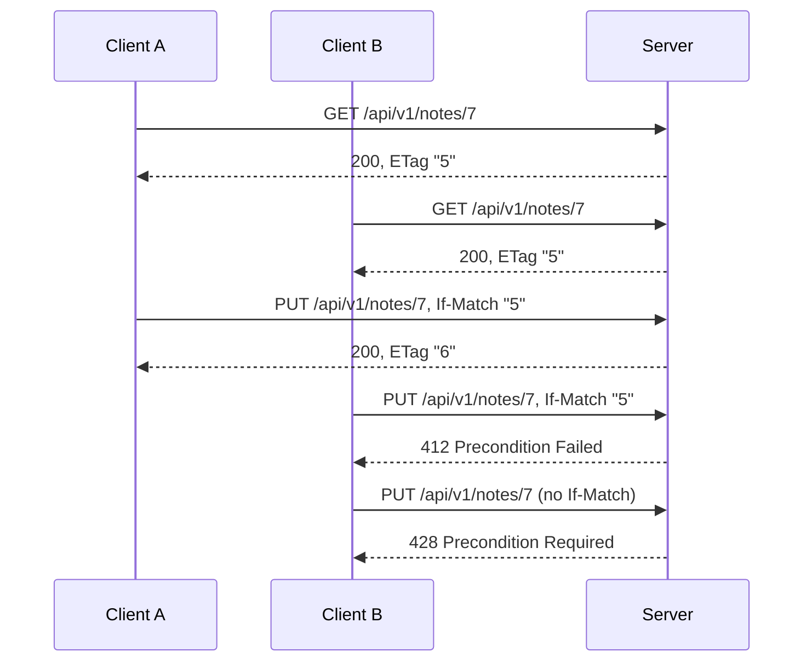

# API Contract

#doc #guide #api-design #draft

**Guide:** [[Docs/Guide/Guide-Index]] · **Conventions:** [[Docs/Guide/Guide-Conventions]]

## Purpose

This document is what an API consumer can rely on: how resources are named, which routes a resource has,
what each status code means, what a page looks like, and how a client avoids overwriting someone else's
change. The contract is HTTP used as specified — RFC 9110 for methods, statuses and conditional requests,
RFC 9457 for errors — so a client that knows HTTP already knows most of it. The one idea to take away:
every status has exactly one meaning, and it is the same in every feature.

## Design

### Routes of a resource

Every route sits under one versioned prefix. A resource is a plural, lower-case, kebab-case noun.

| Method and path | Operation | Success | Body |
|---|---|---|---|
| `GET /api/v1/notes/{id}` | get | 200 + `ETag` | Response |
| `GET /api/v1/notes?page=&size=&sort=` | list | 200 | PageResponse of Summary |
| `POST /api/v1/notes/search` | search | 200 | PageResponse of Summary |
| `POST /api/v1/notes` | create | 201 + `Location` + `ETag` | Response |
| `PUT /api/v1/notes/{id}` with `If-Match` | update (full replacement) | 200 + `ETag` | Response |
| `DELETE /api/v1/notes/{id}` with `If-Match` | delete | 204 | none |

A feature may add routes for operations that are not one of the six (`POST /api/v1/notes/{id}/archive`).
They follow the same naming, the same statuses and the same error shape.

`Location` on create is the path of the new resource's get route (`/api/v1/notes/42`).

Operational endpoints such as health checks are not API routes and do not sit under the prefix;
`14-Observability-and-Operations` (planned) says where they live.

The list parameters and the search body are specified in `06-Query-Engine` (planned).

### Status codes

An endpoint returns only these statuses, each with one meaning.

| Status | Meaning in this contract |
|---|---|
| 200 | Success with a body |
| 201 | Created; `Location` names the new resource |
| 204 | Success with no body (delete) |
| 302 | Download redemption: the object is served from the store |
| 400 | The request is invalid **by itself**: unreadable, wrong type, a missing required input, an unknown query field, a failed input constraint |
| 401 | Not authenticated |
| 403 | Authenticated, and no Access Policy rule allows the action |
| 404 | No such resource, or the caller may not see it; also an unknown, tampered or orphaned download ticket |
| 409 | The request conflicts with the **state** of the resource (never a stale write) |
| 410 | An expired download ticket |
| 412 | `If-Match` was sent and does not match the current version |
| 422 | The request is valid in itself but refused against server state or content: a business rule, an idempotency fingerprint mismatch, a content-digest mismatch |
| 428 | A write that requires `If-Match` was sent without it |
| 500 | An unexpected failure; the body carries a correlation id and no internal detail |

The framework answers a few protocol errors before any controller runs: 405 for a method the route does
not have, 406 and 415 for media types. They keep their standard meaning.

Every error status carries one body shape, an RFC 9457 problem detail whose `type` identifies the
failure. `09-Errors-and-Validation` (planned) defines the shape and the `type` values. When several
failures apply to one request, G04-11 fixes which one the client sees.

### Conditional writes on the wire



- The validator is a **strong** entity tag. Its value is opaque: a client stores it and sends it back,
  and never parses it.
- `If-Match` may list several tags; the write runs when one of them is the current one. A weak tag
  never matches.
- `If-Match: *` is the explicit unconditional write: "replace whatever is there".
- A list row carries no validator. A client that wants to change a row reads it first.
- Conditional reads (`If-None-Match`) are not part of this contract.

### Pages

```json
{
  "items": [ { "id": "…", "title": "…" } ],
  "page": 0,
  "size": 20,
  "totalItems": 137,
  "totalPages": 7
}
```

`page` is zero-based. `totalItems` and `totalPages` count only rows the caller may see (G04-09).

### Downloads

A file is never served from a feature route. The feature route is an ordinary entry point: it authorizes
the caller and issues a Download Ticket. One platform route redeems tickets:

| Ticket | Answer |
|---|---|
| valid, and the store can serve it directly | 302 to a short-lived URL of the store |
| valid, and the store cannot | 200 with the bytes, streamed |
| unknown or tampered | 404 |
| valid, but the object is gone | 404 |
| expired | 410 |

A client treats every URL in this exchange as opaque. `10-Object-Storage-and-Uploads` (planned) specifies
the ticket, the route that issues it and the response headers.

### Description of the API

The application publishes a machine-readable OpenAPI description generated from the running code. It
covers every route, the statuses each route can return and the error shape.

## Rules

### G05-01
**Rule:** Every API route is served under one versioned path prefix, `/api/v<major>`, starting with
`/api/v1`. The prefix is defined in one place.
**Why:** Without a version in the path, a breaking change cannot live beside the clients that still need
the old behaviour.
**Evidence:** BE-R02-05, BT-R02-08, WP-R02-08
**Differs from references:** The reference routes were bare (`/admin`, `/client`), with no prefix and no
version.

### G05-02
**Rule:** A resource path is a plural noun in lower-case kebab case with a leading slash, and one Feature
Module owns one collection path. An id is a path segment, and a feature-specific route uses the same
style.
**Why:** A client that has to memorise exceptions per resource makes mistakes, and so does the next
developer.
**Evidence:** BT-R02-06, WP-R02-07
**Differs from references:** The reference routes mixed snake case, camel case and kebab case, singular
nouns, and paths without a leading slash.

### G05-03
**Rule:** A CRUD feature exposes its six operations through the six routes of this document's route table
and through no other route. A route it adds is for an operation that is not one of the six.
**Why:** One route set means a client written for one resource works for every resource.
**Evidence:** BE-R06-03, BT-R05-05, BT-R02-09 · ADR-005, ADR-011
**Differs from references:** The reference projects listed through `POST /list` and an unbounded
`GET`; one BugTracker controller paged through path variables with its own contract.

### G05-04
**Rule:** Create answers 201 with the new resource's Response and a `Location` header that names it;
delete answers 204 with no body. Every other success answers 200.
**Why:** A client cannot tell a creation from another success, or find the new resource, when every
success is 200.
**Evidence:** BE-R02-04, BT-R02-07, WP-R02-04 · ADR-005
**Differs from references:** Every success in the reference projects was 200; create had no `Location`
and delete returned a body.

### G05-05
**Rule:** Application code answers only with the statuses of this document's status table, each with the
one meaning the table gives it. A status the framework produces before a controller is reached — wrong
method, unsupported media type, not acceptable — keeps its standard meaning and carries the same error
shape.
**Why:** A status that means two things forces clients to read messages, and messages change.
**Evidence:** BE-R04-05, BT-R07-01, WP-R04-01 · ADR-009
**Differs from references:** The reference projects returned 500 for domain failures and for every
failure inside an upload, and 409 or 400 for the same conflict depending on the route.

### G05-06
**Rule:** 400 means the request is invalid by itself, with no server state needed to judge it; 422 means
it is valid in itself and is refused against server state or content. 409 is a conflict with the state of
the resource and is never used for a stale write.
**Why:** Without one test that classifies a failure, each feature picks its own status for the same
situation.
**Evidence:** BE-R04-05, BE-R05-04 · ADR-009
**Differs from references:** In `backend/` any illegal-argument failure became 400, and a duplicate was
409 on create and 400 on update.

### G05-07
**Rule:** A list or a search answers with the page shape of this document: `items`, `page`, `size`,
`totalItems`, `totalPages`, with a zero-based `page`. A framework's own page type is never serialised.
**Why:** A wire format that belongs to a library changes when the library is upgraded.
**Evidence:** BE-R02-08, BT-R02-08 · ADR-011
**Differs from references:** The reference projects serialised the framework's page object directly; the
framework itself warns that this JSON is not stable.

### G05-08
**Rule:** Get, create and update return the entity's version as a strong `ETag`; a weak tag is never
issued and never matches. Update and delete require `If-Match`: a tag that is not current answers 412, a
missing header answers 428, and `*` is the explicit unconditional write.
**Why:** Without a precondition on the wire, the server cannot tell a client that the row changed since
the client read it.
**Evidence:** BT-R03-07 · ADR-005, ADR-009
**Differs from references:** None of the reference projects sent a validator or accepted a precondition;
the last write won.

### G05-09
**Rule:** A date-time on the wire is ISO 8601 with an offset or `Z`. A date-time without a zone is never
emitted, and one received is rejected with 400.
**Why:** A date-time without a zone is read differently by each side, and nobody is told.
**Evidence:** BE-R05-05, BE-R06-06 · ADR-011
**Differs from references:** `backend/` emitted a zone-less timestamp in its error body and silently read
zone-less filter values as UTC.

### G05-10
**Rule:** The API consists of the routes that controllers declare and nothing else. No library exports a
repository or an entity as a route.
**Why:** A route nobody wrote has no Access Policy, no Row Scope and no Request shape. It exposes every
column and accepts every write.
**Evidence:** BE-R01-03, WP-R01-05, BT-R01-07 · ADR-006, ADR-011
**Differs from references:** All three reference projects had a repository-export library on the
classpath with its default settings.

### G05-11
**Rule:** Search is a read sent with POST: it changes no state, answers 200 and is never guarded by an
idempotency key.
**Why:** A search treated as a write would be replayed from a stored answer and return stale rows.
**Evidence:** BE-R06-03 · ADR-011, ADR-014
**Differs from references:** The reference `POST /list` was the only way to list; the Guide keeps POST
for rich filters only and adds a plain `GET`.

### G05-12
**Rule:** Redeeming a download ticket answers 302 or streams the bytes with 200; an unknown or tampered
ticket answers 404, an expired one 410, and a ticket whose object is gone 404. A client never builds or
parses a download URL.
**Why:** One answer for "not valid" and "no longer there" tells a caller nothing about what exists, and
an opaque URL keeps storage keys off the client.
**Evidence:** WP-R01-02, WP-R05-07 · ADR-013, ADR-009
**Differs from references:** wpmanager served objects through an anonymous route and rebuilt object keys
by parsing URLs.

### G05-13
**Rule:** The application publishes an OpenAPI description generated from its code. It covers every
route, the statuses each route returns and the error shape.
**Why:** Without a description, consumers learn the API by reading the source or by trial.
**Evidence:** BE-R02-05, BT-R02-08, WP-R02-08
**Differs from references:** None of the reference projects had an API description.

## Differs From the Reference Projects

- Routes gained a versioned prefix and one naming style (G05-01, G05-02; BE-R02-05, BT-R02-06,
  WP-R02-07).
- Listing moved from `POST /list` to `GET`, with `POST /search` kept for rich filters (G05-03, G05-11;
  BE-R06-03).
- Success statuses carry meaning: 201 with `Location`, 204 (G05-04; BE-R02-04, BT-R02-07, WP-R02-04).
- Each error status has one meaning (G05-05, G05-06; BE-R04-05, BT-R07-01, WP-R04-01).
- The page shape is owned (G05-07; BE-R02-08).
- Writes are conditional (G05-08; BT-R03-07).
- Nothing is exported that a controller did not declare (G05-10; BE-R01-03, WP-R01-05, BT-R01-07).
- The API is described (G05-13; BE-R02-05).

## Version Notes

- **verified on 4.1.x** — for a request with an unsafe method, `WebRequest.checkNotModified` compares the
  `If-Match` header with the given entity tag by strong comparison and sets 412 when none matches. It
  does not reject a request that has no `If-Match`, so the 428 of G05-08 is produced by the CRUD base.
  Evidence: https://docs.spring.io/spring-framework/reference/7.0/web/webmvc/mvc-caching.html and
  https://github.com/spring-projects/spring-framework/blob/v7.0.9/spring-web/src/main/java/org/springframework/web/context/request/ServletWebRequest.java
- **verified on 4.1.x** — the status constants are `HttpStatus.PRECONDITION_FAILED` (412),
  `HttpStatus.PRECONDITION_REQUIRED` (428) and `HttpStatus.UNPROCESSABLE_CONTENT` (422; the older name
  `UNPROCESSABLE_ENTITY` is deprecated). Evidence:
  https://github.com/spring-projects/spring-framework/blob/v7.0.9/spring-web/src/main/java/org/springframework/http/HttpStatus.java
- **verified on 4.1.x** — a common path prefix for controllers is set with
  `PathMatchConfigurer.addPathPrefix`; the framework's API-versioning support can read the version from a
  path segment (`spring.mvc.apiversion.use.path-segment`). Evidence:
  https://docs.spring.io/spring-framework/reference/7.0/web/webmvc/mvc-config/path-matching.html and
  https://docs.spring.io/spring-boot/4.1/appendix/application-properties/index.html
- **verified on 4.1.x** — springdoc-openapi 3.1 states support for Spring Boot 4.x; the artifact without
  the browser UI is `springdoc-openapi-starter-webmvc-api`. Evidence:
  https://github.com/springdoc/springdoc-openapi/blob/v3.1.1/README.md
- **verified on 3.4.x** — serialising the framework's page type directly logs a warning that the JSON
  structure is not guaranteed to be stable. Evidence: BE-R02-08
- **not verified** — current-docs lookup at execution time: that springdoc-openapi 3.1 works on this
  exact line. Its documentation names the 4.x generation; no test proves 4.1.x.
- **not verified** — current-docs lookup at execution time: how the JSON mapper of this line writes and
  reads date-times by default, and the setting that rejects a date-time without a zone.
- **not verified** — current-docs lookup at execution time: the dependency that would export
  repositories as routes (G05-10), so the build can be checked for its absence.

## Related Documents

- [[Docs/Guide/03-Feature-Module-Anatomy]] — the Request, Response and Summary shapes.
- [[Docs/Guide/04-CRUD-Base-and-Service-Hooks]] — the operations behind the routes and the order of
  checks.
- `06-Query-Engine` — planned: list parameters, the search body, operators and bounds.
- `08-Identity-Authentication-and-Authorization` — planned: which routes are public.
- `09-Errors-and-Validation` — planned: the problem-detail shape and its `type` values.
- `10-Object-Storage-and-Uploads` — planned: the Download Ticket.
- `11-Idempotency` — planned: the `Idempotency-Key` header.
- `14-Observability-and-Operations` — planned: operational endpoints.
- [[ADRs/ADR-009-unchecked-domain-exceptions-as-problem-details|ADR-009]] — the status meanings.
- [[ADRs/ADR-011-list-api-get-paging-and-post-search|ADR-011]] — `GET` paging, `POST /search`, the page
  shape.
- [[ADRs/ADR-005-deepened-crud-base-with-access-policy|ADR-005]] — status codes of the base and
  conditional writes.
- [[ADRs/ADR-013-object-storage-port-upload-coordinator-and-download-tickets|ADR-013]] — download
  redemption.
