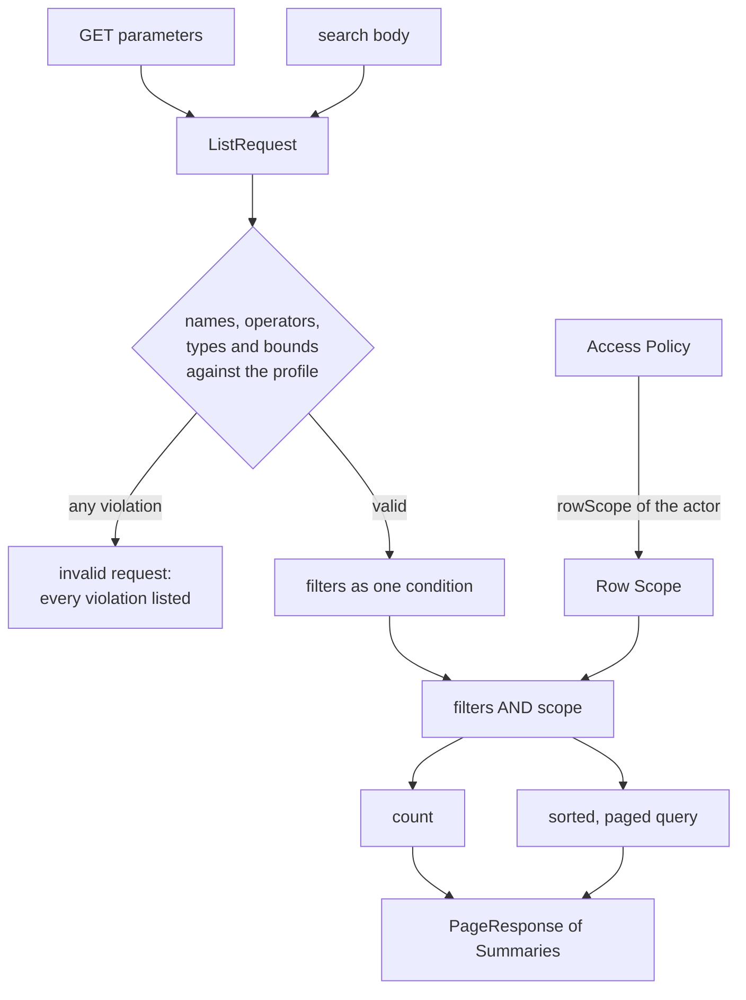

# Query Engine

#doc #guide #api-design #security #persistence #draft

**Guide:** [[Docs/Guide/Guide-Index]] · **Conventions:** [[Docs/Guide/Guide-Conventions]]

## Purpose

The query engine answers every list and every search of the application: it filters, sorts and pages
rows, safely, behind one call. A client may name only the fields a feature declared, may use only the
operators declared for them, and can never see a row outside the actor's Row Scope. This document is the
contract of that engine: the two request forms, the Query Profile, the operators, the bounds, and how the
Row Scope is applied and composed. The one idea to take away: the Query Profile decides which *fields* a
client may query, the Row Scope decides which *rows* the actor may see, and the two never mix.

## Design

### Interface

Design sketch in Java-like notation. It fixes names and shapes of this convention, not framework syntax.

```java
// platform.query
interface ListQuery {
  // filter, sort and page the rows the scope allows
  <E, SUM> PageResponse<SUM> run(QueryProfile<E> profile, RowScope scope,
                                 ListRequest request, Function<E, SUM> toSummary);

  // load one row by id, through the scope; empty when the row is absent or not visible
  <E, ID> Optional<E> findVisible(Class<E> entity, ID id, RowScope scope);
}

// one internal form for both request forms
record ListRequest(Integer page, Integer size, List<SortKey> sort, List<FieldFilter> filters) {}
record SortKey(String field, Direction direction) {}            // asc | desc
record FieldFilter(String field, List<Condition> conditions) {} // conditions are OR-ed
record Condition(Operator op, List<String> values) {}

// platform.access — a value; it carries no persistence type
final class RowScope {
  static RowScope ownedBy(String ownerPath, CurrentUser actor); // rows whose owner is the actor
  static RowScope all();                                        // every row
  static RowScope none();                                       // no row
  static RowScope system(CurrentUser actor);                    // every row; only the system actor may build it
  RowScope and(RowScope other);                                 // the only way to combine two scopes
}
```

- `run` is the list entry point. The CRUD base calls it for `list` and `search`
  ([[Docs/Guide/04-CRUD-Base-and-Service-Hooks]]); a feature that opts out of the base calls it directly.
- `findVisible` is the scoped load of G04-11. It lives here because the engine is the one place that
  turns a Row Scope into a query condition.
- Both take the Row Scope as a required argument. There is no overload without it.
- A feature never builds a query condition itself. It declares a Query Profile and returns a Row Scope;
  the engine does the rest.

### The Query Profile

One per feature that lists rows (`<F>QueryProfile`, G03-08). It declares each queryable field once:

| Part of a field declaration | Meaning |
|---|---|
| name | What the client writes. It is the only thing a client ever sends about a field |
| path | Where the value lives on the entity; it may go through an association (`project.name`) |
| type | text, number, boolean, date, date-time, enumeration, identifier — or a collection of one of them |
| operators | The operators a client may use on this field |
| sortable | Whether a client may sort by it |
| nullable | Whether the field can be empty, which allows the `isNull` operator |

The profile also declares the default sort and the bounds:

| Bound | What it limits |
|---|---|
| maximum page size | `size` |
| default page size | `size` when the client sends none |
| maximum sort keys | entries in `sort` |
| maximum filters | entries in `filters` |
| maximum conditions per filter | entries in one filter's `conditions` |
| maximum values per condition | values of one `in` |
| maximum text length | characters of one text value |

The platform supplies a default for every bound, from typed configuration; a profile may lower or raise a
bound for its feature. A profile is checked when the application starts: every path must exist on the
entity and every operator must fit the field's type. A wrong profile stops the start-up.

### Operators

The vocabulary is closed. A field declares the subset it allows.

| Operator | Meaning | Field types |
|---|---|---|
| `eq`, `ne` | equal, not equal | all |
| `in` | equal to one of the values | all except boolean |
| `gt`, `gte`, `lt`, `lte` | ordering | number, date, date-time |
| `between` | from the first value to the second, both included | number, date, date-time |
| `contains`, `startsWith`, `endsWith` | text match, case-insensitive | text |
| `isNull` | the field is empty (`true`) or not (`false`) | nullable fields |

On a collection field, `eq` and `in` mean "the collection has at least one such element".

`contains` and `endsWith` cannot use an ordinary index. A profile allows them only on fields where a scan
is acceptable or where the migration adds a suitable index
([[Docs/Guide/07-Domain-Model-and-Persistence]]).

### The two request forms

Simple listing, cacheable and bookmarkable:

```
GET /api/v1/notes?page=0&size=20&sort=createdAt,desc&sort=title,asc
```

Rich filters:

```json
POST /api/v1/notes/search
{
  "page": 0,
  "size": 20,
  "sort": [ { "field": "createdAt", "direction": "desc" } ],
  "filters": [
    { "field": "title",  "conditions": [ { "op": "contains", "value": "invoice" },
                                         { "op": "startsWith", "value": "draft" } ] },
    { "field": "status", "conditions": [ { "op": "in", "values": ["OPEN", "REVIEW"] } ] }
  ]
}
```

- The `GET` form carries `page`, `size` and `sort` only. Filters exist only in the search body.
- Every member of the body is optional. `{}` is a valid search: first page, default size, default sort.
- Conditions of one filter are OR-ed. Filters are AND-ed. The example reads: (title contains "invoice"
  OR title starts with "draft") AND status is OPEN or REVIEW.
- A condition carries `value` for one value and `values` for `in` and `between`.
- A field appears in at most one filter.
- Both forms answer with the page shape of [[Docs/Guide/05-API-Contract]] (G05-07).

### What the engine does with a request



1. Both forms are parsed into one `ListRequest`.
2. The request is checked against the profile: every field name, every operator, every value and every
   bound. All violations are reported together, as one invalid request (the `invalid-query` failure of
   [[Docs/Guide/09-Errors-and-Validation]]).
3. Missing parts take the profile's defaults. The engine appends the identifier as the last sort key, so
   the order of rows is total and pages do not overlap.
4. The filters become one condition. The Row Scope is AND-ed onto it. Nothing a client sends can remove,
   replace or widen the scope.
5. The count and the page query use that same condition, so `totalItems` and `totalPages` count only rows
   the actor may see (G04-09).
6. Each row becomes a Summary. The query fetches what the Summary needs; the mapping causes no further
   query.

### The Row Scope

A Row Scope is a value that says which rows an actor may see. The Access Policy returns one for every
actor ([[Docs/Guide/04-CRUD-Base-and-Service-Hooks]]); the engine applies it.

| Value | Rows | Returned for |
|---|---|---|
| `ownedBy(ownerPath, actor)` | rows whose owner is the actor | an ordinary user of a feature with owned rows |
| `all()` | every row | a role that may see everything, such as an administrator |
| `none()` | no row | an actor the feature has no rule for |
| `system(actor)` | every row | the system actor, in a feature that declares system work |

- `ownerPath` names the attribute that holds the owner's user id; it may go through an association
  (`project.ownerId`). The engine compares it with the actor's user id.
- `none()` is the fail-closed answer. A policy that does not know an actor returns it, and every query
  for that actor finds nothing.
- `system(actor)` refuses to be built for any actor that is not the system actor. A policy cannot hand
  "every row" to a user by mistake through it.
- `and` narrows: the result shows a row only when both scopes show it. There is no `or`.

**Multi-tenancy.** The convention implements no tenancy
([[ADRs/ADR-008-no-multi-tenancy-in-the-base-project|ADR-008]]). `and` is its one extension point: a
project that needs tenants adds a tenant scope and returns `tenantScope.and(featureScope)` from every
policy. That project owns the design and the risk.

### Depth

One call hides parsing, whitelisting, typing, bounds, scoping, sorting, counting and paging. Deleting the
engine would put all of that into every feature — and the scope is the part a feature would forget.

## Rules

### G06-01
**Rule:** The list engine has two entry points: run a list (Query Profile, Row Scope, list request,
Summary mapping) and load one row by id through a Row Scope. The Row Scope is a required argument of
both, and a feature never builds a query condition of its own.
**Why:** A list that a feature assembles by hand is the list that forgets the scope, the whitelist or the
bounds.
**Evidence:** WP-R01-03, BT-R01-02, BT-R05-05 · ADR-011, ADR-018
**Differs from references:** The reference engines had no scope argument. BugTracker's plain list route
ignored its filter and returned every row of every tenant.

### G06-02
**Rule:** Simple listing is a `GET` with page, size and sort; rich filtering is a `POST` to the search
route. Both are parsed into one list request and run by the same engine, and the `GET` form carries no
filter.
**Why:** Two engines for two forms drift, and a filter language squeezed into a query string is hard to
parse and hard to bound.
**Evidence:** BE-R06-03, BT-R05-05, BT-R02-09 · ADR-011
**Differs from references:** `backend/` listed only through `POST /list`; BugTracker's plain list route
ignored its filter, and one of its controllers paged through path variables with a contract of its own.

### G06-03
**Rule:** Every filterable or sortable field is declared exactly once in the feature's Query Profile:
name, path, type, operators, sortable, nullable. A field that is not declared cannot be filtered or
sorted; a request that names one is rejected as invalid.
**Why:** Without a whitelist a client can filter and sort by any column, including a password hash, and
read it out one character at a time.
**Evidence:** BT-R05-07, BE-R06-05, BT-R05-03 · ADR-011
**Differs from references:** BugTracker accepted any field name and answered an unknown one with a server
error; `backend/` had a whitelist but wrote each field name three times.

### G06-04
**Rule:** A client names a field only by its declared name. It never sends a path, a column or an
expression; a value on an associated entity is reachable only through a field the profile declares for
it.
**Why:** A path taken from the request lets a client walk associations into data the feature never meant
to expose.
**Evidence:** BT-R05-07, BT-R05-08, BT-R05-04 · ADR-011
**Differs from references:** BugTracker took field names from the request and built association paths
from them at run time; a bad date on such a path ended in a server error.

### G06-05
**Rule:** A value is read according to the declared type of its field, never guessed from how the value
looks. A value that does not parse as that type is rejected as invalid.
**Why:** Guessing turns the text "false" into a string comparison on a boolean column and a date-shaped
name into a date. The query then fails or silently matches nothing.
**Evidence:** BT-R05-02, BT-R05-04, BE-R06-06 · ADR-011
**Differs from references:** BugTracker chose the comparison from the shape of the value; `backend/` read
a date-time without a zone as UTC without saying so.

### G06-06
**Rule:** The operator vocabulary is the closed set of this document, and each field declares the
operators a client may use on it. An operator that is not declared for the field, or that does not fit
its type, is rejected as invalid.
**Why:** An operator a feature never chose — a text scan on a large column — is a cost that any client
can then impose.
**Evidence:** BE-R06-04, BE-R06-01 · ADR-011
**Differs from references:** `backend/` declared operators per field but put no limit on how many
costly text matches one request may carry, and its "is empty" capability was tested yet reachable from
no profile.

### G06-07
**Rule:** In a search, the conditions of one field are combined with OR and the fields with AND; a field
appears in at most one filter; sorting accepts several keys in order. Every part of the search body is
optional.
**Why:** Without one fixed meaning, each client guesses how filters combine, and a missing optional part
becomes a server error.
**Evidence:** BT-R05-06, BT-R05-05 · ADR-011
**Differs from references:** None for the combination rule — it is BugTracker's contract, kept. Differs
in that a body without a sort failed there with a server error.

### G06-08
**Rule:** The Query Profile bounds every list request: page size, number of sort keys, number of filters,
conditions per filter, values per condition and length of a text value. A request beyond a bound is
rejected as invalid — it is never silently cut down to the bound.
**Why:** One request with thousands of conditions or values produces a statement that can exhaust the
database. A value cut down in silence gives the client an answer to a question it did not ask.
**Evidence:** BE-R06-04, BE-R02-03 · ADR-011
**Differs from references:** `backend/` put no upper limit on filters, operations, values or text length.

### G06-09
**Rule:** A request that omits page, size or sort takes the profile's defaults, and the engine always
appends the identifier as the last sort key.
**Why:** Without a total order, a row can appear on two pages or on none, and the result changes between
two identical requests.
**Evidence:** BT-R05-06, BE-R02-03, BT-R02-05 · ADR-011
**Differs from references:** The reference projects returned unordered sets from their get-all routes and
failed on a missing sort.

### G06-10
**Rule:** The engine combines the client's filters and the actor's Row Scope with AND, and uses that one
condition for the count and for the page. No client input can remove, replace or widen the scope.
**Why:** A scope applied to the page but not to the count reveals how many hidden rows exist; a scope a
filter can override is not a scope.
**Evidence:** WP-R01-03, BT-R01-02 · ADR-005, ADR-011
**Differs from references:** The reference engines had no row visibility; a filter was the only thing
that limited what a caller saw.

### G06-11
**Rule:** A Row Scope is a value with four forms — owned by the actor, all rows, no rows, and all rows
for the system actor — and two scopes combine only by AND. The no-rows form is what a policy returns for
an actor it has no rule for, and the system form cannot be built for any other actor.
**Why:** If "all rows" were the easy answer, a forgotten case would show everything. With a no-rows form
and AND-only composition, a mistake hides rows instead of leaking them.
**Evidence:** WP-R01-03, BT-R01-02, BT-R06-01 · ADR-005, ADR-008
**Differs from references:** The reference projects had no such value. BugTracker modelled tenants and
checked their data globally.

### G06-12
**Rule:** The Row Scope and the list request carry no type of the persistence or query technology. The
technology that turns them into a query is an implementation detail of the engine, recorded in a Version
Note.
**Why:** A scope written in the query technology ties every Access Policy to it, and a change of
technology becomes a rewrite of every feature.
**Evidence:** BT-R05-08, BT-R05-09 · ADR-011
**Differs from references:** Reference features wrote query-library predicates themselves; some were
built from the text form of a path and one had no root at all.

### G06-13
**Rule:** The engine keeps no state between calls: nothing about one request is stored on a shared
object.
**Why:** State on a shared object is read by the next request. Two concurrent lists then run with each
other's filters.
**Evidence:** BT-R05-01 · ADR-011
**Differs from references:** BugTracker stored the current filters in fields of a singleton.

### G06-14
**Rule:** Enumeration fields, collection fields and nullable fields are supported kinds of field: an
enumeration is compared by name, a collection matches when one element matches, and a nullable field may
allow the is-empty operator.
**Why:** A kind of field the engine cannot express is filtered in the client instead — over pages it has
not loaded.
**Evidence:** BE-R06-02, BE-R06-01 · ADR-011
**Differs from references:** In `backend/` a list could not be filtered by role, and no profile could ask
for rows where a date was empty.

### G06-15
**Rule:** A list or a search writes nothing, and the number of queries it runs does not grow with the
number of rows on the page. What a Summary shows is fetched by the list query, not row by row.
**Why:** A query per row turns a page of fifty into hundreds of queries, and a list that writes makes
every read a possible lock and a possible lost update.
**Evidence:** BT-R04-02, BT-R04-03, BT-R04-01 · ADR-011
**Differs from references:** BugTracker's list views loaded seven collections per row and wrote
recomputed counters back while listing.

### G06-16
**Rule:** A Query Profile is checked when the application starts: every declared path exists on the
entity, and every declared operator fits the field's type. A profile that fails the check stops the
start-up.
**Why:** A wrong path found at the first request is a server error in production; found at start-up it is
a failed build.
**Evidence:** BE-R06-05, BT-R05-09, BT-R05-03 · ADR-011
**Differs from references:** A mistyped name in a `backend/` profile would surface as a wrong sort or a
wrong error message, and a BugTracker predicate with no root fails only when it is first used.

## Differs From the Reference Projects

- Reads moved from `POST /list` to `GET`, with `POST` kept for search (G06-02; BE-R06-03).
- A field whitelist is mandatory and each field is written once (G06-03, G06-04; BT-R05-07, BE-R06-05).
- Values are typed by declaration, not by their look (G06-05; BT-R05-02).
- Every request is bounded (G06-08; BE-R06-04).
- Row visibility is part of every query and cannot be filtered away (G06-10, G06-11; WP-R01-03,
  BT-R01-02). The reference engines had none.
- The engine holds no request state (G06-13; BT-R05-01).
- Enumerations, collections and empty values can be filtered (G06-14; BE-R06-02, BE-R06-01).
- A list no longer writes and no longer queries per row (G06-15; BT-R04-02, BT-R04-03).
- Kept from the reference projects: BugTracker's filter contract — OR inside a field, AND across fields
  (G06-07) — and the per-field profile of `backend/` with its typed parsing.

## Version Notes

- **verified on 4.1.x** — Spring Data JPA 4.1 runs a condition with paging through
  `JpaSpecificationExecutor` (`findAll` with a specification and a pageable); a condition is a
  `Specification` or, since 4.0, a `PredicateSpecification`, and conditions combine with `and` and `or`.
  Evidence: https://docs.spring.io/spring-data/jpa/reference/4.1/jpa/specifications.html
- **verified on 4.1.x** — Spring Data JPA 4.1 also offers `QuerydslPredicateExecutor` for conditions
  written with Querydsl. Evidence:
  https://docs.spring.io/spring-data/jpa/reference/4.1/repositories/core-extensions.html
- **verified on 3.4.x** — the reference engine was written with Querydsl generated types and declared
  each field three times. Evidence: BE-R06-05
- **not verified** — current-docs lookup at execution time: the predicate technology. The convention's
  choice is the Jakarta Persistence criteria API through Spring Data specifications: it needs no
  dependency outside the managed set (G01-07) and no second annotation processor beside MapStruct. No
  test proves the choice on this line yet.
- **not verified** — current-docs lookup at execution time: whether a Querydsl distribution exists for
  the persistence provider of this line, for a project that prefers it.
- **not verified** — current-docs lookup at execution time: how a path through an association is
  resolved and checked against the entity model at start-up (the persistence metamodel).
- **not verified** — current-docs lookup at execution time: how the list query fetches what a Summary
  needs without a query per row (a fetch join, an entity graph or a projection), and how the count query
  is derived when the page query joins a collection.
- **not verified** — current-docs lookup at execution time: how repeated `sort` parameters of the `GET`
  form are bound, and the framework's own cap on page size
  (`spring.data.web.pageable.max-page-size`), which must not contradict the profile's bound.

## Related Documents

- [[Docs/Guide/03-Feature-Module-Anatomy]] — the Query Profile as one file of a Feature Module.
- [[Docs/Guide/04-CRUD-Base-and-Service-Hooks]] — the Access Policy that returns the Row Scope, and the
  entry points that call the engine.
- [[Docs/Guide/05-API-Contract]] — the routes and the page shape.
- [[Docs/Guide/07-Domain-Model-and-Persistence]] — owner columns, indexes and lazy associations.
- [[Docs/Guide/09-Errors-and-Validation]] — the invalid-query failure.
- [[ADRs/ADR-011-list-api-get-paging-and-post-search|ADR-011]] — the decision this document details.
- [[ADRs/ADR-008-no-multi-tenancy-in-the-base-project|ADR-008]] — Row Scope composition as the tenancy
  extension point.
- [[ADRs/ADR-018-scoped-load-before-policy-check|ADR-018]] — why the scoped load comes first.
