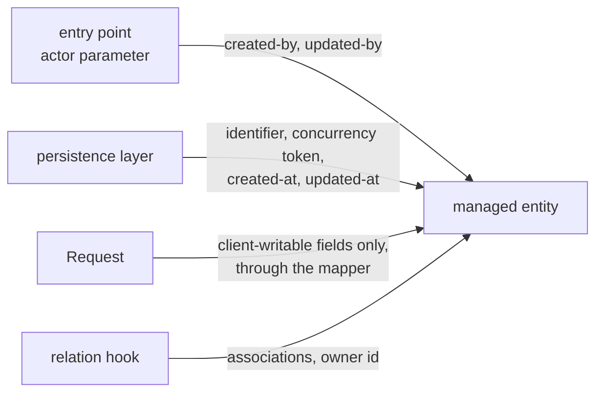
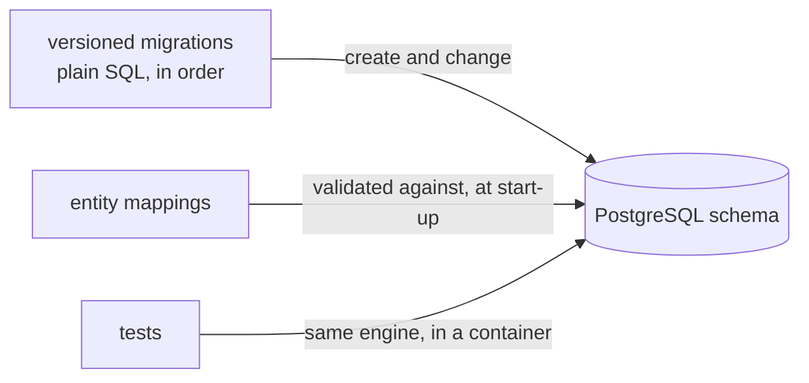

# Domain Model and Persistence

#doc #guide #persistence #architecture #draft

**Guide:** [[Docs/Guide/Guide-Index]] · **Conventions:** [[Docs/Guide/Guide-Conventions]]

## Purpose

This document says how an entity is shaped and how the schema it lives in is owned. Every entity the
CRUD base manages carries the same server-owned fields — an identifier, a concurrency token and four
audit fields — and no feature code writes any of them. The schema belongs to versioned migrations: the
persistence layer checks it and never changes it, and the engine is PostgreSQL everywhere, tests
included. The one idea to take away: what the database can guarantee is written as a constraint in a
migration, and what the server owns on a row is never left to a feature to remember.

## Design

### The managed entity

Every entity the CRUD base manages extends one shared base type. The base type holds the server-owned
fields and the equality rule, so a feature entity declares only its own state.
The base type lives in `platform.crud`. An entity of a Platform Module that the CRUD base does not manage
— the user record, a credential — does not extend it, and follows the same rules for its identifier, its
equality and its time fields.

| Field | Who writes it | When | Seen by the client as |
|---|---|---|---|
| identifier | the persistence layer | on insert | `id` in the Response and the Summary |
| concurrency token | the persistence layer | on every write | the strong `ETag` (G05-08) |
| created-at | the persistence layer | on insert | a date-time in the Response |
| updated-at | the persistence layer | on every write | a date-time in the Response |
| created-by | the CRUD base, from the actor of the entry point | on create | an actor label |
| updated-by | the CRUD base, from the actor of the entry point | on create and on update | an actor label |

- None of the six is in the Request (G03-04), and the mapper lists them as ignored (G03-06).
- An **actor label** is the actor's user id written as text. For the system actor it is the reserved
  word `system` ([[Docs/Guide/08-Identity-Authentication-and-Authorization]]). It is a label, not a
  foreign key: a row keeps its history when a user is retired.
- The two actor labels come from the actor **parameter** of the entry point (G04-02). They are never
  read from the surroundings, so scheduled work stamps `system` instead of nothing.
- The CRUD base stamps them in `create` and `update`. A feature-specific operation that changes a managed
  entity stamps `updated-by` itself, through the one stamping operation the base type offers
  (`entity.touchedBy(actor)`); the labels have no other way to be assigned.

### Identifiers and equality

- One identifier strategy for the whole project, declared once on the base type. A feature entity never
  declares an identifier of its own.
- Two entities are equal when they are the same type and have the same, non-empty identifier. The hash
  does not change when the identifier is assigned. Both are defined once, on the base type.
- An entity has one way to be constructed, and that way leaves every collection empty-but-present and
  every flag at its declared default.

### Associations

- Every association is loaded lazily, to-one associations included. A use case that needs an association
  says so in its query.
- An entity never leaves the service ([[Docs/Guide/02-Project-Layout-and-Module-Boundaries]], G02-09),
  so no association is loaded while a response is written.
- Removing a row removes only what that row owns inside its own feature. Nothing is removed in another
  feature by cascade; the owning feature's delete hook decides what happens to dependants
  ([[Docs/Guide/04-CRUD-Base-and-Service-Hooks]]).

### References to the user

A feature entity refers to a user by the user's id, in a plain column with a foreign key in the
migration. It does not hold an association to the user record. Ownership is such a column: the relation
hook sets it from the actor on create, and the Row Scope compares it with the actor's user id
([[Docs/Guide/06-Query-Engine]]). Data about a kind of user — a customer profile, an employee record —
is a feature entity of its own that carries the user id.

### The schema

- **Migrations own the schema.** Each change is a new versioned file. A file that has been applied is
  never edited. The persistence layer validates the mappings against the schema at start-up and stops
  when they disagree; it never creates or alters anything.
- **One migration per feature change**, named `V<n>__<feature>_<change>.sql`, in the shared migration
  location. The removable local Token Issuer keeps its migrations in a location of its own, so deleting
  the module removes its tables' history with it.
- **Constraints live in the schema.** Required columns, uniqueness, foreign keys and value checks are
  declared in the migration. A check in code is a courtesy that gives a clear answer early; the
  constraint is what holds when two requests race.
- **Names.** Tables and columns are lower-case snake case; a join column is named after what it refers
  to.
- **Time.** A point in time is stored as an instant with its zone. A calendar date with no time is
  stored as a date.
- **Enumerations** are stored by name.

### What is not stored

A value that can be computed from other rows — a count of children, a total — is computed when it is
read. It is not kept in a column that every writer must remember to update.

### Finders

A repository method that returns one row returns "a row or nothing", explicitly. A yes/no question is
asked as a yes/no query, and "the first one" is asked with an order. No use case loads a table to answer
a question about it.

## Rules

### G07-01
**Rule:** PostgreSQL is the one database engine, in every environment. Tests that touch persistence run
on real PostgreSQL in a container; no in-memory substitute database exists anywhere in the project.
**Why:** A substitute engine has different rules for case, identifiers, constraints and functions. Tests
pass on it and the same code fails in production.
**Evidence:** BE-R03-06, BE-R08-05, BE-R07-03, BT-R08-06 · ADR-010
**Differs from references:** `backend/` tested on an in-memory database set to a third engine's mode;
`backend/` and BugTracker packaged an in-memory database with the application.

### G07-02
**Rule:** The schema is created and changed only by versioned migrations. The persistence layer
validates its mappings against the schema at start-up, stops when they disagree, and never creates or
alters a table.
**Why:** A schema the persistence layer changes at start-up has no history and no review; it never
renames or drops, cannot move data, and drifts between environments unseen.
**Evidence:** BE-R03-04, BT-R03-09, WP-R06-02 · ADR-010
**Differs from references:** All three projects let the persistence layer update the schema at start-up
and had no migration file.

### G07-03
**Rule:** Each schema change is a new migration file; an applied migration is never edited. A feature's
tables are created by that feature's migrations, and a removable module keeps its migrations in a
location of its own.
**Why:** An edited migration makes two databases with the same version differ. Migrations of a removable
module mixed with the others cannot be removed with it.
**Evidence:** BE-R03-04, WP-R06-02 · ADR-010, ADR-006
**Differs from references:** The reference projects had no migrations, so no order and no ownership of
schema changes.

### G07-04
**Rule:** Every entity the CRUD base manages extends one shared base type that holds the identifier, the
concurrency token and the four audit fields. No feature code assigns any of them.
**Why:** A server-owned field that each feature declares is declared differently in each, and one that a
feature may assign is one a request can reach.
**Evidence:** BT-R03-07, BT-R03-04, BT-R02-02 · ADR-005, ADR-012
**Differs from references:** The reference entities had no shared base for these fields: no concurrency
token at all, audit dates on the user entity only, and identifiers a form could set.

### G07-05
**Rule:** The concurrency token is written only by the persistence layer and advances on every write to
the row. It has no public way to be assigned.
**Why:** A token that code can set can be set to "current", which turns every conditional write into an
unconditional one.
**Evidence:** BT-R03-07 · ADR-005
**Differs from references:** None of the reference projects had a concurrency token.

### G07-06
**Rule:** Created-at and updated-at are written by the persistence layer on every insert and every
write. Created-by and updated-by are actor labels taken from the actor parameter of the entry point that
writes the row — by the CRUD base in its own operations, and through the base type's single stamping
operation in a feature-specific one; for system work the label is the reserved word of the system actor.
None of the four is ever empty on a stored row.
**Why:** An audit field that someone must remember to fill stays empty. One read from the surroundings
is empty for every scheduled job.
**Evidence:** BE-R03-02, WP-R06-08, BT-R03-07 · ADR-006
**Differs from references:** `backend/` and wpmanager declared audit dates that no code wrote, then
exposed them and let clients sort by them; BugTracker had no auditing.

### G07-07
**Rule:** An actor label is text, not a foreign key to the user record.
**Why:** A foreign key would stop a user from ever being retired, and it has no value for the system
actor.
**Evidence:** ADR-006, ADR-007
**Differs from references:** The reference projects recorded no actor on a row; BugTracker took authors
from the request body instead.

### G07-08
**Rule:** A project uses one identifier strategy, declared once on the shared base type. A subtype never
declares an identifier of its own, and identifiers are generated by the server.
**Why:** Two strategies in one hierarchy is not valid mapping, and what the persistence layer does with
it depends on its version.
**Evidence:** BT-R03-02, BT-R03-03, BT-R02-02 · ADR-005
**Differs from references:** BugTracker mixed two strategies, and subclasses of its user hierarchy
redeclared the identifier with a different one.

### G07-09
**Rule:** Entity equality is defined once, on the shared base type: same type and same non-empty
identifier, with a hash that does not change when the identifier is assigned. No entity uses generated
all-fields equality.
**Why:** Equality over all fields walks associations and changes when a field changes, so an entity is
lost inside the set that holds it. Equality written by hand per entity is written wrong sooner or later.
**Evidence:** BT-R03-01, BT-R03-04, WP-R06-04, WP-R06-05
**Differs from references:** BugTracker had an equality method that cast to the wrong class and failed
the second insert; wpmanager had four equality styles, one over every field of an entity with a large
collection.

### G07-10
**Rule:** An entity has one construction path, and it leaves every collection present and empty and
every flag at its declared default.
**Why:** A construction path that skips the field defaults produces entities with missing collections
and wrong flags, and the failure appears far from the cause.
**Evidence:** BT-R03-05, BT-R06-03, BT-R01-11
**Differs from references:** BugTracker built entities through a generated builder that dropped the
field initialisers; collections were missing and account flags were stored wrong.

### G07-11
**Rule:** Every association is loaded lazily, to-one associations included. A use case that needs an
association fetches it in its own query.
**Why:** An eagerly loaded association is loaded by every query that touches the entity, and eager
associations chain: one row pulls in a graph.
**Evidence:** BT-R04-01, WP-R06-03
**Differs from references:** BugTracker's tenant root had fifteen eager collections, so one task loaded
the tenant's whole graph; wpmanager eagerly loaded every file of a storage provider.

### G07-12
**Rule:** An enumeration is stored by the name of its constant, never by its position.
**Why:** Stored positions change meaning when a constant is added or moved. For a role, that silently
changes what every user may do.
**Evidence:** BE-R03-03, WP-R06-01, BT-R03-10 · ADR-007
**Differs from references:** `backend/` and wpmanager stored roles by position; BugTracker stored free
text beside an enumeration that nothing used.

### G07-13
**Rule:** Every invariant the database can hold is a constraint in a migration: required, unique,
foreign key, allowed values. A uniqueness rule checked in code is also a unique constraint, with the
same scope as the rule.
**Why:** A check in code does not hold when two requests race, and a check with the wrong scope rejects
valid data or accepts duplicates.
**Evidence:** BT-R01-06, BT-R06-01, WP-R06-07, WP-R08-01 · ADR-010
**Differs from references:** BugTracker checked user names per kind of user and tenant data across all
tenants, with no constraint behind either; wpmanager derived a version's identity from a name that could
change.

### G07-14
**Rule:** The mapping and the schema say the same thing: a required column is a required attribute, and
an optional one is optional in both.
**Why:** When they disagree, the mapping promises something the schema refuses, and the failure arrives
at write time as a server error.
**Evidence:** BT-R03-08, BE-R03-04
**Differs from references:** BugTracker mapped an association as optional on a column declared required.

### G07-15
**Rule:** A feature entity refers to a user by the user's id — a column with a foreign key in the
migration — and holds no association to the user record. Data about a kind of user is a feature entity
that carries the user id.
**Why:** An association to the user record pulls identity types into every feature, and a hierarchy of
user kinds brings conflicting identifiers and deletes that cascade.
**Evidence:** BT-R03-02, BT-R03-11, BE-R09-07 · ADR-007, ADR-006
**Differs from references:** The reference projects modelled each kind of user as a subclass of one user
entity, and features held associations to those subclasses.

### G07-16
**Rule:** A delete removes by cascade only rows the entity owns inside its own feature. A row of another
feature is never removed by cascade; the delete hook of the owning feature decides.
**Why:** A cascade across features deletes data whose owner was never asked, and long chains delete far
more than the caller meant.
**Evidence:** BT-R03-11, WP-R02-05 · ADR-004
**Differs from references:** In BugTracker, deleting one client removed its tenants and everything in
them through cascade chains; wpmanager's inherited delete route removed a row without the clean-up its
owner performs.

### G07-17
**Rule:** A value that can be computed from other rows is computed when it is read. It is not stored in
a column, and a read never writes.
**Why:** A stored copy is stale as soon as one writer forgets it, and the code that repairs it on read
turns every list into a write.
**Evidence:** BT-R04-04, BT-R04-03, WP-R07-06
**Differs from references:** BugTracker stored counters of children on parents; they drifted, several
were computed wrong, and list views rewrote them.

### G07-18
**Rule:** A point in time is stored as an instant with its zone, and a time field of an entity is an
instant.
**Why:** A time stored without a zone means something else on a server in another zone.
**Evidence:** BE-R05-05, BE-R06-06, BE-R03-02
**Differs from references:** `backend/` produced a timestamp without a zone and read zone-less values as
UTC.

### G07-19
**Rule:** A finder for one row returns "a row or nothing" explicitly. Existence is asked with an
existence query and "the first" with an ordered query; no use case loads all rows to answer a question
about them.
**Why:** A finder that may return nothing without saying so is dereferenced sooner or later, and a full
table loaded for a yes/no answer grows with the data.
**Evidence:** BE-R03-05, BT-R04-05, BT-R06-07
**Differs from references:** `backend/` mixed two return styles between features; BugTracker loaded
whole tables to test for emptiness and took "the first row" of an unordered list.

## Differs From the Reference Projects

- The schema has an owner and a history (G07-02, G07-03; BE-R03-04, BT-R03-09, WP-R06-02). The reference
  projects let the persistence layer change it at start-up.
- Tests run on the production engine (G07-01; BE-R03-06, BE-R08-05).
- Server-owned fields sit on one base type and are written by the server only (G07-04, G07-05, G07-06;
  BT-R03-07, BE-R03-02, WP-R06-08).
- Rows record who created and changed them, also for system work (G07-06, G07-07; ADR-006).
- One identifier strategy and one equality rule (G07-08, G07-09; BT-R03-02, BT-R03-01, WP-R06-04).
- Everything is lazy (G07-11; BT-R04-01, WP-R06-03).
- Enumerations are stored by name (G07-12; BE-R03-03, WP-R06-01).
- Invariants moved into the schema (G07-13; BT-R01-06, BT-R06-01).
- The user hierarchy is gone: features carry a user id (G07-15; BT-R03-02).
- No cascade across features and no stored counters (G07-16, G07-17; BT-R03-11, BT-R04-04).

## Version Notes

- **verified on 4.1.x** — Spring Data JPA 4.1 fills creation and modification times through
  `@CreatedDate` and `@LastModifiedDate` with `AuditingEntityListener`, switched on by
  `@EnableJpaAuditing`. Its `@CreatedBy` and `@LastModifiedBy` take their value from an `AuditorAware`,
  whose `getCurrentAuditor()` has no parameter — an ambient read. The actor labels of G07-06 are
  therefore set by the CRUD base from its actor parameter, not through `AuditorAware`.
  Evidence: https://docs.spring.io/spring-data/jpa/reference/4.1/auditing.html
- **verified on 3.4.x** — audit date fields that are declared but have no auditing behind them stay
  empty in production while test fixtures fill them. Evidence: BE-R03-02
- **verified on 3.4.x** — an element collection of an enumeration is stored by position unless the
  mapping asks for the name. Evidence: BE-R03-03
- **not verified** — current-docs lookup at execution time: the concurrency token is a
  persistence-managed version attribute (`@Version`) on a mapped superclass; whether an insert starts it
  at zero.
- **not verified** — current-docs lookup at execution time: the setting that makes the persistence layer
  validate the schema and never change it (`spring.jpa.hibernate.ddl-auto=validate`), and the setting
  that keeps a persistence session from staying open while the response is written
  (`spring.jpa.open-in-view=false`).
- **not verified** — current-docs lookup at execution time: Flyway's file naming, its default location
  (`db/migration`), how a second location is configured for the removable module
  (`spring.flyway.locations`), and the Flyway module PostgreSQL needs on this line.
- **not verified** — current-docs lookup at execution time: the mapping that stores an enumeration by
  name (`@Enumerated(EnumType.STRING)`), also inside an element collection.
- **not verified** — current-docs lookup at execution time: how a lazily loaded to-one association is
  declared (`fetch = FetchType.LAZY`; the default for to-one is eager), and how equality is written so
  that it holds for a lazy proxy.
- **not verified** — current-docs lookup at execution time: how a PostgreSQL container is attached to
  the test context (Testcontainers with a service connection), and which identifier strategies this
  line's persistence provider offers for PostgreSQL.
- **not verified** — current-docs lookup at execution time: how a database constraint violation
  surfaces (`DataIntegrityViolationException`), so that it can be reported as a conflict
  ([[Docs/Guide/09-Errors-and-Validation]]).

## Related Documents

- [[Docs/Guide/03-Feature-Module-Anatomy]] — the entity as one file of a Feature Module; the fields the
  Request must not carry.
- [[Docs/Guide/04-CRUD-Base-and-Service-Hooks]] — conditional writes, which use the concurrency token;
  the hooks that set relations and guard deletes.
- [[Docs/Guide/06-Query-Engine]] — owner paths in the Row Scope; what a list may fetch.
- [[Docs/Guide/08-Identity-Authentication-and-Authorization]] — the user record and the system actor.
- [[Docs/Guide/09-Errors-and-Validation]] — how a constraint violation is reported.
- [[ADRs/ADR-010-postgresql-flyway-and-testcontainers|ADR-010]] — the persistence baseline.
- [[ADRs/ADR-007-single-user-keyed-by-token-subject|ADR-007]] — one user record; roles by name.
- [[ADRs/ADR-005-deepened-crud-base-with-access-policy|ADR-005]] — the concurrency token.
