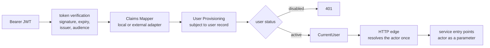
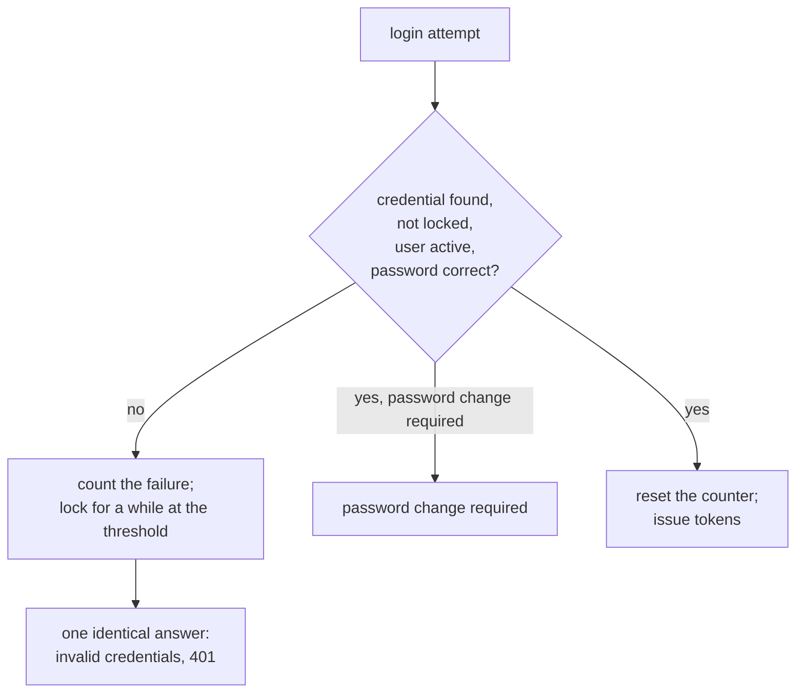
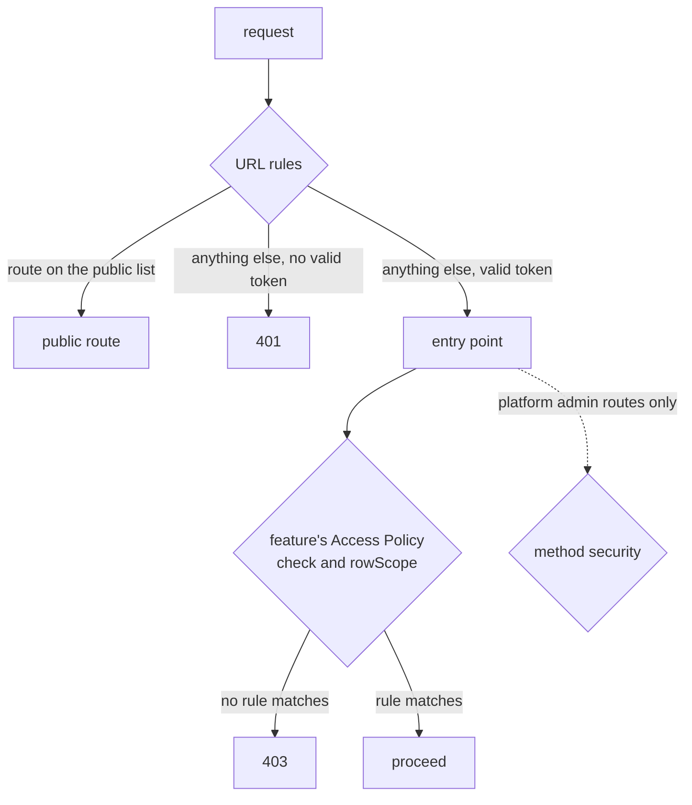

# Identity, Authentication and Authorization

#doc #guide #security #architecture #draft

**Guide:** [[Docs/Guide/Guide-Index]] · **Conventions:** [[Docs/Guide/Guide-Conventions]]

## Purpose

This document says how the application learns who is calling and who decides what the caller may do.
Every request is authenticated by validating a JWT, whoever issued it, and the caller reaches business
code as one small value: the `CurrentUser`. The application can issue its own tokens today and hand
login to an external identity provider later, by removing one module and changing configuration. Each
authorization decision has exactly one owner. The one idea to take away: business code never knows how a
token was issued, and it cannot run without naming the actor it runs for.

## Design

### From a token to the actor



| Module | Responsibility | Interface |
|---|---|---|
| Token verification | Prove the token is genuine and meant for this application | The framework's own resource-server decoder — the convention adds no port around it (G01-03) |
| Claims Mapper | Turn a verified token into provider-neutral claims | `IdentityClaims map(token)` — subject, e-mail, display name, roles (possibly none) |
| User Provisioning | Find the user record of a subject; create it where the mode allows | `User resolve(IdentityClaims)` |
| User Directory | Create and change user records | `create`, `setStatus`, `rebindSubject` |
| Current-user provider | Give the HTTP edge the actor of the request | `CurrentUser current()` — used only at the edge and in adapters (G02-06) |

All of them live in `platform.identity`. Features see none of them: they receive a `CurrentUser`.

### The two identity modes

One setting, `app.identity.mode`, chooses how tokens are verified. Nothing else in the application
changes with it.

| | `local` | `external` |
|---|---|---|
| Who issues tokens | The application's own Token Issuer | An identity provider (for example Clerk or WorkOS) |
| Verification key | The issuer's public key, from configuration | The provider's published key set |
| Issuer and audience | Validated | Validated |
| Token subject | The user's id | The provider's id for the user |
| Claims Mapper adapter | Local: reads the claims this application writes | External: reads the provider's claims; the role claim path is configuration |
| Unknown subject | Refused (401) — a local user exists before its first login | The user record is created on the first request |
| Where roles come from | The user record — written by the local admin surface | The token's claims — the record keeps a read-only mirror |
| Who manages users | The local admin surface of the Token Issuer | The provider's console |

### The user record

`User` is provider-neutral. It holds account state and no credential.

| Field | Meaning |
|---|---|
| id | The identifier every other table refers to. It never changes |
| external subject | Unique. Always equal to the token subject — in both modes |
| e-mail, display name | Contact data; in `external` mode User Provisioning updates them when the claims differ |
| roles | Role names from the project's closed set of roles, stored by name |
| status | `ACTIVE` or `DISABLED` — the application's own ban, checked on every request |

- There is one user record type and no hierarchy of user kinds. Data about a kind of user is a feature
  entity that carries the user id ([[Docs/Guide/07-Domain-Model-and-Persistence]], G07-15).
- Passwords, lock state, failed-attempt counters and refresh tokens are not on `User`. They belong to
  the Token Issuer module and disappear with it.
- **User Provisioning** resolves a user by subject, and by nothing else. In `external` mode it creates
  the record on the first request. That write is safe against two first requests arriving together (the
  unique subject decides; the loser reads the winner's row), and it runs in a transaction of its own,
  never inside the caller's read-only one.
- **User Directory** is the only path that creates or changes a user record. The first-administrator
  bootstrap and the local admin surface both go through it.

| User Directory operation | Does | Refuses |
|---|---|---|
| `create` | Creates a user record with a subject, contact data and roles | A subject that is already bound — conflict |
| `setStatus` | Enables or disables a user | — |
| `rebindSubject` | Binds an existing user to another subject; the id, the roles and every row that refers to the user stay | A subject that is already bound — conflict. It never links two records because their e-mail matches |

`rebindSubject` is a privileged operation: a wrong binding hands one person's account to another. It is
available to administrators only, and every call is recorded with the actor, the user and both subjects.

### CurrentUser and the system actor

```java
// platform.identity — the only identity type service and feature code uses
record CurrentUser(String userId, String subject, Set<String> roles) {
  static CurrentUser system();   // userId = "system", no subject, no role
  boolean isSystem();
}
```

- The HTTP edge — a controller, a request interceptor — resolves the actor **once** and passes it down
  as a parameter (G04-02).
- A scheduled trigger, a worker and the start-up bootstrap pass `CurrentUser.system()`. An operator who
  starts the same work by hand passes their own actor.
- `system` is a reserved word. It can never be the id of a user record, and no token can produce the
  system actor.
- The system actor is an ordinary actor, not a superuser. It goes through the same Access Policy: a
  feature with system work writes a narrow rule for it, and a feature with none denies it
  ([[Docs/Guide/04-CRUD-Base-and-Service-Hooks]]).
- There is no "run as system" and no way to switch the actor for a block of code.
- **Platform housekeeping** — the clean-up of expired idempotency records, of expired refresh tokens —
  touches only tables of `platform` modules. It is outside every Access Policy by the layout rules, and
  it never writes a feature's rows.

### The local Token Issuer

`platform.identity.local` is the module that can be deleted (G02-04). While it exists, it owns login.

| Route | Does | Success |
|---|---|---|
| `POST /api/v1/auth/login` | Checks a login name and a password; issues an access token and a refresh token | 200 |
| `POST /api/v1/auth/refresh` | Exchanges a refresh token for a new access token and a new refresh token | 200 |
| `POST /api/v1/auth/logout` | Revokes a refresh token | 204 |
| `POST /api/v1/auth/password` | Replaces a password, given the login name and the current password | 204 |
| `/api/v1/auth/users/…` (administrators) | Create a user, disable or enable it, assign roles, set a password, require a password change | 201, 200 or 204 |

It owns two tables, created by its own migrations (G07-03):

| Table | Holds |
|---|---|
| `LocalCredential` | user id, login name (unique), password hash, failed-attempt counter, locked-until, must-change-password |
| `RefreshToken` | user id, token hash, expiry, revoked-at |

- **Access tokens** are short-lived and signed with the private half of an asymmetric key pair that comes
  from configuration. Subject = user id; issuer and audience are set. The key has one purpose.
- **Refresh tokens** are opaque random values. Only their hash is stored. Each use replaces the token; a
  used, revoked or expired token is refused, and so is the token of a user who has been disabled.
- **Passwords** are stored as the output of an adaptive one-way encoder that can be upgraded without
  resetting passwords. A password is never derived from other data.
- **Creating a local user** writes the user record (through the User Directory) and its credential in
  one transaction that the operation declares (G04-15).
- **The first administrator** is created once, at start-up, through the User Directory, from credentials
  supplied by configuration, with a password change required. If no administrator exists and the
  configuration supplies none, the application does not start.
- A credential that must change its password cannot log in; the password route is its way forward.

#### Login failures



Brute-force protection is three contracts, each with one owner:

| Contract | Owner | What it does |
|---|---|---|
| Credential failure policy | `LocalCredential` | Counts failed attempts; after the configured threshold the credential is locked for the configured time; a success resets the counter |
| One answer for every credential failure | The error contract ([[Docs/Guide/09-Errors-and-Validation]]) | An unknown login name, a wrong password, a locked credential and a disabled user get the same response |
| Request throttling per client address | **The deployment layer** — a gateway or a firewall in front of the application | Limits how fast one address may try |

The third is not part of the application. A counter per address kept inside the application is wrong as
soon as two instances run. The convention therefore states the assumption and names what is left
uncovered when no such layer exists: **password spraying** — a few common passwords tried against many
login names — is not stopped by a per-credential lockout.

### Authorization: one owner per decision



| Decision | Owner | Never decided by |
|---|---|---|
| Is this route public or authenticated? | The URL rules in `platform.access`: one explicit public list, and "everything else is authenticated" as the last rule | A feature; an annotation |
| May this actor do this action, to this row? | The feature's Access Policy (G04-07) | URL rules; method-security annotations (G02-05) |
| Which rows may this actor see? | The Access Policy's Row Scope ([[Docs/Guide/06-Query-Engine]]) | A filter the client sends |
| May this actor use a platform admin route? | Method security, switched on once on the security configuration | A feature |

**The public list** is closed and written in one place. It contains:

- the Token Issuer's login, refresh, logout and password routes (while the module exists);
- the download redemption route — **public by capability**: the ticket is the credential
  (`10-Object-Storage-and-Uploads`);
- the health endpoint the deployment needs (`14-Observability-and-Operations`).

Whether the API description (G05-13) is public is a project decision, recorded where the list is.

**The administrator role.** Role names belong to the project, so the platform cannot know which one
administers users. The project names its administrator role in typed configuration, and the platform's
admin routes — the administration of local users, `rebindSubject` — require that role.

A platform module adds its routes to the list through a small contribution contract in `platform.access`
— a `PublicRoutes` port with one adapter per contributing module — so `platform.access` never depends on
`platform.identity.local` (G02-04). A feature does not contribute to the list. The convention defines no
anonymous actor: a feature that must serve callers with no token is outside this contract, and the
project records that decision as an ADR of its own.

**Deny by default holds at three layers:** the URL rules end with "authenticated"; an Access Policy with
no matching rule denies (G04-08); and the CRUD base cannot be constructed without a policy (G04-01).

**Sessions.** The application keeps no server-side session. A token travels in the `Authorization`
header and nowhere else.

### CORS

Allowed origins come from typed configuration ([[Docs/Guide/01-Principles-and-Baseline]], G01-05). The
security chain uses the one configured source of CORS settings — it does not build a second one. The
application refuses to start when the origins are a wildcard and credentials are allowed. The developer
origin exists only in the `local` profile; the default is no cross-origin access.

### Moving login to an external provider

A runbook, not a rewrite:

1. Export users and roles.
2. Create the accounts at the provider; configure the role claim.
3. For each user, `rebindSubject(userId, providerSubject)`.
4. Disable every user that was not rebound.
5. Delete `platform.identity.local` and its migrations' tables.
6. Set `app.identity.mode=external` with the provider's issuer, audience and key-set location.

No feature changes: every foreign key points at the user id, which did not move.

## Rules

### G08-01
**Rule:** Every request to a route that is not public is authenticated by validating a JWT as an OAuth 2
resource server, with the token verification the framework provides. The project writes no token filter
of its own and adds no port around the verification.
**Why:** Hand-written token handling is where the reference defects live: a missing header became a
server error, the filter ran twice, and claims were trusted with no check.
**Evidence:** BE-R01-07, WP-R01-08, BT-R01-08, BT-R01-09, BE-R01-09, WP-R01-14 · ADR-006
**Differs from references:** All three projects parsed tokens in a filter of their own and registered
it twice; in BugTracker a request with no token ended in a server error.

### G08-02
**Rule:** Token verification checks the signature, the expiry, the issuer and the audience, in both
identity modes. One setting chooses the mode — the application's own public key, or the key set an
external provider publishes — and nothing else in the application depends on it.
**Why:** A token that is not checked for issuer and audience is accepted from any party that can sign
with a known key, and for any application.
**Evidence:** BE-R01-07, WP-R01-08, BT-R01-10 · ADR-006
**Differs from references:** None of the reference projects checked the issuer; there was no audience.

### G08-03
**Rule:** A verified token is turned into provider-neutral claims — subject, e-mail, display name, roles
— by the Claims Mapper, a port with one adapter per token source. A token with no roles is valid input.
**Why:** Providers put roles in different claims, or in none. Without one mapping point, that difference
reaches every place that reads a role.
**Evidence:** BE-R01-07, WP-R01-08 · ADR-006
**Differs from references:** The reference filters read their own claim names straight from the token and
built the caller's authorities from them.

### G08-04
**Rule:** The external subject of a user record always equals the token subject, in both identity modes;
in local mode the subject is the user's id, with no prefix. A user is found by subject and by nothing
else.
**Why:** A subject that does not identify the user forces a second lookup key, and a second key — a
user name, an e-mail — is one that two users can share.
**Evidence:** BE-R01-07, BT-R01-10, BT-R01-06 · ADR-007
**Differs from references:** Every reference token carried the same constant subject and named the user
in a custom claim; BugTracker's login picked an arbitrary match when two users shared a name.

### G08-05
**Rule:** `CurrentUser` — user id, subject, roles — is the only identity type that service code and
feature code use. They never see a token, a claim, a credential or the user record.
**Why:** Code that reads the token or the user record depends on how login works today, and breaks when
login moves.
**Evidence:** BE-R09-07 · ADR-006
**Differs from references:** A shared tool in `backend/` looked the caller up in the admin and client
repositories and had one method per kind of user.

### G08-06
**Rule:** The system actor is a `CurrentUser` whose user id is the reserved word `system`. That word can
never be the id of a user record, no token can produce the system actor, and it carries no role.
**Why:** If a token or a user record could yield the system actor, every narrow system rule would be a
door for a caller.
**Evidence:** ADR-006, ADR-005
**Differs from references:** The reference projects had no system actor: scheduled work ran with no
identity at all.

### G08-07
**Rule:** There is no way to switch the actor for a block of code. Housekeeping that belongs to a
Platform Module touches only that module's own tables and never writes a row of a feature.
**Why:** An ambient switch is a superuser that any code path can reach; housekeeping that writes feature
rows would bypass the feature's Access Policy and its audit fields.
**Evidence:** ADR-006, ADR-004
**Differs from references:** None of the reference projects named an actor for work that runs outside
a request, so nothing separated housekeeping from business writes.

### G08-08
**Rule:** There is one user record type, provider-neutral: id, external subject (unique), e-mail, display
name, roles, status. There is no hierarchy of user kinds.
**Why:** A hierarchy of user kinds makes a name unique only inside one kind, gives subtypes conflicting
identifiers and turns the deletion of a user into a cascade.
**Evidence:** BT-R01-06, BT-R03-02, BT-R03-11 · ADR-007
**Differs from references:** All three projects modelled each kind of user as a subclass of a base user
entity.

### G08-09
**Rule:** The user record holds no credential. Password hashes, lock state, failed-attempt counters and
refresh tokens belong to the local Token Issuer module, in tables its own migrations create.
**Why:** A credential column on the user record stays behind, empty and misleading, when login moves to
a provider — and it travels with every query that loads a user.
**Evidence:** BE-R01-03, WP-R01-05 · ADR-007, ADR-006
**Differs from references:** The reference user entity carried the password hash and the account flags,
and a repository-export library was set to publish that entity.

### G08-10
**Rule:** The status of the user record is checked on every request, in both identity modes. A disabled
user is refused as not authenticated, even with a token that is still valid, and the roles in force are
the ones of the mode's role writer at the time of the request.
**Why:** With trust in claims only, a disabled or demoted user keeps full access until the token
expires.
**Evidence:** BE-R01-07, WP-R01-08, BT-R01-10, BE-R01-08 · ADR-007
**Differs from references:** The reference filters rebuilt the caller from the token's claims and never
looked at the user again: a deleted or demoted user kept access for a day, or for ten.

### G08-11
**Rule:** A user record is created on first request only in external mode; in local mode an unknown
subject is refused. The creation is safe when two first requests arrive together and runs in a
transaction of its own, never in the caller's.
**Why:** Without the unique subject as the arbiter, two first requests create two users for one person;
inside the caller's read-only transaction the write fails or is lost.
**Evidence:** BT-R01-06 · ADR-007
**Differs from references:** The reference projects had no external identity: every user was created by
an administrator or by a seed.

### G08-12
**Rule:** The User Directory — create, set status, rebind subject — is the only path that creates or
changes a user record. Rebinding is for administrators only, is recorded with its actor, fails with a
conflict when the subject is already bound, and never links two records because their e-mail matches.
**Why:** A second creation path skips the rules of the first, and an automatic link by e-mail gives an
account to whoever controls that address at the provider.
**Evidence:** BE-R01-04, BE-R03-01, BT-R01-04 · ADR-007
**Differs from references:** The reference seed created its administrator beside the service that held
the creation rules; BugTracker created users from a form that carried their roles.

### G08-13
**Rule:** Role names are a closed set the project defines, and each identity mode has exactly one writer
of a user's roles: the local admin surface in local mode, the token's claims in external mode. No request
grants its own caller a role, and a role that is not in the set is rejected.
**Why:** Two writers of one fact disagree. A role taken from the body of a request is a role the caller
chose.
**Evidence:** BT-R01-04, BT-R03-10, BE-R03-03 · ADR-007
**Differs from references:** BugTracker accepted roles in the user form from any authenticated caller and
stored them as free text.

### G08-14
**Rule:** The local Token Issuer offers login, refresh, logout, password change and the administration
of local users, and owns its credential and refresh-token tables through its own migrations. Its routes
sit under the versioned API prefix.
**Why:** A login surface that grows — sessions, policies, second factors — cannot be deleted when login
moves to a provider. Tables it does not own are left behind.
**Evidence:** BE-R01-07, BT-R01-10 · ADR-006, ADR-010
**Differs from references:** The reference projects had login only: no refresh, no logout, and the token
code could not be separated from the token checking.

### G08-15
**Rule:** An access token is short-lived and is signed with an asymmetric key pair read from
configuration. The key has no literal value and no fallback anywhere, the application does not start
without it, and it is used for nothing else.
**Why:** A fallback key in the source is a key everyone has. One key for two purposes means rotating one
breaks the other.
**Evidence:** BE-R01-05, BE-R01-11, WP-R01-07, BT-R01-03, BT-R01-10 · ADR-006
**Differs from references:** The reference tokens lived for one day or ten and were signed with a
symmetric secret — a literal in BugTracker, a literal fallback in wpmanager. `backend/` used its signing
secret to derive passwords as well.

### G08-16
**Rule:** A refresh token is an opaque random value of which only a hash is stored. Each use replaces it
with a new one; a token that was used, revoked by logout or expired is refused, and so is any refresh
token of a disabled user.
**Why:** Without refresh and revocation the only way to end a session is to wait for the access token to
expire — so access tokens are made long-lived, and a stolen one works for days.
**Evidence:** BE-R01-07, WP-R01-08, BT-R01-10 · ADR-006
**Differs from references:** None of the reference projects had a refresh token, a logout or any
revocation.

### G08-17
**Rule:** A password is stored only as the output of an adaptive one-way encoder that can be upgraded
without a reset. A password is never derived from other data and never appears in a response or a log.
**Why:** A password computed from an e-mail and a server secret can be computed by anyone who holds the
secret, for every user at once, and cannot be changed for one user.
**Evidence:** BE-R01-06, WP-R01-10 · ADR-006, ADR-007
**Differs from references:** `backend/` and wpmanager derived each client's password from the client's
e-mail and a shared secret.

### G08-18
**Rule:** A token is issued only to a caller who has just proved the credential of that same user. No
route issues a token for another user.
**Why:** A route that hands out a token for a named user is impersonation with one request.
**Evidence:** BE-R01-02, WP-R01-10 · ADR-006
**Differs from references:** `backend/` returned a signed token for any client whose user name the caller
knew.

### G08-19
**Rule:** A login is refused when the credential is locked or the user is disabled, and a test proves
both. The component that exposes a credential to the framework's login must report those two states
itself — it never relies on a default.
**Why:** The framework's defaults say "not locked" and "enabled". An adapter that does not answer the
question compiles, and every lock and every ban is ignored.
**Evidence:** BE-R01-08, WP-R01-09, BT-R01-11 · ADR-006
**Differs from references:** All three projects stored account flags and ignored them at login.

### G08-20
**Rule:** Failed logins are counted per credential. After a configured number of failures the credential
is locked for a configured time, and a successful login resets the count.
**Why:** Without a failure policy a password can be guessed at the speed of the network.
**Evidence:** BE-R01-08, BT-R01-11 · ADR-006
**Differs from references:** The reference projects had no failure policy; BugTracker had no way to lock
an account at all.

### G08-21
**Rule:** An unknown login name, a wrong password, a locked credential and a disabled user receive one
identical response.
**Why:** A different answer for "no such user" or "locked" tells an attacker which names exist and which
are worth trying again later.
**Evidence:** BT-R01-12 · ADR-006, ADR-009
**Differs from references:** BugTracker raised a different internal failure for an unknown user name.

### G08-22
**Rule:** Throttling requests per client address is a responsibility of the deployment layer, and the
application implements none. The project's own documentation states that assumption and names password
spraying as the risk that remains without it.
**Why:** A per-address counter inside the application is wrong with two instances. A protection that is
assumed and never written down is a protection nobody checks.
**Evidence:** ADR-006
**Differs from references:** The reference projects had no throttling and did not say so.

### G08-23
**Rule:** The first administrator is created once, at start-up, through the User Directory, from
credentials that configuration supplies, with a password change required. When no administrator exists
and none is supplied, the application does not start.
**Why:** A seeded administrator with a password in the source is a known account on every deployment.
**Evidence:** BE-R01-04, WP-R01-07, BT-R01-03 · ADR-006
**Differs from references:** All three projects seeded an administrator with a literal password.

### G08-24
**Rule:** CORS allowed origins come from typed configuration and never from a literal. The security
chain uses the single configured CORS source; the application does not start with wildcard origins
together with credentials; the developer origin exists only in the local profile.
**Why:** An origin in the source needs a rebuild per environment, and a second CORS source built beside
the configured one silently wins.
**Evidence:** BE-R01-10, WP-R01-13 · ADR-006
**Differs from references:** `backend/` and wpmanager hard-coded one developer origin and called their
own factory method instead of using the source they were given.

### G08-25
**Rule:** URL rules decide one thing: whether a route is public or authenticated. They consist of one
explicit list of public routes followed by "every other request is authenticated", and they carry no
role rule.
**Why:** With no rule every route is anonymous; with role rules in the URL layer, authorization has two
homes and the two drift.
**Evidence:** BE-R01-01, WP-R01-01, BT-R01-01 · ADR-006
**Differs from references:** `backend/` and wpmanager had no URL rule at all, so every route without an
annotation was anonymous; BugTracker required a login and nothing more.

### G08-26
**Rule:** The public list is closed and written in one place: the Token Issuer's routes, the download
redemption route, and the operational endpoints the project names. A Platform Module adds its routes
through the contribution contract of the access module; a Feature Module adds none.
**Why:** A route that becomes public because its author forgot something is found by an attacker before
it is found by a review.
**Evidence:** WP-R01-02, WP-R01-01, BE-R01-01 · ADR-006, ADR-013
**Differs from references:** wpmanager shipped a diagnostic controller through which anonymous callers
could upload, overwrite, delete and download stored objects.

### G08-27
**Rule:** Method security is switched on exactly once, on the security configuration, and guards
Platform Module routes only — the administration of local users. It is never the way a feature states
who may do what.
**Why:** A switch that sits on a service disappears with that service, and every annotation in the
project stops working without one failing test.
**Evidence:** WP-R01-11, BE-R01-01, WP-R01-15 · ADR-006, ADR-005
**Differs from references:** wpmanager switched method security on from three services; `backend/` lost
the switch when it deleted them, and its annotations became inert.

### G08-28
**Rule:** The application keeps no server-side session, and a token is accepted only in the
authorization header as a bearer token.
**Why:** A token accepted in more than one form is checked by more than one code path, and state on the
server ties a caller to one instance.
**Evidence:** BE-R01-07, BT-R01-08 · ADR-006
**Differs from references:** `backend/` accepted a token with or without the bearer prefix; BugTracker
parsed a basic-authentication header as a token on any route but login.

### G08-29
**Rule:** Moving login to an external provider changes configuration and subject bindings only: rebind
each user, disable the users that were not rebound, delete the local Token Issuer, set the mode. No
Feature Module changes, and no row that refers to a user is rewritten.
**Why:** If the move re-created users, every foreign key to a user would point at a record that no
longer logs in.
**Evidence:** ADR-006, ADR-007
**Differs from references:** The reference projects could not move: issuing, checking and the user model
were one package.

## Differs From the Reference Projects

- Token checking is the framework's, with issuer and audience (G08-01, G08-02; BE-R01-07, WP-R01-08,
  BT-R01-10). The reference projects parsed tokens by hand.
- The subject identifies the user (G08-04; BE-R01-07).
- The user's status and roles are read on every request (G08-10; BE-R01-07, WP-R01-08).
- One user record, no hierarchy, no credential on it (G08-08, G08-09; BT-R01-06, BT-R03-02).
- Roles have one writer and a closed set of names (G08-13; BT-R01-04, BT-R03-10).
- Login can be removed (G08-14, G08-29; ADR-006), tokens are short-lived with refresh and logout
  (G08-15, G08-16; BT-R01-10), and passwords are real passwords (G08-17; BE-R01-06).
- Account flags are honoured and failures are counted (G08-19, G08-20; BE-R01-08, WP-R01-09, BT-R01-11).
- No literal secret, key or seed password (G08-15, G08-23; BE-R01-04, WP-R01-07, BT-R01-03).
- Routes are authenticated unless listed (G08-25, G08-26; BE-R01-01, WP-R01-01, WP-R01-02).
- Method security has one switch and one narrow use (G08-27; WP-R01-11).
- CORS is configuration (G08-24; BE-R01-10, WP-R01-13).
- New, with no counterpart in the reference projects: the system actor (G08-06), the Claims Mapper
  (G08-03), provisioning on first request (G08-11) and the declared deployment-layer throttle (G08-22).

## Version Notes

- **verified on 4.1.x** — Spring Security 7.1 builds a resource-server decoder from a public key with
  `NimbusJwtDecoder.withPublicKey` and from a key set with `NimbusJwtDecoder.withJwkSetUri`; issuer and
  audience checks are `OAuth2TokenValidator` instances (`JwtValidators.createDefaultWithIssuer`,
  `JwtClaimValidator`) combined with `DelegatingOAuth2TokenValidator` and set with `setJwtValidator`;
  the chain is configured with `oauth2ResourceServer` and its `jwt` customizer, which accepts a decoder
  and a `jwtAuthenticationConverter`. Evidence:
  https://docs.spring.io/spring-security/reference/7.1/servlet/oauth2/resource-server/jwt.html
- **verified on 4.1.x** — in Spring Security 7.1 the default authorities of a JWT come from the `scope`
  claim with the prefix `SCOPE_`; another claim is read with a `JwtGrantedAuthoritiesConverter`. The
  Claims Mapper replaces that default. Evidence:
  https://docs.spring.io/spring-security/reference/7.1/servlet/oauth2/resource-server/jwt.html
- **verified on 4.1.x** — the URL rules are written with `authorizeHttpRequests`:
  `requestMatchers(…).permitAll()` for the public list and `anyRequest().authenticated()` as the last
  rule; the authorization filter runs on every dispatch, error dispatches included. Evidence:
  https://docs.spring.io/spring-security/reference/7.1/servlet/authorization/authorize-http-requests.html
- **verified on 4.1.x** — method security is switched on with `@EnableMethodSecurity` on a configuration
  class and is not active without it; `@Secured` and the JSR-250 annotations need `securedEnabled` and
  `jsr250Enabled`. Evidence:
  https://docs.spring.io/spring-security/reference/7.1/servlet/authorization/method-security.html
- **verified on 4.1.x** — the chain takes its CORS settings from a `CorsConfigurationSource` given to
  `cors(…)`; with more than one such bean nothing is chosen automatically. Evidence:
  https://docs.spring.io/spring-security/reference/7.1/servlet/integrations/cors.html
- **verified on 4.1.x** — `isAccountNonLocked()`, `isEnabled()`, `isAccountNonExpired()` and
  `isCredentialsNonExpired()` of `UserDetails` are `default` methods that return `true`. Evidence:
  https://github.com/spring-projects/spring-security/blob/7.1.1/core/src/main/java/org/springframework/security/core/userdetails/UserDetails.java
- **verified on 3.4.x** — an adapter that defines `getEnabled()` instead of overriding `isEnabled()`
  compiles and ignores the flag. Evidence: BE-R01-08
- **verified on 3.4.x** — method security switched on from a service class works for the whole
  application and stops when that class is deleted. Evidence: WP-R01-11
- **not verified** — current-docs lookup at execution time: the properties of the resource-server
  auto-configuration (`spring.security.oauth2.resourceserver.jwt.*`) and whether the project uses them
  or declares its decoder itself to bind the two modes to `app.identity.mode`.
- **not verified** — current-docs lookup at execution time: where the per-request user lookup and status
  check hook into the chain (a converter from the verified token to the authentication), and how a
  refusal there is reported as 401.
- **not verified** — current-docs lookup at execution time: how an access token is signed with a private
  key on this line (an encoder for the same token library the decoder uses).
- **not verified** — current-docs lookup at execution time: the delegating password encoder and its
  default algorithm.
- **not verified** — current-docs lookup at execution time: that a wildcard origin with credentials is
  rejected by the framework's own CORS configuration check, in addition to the application's start-up
  check.
- **not verified** — current-docs lookup at execution time: that a servlet filter declared as a bean is
  also registered with the container, which is how a token filter came to run twice in the reference
  projects.
- **not verified** — current-docs lookup at execution time: how the session policy is set to stateless
  and whether request-forgery protection is then switched off for a bearer-token API.

## Related Documents

- [[Docs/Guide/02-Project-Layout-and-Module-Boundaries]] — `platform.identity`, `platform.identity.local`
  and `platform.access`; the rules that keep the Token Issuer removable (G02-04) and annotations out of
  features (G02-05).
- [[Docs/Guide/04-CRUD-Base-and-Service-Hooks]] — the Access Policy, which owns all feature
  authorization, and the actor parameter.
- [[Docs/Guide/05-API-Contract]] — the versioned prefix; no exported repositories (G05-10).
- [[Docs/Guide/06-Query-Engine]] — the Row Scope.
- [[Docs/Guide/07-Domain-Model-and-Persistence]] — references to a user by id; actor labels.
- [[Docs/Guide/09-Errors-and-Validation]] — the 401 and 403 responses and the one answer for credential
  failures.
- `10-Object-Storage-and-Uploads` — planned: the download redemption route.
- `12-Configuration-and-Secrets` — planned: the signing key, the bootstrap credentials and the CORS
  origins as typed configuration.
- `13-Testing-Strategy` — planned: the route × role matrix and the route-coverage test.
- [[ADRs/ADR-006-identity-current-user-seam-and-removable-local-issuer|ADR-006]] — the identity seam.
- [[ADRs/ADR-007-single-user-keyed-by-token-subject|ADR-007]] — the user model and the User Directory.
- [[ADRs/ADR-005-deepened-crud-base-with-access-policy|ADR-005]] — the Access Policy.
- [[ADRs/ADR-008-no-multi-tenancy-in-the-base-project|ADR-008]] — ownership only.
