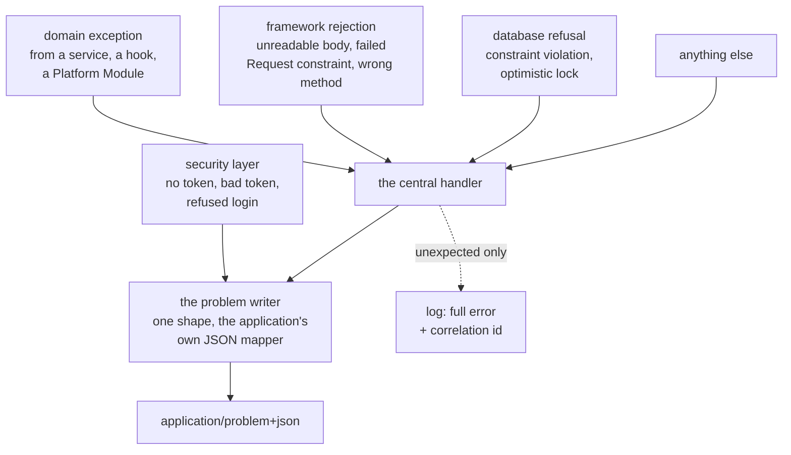

# Errors and Validation

#doc #guide #error-handling #api-design #draft

**Guide:** [[Docs/Guide/Guide-Index]] · **Conventions:** [[Docs/Guide/Guide-Conventions]]

## Purpose

This document is the application's one failure model, from the place a rule is broken to the bytes a
client reads. Code reports a failure by raising an unchecked domain exception that knows its own status
and its own problem type. One handler turns every failure — a domain exception, a rejected input, a
refused login, an unexpected crash — into one response shape, the RFC 9457 problem detail. The one idea
to take away: a client switches on the `type` of a problem, never on its text, and every `type` means
exactly one thing.

## Design

### The exception hierarchy

Design sketch in Java-like notation. It fixes names and shapes of this convention, not framework syntax.

```java
// platform.errors
abstract class DomainException extends RuntimeException {
  ErrorCode code();                 // status + problem type + title — fixed per kind
}
record ErrorCode(int status, String type, String title) {}
```

| Kind | Status | Problem type | Raised when |
|---|---|---|---|
| `InvalidRequest` | 400 | `/problems/invalid-request` | Code — not the framework — finds the request invalid by itself |
| `NotFound` | 404 | `/problems/not-found` | The row does not exist or is outside the actor's Row Scope |
| `Forbidden` | 403 | `/problems/forbidden` | No Access Policy rule allows the action |
| `Conflict` | 409 | `/problems/conflict` | The request conflicts with the state of the resource |
| `PreconditionFailed` | 412 | `/problems/precondition-failed` | The write precondition names a version that is not current |
| `PreconditionRequired` | 428 | `/problems/precondition-required` | A write that needs a precondition came without one |
| `BusinessRuleViolation` | 422 | `/problems/business-rule-violation` | The request is valid in itself and a rule of the domain refuses it |

- Every kind is unchecked, so a transaction rolls back when one is raised (G04-16).
- A Platform Module or a feature may declare a **subtype** of a kind with its own problem type, when a
  client must react differently. The status is always the kind's. The subtypes the platform declares
  are in the registry below.
- A domain exception carries a message for the `detail` field and, when useful, named values (the field
  in question, the id that was not found). It carries no status of its own and no response object.

### The problem detail

Every error response has this body and the media type `application/problem+json`:

```json
{
  "type": "/problems/validation-failed",
  "title": "The request is not valid",
  "status": 400,
  "detail": "2 fields are not valid.",
  "instance": "/api/v1/notes",
  "correlationId": "0f8c2c1e-6c1b-4a5e-9d0e-0d0f3a5b7c11",
  "errors": [
    { "field": "title",   "message": "must not be blank" },
    { "field": "dueDate", "message": "must be a date in the future" }
  ]
}
```

| Member | Meaning | Stable? |
|---|---|---|
| `type` | Identifies the failure. The value a client switches on | Yes — never changes once published |
| `title` | A short name of the type, the same for every occurrence | Yes |
| `status` | The HTTP status, repeated | Yes |
| `detail` | What went wrong this time, for a person | No — wording may change |
| `instance` | The path of the request | — |
| `correlationId` | The id under which the server logged this failure | — |
| `errors` | Only for the two input types below: one entry per violation, each with `field` and `message` | The member is stable; messages are not |

`detail` and `errors` never contain a secret, an internal message, a class name, a statement or data of
another user.

### The registry of problem types

One table for the whole application. A type is the path `/problems/<name>`; it is an identifier and is
the same in every environment.

| Type | Status | Meaning | Declared by |
|---|---|---|---|
| `about:blank` | 405, 406, 415 and other protocol errors | A failure the framework answers before a controller is reached; the status says it all | the framework |
| `/problems/invalid-request` | 400 | Unreadable body, wrong type, missing required parameter or header, a date-time without a zone | `platform.errors` |
| `/problems/validation-failed` | 400 | One or more Request constraints failed; `errors` lists them all | `platform.errors` |
| `/problems/invalid-query` | 400 | A list or search request names an unknown field or operator, a value of the wrong type, or exceeds a bound; `errors` lists them all | `platform.query` |
| `/problems/unauthenticated` | 401 | No token, an invalid or expired token, or a disabled user | `platform.access` |
| `/problems/invalid-credentials` | 401 | A login or a refresh that failed — one answer for every cause | `platform.identity.local` |
| `/problems/password-change-required` | 401 | The credential is correct and must be replaced before a token is issued | `platform.identity.local` |
| `/problems/forbidden` | 403 | No Access Policy rule allows the action | `platform.errors` |
| `/problems/not-found` | 404 | No such resource, or not visible to the caller; also an unknown, tampered or orphaned download ticket | `platform.errors` |
| `/problems/conflict` | 409 | A conflict with the state of the resource: a duplicate of a unique value, an already-bound subject, a delete that dependants prevent | `platform.errors` |
| `/problems/request-in-progress` | 409 | The same idempotency key is being processed right now | `platform.idempotency` |
| `/problems/ticket-expired` | 410 | An expired download ticket | `platform.storage` |
| `/problems/precondition-failed` | 412 | A stale write precondition, or a concurrent write refused at flush | `platform.errors` |
| `/problems/business-rule-violation` | 422 | A rule of the domain refuses a request that is valid in itself; also a reference to something that does not exist | `platform.errors` |
| `/problems/idempotency-fingerprint-mismatch` | 422 | The idempotency key was used before with a different request | `platform.idempotency` |
| `/problems/content-digest-mismatch` | 422 | The declared digest is not the digest of the bytes received | `platform.storage` |
| `/problems/content-type-mismatch` | 422 | The bytes received are not of the declared content type | `platform.storage` |
| `/problems/precondition-required` | 428 | A conditional write without its precondition | `platform.errors` |
| `/problems/internal-error` | 500 | An unexpected failure; `detail` is generic | `platform.errors` |

The rows declared by `platform.storage` and `platform.idempotency` are specified in
[[Docs/Guide/10-Object-Storage-and-Uploads]] and [[Docs/Guide/11-Idempotency]]. A feature that needs a
type of its own adds a row to its project's registry and declares a subtype; the statuses stay those of
[[Docs/Guide/05-API-Contract]] (G05-05).

### One handler, one writer



- **The central handler** is the only place that turns an exception into a response. It maps a domain
  exception by its error code, the framework's own request exceptions to the input types, a database
  constraint violation to `conflict`, a refused optimistic lock to `precondition-failed` (G04-13), and
  everything else to `internal-error`.
- **The problem writer** is the only code that builds an error body. The handler uses it, and so does
  the security layer, which answers before any controller exists for the request. It uses the
  application's configured JSON mapper.
- **The catch-all** logs the full error with the correlation id and answers with a generic detail. The
  log has the cause; the client has the id.
- No general-purpose exception type — an illegal argument, an illegal state, a null dereference — is
  mapped to a client error. Such an exception is a defect of the server and is answered as one.

### Validation

Validation happens in three places, each with one job.

| Where | What it checks | Needs server state? | Failure |
|---|---|---|---|
| The HTTP edge, before the service is called | The Request by itself: required, length, format, range — the constraints declared on the Request (G03-05) | No | 400 `validation-failed`, every violation in one answer |
| The service hooks | The Request against the data: a business rule, a reference that must exist | Yes | 422 `business-rule-violation`, or 409 `conflict` for a duplicate |
| The database | What must hold even when two requests race: uniqueness, foreign keys ([[Docs/Guide/07-Domain-Model-and-Persistence]], G07-13) | Yes | 409 `conflict` |

- A constraint says what a value must be — its length, its format, its range. Input is never checked
  against a list of forbidden words. Queries are parameterised, which is what keeps input from becoming a
  statement.
- A Request refers to another resource by id. An id that does not resolve is a failed rule (422); it is
  never skipped in silence.
- The same rule gives the same answer wherever it is broken: a duplicate is `conflict` on create and on
  update.

### The order of failures

When several failures apply to one request, the client sees the first of this list:

1. **401** — the request is not authenticated ([[Docs/Guide/08-Identity-Authentication-and-Authorization]]).
2. **400** — the request is invalid by itself: unreadable, or a Request constraint failed.
3. **404, 403, 428, 412** — the order of checks of the entry point (G04-11).
4. **422, 409** — a hook refuses the change.
5. **409, 412** — the database refuses the write.

Step 2 comes before step 3 because the framework validates the Request before the service is called. It
reveals nothing about any row: the answer depends on the request alone.

### Which failure the CRUD base raises

| Situation in the base ([[Docs/Guide/04-CRUD-Base-and-Service-Hooks]]) | Kind |
|---|---|
| Scoped load finds no row | `NotFound` |
| The Access Policy has no rule | `Forbidden` |
| No write precondition | `PreconditionRequired` |
| The precondition names an older token; or the flush is refused | `PreconditionFailed` |
| A hook refuses | `BusinessRuleViolation` or `Conflict`, as the hook decides |
| A unique or foreign-key constraint fails at flush | `Conflict` |
| The list engine rejects the request ([[Docs/Guide/06-Query-Engine]]) | `InvalidRequest`, type `invalid-query` |

## Rules

### G09-01
**Rule:** Every failure a service, a hook or a Platform Module reports is an unchecked domain exception
of one hierarchy. Each kind carries its error code — status, problem type, title — and the kinds are:
invalid request, not found, forbidden, conflict, precondition failed, precondition required, business
rule violation.
**Why:** Exceptions with no common base need a handler each and a rollback entry each; one forgotten
entry commits a transaction that failed.
**Evidence:** BE-R05-01, BT-R07-04, BT-R07-02, BE-R02-07 · ADR-009
**Differs from references:** `backend/` had five checked exceptions with no common base; BugTracker's
checked exceptions committed partial work when thrown.

### G09-02
**Rule:** Every error response is an RFC 9457 problem detail with the members of this document — type,
title, status, detail, instance and a correlation id — served as the problem media type. The API has no
other error body.
**Why:** A home-made error body cannot be read by standard tooling, and a second body for unexpected
failures means every client needs two parsers.
**Evidence:** BE-R05-06, BT-R07-05, WP-R08-06, BE-R05-03 · ADR-009
**Differs from references:** All three projects returned a body of their own design; unexpected failures
left it and used the framework's default body.

### G09-03
**Rule:** Each failure shape has its own problem type, and a type has exactly one meaning and one
status. A client switches on the type; the detail text is for people and may change.
**Why:** When two failures share an answer, a client reads the message to tell them apart, and the next
rewording breaks it.
**Evidence:** BE-R04-05, WP-R04-01, BT-R07-01 · ADR-009
**Differs from references:** The reference bodies had no type. One conflict returned 409 on create and
400 on update; every failure inside an upload returned 500.

### G09-04
**Rule:** The problem types of an application are listed in one registry. A type is a stable identifier
of the form `/problems/<name>` that is the same in every environment and is never renamed or reused
once published; a new failure shape gets a new entry.
**Why:** A type that changes with the environment or with a release is a type no client can switch on.
**Evidence:** WP-R08-06, BE-R05-06 · ADR-009
**Differs from references:** None of the reference projects had an identifier for a kind of error.

### G09-05
**Rule:** One central handler turns every failure into a response: a domain exception by its error code,
the framework's request exceptions as invalid input, and anything else as an internal error. No
controller, service or filter builds an error response of its own.
**Why:** Each missing mapping is a failure that leaves the contract — a 500 for a user's mistake, or
another body.
**Evidence:** BE-R05-03, WP-R08-01, BT-R07-01, BT-R01-13 · ADR-009
**Differs from references:** BugTracker mapped one exception and answered 500 for the rest;
`backend/` and wpmanager handled a fixed list and nothing the framework itself raises.

### G09-06
**Rule:** An unexpected failure answers 500 with a generic detail and a correlation id. The full error
is logged under that id, and no message, class name, statement or vendor name from the failure reaches
the client.
**Why:** Internal messages tell a caller how the server is built, and sometimes whose data it holds.
**Evidence:** BE-R05-04, WP-R08-02, BT-R01-13 · ADR-009
**Differs from references:** `backend/` and wpmanager returned the exception's own message on a 500;
in wpmanager that included the storage vendor's diagnostics.

### G09-07
**Rule:** Only a domain exception or a framework request exception produces a client error. A
general-purpose exception type is never mapped to one.
**Why:** A blanket mapping reports the server's own defects — and those of its libraries — to the client
as the client's mistake.
**Evidence:** BE-R05-04, WP-R08-02, BT-R06-13
**Differs from references:** `backend/` and wpmanager answered 400 for any illegal-argument exception,
whoever raised it.

### G09-08
**Rule:** Authentication and authorization failures are written by the same problem writer as every
other failure, with the application's configured JSON mapper. A request with a missing or malformed
token answers 401, never 500.
**Why:** The security layer answers before a controller exists for the request, so it is where a second
error format is born.
**Evidence:** BE-R05-02, WP-R08-07, BE-R09-08, BT-R01-08 · ADR-009
**Differs from references:** The reference projects built the error body in three or four places, the
security ones with a JSON mapper made by hand; in BugTracker a request with no token ended in a 500.

### G09-09
**Rule:** The constraints declared on a Request are checked at the HTTP edge, before the service is
called. A failure answers 400 with every violation in one response, each naming its field.
**Why:** A constraint checked only when the row is written arrives as a server error, and one violation
per round trip makes a form unusable.
**Evidence:** BE-R03-07, WP-R08-03, BT-R07-03, BE-R04-02, WP-R07-08 · ADR-009
**Differs from references:** The reference forms carried almost no constraints; a missing field surfaced
as a null dereference or as a constraint failure at flush, and clients were not told which field.

### G09-10
**Rule:** A failure is classified by one test: invalid by itself is 400; valid in itself and refused
against server state or content is 422; a conflict with the state of the resource is 409. The same rule
gives the same answer at every entry point.
**Why:** Without one test, each service picks a status, and the same mistake is answered two ways.
**Evidence:** BE-R04-05, BT-R06-08 · ADR-009
**Differs from references:** `backend/` answered one duplicate with 409 or 400 depending on the
operation; BugTracker raised "already exists" for a missing reference.

### G09-11
**Rule:** A database constraint violation is reported as a conflict, and a refused optimistic lock as a
failed precondition. Neither is ever a 500.
**Why:** The constraint is what catches two requests that race. If it answers 500, the race looks like
an outage.
**Evidence:** WP-R08-01, BT-R07-01 · ADR-009, ADR-010
**Differs from references:** wpmanager had no handler for a data-integrity failure, so a unique-key race
answered 500.

### G09-12
**Rule:** An id in a Request that refers to nothing is a failure of the request, reported as a business
rule violation. It is never ignored, and never replaced by another row.
**Why:** A reference dropped in silence produces a row the client did not ask for and no error to
explain it.
**Evidence:** WP-R07-10, BT-R06-06, BT-R06-08
**Differs from references:** wpmanager kept the category ids it found and ignored the rest; a BugTracker
update fell back to another client when the one named was missing.

### G09-13
**Rule:** Input is validated by what it must be — length, format, range — and never against a list of
forbidden words or characters.
**Why:** A blacklist rejects real names and stops nothing: parameterised queries are what prevents
injection.
**Evidence:** WP-R08-04
**Differs from references:** wpmanager rejected any text that contained an SQL keyword or a quote, real
author names included.

### G09-14
**Rule:** When several failures apply to one request the client sees, in this order: not authenticated;
invalid by itself; the entry point's own order of checks; a hook's refusal; the database's refusal.
**Why:** With no fixed order the same request gets different answers on different routes, and a
precondition answered before the scope reveals a hidden row.
**Evidence:** BT-R01-08 · ADR-009, ADR-018
**Differs from references:** The reference projects had no order: which failure a caller saw depended on
which line of a service ran first.

## Differs From the Reference Projects

- Failures are unchecked and share one base (G09-01; BE-R05-01, BT-R07-04).
- The error body is the standard one, with a type (G09-02, G09-03, G09-04; BE-R05-06, BT-R07-05,
  WP-R08-06).
- Nothing leaves the contract: there is a catch-all, and the framework's own failures are mapped
  (G09-05; BE-R05-03, WP-R08-01, BT-R07-01).
- A 500 says nothing about the inside (G09-06; BE-R05-04, WP-R08-02).
- The security layer writes the same body with the same mapper (G09-08; BE-R05-02, WP-R08-07,
  BE-R09-08).
- Input is validated at the edge, all at once (G09-09; BE-R03-07, WP-R08-03, BT-R07-03).
- One conflict, one answer (G09-10, G09-11; BE-R04-05).
- The keyword blacklist is gone (G09-13; WP-R08-04).

## Version Notes

- **verified on 4.1.x** — Spring Framework 7.0 represents an RFC 9457 body with `ProblemDetail`; an
  exception exposes its response through `ErrorResponse`, with `ErrorResponseException` as a base class;
  `ResponseEntityExceptionHandler` is the base class of an advice that handles every Spring MVC
  exception; extra members go in the `properties` map of `ProblemDetail` and are written as top-level
  JSON members; the media type is `application/problem+json`. Evidence:
  https://docs.spring.io/spring-framework/reference/7.0/web/webmvc/mvc-ann-rest-exceptions.html
- **verified on 3.4.x** — an advice that does not extend the framework's base handler leaves the
  framework's own exceptions and every unexpected one to the default error body. Evidence: BE-R05-03
- **verified on 3.4.x** — a JSON mapper created by hand ignores the application's JSON configuration.
  Evidence: BE-R09-08
- **not verified** — current-docs lookup at execution time: the JSON mapper type of this line (Jackson 3,
  `tools.jackson`) that the problem writer injects, and how the security layer's entry point and
  access-denied handler are given the writer.
- **not verified** — current-docs lookup at execution time: which exception a failed Request constraint
  raises on this line (`MethodArgumentNotValidException`, and `HandlerMethodValidationException` for
  method validation) and that both answer 400 by default.
- **not verified** — current-docs lookup at execution time: the property that switches the framework's
  own problem-detail responses on (`spring.mvc.problemdetails.enabled`) and whether it is needed once
  the advice extends the base handler.
- **not verified** — current-docs lookup at execution time: how a constraint violation
  (`DataIntegrityViolationException`) and a refused optimistic lock surface when the flush happens at
  commit, after the service method has returned.
- **not verified** — current-docs lookup at execution time: where the correlation id comes from (a
  request header, the tracing context) and how it reaches the log.

## Related Documents

- [[Docs/Guide/03-Feature-Module-Anatomy]] — constraints live on the Request (G03-05).
- [[Docs/Guide/04-CRUD-Base-and-Service-Hooks]] — the order of checks (G04-11) and the unchecked-failure
  rule (G04-16).
- [[Docs/Guide/05-API-Contract]] — the status table and the 400 / 422 / 409 test (G05-05, G05-06).
- [[Docs/Guide/06-Query-Engine]] — what makes a list request invalid.
- [[Docs/Guide/07-Domain-Model-and-Persistence]] — constraints in the schema.
- [[Docs/Guide/08-Identity-Authentication-and-Authorization]] — the 401 cases and the one answer for
  credential failures.
- [[Docs/Guide/10-Object-Storage-and-Uploads]] — the ticket and digest types.
- [[Docs/Guide/11-Idempotency]] — the in-progress and fingerprint types.
- [[Docs/Guide/14-Observability-and-Operations]] — logging and the correlation id.
- [[ADRs/ADR-009-unchecked-domain-exceptions-as-problem-details|ADR-009]] — the decision this document
  details.
- [[ADRs/ADR-018-scoped-load-before-policy-check|ADR-018]] — the order of checks at a row entry point.
