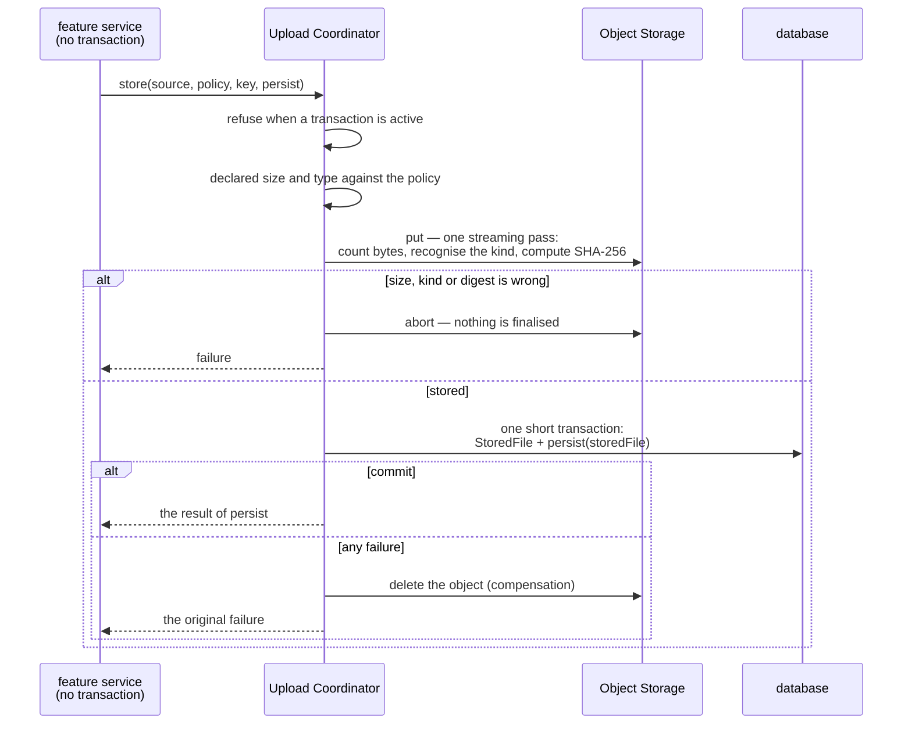
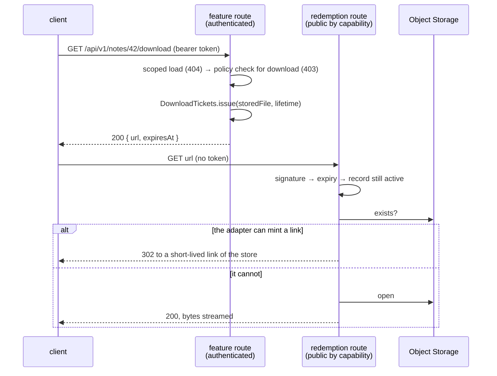

# Object Storage and Uploads

#doc #guide #architecture #security #api-design #draft

**Guide:** [[Docs/Guide/Guide-Index]] · **Conventions:** [[Docs/Guide/Guide-Conventions]]

## Purpose

This document is the contract of `platform.storage`: how a binary object is stored, recorded, served and
removed, on an S3-compatible store or on a local disk. A feature uses three operations — store a file,
issue a Download Ticket, release a file — and writes no transaction code, no clean-up code and no
storage call of its own. The one idea to take away: the record in the database is the truth. Every
failure path may leave an object that no record names, which is garbage to be collected; none may leave
a record whose object is missing, which is a broken download.

## Design

### What a feature uses, and what stays inside

Design sketch in Java-like notation. It fixes names and shapes of this convention, not framework syntax.

```java
// platform.storage — the three entry points a feature uses
interface UploadCoordinator {
  <T> T store(UploadSource source, UploadPolicy policy, ObjectKey key, Function<StoredFile, T> persist);
}
interface DownloadTickets {
  DownloadTicket issue(StoredFile file, Duration lifetime);
}
interface StoredFiles {
  void release(StoredFile file);            // only inside the caller's transaction
}

record UploadSource(InputStream content, long declaredSize, String declaredType,
                    String fileName, ContentDigest expectedDigest) {}   // cannot be built without a digest
record UploadPolicy(long maxSize, Set<ContentKind> allowedKinds) {}
record ObjectKey(String value) {}           // built by the feature's one key function

// platform.storage — the seam; only code of this module calls it
interface ObjectStorage {
  StoredObject put(ObjectKey key, InputStream content, ObjectMetadata metadata);
  InputStream open(ObjectKey key);          // streams; ObjectNotFound when absent
  boolean exists(ObjectKey key);
  void delete(ObjectKey key);               // succeeds when the object is already gone
}
interface DirectLinks {                     // offered only by an adapter that can mint a link
  URI linkFor(ObjectKey key, Duration lifetime, DownloadHeaders headers);
}
```

| Part | Used by | Job |
|---|---|---|
| `UploadCoordinator.store` | a feature service | Store a file and record it, as one step for the caller |
| `DownloadTickets.issue` | a feature service | Turn an authorized request into a short-lived capability |
| `StoredFiles.release` | a feature service or hook | Give a file up when its owner is deleted or replaces it |
| The redemption route | any client that holds a ticket | Verify a ticket and serve the bytes |
| `ObjectStorage` | the module itself | Put, open, check and delete an object on the active store |
| `DirectLinks` | the redemption route | Mint a short-lived link of the store, where the store can |

### The port and its adapters

`ObjectStorage` is a port with two production adapters. One setting, `app.storage.provider`, chooses the
active one ([[Docs/Guide/12-Configuration-and-Secrets]]).

| | S3-compatible adapter | Local-filesystem adapter |
|---|---|---|
| For | Any store that speaks the S3 protocol: AWS S3, MinIO, Wasabi, R2 | Development and single-node deployments |
| Client | Built once from configuration and reused; timeouts on every call | — |
| Address | An endpoint override and a path-style switch for stores that are not AWS | A root directory from configuration |
| Start-up check | The bucket is reachable — checked once | The root exists and is writable — checked once |
| `put` | Streams; a large object goes in parts | Writes a temporary file, then moves it into place atomically |
| Keys | Used as object keys as they are | Resolved inside the root; a key that would leave the root is rejected |
| `DirectLinks` | Yes: a presigned link | No: the redemption route streams |
| More than one instance | Yes | No — the disk belongs to one node |

The semantics every adapter keeps:

- `put` replaces an object as a whole. A reader sees the old object or the new one, never a part.
- `open` streams. A missing object is reported as `ObjectNotFound` — never as empty content and never as
  a general store failure.
- `exists` answers yes or no. When the store cannot be asked, it fails; it does not answer no.
- `delete` succeeds when the object is already gone.
- No operation holds a whole object in memory.

One shared contract suite states these semantics as tests and runs against every adapter
([[Docs/Guide/13-Testing-Strategy]]). A further store — Azure Blob, Google Cloud Storage, FTP — is a new
adapter that passes the suite; nothing else changes.

### Object keys

A feature has one function that builds the key of a new object, for example
`notes/<ownerId>/<generated unique part>`. The function uses server-side values only: the feature's
name, the id of an owner or a parent, and a generated unique part. It never uses a name the client sent.
A key is never reused — each upload gets a new one — so two records can never point at one object, and a
replaced file is a new object plus a release of the old one. No code rebuilds a key from a URL or from
any other text: the key is read from the stored file's record.

### The stored file

`StoredFile` is the platform's record of one stored object. A feature refers to a file through it — its
entity holds a lazy association to the record, a column with a foreign key — and keeps no key and no
address of its own.

| Field | Meaning |
|---|---|
| id | The record's identifier — what the feature's foreign key holds and what a ticket carries |
| key | The object key |
| provider | The adapter that stored the object |
| size | The number of bytes received |
| SHA-256 | The digest computed while the object was stored |
| content type | The verified kind of the content |
| download name | The name a download presents; taken from the upload and cleaned by the platform |
| created at | When the object was stored |
| state | `active`, or `released` once its owner gave it up |

A deployment has one active provider. Moving existing objects from one provider to another is a copy job
outside this contract.

### Uploading

**What arrives.** An upload reaches the server in one of two forms, and both carry the SHA-256 of the
object's bytes, computed by the client:

| Form | The file | The declared digest |
|---|---|---|
| Multipart form | the part `file` | the form field `fileDigest`, sent **before** the file part, like every other non-file field |
| Raw body | the request body | the header `X-Content-SHA256` |

The value is `sha-256:<64 lower-case hexadecimal characters>` in both forms. The digest covers the
object's bytes only. The whole-message digest header of RFC 9530 (`Content-Digest`) is not used: for a
multipart request it covers the envelope, so it can never equal the stored digest.

The HTTP edge builds the `UploadSource` from the request. An `UploadSource` cannot be built without a
digest, so a request with none is rejected as invalid before anything else happens.

**What the feature decides.** The feature passes an `UploadPolicy` — the largest size it accepts and the
kinds of content it accepts — and the `ObjectKey` from its key function. A `ContentKind` is a media type
together with the way to recognise it from the leading bytes of the content. The platform ships the
common kinds; a project adds one by adding a recogniser.

**What the coordinator does.**



1. `store` is called with **no database transaction open**. A call made while one is active fails at
   once, before any byte reaches the store. Upload entry points are therefore service operations that
   declare no transaction (G04-15), and a hook never calls `store`.
2. The declared size and the declared type are checked against the policy before the first byte is read.
3. The content is streamed to the store **once**. In that same pass the coordinator counts the bytes,
   recognises the kind from the leading bytes and computes the SHA-256. The request body is never read a
   second time.
4. If more bytes arrive than the policy allows, if the recognised kind is not the declared one or is not
   on the policy's list, or if the computed digest is not the declared one, the upload is aborted before
   the object is finalised: the temporary file is dropped, the multipart upload of the store is aborted.
5. Otherwise the coordinator opens one short transaction, writes the `StoredFile` and calls `persist`
   with it. The feature writes its own row there and returns its result.
6. If that transaction fails for any reason, the coordinator deletes the object and passes on the
   original failure. If the delete fails as well, it writes an alert log entry
   ([[Docs/Guide/14-Observability-and-Operations]]) and still passes on the original failure.

| Situation | Outcome | Problem type ([[Docs/Guide/09-Errors-and-Validation]]) |
|---|---|---|
| No digest, or one that is not well formed | invalid request, before the coordinator is called | `invalid-request` |
| Declared size above the policy; declared type not on the policy's list | invalid request, nothing read | `invalid-request` |
| More bytes arrive than the policy allows | invalid request, nothing stored | `invalid-request` |
| The content is not of the declared kind | refused against the content, nothing stored | `content-type-mismatch` |
| The computed digest is not the declared one | refused against the content, nothing stored | `content-digest-mismatch` |
| The store fails | unexpected failure, nothing recorded | `internal-error` |
| `persist` fails | the failure `persist` raised, after compensation | as raised |
| `store` is called inside a transaction | a defect of the caller: fails at once, no storage call | `internal-error` |

The platform has one size ceiling for any upload, in typed configuration. A policy cannot exceed it, and
the web server's own request limit is set from the same value, so the limit has one definition (G01-05).
A request above the ceiling is cut off by the web server before any controller runs.

Deeper inspection of the content — the entries of an archive, a malware scan — is the feature's own
step. The coordinator proves what kind of file it stored, not that the file is harmless.

### Downloading

A file is never served by a feature route. Downloading is two requests:



**Issuing.** The feature's download route is an ordinary entry point (G04-11): it loads the owning row
through the Row Scope, asks the Access Policy for the `download` action, and then calls
`DownloadTickets.issue`. No ticket is issued for a released file: the call reports it as not found. The
route is a `GET` whose path ends in `/download`, and it answers 200 with:

```json
{ "url": "/api/v1/files/download/<ticket>", "expiresAt": "2026-10-05T10:15:00Z" }
```

The response is marked as not to be cached. The client treats `url` as opaque and hands it to whatever
fetches the file — a link, an image element, a download manager — none of which could send a token.

**The ticket.** A Download Ticket is an opaque, URL-safe text with two parts: a payload — the stored
file's id and the expiry — and an HMAC-SHA-256 of the payload under the ticket secret. It holds no
object key, no address of the store and no personal data. The lifetime the feature asks for is capped by
one platform maximum. The ticket secret comes from the environment, has no default and is used for
nothing else. Changing the secret ends every outstanding ticket; nothing else can revoke a ticket before
it expires.

**Redeeming.** One platform route, `GET /api/v1/files/download/{ticket}`, redeems every ticket. It is on
the public list of [[Docs/Guide/08-Identity-Authentication-and-Authorization]] (G08-26) because the
ticket is the credential; it does not read the caller's token. Its checks run in this order:

| Check | When it fails |
|---|---|
| The ticket is well formed and its signature is right — compared in constant time | not found |
| The expiry has not passed | gone (`ticket-expired`) |
| The stored file is recorded and `active` | not found |
| The object exists in the store | not found |

The signature is checked first, so a forged ticket learns nothing from the answer. The statuses are
those of [[Docs/Guide/05-API-Contract]] (G05-12).

**Serving.** When the active adapter offers `DirectLinks`, the route answers 302 with a link that lives
for a short fixed time, and the bytes travel from the store to the client. When it does not, the route
streams the object through the port. Either way no database transaction is open while bytes flow, and no
whole object is held in memory. A download is a read: it is never guarded by an idempotency key and
takes no write precondition.

**Headers.** The redemption route is the one place that decides the download headers:

| Header | Value |
|---|---|
| Content type | the stored file's verified content type |
| `X-Content-Type-Options` | `nosniff` |
| `Content-Disposition` | `attachment` with the download name; `inline` only when the content type is on the configured safe list |

The safe list holds types a browser can show without running anything from them — common raster images
and PDF by default. HTML and SVG are never on it. On a redirect the route passes the same content type
and disposition to the store's link. The `nosniff` header is then the store's to send; what protects the
application there is that the bytes arrive from the store's origin, not from the application's.

### Removing a file

A feature never deletes an object. When a row that refers to a stored file is deleted, or starts to
refer to another file, the feature calls `StoredFiles.release(file)` **inside that transaction** —
typically from its delete hook. A call made with no transaction active fails at once: a release that is
not part of the commit that drops the reference could give up a file that is still in use. The release
is recorded with the same commit as the feature's change.
After the commit the platform deletes the object and then the record, and it retries until both are
gone. A released file cannot be redeemed, whether or not its object still exists.

| Path | What a crash or a failure can leave | Who removes it |
|---|---|---|
| Upload: the object is stored, the record is not | an object with no record | the compensation; after a crash, the orphan sweep |
| Removal: the release is committed, the object is still there | a `released` record and its object | the platform's retry |
| Any path | a record whose object is missing | nothing — this state is never produced |

The **orphan sweep** is an optional job: it lists the store, and deletes every object older than a grace
period that no record names. The grace period is longer than the longest upload, so an object whose
record is about to be written is never taken for an orphan. A project that cannot afford lost storage space after a crash runs it.

The retry and the sweep are platform housekeeping. They touch only this module's table and the store,
never a feature's rows (G08-07).

### Depth

Deleting `platform.storage` would put into every feature that handles a file: the placement of the
transaction, the digest check, the kind check, the size limit, the compensation and its alert, the
ticket, the header policy, and the order of deletes. The module hides that behind three entry points
(G01-02). The port is a real seam — two production adapters and the suite's test use (G01-03).

### Optional extension: replication

A project that needs every file on more than one store adds replication. It is not part of the base
contract and the Base Project does not build it.

- A registry of providers, one of them the default. Uploads go to the default.
- In the transaction that records a file, one outbox row per provider that must receive a copy.
- A worker takes one outbox row at a time, copies by streaming, and marks the row done. A failed row
  keeps its error, its attempt count and its next attempt time, and does not stop the rows after it.
- A copy is missing when a provider is not among the providers that hold the file. Counting rows is not
  a way to find missing copies.
- The backlog and the failures are visible in the application's health
  ([[Docs/Guide/14-Observability-and-Operations]]).

## Rules

### G10-01
**Rule:** Binary objects are stored and read only through the `ObjectStorage` port — put, open, exists,
delete — and only code of `platform.storage` calls the port. A feature stores, serves and removes a file
through the module's three entry points: store, issue a ticket, release.
**Why:** A storage call written in a feature or a controller has no transaction rule, no clean-up and no
authorization around it.
**Evidence:** WP-R05-05, WP-R01-02 · ADR-013
**Differs from references:** wpmanager put the storage operations on a JPA entity and called the client
from services and from a controller.

### G10-02
**Rule:** The active store is chosen by one setting, between an S3-compatible adapter and a
local-filesystem adapter, and every adapter passes the same contract suite. Another store is a new
adapter that passes the suite; no other code changes.
**Why:** A port with one working adapter is an assumption, and an adapter nothing tests fails on the
first call.
**Evidence:** WP-R05-05 · ADR-013, ADR-010
**Differs from references:** wpmanager had one working adapter; its second one returned nothing and
would have failed every upload sent to it.

### G10-03
**Rule:** Every adapter keeps the port's semantics: put replaces an object as a whole; open streams and
reports a missing object as not found; exists fails when the store cannot be asked instead of answering
no; delete succeeds when the object is already gone.
**Why:** When "the store did not answer" reads as "the object is not there", a short outage triggers
re-uploads and wrong clean-ups.
**Evidence:** WP-R05-03, WP-R05-07 · ADR-013
**Differs from references:** In wpmanager a failed bucket check was reported as a file that does not
exist.

### G10-04
**Rule:** The client of an S3-compatible store is built once from configuration and reused, with a
timeout on every call. The bucket is checked once, at start-up; no operation is preceded by a check of
its own.
**Why:** A client per call leaks connections and threads, a check per call doubles the traffic, and a
call with no timeout holds a request thread for as long as the store hangs.
**Evidence:** WP-R05-01, WP-R05-03, WP-R05-07 · ADR-013
**Differs from references:** wpmanager built a new client on every use, rarely closed it, checked the
bucket before every operation and set no timeout.

### G10-05
**Rule:** The local-filesystem adapter resolves every key inside its configured root and rejects a key
that would leave it. It writes to a temporary file and moves it into place atomically. It serves one
node only: a project that runs more than one instance uses the S3-compatible adapter.
**Why:** A key that escapes the root reads or overwrites any file of the server, and a disk that only
one node can see makes the others answer "not found" for files that exist.
**Evidence:** WP-R04-04 · ADR-013
**Differs from references:** The reference projects had no local store; wpmanager's single-node
assumptions were unstated.

### G10-06
**Rule:** An object is streamed on every path — upload, download and copy — and a large upload reaches
the store in parts. No code holds a whole object in memory.
**Why:** One buffered object costs its size in memory, and a few large requests at once end the process.
**Evidence:** WP-R05-04 · ADR-013
**Differs from references:** wpmanager read whole objects of up to 100 MB into memory to copy and to
serve them.

### G10-07
**Rule:** The key of an object is built by the feature's one key function from server-side values: the
feature name, an owner or parent id and a generated unique part. A key never contains a name the client
sent, is never rebuilt from a URL or other text, and is never reused — each upload gets a new key.
**Why:** A key made from a client's text changes with that text; a key rebuilt by parsing misses the
object; a shared key lets one upload overwrite or delete another's bytes.
**Evidence:** WP-R05-07, WP-R03-04, WP-R06-07 · ADR-013
**Differs from references:** wpmanager built keys from the plugin name and the version, rebuilt them by
parsing URLs, and let two uploads of one version share a key.

### G10-08
**Rule:** Every stored object has exactly one `StoredFile` record, owned by `platform.storage`: key,
provider, size, SHA-256, content type, download name, creation time and state. A feature refers to a
file only through that record and keeps no key and no store address of its own.
**Why:** A key or a URL copied into a feature's row goes stale when the store, the bucket or the key
scheme changes, and nothing can tell which objects are still in use.
**Evidence:** WP-R05-07, WP-R03-04 · ADR-013
**Differs from references:** wpmanager kept no record of a key: every operation rebuilt the object's
address from a base address and the version name.

### G10-09
**Rule:** Every upload declares the SHA-256 of the object's bytes: in the digest form field that belongs
to the file part, sent before it, for a multipart request, and in the one pinned request header for a
raw body. An upload with no well-formed digest is rejected as invalid before any byte is stored.
**Why:** The declared digest is the only proof that the bytes stored are the bytes sent, and the only
part of a file an idempotency fingerprint can use without reading the file.
**Evidence:** WP-R04-06, WP-R04-02 · ADR-013, ADR-014
**Differs from references:** wpmanager computed the checksum on the server, twice per request, and used
it alone as the idempotency key.

### G10-10
**Rule:** A file is stored only through the Upload Coordinator's one operation, and that operation is
called with no database transaction open. A call made inside a transaction fails at once, before any
byte reaches the store.
**Why:** A transaction that waits for a network transfer holds a database connection for its whole
length; a handful of uploads then stalls every other request.
**Evidence:** WP-R03-02, WP-R03-01 · ADR-013, ADR-005
**Differs from references:** wpmanager uploaded files of up to 100 MB inside the transaction of the
upload service.

### G10-11
**Rule:** The coordinator stores the object first and then records it — the `StoredFile` and everything
the caller's persist step writes — in one short transaction. When that transaction fails, for any
reason, the coordinator deletes the object and the caller receives the original failure.
**Why:** With the row first, a failed transfer leaves a row with no file that blocks every retry; with
partial clean-up, later failures leave objects nobody will find.
**Evidence:** WP-R03-01, WP-R03-03 · ADR-013
**Differs from references:** wpmanager committed the version row before the transfer and compensated
for one of several failure points only.

### G10-12
**Rule:** When the compensating delete fails as well, the coordinator writes an alert log entry with a
fixed event name and the object key, and still reports the original failure to the caller.
**Why:** An orphan that is not announced is found only on the storage bill.
**Evidence:** WP-R03-03 · ADR-013
**Differs from references:** wpmanager logged an orphan alert on one path and nothing on the others.

### G10-13
**Rule:** The content of an upload is read exactly once. In that one pass the coordinator streams it to
the store, counts its bytes, recognises its kind and computes its SHA-256; a computed digest that is not
the declared one fails the upload before the object is finalised, and nothing is stored or recorded.
**Why:** A second read of a large body costs its size again in time or in memory, and a digest checked
after the object is final leaves a wrong file to clean up.
**Evidence:** WP-R04-06, WP-R05-04 · ADR-013, ADR-009
**Differs from references:** wpmanager hashed each upload twice and compared nothing against what the
client meant to send.

### G10-14
**Rule:** Every upload is checked against the Upload Policy its feature passes — the largest size and
the allowed kinds of content — by the coordinator and by nothing else. Size is enforced by counting the
bytes received, never by trusting a declared length, and the platform's one size ceiling bounds every
policy and is the source of the web server's own limit.
**Why:** Two definitions of one limit drift apart, and a limit that trusts the declared length is a
limit the sender chooses.
**Evidence:** WP-R09-05, BE-R07-08 · ADR-013
**Differs from references:** wpmanager defined the upload limit in two places; `backend/` kept a 100 MB
request limit for an API with no upload.

### G10-15
**Rule:** The kind of an upload is decided from its content — the signature in its leading bytes — and
it must be the declared content type and be on the policy's list. A file name and a declared type never
decide it by themselves.
**Why:** Whatever the client names a file, the server stores it and later serves it under that name's
type.
**Evidence:** WP-R08-05 · ADR-013
**Differs from references:** wpmanager accepted any file whose name ended in `.zip` and whose declared
type said ZIP.

### G10-16
**Rule:** A feature serves a file only by issuing a Download Ticket from an ordinary entry point: the
scoped load of the owning row, the Access Policy's check for the download action, then the ticket. No
feature route returns file bytes or an address of the store.
**Why:** A route that returns bytes re-decides authorization, headers and streaming for itself, and an
address of the store works for anyone who learns it.
**Evidence:** WP-R01-02, WP-R01-03 · ADR-013, ADR-018
**Differs from references:** wpmanager had an anonymous controller that downloaded any object by name.

### G10-17
**Rule:** A Download Ticket is an opaque, URL-safe token: the stored file's id and an expiry,
authenticated with an HMAC-SHA-256. It carries no object key, no store address and no personal data,
and its lifetime never exceeds the platform's one maximum.
**Why:** A link that shows the key or the bucket teaches a caller how to ask the store for other
objects, and a link with no end is a public file.
**Evidence:** WP-R05-07, WP-R01-04 · ADR-013
**Differs from references:** wpmanager signed file integrity, not links, and its object keys were
predictable: the plugin name and the version.

### G10-18
**Rule:** The ticket secret comes from the environment, has no default and a minimum length, and is used
for nothing but tickets. An application that uses storage does not start without it.
**Why:** A default secret is a published secret, and anyone who holds it can mint a ticket for any file.
**Evidence:** WP-R01-07, BE-R01-05 · ADR-013
**Differs from references:** wpmanager's token-signing secret had a literal fallback; `backend/` used
one secret for two purposes.

### G10-19
**Rule:** One platform route redeems every ticket. It checks, in this order, the signature in constant
time, the expiry, that the stored file is recorded and active, and that the object exists — and only
then serves. A malformed, unknown or tampered ticket and a ticket whose file is gone are answered as not
found, an expired one as gone, with no further detail.
**Why:** A second redemption path is a second place to forget a check, and an answer that tells a forged
ticket from an expired one helps the forger.
**Evidence:** WP-R01-02 · ADR-013, ADR-009
**Differs from references:** The reference projects had no redemption step: a download was a direct
read of the bucket.

### G10-20
**Rule:** Redemption redirects to a link of the store that lives for a short fixed time when the active
adapter can mint one, and streams through the port when it cannot. No database transaction is open
while bytes flow, and a download is never guarded by an idempotency key and takes no write precondition.
**Why:** Proxying every byte through the application spends its bandwidth for nothing, and a transaction
held for the length of a download is the upload defect again.
**Evidence:** WP-R03-02, WP-R05-04 · ADR-013, ADR-014
**Differs from references:** wpmanager served downloads by reading the whole object into memory.

### G10-21
**Rule:** The headers of a download are decided in one place, the redemption route: content-type
sniffing is switched off, the disposition is attachment with the stored download name, and inline only
for content types on the configured safe list, which never holds HTML or SVG. A redirect passes the same
content type and disposition to the store's link.
**Why:** A stored file that a browser renders as a page runs the uploader's script with the
application's origin.
**Evidence:** WP-R08-05, WP-R01-02 · ADR-013
**Differs from references:** wpmanager served stored objects from an anonymous test controller, and
what it had stored was accepted on the client's word for its type.

### G10-22
**Rule:** The redemption route is public because the ticket is the credential, and it does not read the
caller's token. Authorization is decided when the ticket is issued; the ticket's lifetime is the whole
exposure window, and nothing revokes a ticket before it expires except a change of the secret.
**Why:** A link, an image element and a download manager cannot send a token, so the alternative is a
route with no protection at all.
**Evidence:** WP-R01-02 · ADR-013, ADR-006
**Differs from references:** wpmanager's test routes over the bucket were anonymous, with no
credential of any kind.

### G10-23
**Rule:** A stored file is removed only through the module's release operation, called inside the
transaction that deletes or replaces the reference to it; a call with no transaction active fails at
once. The release is recorded with that commit; the platform deletes the object and then the record
after the commit and retries until both are gone. A released file is never redeemed and gets no new
ticket.
**Why:** A delete of the object inside the transaction cannot be rolled back, and a delete left to each
feature is skipped by the first route that forgets it.
**Evidence:** WP-R02-05, WP-R07-02, WP-R03-03 · ADR-013
**Differs from references:** wpmanager deleted objects in the middle of a database transaction, and its
inherited delete route skipped the storage clean-up altogether.

### G10-24
**Rule:** No failure and no crash leaves an active record whose object is missing. The only inconsistent
state the module can leave is an object that no active record names.
**Why:** An object with no record costs space; a record with no object is a file the application offers
and cannot deliver.
**Evidence:** WP-R03-01, WP-R07-02 · ADR-013
**Differs from references:** wpmanager could leave both: version rows with no file, and objects with no
row.

### G10-25
**Rule:** The orphan sweep lists the store and deletes every object older than a grace period that no
record names, and it reports how many it removed. It never deletes an object a record names.
**Optional:** orphan sweep
**Why:** A crash between the transfer and the record leaves an object that no compensation ran for.
**Evidence:** WP-R03-03 · ADR-013
**Differs from references:** wpmanager had no reconciliation between the bucket and the file rows.

### G10-26
**Rule:** Replication writes one outbox row per missing copy in the transaction that records the file. A
worker processes one row at a time, by streaming, with retries and a growing delay; one row's failure
never stops the rows after it; a copy is missing when a provider is not among those that hold the file,
never by a count; and the backlog and the failures are visible in the application's health.
**Optional:** storage replication
**Why:** A replication run that one bad row can stop, and that nobody can see has stopped, lets
redundancy decay in silence.
**Evidence:** WP-R05-02, WP-R05-06, WP-R03-05 · ADR-013
**Differs from references:** wpmanager's replication job stopped at the first version with no source
copy, found work by counting rows, started 83 minutes after a deploy and reported nothing.

## Differs From the Reference Projects

- The storage port is a module with two tested adapters, not a method on an entity (G10-01, G10-02;
  WP-R05-05).
- The transfer happens outside every transaction, and the record is written after it (G10-10, G10-11;
  WP-R03-02, WP-R03-01).
- Every failure after the transfer is compensated, and a failed compensation is announced (G10-11,
  G10-12; WP-R03-03).
- The client declares the digest; the server reads the file once (G10-09, G10-13; WP-R04-06).
- The kind of a file comes from its content, and the size limit has one definition (G10-14, G10-15;
  WP-R08-05, WP-R09-05).
- Keys are server-made, unique and never parsed (G10-07; WP-R05-07, WP-R03-04).
- Downloads need an authorized ticket; nothing reads the bucket anonymously (G10-16, G10-19, G10-22;
  WP-R01-02).
- Objects are streamed, never buffered (G10-06; WP-R05-04).
- One client per store, with timeouts (G10-04; WP-R05-01, WP-R05-07).
- Removing a file is the platform's job, after the commit (G10-23; WP-R02-05, WP-R07-02).
- New in this convention, with no reference counterpart: the local-filesystem adapter (G10-05), the
  Download Ticket (G10-17) and the single header policy (G10-21).

## Version Notes

- **verified on 4.1.x** — Spring Framework 7.0 offers the propagation setting `NEVER` — "Execute
  non-transactionally, throw an exception if a transaction exists" — which is how the coordinator's
  no-transaction contract is declared. Evidence:
  https://docs.spring.io/spring-framework/docs/7.0.x/javadoc-api/org/springframework/transaction/annotation/Propagation.html
- **verified on 4.1.x** — a short transaction around a block of code is opened with
  `TransactionTemplate.execute` and a callback. Evidence:
  https://docs.spring.io/spring-framework/reference/7.0/data-access/transaction/programmatic.html
- **verified on 4.1.x** — a controller streams a response body with `StreamingResponseBody`, which
  writes to the response stream without message conversion, on a separate thread of the configured
  `AsyncTaskExecutor`. Evidence:
  https://docs.spring.io/spring-framework/reference/7.0/web/webmvc/mvc-ann-async.html
- **verified on 3.4.x** — a transactional annotation on the upload service puts the whole transfer
  inside the database transaction. Evidence: WP-R03-02
- **not verified** — current-docs lookup at execution time: which exception a call inside a transaction
  raises under `NEVER` (`IllegalTransactionStateException`), and that an unchecked exception thrown from
  a `TransactionTemplate` callback rolls the transaction back.
- **not verified** — current-docs lookup at execution time: the AWS SDK for Java v2 calls of the
  S3-compatible adapter — that a client owns a connection pool and is meant to be shared,
  `S3Client.builder()` with `endpointOverride` and `forcePathStyle`, the
  `apiCallTimeout` and `apiCallAttemptTimeout` settings (off by default), a multipart upload from a
  stream of unknown length, and aborting it. The SDK is not in Spring Boot's managed set, so the project
  pins its version (G01-07).
- **not verified** — current-docs lookup at execution time: minting a presigned link with `S3Presigner`
  (`presignGetObject`, `signatureDuration`) and overriding the response content type and disposition on
  it.
- **not verified** — current-docs lookup at execution time: how the action after the commit is
  registered (a transaction synchronisation or a transactional event listener for the after-commit
  phase).
- **not verified** — current-docs lookup at execution time: how multipart parts reach a controller on
  this line (spooled to disk by the web server, or parsed as a stream), and the properties of the
  request and file size ceiling (`spring.servlet.multipart.max-file-size`,
  `spring.servlet.multipart.max-request-size`).
- **not verified** — current-docs lookup at execution time: the JDK calls for the ticket (`Mac` with
  `HmacSHA256`, `MessageDigest.isEqual` for the constant-time comparison) and for the atomic move
  (`Files.move` with `ATOMIC_MOVE`).
- **not verified** — current-docs lookup at execution time: whether the security layer already writes
  `X-Content-Type-Options: nosniff` on every response of this line, and how a single route sets
  `Cache-Control: no-store`.

## Related Documents

- [[Docs/Guide/02-Project-Layout-and-Module-Boundaries]] — where `platform.storage` sits and what it may
  depend on.
- [[Docs/Guide/04-CRUD-Base-and-Service-Hooks]] — the order of checks of an entry point (G04-11), the
  per-entry-point transaction rule (G04-15) and the delete hook.
- [[Docs/Guide/05-API-Contract]] — the statuses of ticket redemption (G05-12).
- [[Docs/Guide/08-Identity-Authentication-and-Authorization]] — the public list and its contribution
  contract (G08-26); platform housekeeping (G08-07).
- [[Docs/Guide/09-Errors-and-Validation]] — the registry of problem types.
- [[Docs/Guide/11-Idempotency]] — how the declared digest enters the request fingerprint.
- [[Docs/Guide/12-Configuration-and-Secrets]] — the storage settings, the ticket secret and the rule
  that a credential is never data.
- [[Docs/Guide/13-Testing-Strategy]] — the contract suite and the tests of every invariant of this
  document.
- [[Docs/Guide/14-Observability-and-Operations]] — the storage health indicator and the alert log
  entry.
- [[Docs/Guide/15-Recipe-Add-a-Feature]] — adding an upload to a feature, step by step.
- [[ADRs/ADR-013-object-storage-port-upload-coordinator-and-download-tickets|ADR-013]] — the decision
  this document details.
- [[ADRs/ADR-014-idempotency-guard-opt-in-per-endpoint|ADR-014]] — why the digest is declared.
- [[ADRs/ADR-009-unchecked-domain-exceptions-as-problem-details|ADR-009]] — the pinned statuses.
