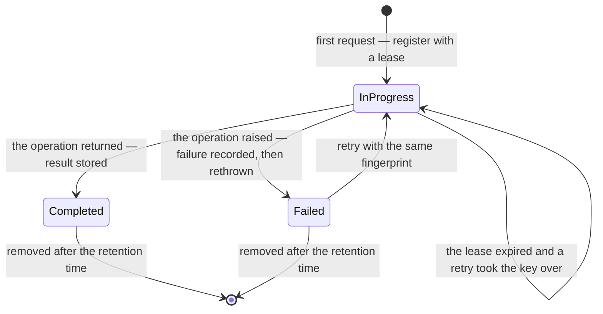

# Idempotency

#doc #guide #api-design #architecture #draft

**Guide:** [[Docs/Guide/Guide-Index]] · **Conventions:** [[Docs/Guide/Guide-Conventions]]

## Purpose

A client that sends a `POST` and gets no answer cannot know whether the work was done. This document is
the contract of `platform.idempotency`, the module that makes such a request safe to send again: the
client names the operation with a key, and a retry with the same key gets the first result instead of a
second execution. The guard is opt-in per endpoint and has one entry point. The one idea to take away: a
key stands for exactly one request — the same request again is a replay, and a different request under
the same key is an error, never another upload's result.

## Design

### Interface

Design sketch in Java-like notation. It fixes names and shapes of this convention, not framework syntax.

```java
// platform.idempotency
interface IdempotencyGuard {
  <T> T execute(IdempotencyKey key, Fingerprint fingerprint, Class<T> type, Supplier<T> operation);
}
record IdempotencyKey(String actorId, String clientKey) {}   // the client's key, scoped by the actor
record Fingerprint(String value) {}                          // SHA-256 over what identifies the request

@interface Idempotent {                                      // the marker on a controller method
  boolean spoolWhenNoDigest() default false;                 // the fallback of "Uploads" below
}
```

- `execute` is the whole interface. The caller never sees a state and never calls a transition.
- The marker is honoured at the HTTP edge. For a marked controller method the edge reads the
  `Idempotency-Key` header, resolves the actor ([[Docs/Guide/02-Project-Layout-and-Module-Boundaries]],
  G02-06), builds the fingerprint and runs the controller method as the guard's operation.
- Code that is not an HTTP request — a worker that must not repeat a step — may call `execute` with a
  key of its own.

### Which endpoints are guarded

| Request | Guarded? | Why |
|---|---|---|
| A `POST` that creates something or starts work, and that a client may retry | When the endpoint carries the marker | A retry would do the work twice |
| An upload | Yes, by the recipe ([[Docs/Guide/15-Recipe-Add-a-Feature]]) | A retry would store the file twice |
| `GET`, a list, a search (G05-11), a download ([[Docs/Guide/10-Object-Storage-and-Uploads]]) | Never | A read changes nothing |
| Update and delete | No need | The write precondition already refuses a second application (G04-12) |

### The key

- The client sends the key in the `Idempotency-Key` request header. The header name follows the IETF
  draft "The Idempotency-Key HTTP Header Field", which is not yet a standard.
- A key is 1 to 255 visible ASCII characters and is opaque to the server. A random UUID is a good key.
- The client makes a new key for each new operation and sends the same key with every retry of it.
- The server scopes the key by the actor: the same text sent by two users is two keys.
- A guarded endpoint **requires** the key. A request without it is invalid.

### The fingerprint

The fingerprint tells "the same request again" from "another request under the same key". It is a
SHA-256 over:

| Request | What goes into the fingerprint |
|---|---|
| A buffered body (JSON) | the method, the path with its query string, the bytes of the body as received |
| A request with a file (multipart or raw) | the method, the path with its query string, the non-file fields in name order, and the **declared** content digest of each file |

No code reads a file's bytes to build a fingerprint. The digest the client declares stands for the file,
and the Upload Coordinator proves it against the bytes later, in its one streaming pass (G10-13). A
reused key with other bytes therefore has another digest, another fingerprint, and is rejected.

### States and outcomes



What a request with a key meets, and what happens:

| Record for this actor and key | Fingerprint | Outcome |
|---|---|---|
| None, or one past its retention time | — | Register `in progress` with a lease; run the operation |
| `in progress`, lease still running | same | Rejected: `request-in-progress` (409) |
| `in progress`, lease expired | same | The request takes the key over with a new lease; run the operation |
| `completed` | same | The stored result is returned; the operation does not run |
| `failed` | same | A new lease; run the operation again |
| any | different | Rejected: `idempotency-fingerprint-mismatch` (422) |

The two rejections have problem types of their own in the registry of
[[Docs/Guide/09-Errors-and-Validation]].

- **The lease** is how long an `in progress` record blocks a retry. It is a setting, and it must be
  longer than the longest run of a guarded operation — for uploads, longer than the upload timeout.
- **The stored result** is the outcome of the operation as the client saw it: the status, the headers
  this contract defines (`Location`, `ETag`) and the body. A replay returns exactly that, and only to
  the actor who made the first request.
- **A failure is not replayed.** The guard records it, rethrows the original failure unchanged, and a
  retry runs the operation again. The client sees the status the failure has without the guard.
- **The retention time** is how long a `completed` or `failed` record is kept. A record past it counts
  as absent, whether or not the clean-up has removed it yet.

### Where the guard sits

The guard runs at the HTTP edge, after the request has been authenticated and found valid by itself, and
before the operation. In the order of failures of [[Docs/Guide/09-Errors-and-Validation]] (G09-14) its
answers come third:

1. **401** — the request is not authenticated.
2. **400** — the request is invalid by itself: a failed Request constraint, a missing or malformed key,
   a file with no well-formed digest. Nothing is registered for such a request.
3. **409, 422** — the guard's own rejections: in progress, fingerprint mismatch.
4. Everything the operation answers — the entry point's checks, a hook's refusal, the database's
   refusal. These happen inside the guarded operation, so they are recorded as its failure.

A replay is answered at step 3, before the entry point's checks run again: the caller receives the
result of its own first request.

### The guard and transactions

- The state lives in one table with a unique constraint on actor and key. Registering a key is an
  insert, and the constraint decides a race: the request that loses it finds an `in progress` record.
  There is no copy of the state in memory, so every instance of the application sees the same state.
- The guard writes its record in short transactions of its own — one to register, one to record the
  outcome — and holds none open while the operation runs. That is what lets a guarded endpoint call the
  Upload Coordinator, which refuses to run inside a transaction (G10-10).
- An operation run under the guard must be **all or nothing**: it completes, or it leaves nothing
  behind. A database transaction gives that for rows; the Upload Coordinator gives it for a file and its
  rows. The guard does not make half-done work safe to repeat.

**The limit of the guarantee.** Between the moment the operation commits and the moment the guard
records the result, a crash leaves the record `in progress`. When its lease expires, one retry runs the
operation again. The guard therefore prevents duplicates from retries and from concurrent requests, not
from a crash in that window. An operation that must never happen twice also holds a unique constraint on
its natural key (G07-13), which turns the second execution into a conflict.

### Uploads

An upload endpoint carries the marker by the recipe. Its fingerprint uses the declared digest of
[[Docs/Guide/10-Object-Storage-and-Uploads]] (G10-09), so the file is still read exactly once, by the
coordinator.

**The spool fallback.** Some clients cannot compute a digest before sending — a plain HTML form, for
example. An endpoint may declare the fallback on its marker. For a request with no digest it then writes
the upload to a temporary file once, computes the SHA-256 in that same pass, and gives the digest and
the file to both the guard and the coordinator: computed once, passed along, never read a second time.
The temporary file is removed when the request ends. A request that does declare a digest is handled as
usual. The fallback belongs to the endpoint, never to a storage adapter: an upload must behave the same
on every store. Without the fallback, a file request with no digest is rejected as invalid before the
guard runs.

`platform.idempotency` does not depend on `platform.storage` (G02-03). The edge reads the declared
digest as text. With the fallback it hands the computed digest and the spooled content to the
controller, and the controller builds its `UploadSource` from them.

### Clean-up

A scheduled clean-up removes records past their retention time. It is platform housekeeping: it touches
only this module's table (G08-07) and reports through the application's health like every other job
([[Docs/Guide/14-Observability-and-Operations]]).

### Depth

One operation hides the header, the scoping, the state machine, the lease, the race on registration, the
replay and the failure record. Deleting the module would put that protocol, and its order of calls, into
every endpoint that must survive a retry (G01-02).

## Rules

### G11-01
**Rule:** An endpoint is guarded only when it carries the idempotency marker, and the marker goes on a
non-repeatable `POST`. A get, a list, a search and a download are never guarded.
**Why:** A guard on every request pays for a table row per call, and a guarded read would answer with
stale data as if it were fresh.
**Evidence:** WP-R04-05 · ADR-014, ADR-011
**Differs from references:** wpmanager wired its mechanism into one upload service; nothing else could
use it and nothing said where it applied.

### G11-02
**Rule:** The Idempotency Guard has one entry point: execute an operation under a key and a fingerprint
and return its result. No caller reads a state or calls a transition.
**Why:** A protocol of several calls in a required order is learned again, and broken again, by every
caller.
**Evidence:** WP-R04-05 · ADR-014
**Differs from references:** wpmanager's state keeper exposed each transition as a method and was tied
to one result type.

### G11-03
**Rule:** The client sends the key in the `Idempotency-Key` header: 1 to 255 visible ASCII characters,
opaque to the server, and scoped by the actor, so the same text from two users is two keys. A guarded
endpoint requires the header; a request without it is rejected as invalid.
**Why:** A key the server derives from the content cannot tell a retry from a second, intended request,
and a key shared between users would hand one user another's result.
**Evidence:** WP-R04-02 · ADR-014
**Differs from references:** wpmanager used the file's checksum as the key, for every user alike.

### G11-04
**Rule:** Every key is stored with the fingerprint of its request: the method, the path with its query
string and the body — the bytes of a buffered body, or, for a request with a file, the non-file fields
and the declared content digest of each file. A file's bytes are never read to build a fingerprint.
**Why:** Without a fingerprint a reused key replays an unrelated result; a fingerprint that hashes the
file reads every upload twice.
**Evidence:** WP-R04-02, WP-R04-06, WP-R05-04 · ADR-014
**Differs from references:** wpmanager stored no fingerprint, so the same archive sent as another
version returned the earlier version's result.

### G11-05
**Rule:** A request whose key is completed with the same fingerprint receives the stored result, and the
operation does not run. The same key with a different fingerprint is rejected as a fingerprint mismatch,
whatever the state of the key. The same key and fingerprint while the first request is still in progress
is rejected as in progress.
**Why:** These three answers are what a client's retry logic is built on; any other answer either
repeats the work or hides that it was never done.
**Evidence:** WP-R04-02, WP-R04-01 · ADR-014, ADR-009
**Differs from references:** wpmanager had the replay and the in-flight rejection, and no way to detect
a different request under the same key.

### G11-06
**Rule:** An in-progress key carries a lease, set longer than the longest run of the guarded operation.
When the lease has expired, a retry takes the key over and runs. No key blocks retries for longer than
its lease.
**Why:** A crash in the middle of an operation otherwise leaves its key in progress, and the client
locked out, until someone deletes the row.
**Evidence:** WP-R04-03 · ADR-014
**Differs from references:** In wpmanager a crash left the key pending and blocked that file for 24
hours.

### G11-07
**Rule:** When the operation fails, the guard records the failure and rethrows the original failure
unchanged, so the client receives the status it would have received without the guard. A failed key may
be retried with the same fingerprint, and the operation then runs again.
**Why:** A guard that wraps every failure in its own makes a rejected input look like an outage, and
clients retry what can never succeed.
**Evidence:** WP-R04-01 · ADR-014, ADR-009
**Differs from references:** wpmanager answered 500 for every failure inside the guarded upload, a
wrong file type and a duplicate version included.

### G11-08
**Rule:** What the guard stores for a completed key is the result as the client saw it — the status, the
`Location` and `ETag` headers and the body — and a replay returns exactly that, to the actor who made
the first request and to nobody else.
**Why:** A replay that differs from the first answer breaks the client that missed the first answer,
which is the only client that ever sees a replay.
**Evidence:** WP-R04-02, WP-R04-05 · ADR-014
**Differs from references:** wpmanager stored one DTO type as text and replayed it to whoever sent the
same file.

### G11-09
**Rule:** The state of every key lives in one database table with a unique constraint on actor and key.
Registering a key is an insert that the constraint decides, and no instance keeps a copy of the state in
memory.
**Why:** A state cached per instance disagrees between instances, and a check before the insert lets two
requests both believe they were first.
**Evidence:** WP-R04-04 · ADR-014, ADR-010
**Differs from references:** wpmanager cached key states in a map per instance and did not handle the
race of two first requests.

### G11-10
**Rule:** The guard writes its record in short transactions of its own, before and after the operation,
and holds no transaction open while the operation runs.
**Why:** A transaction opened by the guard would wrap the whole operation — for an upload, the whole
transfer — and the first request's record would be invisible to the retry it must block.
**Evidence:** WP-R03-02, WP-R04-04 · ADR-014, ADR-013
**Differs from references:** wpmanager ran the guarded upload inside the transaction of the upload
service.

### G11-11
**Rule:** An operation run under the guard is all or nothing: it completes, or it leaves no row and no
object behind. The guard is never the reason half-done work is safe to repeat.
**Why:** A retry after a failure runs the operation again; whatever the first run left behind is then
there twice, or blocks the second run.
**Evidence:** WP-R03-01, WP-R03-03 · ADR-014, ADR-013
**Differs from references:** A failed wpmanager upload left a version row that made every retry fail as
a duplicate.

### G11-12
**Rule:** The guard prevents a second execution on a retry and on a concurrent duplicate; it does not
prevent one after a crash between the operation's commit and the recording of its result. An operation
that must never happen twice also holds a unique constraint on its natural key.
**Why:** A guarantee stated more strongly than it holds is trusted exactly where it fails.
**Evidence:** WP-R03-04, WP-R04-03 · ADR-014, ADR-010
**Differs from references:** wpmanager's duplicate-version check was a read before the insert, with no
constraint behind it.

### G11-13
**Rule:** An upload endpoint may declare the spool fallback. A request with no digest is then written
once to a temporary file while its SHA-256 is computed in that same pass, and the digest and the file
are given to both the guard and the Upload Coordinator. The fallback is a property of the endpoint,
never of a storage adapter; without it, a file request with no digest is rejected as invalid before the
guard runs.
**Why:** A fallback that reads the file twice brings back the double read, and one that depends on the
store makes the same upload behave differently per deployment.
**Evidence:** WP-R04-06 · ADR-014, ADR-013
**Differs from references:** wpmanager read each upload twice to compute the same checksum.

### G11-14
**Rule:** A completed or failed record is kept for a configured retention time and is then removed by a
scheduled clean-up that touches only this module's table. A record past its retention time counts as
absent even before the clean-up has removed it.
**Why:** A record that blocks until a job deletes it ties the correctness of every retry to a job
nobody watches.
**Evidence:** WP-R04-03, WP-R04-04 · ADR-014
**Differs from references:** wpmanager did not check a key's expiry when it was used again; an expired
key blocked until the clean-up job ran.

### G11-15
**Rule:** The guard runs after the request has been authenticated and found valid by itself, and before
the operation. Its two rejections therefore come after "not authenticated" and "invalid" and before any
answer of the entry point, and a request that is invalid by itself registers no key.
**Why:** If the guard ran first, a malformed request would occupy its key, and the order in which a
caller sees failures would differ between guarded and unguarded routes.
**Evidence:** WP-R04-01 · ADR-009, ADR-014
**Differs from references:** wpmanager registered the key first and validated the upload inside the
guarded call, so every validation failure became a failed key and a 500.

## Differs From the Reference Projects

- The key comes from the client and is scoped by the user; the file's checksum is no longer the key
  (G11-03; WP-R04-02).
- Each key has a fingerprint, so a different request under the same key is rejected, not answered with
  another result (G11-04, G11-05; WP-R04-02).
- Failures keep their own status (G11-07; WP-R04-01).
- A crash blocks a key for the length of its lease, not for a day (G11-06; WP-R04-03).
- The state is in the database only, and a race is decided by a constraint (G11-09; WP-R04-04).
- One operation replaces a protocol of calls, and works for any result type (G11-02, G11-08;
  WP-R04-05).
- The file is read once (G11-04, G11-13; WP-R04-06).

## Version Notes

- **not verified** — current-docs lookup at execution time: how the marker is honoured around a
  controller method on this line. A handler interceptor cannot replace a handler's result, so the
  likely mechanism is an around advice on the marked method.
- **not verified** — current-docs lookup at execution time: that the arguments of a controller method
  are resolved and validated before an advice around that method runs — which is what puts the 400 of
  a failed Request constraint before the guard.
- **not verified** — current-docs lookup at execution time: how the bytes of a buffered body are made
  available for the fingerprint before the controller reads them (a request wrapper that caches the
  body).
- **not verified** — current-docs lookup at execution time: which exception a violated unique constraint
  raises when the key is registered (`DataIntegrityViolationException`) and how the insert is isolated
  so that the violation does not mark an outer transaction for rollback.
- **not verified** — current-docs lookup at execution time: the JSON mapper type of this line
  (Jackson 3) used to store and read back the result.
- **not verified** — current-docs lookup at execution time: how the clean-up is scheduled
  (`@Scheduled`) and how scheduling is switched on.

## Related Documents

- [[Docs/Guide/02-Project-Layout-and-Module-Boundaries]] — where `platform.idempotency` sits; the actor
  is resolved at the HTTP edge (G02-06).
- [[Docs/Guide/05-API-Contract]] — search is never guarded (G05-11); the statuses.
- [[Docs/Guide/07-Domain-Model-and-Persistence]] — unique constraints (G07-13).
- [[Docs/Guide/08-Identity-Authentication-and-Authorization]] — platform housekeeping (G08-07).
- [[Docs/Guide/09-Errors-and-Validation]] — the `request-in-progress` and
  `idempotency-fingerprint-mismatch` problem types; the order of failures (G09-14).
- [[Docs/Guide/10-Object-Storage-and-Uploads]] — the declared digest (G10-09) and the single streaming
  pass (G10-13).
- [[Docs/Guide/12-Configuration-and-Secrets]] — the lease and retention settings.
- [[Docs/Guide/13-Testing-Strategy]] — the tests of every outcome of this document.
- [[Docs/Guide/14-Observability-and-Operations]] — the clean-up as a reported job.
- [[Docs/Guide/15-Recipe-Add-a-Feature]] — why an upload endpoint carries the marker.
- [[ADRs/ADR-014-idempotency-guard-opt-in-per-endpoint|ADR-014]] — the decision this document details.
- [[ADRs/ADR-013-object-storage-port-upload-coordinator-and-download-tickets|ADR-013]] — the Upload
  Coordinator the guard works with.
