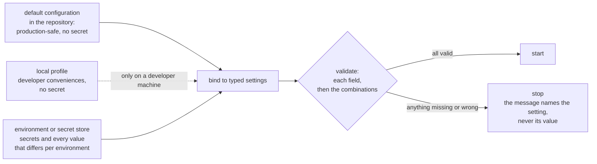

# Configuration and Secrets

#doc #guide #configuration #security #draft

**Guide:** [[Docs/Guide/Guide-Index]] · **Conventions:** [[Docs/Guide/Guide-Conventions]]

## Purpose

This document says where a setting is defined, how it is checked and how a secret is handled. Every
setting belongs to one typed settings type that is validated when the application starts, so a missing
or wrong value stops the start-up instead of failing in the middle of a request. A secret has no literal
value and no fallback anywhere in the repository. The one idea to take away: the application either
starts with a complete, valid configuration or does not start, and nothing in the repository can make it
start with a secret that someone else knows.

## Design

### Typed settings

Design sketch in Java-like notation. It fixes names and shapes of this convention, not framework syntax.

```java
// platform.storage — one settings type per module, bound under app.<module>
record StorageSettings(
    Provider provider,                // required
    DataSize maxUploadSize,           // the one upload ceiling
    S3Settings s3,                    // required when provider = s3
    LocalSettings local,              // required when provider = local
    TicketSettings tickets) {}

record TicketSettings(
    Secret secret,                    // required; no default; minimum length
    Duration maxLifetime,
    Duration linkLifetime,
    Set<String> inlineTypes) {}

final class Secret {                  // platform.config — holds a secret value
  String reveal();                    // the only way to read it
  public String toString() { return "****"; }
}
```

- A settings type belongs to the module that uses it and is bound under the prefix `app.<module>`.
  A feature that needs a setting has a settings type of its own under `app.<feature>`.
- A module reads its settings through its settings type. No code looks a setting up by its name.
- A secret is held in the `Secret` type of `platform.config`, whose text form is masked. A settings type
  can therefore be printed, logged or compared without showing a secret.
- Settings of the framework itself — the database address, the server port — keep the framework's own
  names; the rules of this document apply to them unchanged.

### From the environment to a running application



What stops the start-up:

| Check | Example |
|---|---|
| A required setting is missing | no identity mode; no storage provider while a feature uses storage |
| A value is not valid | a negative lifetime; a ticket secret shorter than the minimum |
| A choice lacks what it requires | `external` identity mode with no key-set address; the `s3` provider with no bucket |
| A combination is unsafe | wildcard CORS origins together with credentials (G08-24) |
| A declaration is wrong | a Query Profile that names a field its entity does not have (G06-16) |
| A dependency is unreachable | the bucket or the storage root cannot be reached (G10-04, G10-05) |
| A required first step cannot run | no administrator exists and none is supplied (G08-23) |

### The settings of the platform

The names below are the convention's. A project adds its own under `app.<feature>`.

| Setting | Owner | Secret | Required | Default |
|---|---|---|---|---|
| `app.identity.mode` | `identity` | no | always | none |
| `app.identity.issuer`, `app.identity.audience` | `identity` | no | always | none |
| `app.identity.jwk-set-uri`, `app.identity.role-claim` | `identity` | no | in `external` mode | none |
| `app.identity.local.private-key`, `app.identity.local.public-key` | `identity.local` | the private key | in `local` mode | none |
| `app.identity.local.access-token-lifetime`, `app.identity.local.refresh-token-lifetime` | `identity.local` | no | no | short, stated in the project's list |
| `app.identity.local.lockout.threshold`, `app.identity.local.lockout.duration` | `identity.local` | no | no | stated in the project's list |
| `app.identity.local.bootstrap-admin.login-name`, `app.identity.local.bootstrap-admin.password` | `identity.local` | the password | while no administrator exists | none |
| `app.access.admin-role` | `access` | no | always | none |
| `app.access.cors.allowed-origins` | `access` | no | no | empty — no cross-origin access; the developer origin in the `local` profile only |
| `app.query.defaults.*` — the list bounds of [[Docs/Guide/06-Query-Engine]] | `query` | no | no | stated in the project's list |
| `app.storage.provider` | `storage` | no | when storage is used | none |
| `app.storage.max-upload-size` | `storage` | no | no | stated in the project's list |
| `app.storage.s3.endpoint`, `app.storage.s3.region`, `app.storage.s3.bucket`, `app.storage.s3.path-style`, `app.storage.s3.timeout` | `storage` | no | for the `s3` provider | none, except the timeout |
| `app.storage.s3.access-key`, `app.storage.s3.secret-key` | `storage` | yes | for the `s3` provider | none |
| `app.storage.local.root` | `storage` | no | for the `local` provider | none |
| `app.storage.tickets.secret` | `storage` | yes | when storage is used | none |
| `app.storage.tickets.max-lifetime`, `app.storage.tickets.link-lifetime`, `app.storage.tickets.inline-types` | `storage` | no | no | minutes; under a minute; raster images and PDF |
| `app.idempotency.lease`, `app.idempotency.retention` | `idempotency` | no | no | stated in the project's list |
| The database address, user and password | the framework | the password | always | none |

### Secrets

A secret is any value that gives access when known: a password, a private key, a signing secret, an
access key, a token.

- **No literal, no fallback.** No secret has a value in the repository — not in source, not in a
  configuration file of any profile, not in a test, not in documentation, not in an example file. A
  setting that holds a secret has no default.
- **From the environment.** A secret reaches the application from the environment or from a secret store
  the deployment provides. On a developer machine it comes from the developer's shell or from a file
  that is not tracked.
- **One purpose.** The token signing key, the ticket secret and the database password are three secrets.
  A value is never used for two jobs.
- **It never leaves.** A secret is not returned by any API, not written to any log and not shown by the
  text form of any object.
- **A credential is configuration, not data.** The credentials of the database, of the object store and
  of an identity provider are settings. They are not stored in a table of the application and are not
  managed through a route. A project that keeps a registry of stores — the replication extension of
  [[Docs/Guide/10-Object-Storage-and-Uploads]] — stores names and addresses there, and each entry names
  the settings that hold its credentials.
- **In tests.** Test secrets are made when the tests start: a key pair and a ticket secret are generated,
  and containers supply their own credentials ([[Docs/Guide/13-Testing-Strategy]]).
- **Checked.** A check that searches the repository for secret-looking values runs with the project's
  ordinary checks.

### Profiles

| Where | What it holds | What it never holds |
|---|---|---|
| The default configuration | The production-safe value of every setting that has one: conveniences off, statement logging off, no cross-origin access | A secret; a host name, an origin or an address of one environment |
| The `local` profile | Conveniences for a developer's machine: the developer origin for CORS, the local storage root, readable logs | A secret |
| The test source tree | Everything tests need | — it is not part of the application artifact |
| The environment | Secrets, and every value that differs between deployed environments | — |

There is no profile named after a deployed environment. What differs between environments comes from
the environment.

### A lean build

- The build declares the dependencies the code uses, and no others. A dependency arrives with the feature
  that needs it and leaves with it.
- No setting exists for a capability the application does not have.
- Scheduling is switched on when the first job exists, and each job has an on/off setting that the
  project owns.

### One list of settings

The project's README lists every setting once: its exact name, whether it is a secret, whether it is
required and its default. An example environment file names the variables and holds no real value. The
names in that list are the names the code binds — the list is checked whenever a setting is added.

## Rules

### G12-01
**Rule:** Every setting the application defines is a field of one typed settings type, owned by the
module or feature that uses it and bound under `app.<module>` or `app.<feature>`. No other code reads a
setting by its name.
**Why:** A setting read by name in several places has several spellings, several defaults and no place
where it can be validated.
**Evidence:** BE-R07-11, BT-R08-07, WP-R09-05
**Differs from references:** The reference projects read values by name where they were used; in
`backend/` the documented variable names and the names the code read had drifted apart.

### G12-02
**Rule:** Every settings type is validated when the application starts, field by field and then for the
settings its chosen identity mode and storage provider require. A missing or invalid setting stops the
start-up with a message that names the setting and never shows its value.
**Why:** A setting checked at first use fails in the middle of a user's request — or is never checked,
and the application runs on a default nobody chose.
**Evidence:** BE-R07-11, WP-R01-07, BT-R08-07 · ADR-006, ADR-013
**Differs from references:** wpmanager started with a fallback signing secret when none was set;
`backend/` read variables its own setup notes did not name, so a documented setup did not start.

### G12-03
**Rule:** A secret has no literal value and no fallback default anywhere in the repository: not in
source, not in a configuration file of any profile, not in a test, not in documentation and not in an
example file.
**Why:** A secret in a repository is known to everyone who can read it, now and in every later copy of
its history.
**Evidence:** BE-R01-11, BT-R01-03, WP-R01-07, WP-R01-06 · ADR-006
**Differs from references:** All three projects committed secrets: database passwords, signing keys,
seed passwords and, in a wpmanager test, live cloud-storage keys.

### G12-04
**Rule:** A secret reaches the application only from the environment or from a secret store the
deployment provides. The `local` profile holds none: a developer supplies secrets from the shell or
from a file that is not tracked.
**Why:** A "development-only" secret in a profile file is the value that ends up in production the day
the environment forgets to set its own.
**Evidence:** WP-R01-07, BE-R01-11, BE-R07-06 · ADR-006
**Differs from references:** The reference projects kept working secret values in committed property
files and used them as defaults.

### G12-05
**Rule:** A secret has one purpose. Two uses are two secrets, each with its own setting.
**Why:** A value used twice cannot be rotated for one use, and whoever learns it for the lesser use
holds it for the greater.
**Evidence:** BE-R01-05 · ADR-006, ADR-013
**Differs from references:** `backend/` used one secret to sign tokens and to derive passwords.

### G12-06
**Rule:** A secret is never returned by an API, never written to a log and never shown by the text form
of a settings object, an entity or an exception.
**Why:** One response or one log line with the key gives away everything the key protects.
**Evidence:** WP-R01-04, BE-R09-06 · ADR-013
**Differs from references:** wpmanager returned the storage providers' secret keys to any client that
listed them.

### G12-07
**Rule:** The credentials of an external system — the database, the object store, an identity provider —
are settings. They are not stored in an application table and are not created, read or changed through
an API route.
**Why:** A credential in a row is read by every query, every dump and every response that touches the
row.
**Evidence:** WP-R01-04 · ADR-013
**Differs from references:** wpmanager stored storage credentials in plain text in a table and managed
them through its CRUD routes.

### G12-08
**Rule:** Test configuration lives only in the test source tree and is not part of the application
artifact. Test secrets are generated when the tests start, and no test uses a credential of a real
external account.
**Why:** A test profile that ships can be switched on in production, with secrets everyone knows; a real
credential in a test is a published credential.
**Evidence:** BE-R07-06, WP-R09-02, WP-R01-06 · ADR-010
**Differs from references:** `backend/` and wpmanager shipped a test profile with fixed secrets in the
application jar; a wpmanager test held live cloud keys.

### G12-09
**Rule:** The default configuration is production-safe: every convenience is off and it holds no value
of one environment. The only other profile in the main source tree is `local`, for a developer's
machine. No profile is named after a deployed environment.
**Why:** When the safe behaviour needs a profile to be switched on, the unsafe behaviour is what runs
when someone forgets.
**Evidence:** BT-R08-07, BE-R07-05, BE-R07-06
**Differs from references:** The reference defaults were the developer's: statement logging on, the
developer's origin, a local database.

### G12-10
**Rule:** A value that differs between deployed environments — a host, a port, an origin, the address of
another system — comes from the environment. It is not a literal in code or in the default
configuration.
**Why:** A literal host works in the one environment it was written for, and every other deployment
starts with an edit.
**Evidence:** BE-R07-07, BT-R08-07, BE-R01-10, WP-R01-13
**Differs from references:** `backend/` fixed the database host to `db`; BugTracker and wpmanager fixed
the allowed origin and the database address in source.

### G12-11
**Rule:** The project's README lists every setting once — exact name, secret or not, required or not,
default — and says how to run the application and how the first administrator is created. An example
environment file names the variables and holds no real value.
**Why:** Settings nobody listed are found by reading code or by a failed start, and a list that names
other variables than the code reads configures nothing.
**Evidence:** BE-R07-11, BT-R08-08, WP-R09-07
**Differs from references:** BugTracker and wpmanager had no run instructions; the env file of
`backend/` named variables the code did not read.

### G12-12
**Rule:** The build declares only the dependencies the code uses. A dependency is added with the feature
that needs it and removed with it.
**Why:** An unused library is not inert: it can export routes, create tables, start schedulers, and it
adds its vulnerabilities to the application.
**Evidence:** BE-R07-01, BT-R08-04, WP-R09-01
**Differs from references:** Each reference project carried six or more unused starters, some of which
configured themselves at start-up.

### G12-13
**Rule:** No setting exists for a capability the application does not have. Scheduling is switched on
only when a job exists, and every job has an on/off setting the project defines.
**Why:** Dead configuration describes an application that is not there, and a switch that the framework
does not know switches nothing.
**Evidence:** BE-R07-08, BE-R07-02, WP-R09-04
**Differs from references:** `backend/` kept upload limits and a scheduler with no upload and no job;
wpmanager tried to disable its jobs with a property the framework does not have.

### G12-14
**Rule:** A check that searches the repository for secret-looking values runs with the project's
ordinary checks, and a hit fails it.
**Why:** A rule against committing secrets that nothing checks is broken by the first hurried commit.
**Evidence:** BE-R01-11, WP-R01-06
**Differs from references:** None of the reference projects scanned for secrets, and all three committed
some.

## Differs From the Reference Projects

- Settings are typed and validated at start-up; nothing is read by name (G12-01, G12-02; BE-R07-11,
  BT-R08-07).
- No secret is in the repository, and no secret setting has a default (G12-03, G12-04; BE-R01-11,
  BT-R01-03, WP-R01-07).
- A secret has one purpose and never leaves the application (G12-05, G12-06; BE-R01-05, WP-R01-04).
- Credentials of other systems are configuration, not rows (G12-07; WP-R01-04).
- The test profile does not ship (G12-08; BE-R07-06, WP-R09-02).
- The default is the production-safe configuration (G12-09, G12-10; BT-R08-07, BE-R07-07).
- The build and the configuration hold nothing that is unused (G12-12, G12-13; BE-R07-01, BT-R08-04,
  WP-R09-01).

## Version Notes

- **verified on 4.1.x** — a settings type is bound with `@ConfigurationProperties`; it is validated when
  it also carries `@Validated`, with `jakarta.validation` constraints on its fields, and a nested type
  is validated only when its field carries `@Valid`. A record is bound through its constructor with no
  further annotation. Evidence:
  https://docs.spring.io/spring-boot/4.1/reference/features/external-config.html
- **verified on 4.1.x** — a profile-specific file is named `application-{profile}`, is loaded from the
  same locations as the default file and overrides it; an environment variable binds to a property by
  relaxed binding (`SPRING_CONFIG_NAME` for `spring.config.name`). Evidence:
  https://docs.spring.io/spring-boot/4.1/reference/features/external-config.html
- **verified on 3.4.x** — `spring.task.scheduling.enabled` is not a property of Spring Boot. Evidence:
  WP-R09-04
- **not verified** — current-docs lookup at execution time: that a settings type that fails validation
  stops the start-up on this line, and whether the failure report prints the rejected value.
- **not verified** — current-docs lookup at execution time: how settings types are registered
  (`@ConfigurationPropertiesScan` or `@EnableConfigurationProperties`).
- **not verified** — current-docs lookup at execution time: how a mode-dependent requirement is
  validated at start-up (a class-level constraint on the settings type, or a validating bean).
- **not verified** — current-docs lookup at execution time: how a custom value type such as `Secret` is
  bound from text (a converter), and that the text form of a record prints every component — which is
  why a secret is not held as plain text in one.

## Related Documents

- [[Docs/Guide/01-Principles-and-Baseline]] — one owner per setting (G01-05); start-up checks as the way
  to enforce a safety property (G01-04).
- [[Docs/Guide/02-Project-Layout-and-Module-Boundaries]] — `platform.config` depends on no other module.
- [[Docs/Guide/06-Query-Engine]] — the list bounds and the start-up check of a Query Profile (G06-16).
- [[Docs/Guide/07-Domain-Model-and-Persistence]] — no in-memory database in any scope (G07-01).
- [[Docs/Guide/08-Identity-Authentication-and-Authorization]] — the signing key (G08-15), the first
  administrator (G08-23) and the CORS origins (G08-24).
- [[Docs/Guide/10-Object-Storage-and-Uploads]] — the storage settings and the ticket secret (G10-18).
- [[Docs/Guide/11-Idempotency]] — the lease and the retention time.
- [[Docs/Guide/13-Testing-Strategy]] — how tests get their configuration and their secrets.
- [[Docs/Guide/14-Observability-and-Operations]] — statement logging and what a log may contain.
- [[ADRs/ADR-006-identity-current-user-seam-and-removable-local-issuer|ADR-006]] — keys and origins
  from configuration.
- [[ADRs/ADR-013-object-storage-port-upload-coordinator-and-download-tickets|ADR-013]] — storage
  credentials from the environment only.
