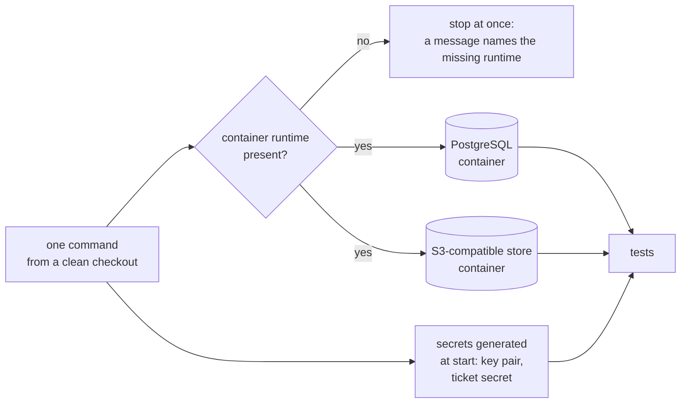

# Testing Strategy

#doc #guide #testing #security #draft

**Guide:** [[Docs/Guide/Guide-Index]] · **Conventions:** [[Docs/Guide/Guide-Conventions]]

## Purpose

This document says what a project tests, at which layer, and on what. The reference projects had tests
that stayed green while no route required a login and the generic update did nothing; the lesson is that
a test must go through the same door a caller uses, on the same database and with a real token. The one
idea to take away: every rule of the Guide that describes behaviour has a test that would fail if the
behaviour were removed — and the authorization of every route is one of those behaviours.

## Design

### What a good test is

- It exercises behaviour through a public interface: a route, a service entry point, a port.
- It asserts on what a caller can observe: a status, a body, a stored row read back, an object in the
  store.
- It survives a rewrite of the inside of the module. It calls no private member, replaces no
  collaborator inside the module under test and asserts on no internal structure.
- It creates the data it needs and leaves nothing another test depends on.

### Layers

| Layer | Proves | Runs on | Examples |
|---|---|---|---|
| Unit | Logic with no I/O | plain objects | An Access Policy's `check` and `rowScope`; an object-key function; the request fingerprint; ticket signing and verification |
| Module | A Platform Module through its entry points | the application context and PostgreSQL in a container | The list engine; the Idempotency Guard; the Upload Coordinator with the local adapter; migrations apply and the mappings validate |
| HTTP | A route from request to response | the whole application, the real security chain, real tokens, PostgreSQL in a container | Statuses and headers; problem details; the authorization matrix |
| Contract suite | That every adapter of a port keeps the port's semantics | each adapter; for the S3-compatible one, an S3-compatible store in a container | Object storage; the Claims Mapper adapters |
| Architecture | The dependency rules of [[Docs/Guide/02-Project-Layout-and-Module-Boundaries]] | the compiled code | G02-11 lists them |

Most tests of a feature are HTTP tests: a feature is routes, and its rules are visible there. Unit tests
are for logic that has many cases and no I/O.

### The environment of a test run

A test run needs a container runtime and nothing else: no database installed on the machine, no cloud
account, no public internet. Persistence is tested on PostgreSQL only (G07-01). An outside system a test
needs — an identity provider's key set, a remote site — is replaced by a local stand-in.

### The authorization matrix

The matrix is a table the project keeps as test data, and a test that runs it. One row per route:

| Route | No token | Actor the policy does not allow | Allowed actor | Actor who may not see the row |
|---|---|---|---|---|
| `GET /api/v1/notes/{id}` | 401 | cannot occur: every caller who sees a note may read it | 200 | 404 |
| `POST /api/v1/notes` | 401 | 403 | 201 | no target row |
| `DELETE /api/v1/notes/{id}` | 401 | 403 | 204 | 404 |
| `GET /api/v1/notes/{id}/download` | 401 | 403 | 200 | 404 |
| `GET /api/v1/files/download/{ticket}` | public by capability: 200 or 302 with a valid ticket, 404 with none | — | — | — |
| `POST /api/v1/auth/login` | public | — | — | — |

The rows are those of the `note` example of [[Docs/Guide/15-Recipe-Add-a-Feature]]: a user owns notes,
an administrator sees every note and may only read, so the administrator is the 403 case of delete and
download.

- **The two middle cases are different actors.** A route that targets a row loads the row through the
  Row Scope first (G04-11). An actor who cannot see the row gets 404 and never reaches the policy check.
  The 403 case therefore needs an actor who **can** see the row and whom no rule allows the action. An
  actor with no rule at all is the 403 case only of a route with no target row.
- A case that cannot occur for a route is written down as such, with the reason. An empty cell is a
  case nobody thought about.

- Every route the application registers has a row. A **route-coverage test** reads the registered routes
  from the running application and fails for any route that has none, so a new route cannot ship
  unclassified. A public route is a row that says so.
- The matrix runs against the real security chain with real tokens: in local mode, tokens signed with a
  key pair generated for the run; in external mode, tokens of a stand-in issuer that serves its key set
  locally. A project that supports both modes runs the matrix in both.
- A list route has one more case: two users with rows of their own each list, and each sees only their
  rows, with totals and page counts that count only those (G04-09).
- Work with no caller is covered at the service: a job's entry point is called directly with the system
  actor. Each feature has a case where the system actor is denied because the policy has no rule for
  it, and one where it is allowed if the feature has system work.

### What every CRUD feature tests

| Behaviour | Expected | Rule |
|---|---|---|
| Create | 201, `Location`, the Response, an `ETag` | G05-04, G05-08 |
| Update with the current tag | Every Request field is changed and read back; a new `ETag` | G04-04 |
| Update or delete with a stale tag; with no precondition | 412; 428 | G04-12, G05-08 |
| Delete, then get | 204, then 404 | G05-04 |
| A duplicate of a unique value | 409 | G09-11 |
| An invalid Request | 400 with every violation | G09-09 |
| A list by two users | Each sees only their rows and their totals | G04-09 |
| A filter or a sort on a field that is not declared | 400 | G06-03 |
| The feature's rows in the authorization matrix | as declared | G13-03 |

A feature with an upload adds: the upload stores and records the file; a wrong digest is refused and
leaves nothing; a retry with the same key returns the first result; the download route issues a ticket
only to an allowed actor.

### What every Platform Module tests

Every invariant and every error mode a Guide document states is backed by at least one test. The project
keeps the list that maps each to its test — the **conformance list**. Its minimum content:

| Module | What is proven | Rules |
|---|---|---|
| CRUD base | Update applies every field; the id comes from the server; the order of checks (a hidden row is not found before a precondition is judged, a denied actor is refused before it); two concurrent writes with one tag — exactly one succeeds; the base cannot be built without a policy; a policy with no rule denies | G04-01, G04-03, G04-04, G04-08, G04-11, G04-13 |
| List engine | Undeclared fields and operators are rejected; values are read by declared type; a request beyond a bound is rejected; the scope is applied before paging; the order is total; a wrong profile stops the start-up; the number of queries does not grow with the page | G06-03, G06-05, G06-08, G06-09, G06-10, G06-15, G06-16 |
| Persistence | The migrations build an empty database and the mappings validate against it; audit fields are never empty, for system work too | G07-02, G07-06 |
| Identity and access | Verification in each mode; the subject invariant; a disabled user is refused on the next request; first-request creation under two simultaneous requests; rebind and its conflict; the public list is exactly the declared one; CORS from configuration, and no start with a wildcard plus credentials | G08-02, G08-04, G08-10, G08-11, G08-12, G08-24, G08-26 |
| Local Token Issuer | Login, wrong password, unknown name, locked credential, disabled user — the four failures answer identically; lockout at the threshold and its reset; refresh rotation and reuse; logout; an expired and a tampered token | G08-16, G08-19, G08-20, G08-21 |
| Errors | The body of every problem type; an unexpected failure shows nothing internal and logs under its correlation id; a security failure has the same shape | G09-02, G09-06, G09-08 |
| Object storage | The contract suite on both adapters; a key that leaves the root is rejected; storing inside a transaction fails with no storage call; a failed persist leaves no object; a failed compensation writes the alert; a wrong digest, a wrong kind and too many bytes leave nothing; ticket round trip, tampered, expired, released; redirect on one adapter and streaming on the other; the download headers; release fails outside a transaction and removes the object only after the commit | G10-03, G10-05, G10-10, G10-11, G10-12, G10-13, G10-14, G10-15, G10-19, G10-20, G10-21, G10-23 |
| Idempotency | Replay; a different request under the same key, including a change of the file only; a request in progress; lease expiry; a failure keeps its status and can be retried; a missing key; a missing digest; an invalid request registers no key; the spool fallback reads once | G11-03, G11-04, G11-05, G11-06, G11-07, G11-13, G11-15 |
| Configuration | The start-up stops for a missing secret and for each unsafe combination | G12-02 |

### What is not tested

- The framework: that a request is routed, that JSON is parsed.
- A generated mapper's field-by-field copying. The build already fails for an unmapped field (G03-06).
- The deployment layer's request throttling (G08-22).
- Anything through an outside system that the test run does not own.

## Rules

### G13-01
**Rule:** A test exercises behaviour through a public interface — a route, a service entry point, a
port — and asserts on what a caller can observe. It calls no private member, replaces no collaborator
inside the module under test and asserts on no internal structure.
**Why:** A test tied to the inside of a module fails when the code is tidied and passes when the
behaviour is broken.
**Evidence:** BE-R08-01, BE-R08-04
**Differs from references:** The tests of `backend/` bypassed the security layer with a simulated user
and so asserted on a path no real caller takes.

### G13-02
**Rule:** The test run needs a container runtime and nothing else: no database on the machine, no cloud
account and no public internet. When the runtime is missing, the run stops at once with a message that
says so.
**Why:** A suite that needs the developer's own database is red on every other machine, and a suite
that is red by default is ignored.
**Evidence:** BT-R09-01, WP-R10-05, WP-R10-04, BE-R08-03, WP-R01-06 · ADR-010
**Differs from references:** BugTracker's one test needed a live MySQL; wpmanager's tests needed MySQL,
the public internet and real cloud keys; the whole-context test of `backend/` failed outside Docker.

### G13-03
**Rule:** Every route has a row in the project's authorization matrix, and the matrix is a test. For
each route it sends a request with no token; as an actor the policy does not allow the action — one who
can see the target row, where the route has one; as an allowed actor; and, for a route that targets a
row, as an actor who may not see that row. It expects not authenticated, forbidden, success and not
found, and a case that cannot occur for a route is marked as such with its reason.
**Why:** Authorization that no test exercises is removed by a refactoring and nobody notices: every
reference project shipped that way.
**Evidence:** BE-R08-01, WP-R10-01, BT-R09-02, BE-R01-01, WP-R01-03 · ADR-005
**Differs from references:** wpmanager tested authorization for one module; `backend/` and BugTracker
for none.

### G13-04
**Rule:** A route-coverage test compares the authorization matrix with the routes the running
application registers. A registered route with no row fails the build; a public route is a row that
says it is public.
**Why:** A matrix kept by hand covers the routes someone remembered, and the dangerous route is the one
nobody remembered.
**Evidence:** WP-R10-01, WP-R01-02, WP-R01-01 · ADR-006
**Differs from references:** wpmanager shipped an anonymous test controller over its bucket that no test
knew about.

### G13-05
**Rule:** The authorization matrix runs against the real security chain with real tokens — a signature,
an issuer and an audience that are verified — in every identity mode the project supports. A simulated
authentication is used only in a test whose subject is neither authentication nor authorization.
**Why:** A simulated user is accepted whether or not the application checks anything, so the suite stays
green with security switched off.
**Evidence:** BE-R08-01 · ADR-006
**Differs from references:** The tests of `backend/` used a simulated user throughout and passed while
no route required a login.

### G13-06
**Rule:** A job or a worker is tested by calling its entry point directly, with the system actor. Each
feature has a test in which the system actor is denied where its Access Policy has no rule for it.
**Why:** Work that only a clock starts is work no test starts, and a policy that quietly lets the system
actor through is a superuser.
**Evidence:** WP-R10-02, WP-R05-02 · ADR-006, ADR-005
**Differs from references:** wpmanager's replication job had no test and ran with no actor.

### G13-07
**Rule:** The local Token Issuer has tests for a successful login, a wrong password, an unknown login
name, a locked credential, a disabled user, the rotation and the reuse of a refresh token, logout, and
an expired and a tampered access token.
**Why:** These are the paths the reference projects got wrong, and none of them had a test.
**Evidence:** BE-R08-02, BE-R01-08, WP-R01-09, BT-R09-02 · ADR-006
**Differs from references:** Login was untested in `backend/` and BugTracker, and all three projects
ignored the account-status flags.

### G13-08
**Rule:** Every CRUD feature has tests for: create with its status, location and body; an update that
changes every Request field and reads it back; delete followed by not found; a duplicate; an invalid
Request; a stale and a missing write precondition; and a list by two users in which each sees only
their own rows and totals.
**Why:** The generic update that did nothing was in every reference project because no test wrote a
field and read it back.
**Evidence:** BE-R08-02, BE-R02-01, BT-R09-02, WP-R10-03
**Differs from references:** `backend/` and BugTracker tested no write operation; in all three the
generic update did nothing and no test noticed.

### G13-09
**Rule:** Every port has one contract suite, written against the port, and the suite runs against every
adapter. For object storage that is the local-filesystem adapter and the S3-compatible adapter on an
S3-compatible store in a container.
**Why:** Two adapters that were tested separately agree only where their authors happened to look.
**Evidence:** WP-R10-02, WP-R05-05 · ADR-013, ADR-010
**Differs from references:** wpmanager's storage code had one adapter and no test.

### G13-10
**Rule:** Every invariant and every error mode that a Guide document states for a Platform Module is
proven by at least one test, and the project keeps the list that maps each to its test.
**Why:** A contract that no test holds is a paragraph; the next change breaks it without a sound.
**Evidence:** WP-R10-02, BT-R09-02, BE-R08-02 · ADR-002
**Differs from references:** Upload, idempotency, storage and replication — the riskiest code of
wpmanager — had no test at all.

### G13-11
**Rule:** Each transaction boundary the Guide states has a test: storing a file inside a transaction
fails with no storage call; a failed persist leaves no object and no row; a failure inside an entry
point leaves no row behind.
**Why:** A transaction boundary cannot be seen in a response; only a test that injects the failure shows
where it is.
**Evidence:** WP-R03-01, WP-R03-02, BT-R07-02 · ADR-013
**Differs from references:** No reference test injected a failure; the partial commits of BugTracker
and wpmanager were found by reading the code.

### G13-12
**Rule:** The whole suite runs with one command from a clean checkout, every test belongs to it, and it
passes on the main branch. A failing test is fixed or removed — it is never skipped and never left
failing.
**Why:** One test that is known to fail teaches everyone to stop reading the result.
**Evidence:** BE-R08-03, WP-R10-05, BT-R09-04, WP-R10-06
**Differs from references:** In `backend/` the default test run was red; in wpmanager one test sat
outside every suite and the recorded results were stale.

### G13-13
**Rule:** No test type is empty and no test is without an assertion; the name of a test states the
behaviour it proves. A test dependency is declared only when a test uses it.
**Why:** Empty suites and unused test libraries read as coverage that does not exist.
**Evidence:** BE-R08-04, BT-R09-03, WP-R09-01
**Differs from references:** `backend/` had empty suites and a test whose name promised more than it
checked; BugTracker declared test libraries no test used.

### G13-14
**Rule:** Each test creates the data it needs and depends on no other test, on no seeded data and on no
order of execution.
**Why:** Tests that share data pass together and fail alone, and the failure points at the wrong test.
**Evidence:** BT-R09-01, BE-R08-04
**Differs from references:** BugTracker's test ran against the development database and whatever it
held.

### G13-15
**Rule:** A project tests its own behaviour: not the framework, not the field copying of a generated
mapper, and not the deployment layer's request throttling. An outside system a test needs is replaced by
a local stand-in.
**Why:** A test of someone else's system fails for someone else's reasons.
**Evidence:** WP-R10-04 · ADR-006
**Differs from references:** A wpmanager test called public websites and failed whenever one of them
changed.

## Differs From the Reference Projects

- Tests go through the real security chain with real tokens (G13-05; BE-R08-01).
- Authorization is tested for every route, and a new route cannot escape the matrix (G13-03, G13-04;
  WP-R10-01, BT-R09-02).
- Tests run on PostgreSQL and an S3-compatible store in containers, and need nothing else (G13-02;
  BT-R09-01, WP-R10-05).
- Writes are tested by writing and reading back (G13-08; BE-R08-02).
- Storage, uploads and idempotency are tested, adapters by one suite (G13-09, G13-10; WP-R10-02).
- The default run is green (G13-12; BE-R08-03).
- Kept from the reference projects: the four-layer tests of the `backend/` query engine and wpmanager's
  end-to-end tests with real tokens — the two places where the references tested the right way.

## Version Notes

- **verified on 4.1.x** — a container is connected to the application under test with
  `@ServiceConnection` (module `spring-boot-testcontainers`) on a field managed by `@Testcontainers` and
  `@Container`; `@DynamicPropertySource` with a `DynamicPropertyRegistry` is the alternative, and the
  way to hand generated values to the application. Evidence:
  https://docs.spring.io/spring-boot/4.1/reference/testing/testcontainers.html
- **verified on 4.1.x** — Spring Security 7.1 offers the `jwt()` request post-processor, which builds an
  authentication for a test without the application's token decoder; it therefore proves nothing about
  token verification. Evidence:
  https://docs.spring.io/spring-security/reference/7.1/servlet/test/mockmvc/oauth2.html
- **not verified** — current-docs lookup at execution time: how the registered routes are read from the
  running application (`RequestMappingHandlerMapping`), and how actuator routes are included.
- **not verified** — current-docs lookup at execution time: the Testcontainers 2.0 modules and classes
  for PostgreSQL and for an S3-compatible store, and how a run fails fast when no container runtime is
  present.
- **not verified** — current-docs lookup at execution time: the ArchUnit version and its integration
  with the JUnit version of this line; ArchUnit is not in Spring Boot's managed set (G01-07).
- **not verified** — current-docs lookup at execution time: how a stand-in issuer serves a key set to
  the resource-server decoder in a test, and which HTTP test client of this line sends real requests to
  the running application.

## Related Documents

- [[Docs/Guide/02-Project-Layout-and-Module-Boundaries]] — the architecture tests (G02-11).
- [[Docs/Guide/04-CRUD-Base-and-Service-Hooks]] — the behaviours of the base that the tests prove.
- [[Docs/Guide/06-Query-Engine]] — the behaviours of the list engine.
- [[Docs/Guide/07-Domain-Model-and-Persistence]] — PostgreSQL in every environment (G07-01).
- [[Docs/Guide/08-Identity-Authentication-and-Authorization]] — the public list, the two identity modes
  and the login rules.
- [[Docs/Guide/09-Errors-and-Validation]] — the problem types a test asserts on.
- [[Docs/Guide/10-Object-Storage-and-Uploads]] — the port's semantics, which the contract suite states.
- [[Docs/Guide/11-Idempotency]] — the outcomes the tests prove.
- [[Docs/Guide/12-Configuration-and-Secrets]] — test configuration and generated secrets (G12-08).
- [[Docs/Guide/15-Recipe-Add-a-Feature]] — where the tests of a new feature are written.
- [[ADRs/ADR-010-postgresql-flyway-and-testcontainers|ADR-010]] — containers for tests.
- [[ADRs/ADR-015-validation-loop-protocol-and-exit-gate|ADR-015]] — the Exit Gate requires these tests
  in every generated project.
