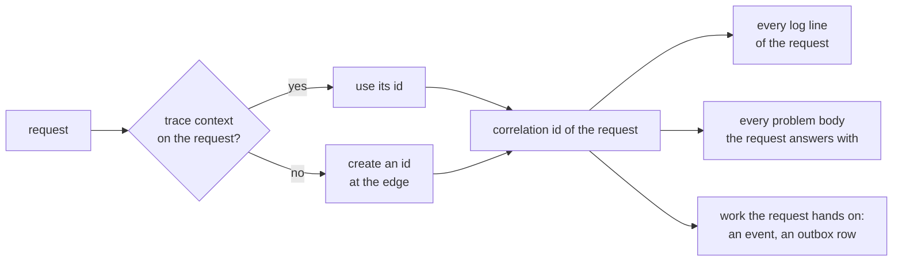

# Observability and Operations

#doc #guide #configuration #error-handling #draft

**Guide:** [[Docs/Guide/Guide-Index]] · **Conventions:** [[Docs/Guide/Guide-Conventions]]

## Purpose

This document is what an operator can rely on: how the application says whether it is healthy, what its
jobs report, what a log line may and may not contain, and how a failure is traced from a client's error
to the server's log. In the reference projects a replication job could stop on every run, and orphaned
files could pile up, with no signal anywhere. The one idea to take away: nothing that runs without a
caller may fail without leaving a signal that an operator can see without reading code.

## Design

### Operational endpoints

Operational endpoints are not API routes. They do not sit under the `/api/v<major>` prefix of
[[Docs/Guide/05-API-Contract]], and they are not in the API description.

| Endpoint | Who may call it | What it answers |
|---|---|---|
| Health — overall, liveness, readiness | anyone; it is on the public list (G08-26) | The status only: up or down |
| Health with details | an authenticated operator | The state of each indicator and each job |
| Every other operational endpoint | off by default; an authenticated operator when a project switches one on | — |

**Liveness** says the process works; it depends on nothing outside the process. **Readiness** says the
instance can take requests; it is down when the database cannot be reached.

| Indicator | Reports | Makes the instance not ready? |
|---|---|---|
| Database | Whether a connection can be obtained | Yes |
| Object store | Whether the active store answers ([[Docs/Guide/10-Object-Storage-and-Uploads]]) | The project decides, and writes the decision down |
| Each job | Last run, last success, processed and failed items, backlog | No |

### Jobs

A job is work that a clock or a queue starts: the clean-up of idempotency records
([[Docs/Guide/11-Idempotency]]) and of refresh tokens, the removal of released files, the orphan sweep,
the replication worker, and whatever a feature schedules.

- A job has an entry point like any other work. A feature's job passes the system actor (G04-02);
  platform housekeeping touches only its own module's tables (G08-07).
- A job that works through items treats each item by itself: a failure is recorded with the item, and
  the job goes on to the next.
- A job reports when it last ran, when it last succeeded, how many items it processed and how many
  failed, and — where it has one — its backlog. The report is part of the detailed health answer.
- A job has an on/off setting the project defines (G12-13).
- A job that must not run twice at the same time takes a lock in the database, because the application
  may run as several instances.

### More than one instance

The application is written to run as several instances behind a load balancer. Whatever instances must
agree on is in the database: idempotency records, refresh tokens, lock state, job locks. Nothing is kept
in the memory of one instance and expected by another. The one stated exception is the local-filesystem
storage adapter, which serves one node (G10-05).

### Logging

| Level | What is logged there |
|---|---|
| Error | A failure of the server that someone must look at: an unexpected exception, a failed compensation, a failed job run |
| Warning | Something unusual that the server handled: a retry, a lock that could not be taken, a credential that was locked |
| Info | The life of the application: start, stop, a job run with its counts |
| Debug | Detail for a developer, off by default — including a request the client got wrong |

- Every line goes through the logging API, with a message that has parameters instead of joined text.
  Nothing writes to standard output and nothing prints a stack trace by itself.
- A request the client got wrong — any 4xx — is not an error of the server and is not logged as one.
- An unexpected failure is logged once, at error level, with its stack trace and its correlation id
  ([[Docs/Guide/09-Errors-and-Validation]], G09-06).
- A log line never holds a secret, a credential, a token or a request body. Personal data — a name, an
  e-mail address — does not appear at the levels that are on by default. A user is named by id.
- Statement logging is off in the default configuration. Bound values are never logged outside a
  developer's machine: they are the application's data.

### The correlation id

A client that reports a failure quotes the `correlationId` of the problem it received; the operator
finds the log lines by that id. A job run has a correlation id of its own, created when the run starts.

### Events that need a person

Some log lines exist to be found by a search or an alert. Each has a fixed event name, written as a
field of the line, and the project keeps the list.

| Event name | When | From |
|---|---|---|
| `storage.compensation-failed` | An upload failed and its object could not be deleted | G10-12 |
| `storage.release-failed` | The removal of a released file keeps failing | G10-23 |
| `job.run-failed` | A job run ended with a failure that is not an item's | this document |
| `identity.rebind` | A subject was rebound — an audit entry, with its actor | G08-12 |

### Calls to other systems

- Every call to another system — the object store, an identity provider's key set, any HTTP service —
  has a connect timeout and a response timeout.
- No such call runs inside a database transaction (G04-15, G10-10).
- The addresses the application calls come from its configuration
  ([[Docs/Guide/12-Configuration-and-Secrets]], G12-10).
- A feature that must call an address a caller supplied — a web hook, a link to check — is a risk of its
  own: without care it lets a caller make the server reach hosts inside the network. Such a feature
  resolves the address first, refuses loopback, private, link-local and metadata addresses, repeats the
  check for every redirect, and limits the time and the size of the answer.

## Rules

### G14-01
**Rule:** The application exposes a health endpoint with a liveness and a readiness answer. Readiness is
down when the database cannot be reached, and the state of the active object store and of every job is
part of the detailed health answer.
**Why:** Without it a load balancer sends requests to an instance that cannot serve them, and a
dependency can be down for days before a user reports it.
**Evidence:** WP-R09-03, WP-R05-06
**Differs from references:** None of the reference projects had a health endpoint or any metric.

### G14-02
**Rule:** Operational endpoints sit outside the API prefix. Health is the only one reachable without
authentication, and it then answers with the status alone; details and every other operational endpoint
need an authenticated operator, and an endpoint the project does not use is off.
**Why:** An open operational endpoint describes the inside of the application — its dependencies, its
settings, its routes — to anyone who asks.
**Evidence:** WP-R09-03, WP-R01-01, BE-R01-03 · ADR-006
**Differs from references:** The reference projects exposed whatever the libraries on their classpath
exposed; nobody had decided.

### G14-03
**Rule:** Every job reports when it last ran, when it last succeeded, how many items it processed and
how many failed, and its backlog where it has one. The report is visible in the detailed health answer.
**Why:** A job that stops fails silently by nature: nobody is waiting for its answer.
**Evidence:** WP-R05-06, WP-R09-03, WP-R05-02
**Differs from references:** wpmanager's replication could stop at one bad row, on every run, with no
signal.

### G14-04
**Rule:** A job that processes items handles the failure of each item by itself: the error is recorded
with the item, and the job continues with the next one.
**Why:** One bad item at the front of the queue otherwise stops everything behind it, for ever.
**Evidence:** WP-R05-02, WP-R03-05
**Differs from references:** wpmanager's replication run ended at the first version it could not copy.

### G14-05
**Rule:** No correctness property depends on the application running as a single instance: what
instances must agree on is in the database, and a job that must not run twice at once takes a lock
there. The one stated exception is local-filesystem storage.
**Why:** State in one instance's memory is wrong on the second instance, and the second instance arrives
with the first scale-out or the first rolling deploy.
**Evidence:** WP-R04-04, WP-R05-06 · ADR-014
**Differs from references:** wpmanager kept idempotency state in a map per instance and ran its jobs
with no lock.

### G14-06
**Rule:** Every log line is written through the logging API with a parameterised message. Nothing writes
to standard output, and nothing prints a stack trace by itself.
**Why:** Output that bypasses the logging API has no level, no correlation id and cannot be filtered or
switched off.
**Evidence:** BE-R09-06, BT-R10-01, WP-R11-02
**Differs from references:** BugTracker and wpmanager printed to standard output; all three joined
values into their messages.

### G14-07
**Rule:** A failure caused by the client's request is not logged as an error. The error level is for a
failure of the server that someone must look at, and an unexpected failure is logged exactly once, with
its stack trace and its correlation id.
**Why:** When every rejected input is an error, the alerts fire all day and the real failure is one line
among thousands.
**Evidence:** BE-R09-06, WP-R11-02, BE-R05-04 · ADR-009
**Differs from references:** `backend/` and wpmanager logged ordinary validation failures at error
level.

### G14-08
**Rule:** A log line never contains a secret, a credential, a token or a request body, and contains no
personal data at the levels that are on by default. A user is named by id.
**Why:** Logs are copied, shipped and kept far longer and far wider than the database they describe.
**Evidence:** BE-R09-06, BT-R10-01, WP-R11-02, WP-R01-04
**Differs from references:** The reference projects logged user names and e-mail addresses at error
level and on standard output.

### G14-09
**Rule:** Statement logging is off in the default configuration, and bound values are never logged
outside a developer's machine.
**Why:** Statement logs cost I/O on every query, and bound values are the data itself — password hashes
included.
**Evidence:** BE-R07-05
**Differs from references:** `backend/` logged every statement in its runtime configuration.

### G14-10
**Rule:** Every request has one correlation id — the id of the incoming trace context when there is
one, otherwise an id created at the edge. It is on every log line written for the request and in every
problem the request is answered with, and a job run has one of its own.
**Why:** An error id the client holds is worthless if the server's log lines do not carry it.
**Evidence:** BE-R05-03, WP-R08-02 · ADR-009
**Differs from references:** The reference projects had no correlation id; a reported failure was found
by time and guesswork.

### G14-11
**Rule:** An event that needs a person — a compensation that failed, a released file that cannot be
removed, a job run that failed — is logged at error level with a fixed event name from the project's
list of events.
**Why:** A message that is reworded stops matching the search and the alert that were built on it.
**Evidence:** WP-R03-03, WP-R05-06 · ADR-013
**Differs from references:** wpmanager logged an orphaned-file alert on one failure path and nothing on
the others.

### G14-12
**Rule:** Every call to another system has a connect timeout and a response timeout, and no such call
runs inside a database transaction.
**Why:** A call with no timeout holds a request thread — and, inside a transaction, a database
connection — for as long as the other system hangs.
**Evidence:** WP-R05-07, WP-R03-02, WP-R01-12 · ADR-013
**Differs from references:** wpmanager called its object store with no timeout, from inside a
transaction.

### G14-13
**Rule:** The application calls only addresses that its configuration names. A feature that must call an
address a caller supplied resolves it first, refuses loopback, private, link-local and metadata
addresses, applies the same check to every redirect, and limits the time and the size of the answer.
**Why:** A server that fetches any address on request lets a caller reach the hosts that only the server
can reach.
**Evidence:** WP-R01-12, WP-R10-04
**Differs from references:** wpmanager probed any website URL a client sent, followed its redirects and
waited up to twenty seconds.

## Differs From the Reference Projects

- There is a health endpoint, and jobs report through it (G14-01, G14-03; WP-R09-03, WP-R05-06).
- One bad item does not stop a job (G14-04; WP-R05-02).
- Nothing assumes a single instance (G14-05; WP-R04-04).
- Logging goes through the logging API, with levels that mean something and no personal data (G14-06,
  G14-07, G14-08; BE-R09-06, BT-R10-01, WP-R11-02).
- Statement logging is off by default (G14-09; BE-R07-05).
- A failure can be followed from the client to the log by one id (G14-10; BE-R05-03).
- Calls to other systems have timeouts, and caller-supplied addresses are checked (G14-12, G14-13;
  WP-R05-07, WP-R01-12).

## Version Notes

- **verified on 4.1.x** — Spring Boot's Actuator exposes only the health endpoint over HTTP by default
  (`management.endpoints.web.exposure.include`), at `/actuator/health`; it shows details according to
  `management.endpoint.health.show-details`, whose default is `never`; liveness and readiness are served
  at `/actuator/health/liveness` and `/actuator/health/readiness`; and a custom indicator implements
  `org.springframework.boot.health.contributor.HealthIndicator`. Evidence:
  https://docs.spring.io/spring-boot/4.1/reference/actuator/endpoints.html
- **verified on 3.4.x** — with Hibernate 6 the category that logs bound values is
  `org.hibernate.orm.jdbc.bind`; the older category name does nothing. Evidence: BE-R07-05
- **not verified** — current-docs lookup at execution time: whether the liveness and readiness groups
  are on by default outside Kubernetes (`management.endpoint.health.probes.enabled`), and which
  indicators belong to readiness by default.
- **not verified** — current-docs lookup at execution time: how the trace id of this line's tracing
  support reaches the logging context and the log pattern, and how an id is created when no trace
  context arrives.
- **not verified** — current-docs lookup at execution time: how a job takes a lock in the database — a
  PostgreSQL advisory lock, or a lock library, which is not in Spring Boot's managed set (G01-07).
- **not verified** — current-docs lookup at execution time: the timeout settings of the HTTP client of
  this line, and how its redirect handling is switched off.

## Related Documents

- [[Docs/Guide/05-API-Contract]] — operational endpoints are not API routes.
- [[Docs/Guide/08-Identity-Authentication-and-Authorization]] — health on the public list (G08-26);
  platform housekeeping (G08-07); the audit of a rebind (G08-12).
- [[Docs/Guide/09-Errors-and-Validation]] — the correlation id in every problem (G09-02) and the
  catch-all (G09-06).
- [[Docs/Guide/10-Object-Storage-and-Uploads]] — the store's health, the alert of a failed compensation
  and the jobs of the storage module.
- [[Docs/Guide/11-Idempotency]] — the clean-up job.
- [[Docs/Guide/12-Configuration-and-Secrets]] — statement logging off by default (G12-09); job switches
  (G12-13).
- [[Docs/Guide/13-Testing-Strategy]] — a job is tested through its entry point (G13-06).
- [[ADRs/ADR-009-unchecked-domain-exceptions-as-problem-details|ADR-009]] — the correlation id.
- [[ADRs/ADR-013-object-storage-port-upload-coordinator-and-download-tickets|ADR-013]] — the alert log
  entry and the replication health indicator.
