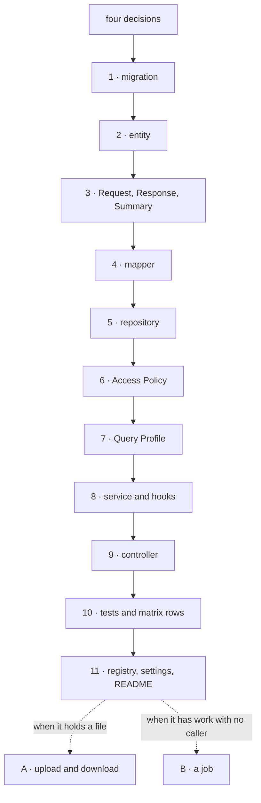

# Recipe: Add a Feature

#doc #guide #architecture #api-design #draft

**Guide:** [[Docs/Guide/Guide-Index]] · **Conventions:** [[Docs/Guide/Guide-Conventions]]

## Purpose

This document walks through adding one Feature Module, from the first decision to the last test, with a
`note` feature as the running example: a note has an owner, a title, a body, a status and one optional
attachment. It restates no rule. Each step names what to write and cites the rules that govern it, so
the walk can be followed with the other documents open. The one idea to take away: a feature is a
package, a migration and tests — when adding one seems to need a change to a Platform Module, that is a
change to the platform, made first and by itself.

## Design

### Before any code: four decisions

| Decision | For the example | Lands in |
|---|---|---|
| Who may do what? | A user may create notes and may read, change, delete and download their own; an administrator may read all; the system actor may delete notes past their retention | `NoteAccessPolicy.check` |
| Who sees which rows? | A user sees their own notes; an administrator sees all; the system actor sees all | `NoteAccessPolicy.rowScope` |
| Which fields can a list filter and sort by? | title, status, created-at | `NoteQueryProfile` |
| Does it hold a file, and does it have work with no caller? | One attachment; one nightly clean-up | The two optional parts below |

A cell with no answer is a denied cell (G04-08). Writing the table first is what makes the policy
complete.

### The walk



| Step | Write | Governed by |
|---|---|---|
| 1 | The migration `V<n>__note.sql`: the table with the shared columns (identifier, concurrency token, four audit fields), the owner's user id with its foreign key, every constraint the rules of the feature imply | [[Docs/Guide/07-Domain-Model-and-Persistence]] — G07-02, G07-03, G07-13, G07-15 |
| 2 | The entity `Note`, extending the shared base type; associations lazy; the status stored by name | G07-04, G07-11, G07-12 |
| 3 | `NoteRequest` with its input constraints and no server-owned field; `NoteResponse`; `NoteSummary` | [[Docs/Guide/03-Feature-Module-Anatomy]] — G03-03, G03-04, G03-05 |
| 4 | `NoteMapper`, with its four operations and the server-controlled fields listed as ignored | G03-06, G03-07 |
| 5 | `NoteRepository` | G03-01 |
| 6 | `NoteAccessPolicy` from the decision table: `check` and `rowScope`, an answer for every actor | [[Docs/Guide/04-CRUD-Base-and-Service-Hooks]] — G04-07, G04-08; [[Docs/Guide/06-Query-Engine]] — G06-11 |
| 7 | `NoteQueryProfile`: each field once, the default sort, the bounds | G06-03, G06-08 |
| 8 | `NoteService`, extending the CRUD base with the four collaborators; the rules of the data in its hooks; the owner recorded in the relation hook | G04-01, G04-05, G04-06 |
| 9 | `NoteController`, extending the base controller: the collection path, and only the routes that are not one of the six | [[Docs/Guide/05-API-Contract]] — G05-02, G05-03; G03-10 |
| 10 | The feature's rows in the authorization matrix — with the 403 case played by an actor who can see the row — and its tests | [[Docs/Guide/13-Testing-Strategy]] — G13-03, G13-08 |
| 11 | A problem type only if a client must tell a new failure apart; a settings type only if the feature has a setting; the README's list of settings | [[Docs/Guide/09-Errors-and-Validation]] — G09-04; [[Docs/Guide/12-Configuration-and-Secrets]] — G12-01, G12-11 |

What the Access Policy of the example looks like — a sketch of the shape, not of framework syntax:

```java
// features.note
class NoteAccessPolicy implements AccessPolicy<Note> {

  public void check(Action action, CurrentUser actor, Note noteOrNull) {
    boolean allowed =
        actor.isSystem()                  ? action == Action.delete
      : actor.roles().contains("ADMIN")   ? READS.contains(action)        // get, list, search
      : actor.roles().contains("USER");   // every action; the Row Scope limits a user to their own notes
    if (!allowed) throw new Forbidden();  // no rule matched: denied
  }

  public RowScope rowScope(CurrentUser actor) {
    if (actor.isSystem())                 return RowScope.system(actor);
    if (actor.roles().contains("ADMIN"))  return RowScope.all();
    if (actor.roles().contains("USER"))   return RowScope.ownedBy("ownerId", actor);
    return RowScope.none();               // an actor with no rule sees nothing
  }
}
```

### A · When the feature holds a file

| Step | Write | Governed by |
|---|---|---|
| A1 | A lazy association from the note to its `StoredFile`: a column with a foreign key, added by a migration | G10-08, G07-11 |
| A2 | The key function: `notes/<ownerId>/<generated unique part>` | G10-07 |
| A3 | The Upload Policy: the largest size and the allowed kinds | G10-14, G10-15 |
| A4 | The upload operation in the service: **no transaction**; the scoped load and the policy check; then `UploadCoordinator.store`, whose persist step attaches the stored file to the note and releases the one it replaces | G10-10, G10-11, G10-23 |
| A5 | The upload route, carrying the idempotency marker | [[Docs/Guide/11-Idempotency]] — G15-03 |
| A6 | The download route: scoped load, the policy check for `download`, `DownloadTickets.issue` | G10-16 |
| A7 | The release of the file in the delete hook | G10-23 |
| A8 | Tests: the upload stores and records; a wrong digest leaves nothing; a retry with the same key returns the first result; the ticket goes only to an allowed actor; the matrix rows of the two routes | G13-08, G13-10 |

```java
// features.note — the upload operation; it declares no transaction
public NoteResponse attach(Long noteId, UploadSource source, CurrentUser actor) {
  Note note = listQuery.findVisible(Note.class, noteId, policy.rowScope(actor))
      .orElseThrow(NotFound::new);                           // scoped load: not found when hidden
  policy.check(Action.update, actor, note);
  return uploads.store(source, NOTE_ATTACHMENTS, NoteKeys.attachment(note), storedFile ->
      replaceAttachment(noteId, storedFile, actor));         // runs inside the coordinator's short transaction:
}                                                            // attach the new file, release the old one, stamp the actor
```

### B · When the feature has work with no caller

| Step | Write | Governed by |
|---|---|---|
| B1 | An operation in the service that takes the actor like any other | G04-02 |
| B2 | A narrow rule for the system actor in the Access Policy | G04-07, G08-06 |
| B3 | The trigger: it calls the operation with `CurrentUser.system()`, handles each item by itself and reports its run | [[Docs/Guide/14-Observability-and-Operations]] — G14-03, G14-04 |
| B4 | An on/off setting for the job | G12-13 |
| B5 | A test that calls the operation with the system actor | G13-06 |

### C · When the feature does not fit the CRUD base

A feature that is not "six operations on rows" — a report, a state machine, a join of two features — is
a plain service and controller. Steps 6, 7, 10 and 11 stay as they are; the service consults the policy
at every entry point and lists through the list engine (G03-09).

### Done when

- The feature's package holds the file set and nothing else that has a role in it (G03-01).
- The migration builds the tables on an empty database and the mappings validate (G07-02).
- Every route of the feature has a row in the authorization matrix, and the matrix passes (G13-03,
  G13-04).
- The feature tests pass (G13-08), and the architecture tests still pass (G02-11).
- No Platform Module was changed.

## Rules

### G15-01
**Rule:** A feature is added by adding its package, its migrations and its tests. Adding a feature
changes no Platform Module; a change the platform needs is made first, as a change to the platform and
to the Guide document that describes it.
**Why:** A platform edited to fit one feature stops fitting the others, and the next feature copies the
edit instead of the contract.
**Evidence:** WP-R07-03, WP-R02-06 · ADR-004, ADR-005
**Differs from references:** wpmanager's features overrode half of the base service, and its theme
feature was a copy of its plugin feature that had already diverged.

### G15-02
**Rule:** A feature is complete only with its migration, its Access Policy, its rows in the
authorization matrix and its feature tests, delivered in the same change as its code.
**Why:** The parts left for later are the ones the reference projects never wrote: the tests and the
authorization.
**Evidence:** BE-R08-02, WP-R10-01, WP-R07-01, BE-R03-04 · ADR-010
**Differs from references:** wpmanager shipped a theme upload that failed on every call, with no test
that ran it; no reference feature came with a migration.

### G15-03
**Rule:** An upload endpoint carries the idempotency marker. A feature that leaves it out states the
reason in the type-level documentation of its controller.
**Why:** An upload is the request most likely to be retried after a timeout and the most expensive to
run twice.
**Evidence:** WP-R04-02 · ADR-014
**Differs from references:** wpmanager guarded its uploads, with a key that could not tell a retry from
a different upload.

### G15-04
**Rule:** A feature that stores a file has all of: a key function, an Upload Policy, a download route
that issues a ticket, and a release of the file in its delete hook and wherever it replaces the file.
**Why:** Each missing part is a known defect: an unchecked file, a file nobody may fetch, or an object
that outlives its row.
**Evidence:** WP-R02-05, WP-R07-02, WP-R08-05 · ADR-013
**Differs from references:** wpmanager's inherited delete route removed the row and left the objects.

### G15-05
**Rule:** A job of a feature has an entry point that takes the system actor, a rule for that actor in
the feature's Access Policy, a report of its runs and an on/off setting.
**Why:** A job written as a method that a scheduler calls has no actor, no authorization and no signal
when it stops.
**Evidence:** WP-R03-05, WP-R05-06 · ADR-006
**Differs from references:** wpmanager's jobs wrote rows with no actor and no transaction, and reported
nothing.

## Differs From the Reference Projects

- A feature is eleven files and a migration, written in a fixed order, instead of a copy of the nearest
  feature (G15-01; WP-R07-03).
- Authorization is decided in a table before the code is written (G15-02; WP-R10-01).
- A feature arrives with its migration and its tests (G15-02; BE-R08-02, BE-R03-04).
- An upload is guarded, checked, served through tickets and released (G15-03, G15-04; WP-R04-02,
  WP-R02-05).
- Kept from the reference projects: each of them ends its explanation documents with a recipe for
  building a project the same way; this document is that recipe for the corrected convention.

## Version Notes

None.

## Related Documents

- [[Docs/Guide/02-Project-Layout-and-Module-Boundaries]] — where the feature package sits and what it
  may use.
- [[Docs/Guide/03-Feature-Module-Anatomy]] — the file set this recipe walks through.
- [[Docs/Guide/04-CRUD-Base-and-Service-Hooks]] — the base, the hooks and the Access Policy.
- [[Docs/Guide/05-API-Contract]] — routes and statuses.
- [[Docs/Guide/06-Query-Engine]] — the Query Profile and the Row Scope.
- [[Docs/Guide/07-Domain-Model-and-Persistence]] — the entity and the migration.
- [[Docs/Guide/09-Errors-and-Validation]] — failures a hook may raise.
- [[Docs/Guide/10-Object-Storage-and-Uploads]] — part A.
- [[Docs/Guide/11-Idempotency]] — the marker on the upload route.
- [[Docs/Guide/12-Configuration-and-Secrets]] — a feature's settings.
- [[Docs/Guide/13-Testing-Strategy]] — the feature tests and the matrix.
- [[Docs/Guide/14-Observability-and-Operations]] — part B.
- [[ADRs/ADR-005-deepened-crud-base-with-access-policy|ADR-005]] — the base a feature plugs into.
- [[ADRs/ADR-014-idempotency-guard-opt-in-per-endpoint|ADR-014]] — decision 10: the upload recipe opts
  in.
