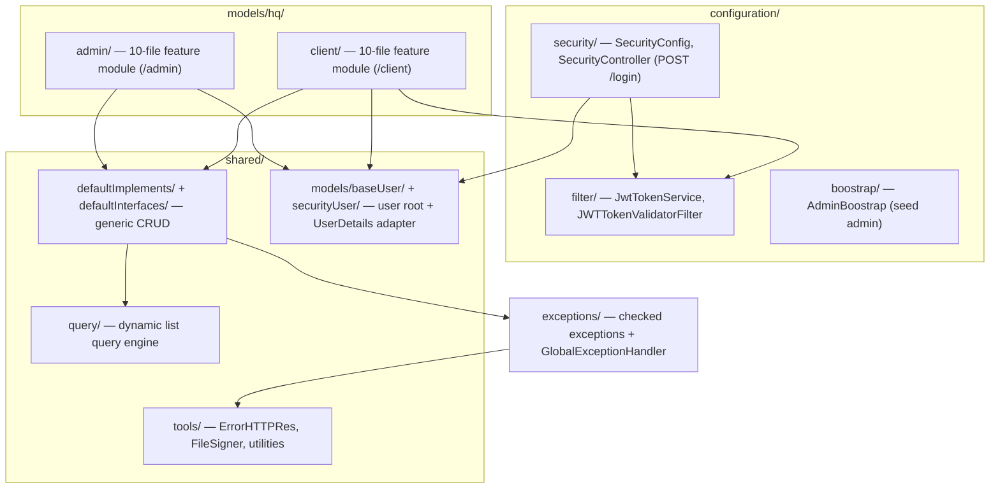

# Overview and Design Philosophy — backend

#doc #explanation #ref-backend #architecture

**Project:** `backend/` · **Stack:** Spring Boot 3.4.1, Java 21 · **Index:** [[Docs/backend/backend-Index]]

## Summary

`backend/` (Maven artifact `agentForgeBackend`) is a small, user-centric REST backend: it manages two
kinds of users — **admins** and **clients** — authenticates them with a username/password login that
returns a stateless JWT, and exposes a generic CRUD API plus a paginated, filterable list endpoint for
each user type. The code is dominated by *shared infrastructure* (a generic CRUD framework and a dynamic
list-query engine) rather than by business features: the two feature modules are thin, 10-file
subclasses of that infrastructure. The one idea to take away: **a feature is "a set of typed classes
plugged into generic base classes"**, and everything reusable lives under `shared/`.

## Why It Is Built This Way

### Stated intent

The code states very little intent outright. The few explicit statements are in comments and
configuration:

- `backend/pom.xml:14-15` still names the project `authServer` / "Auth microservice" — the codebase was
  born as an authentication service.
- `backend/src/main/java/com/agentForgeBackend/configuration/security/SecurityController.java:36-65`
  comments each login step ("Authenticate the user", "Generate token", "Build response").
- `backend/src/main/resources/application.properties:24-30` states that secrets "MUST be set via
  environment variable" in production.

### Inferred design philosophy

Read from the structure of the code, four principles recur:

1. **Convention-driven generic CRUD, minimal per-feature code.** `DefaultController` and
   `DefaultServiceImplements` implement every CRUD endpoint once
   (`backend/src/main/java/com/agentForgeBackend/shared/defaultImplements/DefaultController.java:17-59`,
   `backend/src/main/java/com/agentForgeBackend/shared/defaultImplements/DefaultServiceImplements.java:31-103`).
   `AdminController` is 14 lines long
   (`backend/src/main/java/com/agentForgeBackend/models/hq/admin/AdminController.java:7-14`).
2. **One user table hierarchy.** Every user type extends the abstract JPA root `BaseUserEntity` with
   `JOINED` inheritance, so login, uniqueness of `username`/`email` and roles are handled once
   (`backend/src/main/java/com/agentForgeBackend/shared/models/baseUser/BaseUserEntity.java:11-18`).
3. **Stateless JWT authentication.** No server session; every request carries a signed token that the
   filter turns into a `SecurityContext`
   (`backend/src/main/java/com/agentForgeBackend/configuration/security/SecurityConfig.java:52-57`).
4. **Whitelist-first querying.** Clients can only filter and sort on fields that a per-entity
   `QueryProfile` explicitly registers, with typed values and bounded paging
   (`backend/src/main/java/com/agentForgeBackend/models/hq/admin/AdminQueryProfile.java:18-29`,
   `backend/src/main/java/com/agentForgeBackend/shared/query/PageableFactory.java:80-82`).

A fifth, implicit principle shows up in the intended security model: authorization rules are written
**on service methods** with `@PreAuthorize` rather than on URLs
(`backend/src/main/java/com/agentForgeBackend/models/hq/admin/AdminServiceImpl.java:33-35`). Method
security is not switched on, so this remains intent only — see
[[Docs/backend/Explanations/07-Authentication-and-Authorization]].

### Lineage

`backend/` is the newest of three related projects. The generic CRUD stack originates in BugTracker
(Spring Boot 2.7.0), whose `DefaultController<DTO, MINIDTO, LISTDTO, FORM, ID>` already carries a list-DTO
type parameter (`BugTracker/src/main/java/com/bgsystem/bugtracker/shared/controller/DefaultController.java:17`,
`BugTracker/pom.xml:8`). wpmanager moved it to Spring Boot 3.4.1 and **dropped** the list DTO
(`wpmanager/src/main/java/com/wpmanager/shared/defaultImplements/DefaultController.java:14`).
`backend/` then:

- **inherited** wpmanager's `configuration/` and `shared/` packages almost file for file. The JWT service
  is identical apart from the package name
  (`wpmanager/src/main/java/com/wpmanager/configuration/filter/JwtTokenService.java`,
  `backend/src/main/java/com/agentForgeBackend/configuration/filter/JwtTokenService.java`), and the
  upload/URL utilities came along even though `backend/` has no upload feature
  (`backend/src/main/java/com/agentForgeBackend/shared/tools`);
- **re-introduced** the `LISTDTO` type parameter and added a new QueryDSL-based list/filter subsystem
  (`backend/src/main/java/com/agentForgeBackend/shared/query`), wired into the base service as
  `getListPage` (`backend/src/main/java/com/agentForgeBackend/shared/defaultImplements/DefaultServiceImplements.java:70-79`);
- **switched** the production database to PostgreSQL
  (`backend/src/main/resources/application.properties:5-8`) and routed both application secrets to one
  environment variable, `JWT_SECRET` (`backend/src/main/resources/application.properties:26`,
  `backend/src/main/resources/application.properties:30`).

It also directly replaces this workspace's former `auth-server/` reference project. The security
classes are the same with a package rename.

## How It Works

The application is one Spring Boot process with four top-level packages under
`com.agentForgeBackend`:

A request to a feature endpoint flows: `JWTTokenValidatorFilter` (reads the `Authorization` header and
populates the `SecurityContext`) → feature controller (inherits handlers from `DefaultController`) →
feature service (inherits from `DefaultServiceImplements`, overrides what differs) → Spring Data
repository (`JpaRepository` + `QuerydslPredicateExecutor`) → mapper (entity → DTO). Checked exceptions
thrown on the way are turned into a JSON error body by `GlobalExceptionHandler`
(`backend/src/main/java/com/agentForgeBackend/exceptions/GlobalExceptionHandler.java:16-17`).

The application class enables scheduling and web security at the top level
(`backend/src/main/java/com/agentForgeBackend/agentForgeBackendApplication.java:8-11`).

### Stack

| Concern | Choice | Version | Source |
|---|---|---|---|
| Framework | Spring Boot (parent POM) | 3.4.1 | `backend/pom.xml:5-10` |
| Language | Java | 21 | `backend/pom.xml:30` |
| Persistence | Spring Data JPA (Hibernate, Boot-managed) | 6.6.x | `backend/pom.xml:57-60` |
| Dynamic queries | OpenFeign QueryDSL (`querydsl-jpa` + `querydsl-apt` `jpa` classifier) | 6.12 | `backend/pom.xml:33`, `backend/pom.xml:61-65`, `backend/pom.xml:193-198` |
| Security | Spring Security (Boot-managed) | 6.4.2 | `backend/pom.xml:74-77` |
| JWT | JJWT (`api`, `impl`, `jackson`) | 0.12.5 | `backend/pom.xml:120-136` |
| Validation | Jakarta Bean Validation starter | Boot-managed | `backend/pom.xml:78-81` |
| Boilerplate | Lombok | Boot-managed | `backend/pom.xml:115-119` |
| Production DB | PostgreSQL driver | Boot-managed | `backend/pom.xml:110-114` |
| Test DB | H2 (MySQL mode) | Boot-managed | `backend/pom.xml:105-109`, `backend/src/main/resources/application-test.properties:4` |
| Tests | JUnit 5 + Mockito + Spring Security Test + JUnit Platform Suite | Boot-managed / 5.14.2 | `backend/pom.xml:36-48`, `backend/pom.xml:138-168` |

Several further starters (batch, data-jdbc, data-rest, web-services, webflux, websocket) and the AWS S3
SDK are declared but not referenced by any code; see
[[Docs/backend/Explanations/02-Build-Tooling-and-Dependencies]].

## Key Components

| Component | Path | Responsibility |
|---|---|---|
| Application entry point | `backend/src/main/java/com/agentForgeBackend/agentForgeBackendApplication.java` | Boots Spring; enables scheduling and web security |
| Security configuration | `backend/src/main/java/com/agentForgeBackend/configuration/security/SecurityConfig.java` | Filter chain, CORS, password encoder, JSON 401/403 handlers |
| Login endpoint | `backend/src/main/java/com/agentForgeBackend/configuration/security/SecurityController.java` | `POST /login` → JWT |
| JWT service + filter | `backend/src/main/java/com/agentForgeBackend/configuration/filter` | Issue and validate tokens |
| Generic CRUD framework | `backend/src/main/java/com/agentForgeBackend/shared/defaultImplements` | Base controller and service |
| List query engine | `backend/src/main/java/com/agentForgeBackend/shared/query` | Whitelisted filter/sort/paging for `POST /<feature>/list` |
| User root entity | `backend/src/main/java/com/agentForgeBackend/shared/models/baseUser/BaseUserEntity.java` | Shared user columns, roles, account flags |
| Feature modules | `backend/src/main/java/com/agentForgeBackend/models/hq` | `admin/` and `client/` |
| Error mapping | `backend/src/main/java/com/agentForgeBackend/exceptions/GlobalExceptionHandler.java` | Exception → HTTP status + `ErrorHTTPRes` |

## Conventions and Rules

- Everything reusable goes under `shared/`; everything cross-cutting and framework-facing goes under
  `configuration/`; features go under `models/hq/<feature>/`.
- A feature is exactly one package with the same 10 file roles (see
  [[Docs/backend/Explanations/03-Package-Structure-and-Module-Anatomy]]).
- Features extend the generic base classes rather than writing controllers and services from scratch.
- Domain failures are signalled with the project's checked exceptions and mapped centrally.
- Secrets are read from properties that are populated from environment variables in production.

## How to Replicate

1. Create a Spring Boot 3.4.x / Java 21 Maven project with web, data-jpa, security, validation, Lombok,
   JJWT 0.12.x and OpenFeign QueryDSL 6.x (details in
   [[Docs/backend/Explanations/02-Build-Tooling-and-Dependencies]]).
2. Create the four top-level packages `configuration/`, `shared/`, `models/`, `exceptions/`.
3. Build `shared/` first: the generic CRUD framework
   ([[Docs/backend/Explanations/04-Generic-CRUD-Framework]]) and the query engine
   ([[Docs/backend/Explanations/05-Dynamic-List-Query-Engine]]).
4. Add the user root entity and security wiring
   ([[Docs/backend/Explanations/06-Domain-Model-and-Persistence]],
   [[Docs/backend/Explanations/07-Authentication-and-Authorization]]).
5. Add the error contract ([[Docs/backend/Explanations/08-Error-Handling]]).
6. Add features as 10-file modules. The full walkthrough is
   [[Docs/backend/Explanations/11-Recipe-Build-a-Project-This-Way]].

## Known Limitations

- The intended service-level authorization is not active, and no URL rules exist, so every endpoint is
  reachable without a token
  ([[Docs/backend/Reviews/01-Security-Review#BE-R01-01|BE-R01-01]]).
- The inherited `update` operation does not apply the submitted form
  ([[Docs/backend/Reviews/02-CRUD-Framework-and-API-Design-Review#BE-R02-01|BE-R02-01]]).
- Roughly a third of `shared/tools/` and several declared dependencies are unused carry-overs from
  wpmanager ([[Docs/backend/Reviews/09-Code-Hygiene-Review#BE-R09-01|BE-R09-01]],
  [[Docs/backend/Reviews/07-Build-Dependencies-and-Configuration-Review#BE-R07-01|BE-R07-01]]).

## Related Documents

- [[Docs/backend/backend-Index]]
- [[Docs/backend/Explanations/02-Build-Tooling-and-Dependencies]]
- [[Docs/backend/Explanations/03-Package-Structure-and-Module-Anatomy]]
- [[Docs/backend/Reviews/00-Review-Summary]]
- [[Docs/Analysis-Doc-Conventions]]
