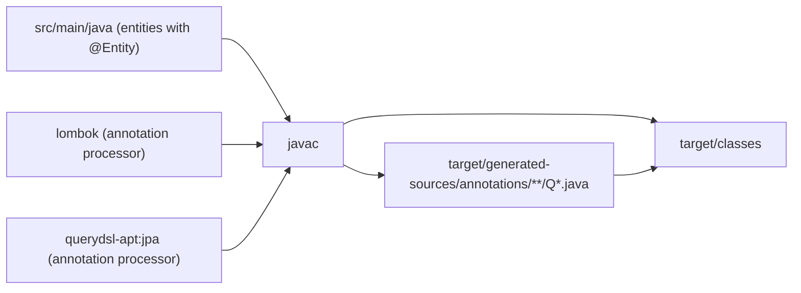

# Build, Tooling and Dependencies — backend

#doc #explanation #ref-backend #build

**Project:** `backend/` · **Stack:** Spring Boot 3.4.1, Java 21 · **Index:** [[Docs/backend/backend-Index]]

## Summary

`backend/` is a single-module Maven project that inherits `spring-boot-starter-parent` 3.4.1 and
targets Java 21. Two annotation processors run at compile time: **Lombok** (getters, builders,
constructors) and **QueryDSL APT** with the `jpa` classifier, which generates a `Q`-class per JPA entity
for the list query engine. Surefire is configured to exclude the tag-based `*SuiteTest` classes, and a
`test.sh` script runs the whole test tree through one JUnit Platform suite. The one thing to know: the
dependency list is a superset of what the code uses. Only about half of the declared starters are
referenced by any class.

## Why It Is Built This Way

- **Boot parent POM for version management.** Every Spring, Hibernate, H2, PostgreSQL and Lombok version
  is inherited (`backend/pom.xml:5-10`). Only JJWT, QueryDSL, the S3 SDK, Mockito and Surefire carry
  explicit versions (`backend/pom.xml:29-34`, `backend/pom.xml:120-136`, `backend/pom.xml:159-163`).
- **QueryDSL via annotation processing, not a Maven plugin.** Adding `querydsl-apt` (classifier `jpa`) to
  `annotationProcessorPaths` next to Lombok makes `javac` emit the `Q`-types in the normal compile step
  (`backend/pom.xml:184-201`). No `apt-maven-plugin` is needed.
- **Inferred:** the starter list was copied from wpmanager, whose POM declares the same batch, data-jdbc,
  data-rest, web-services, webflux and websocket starters (`wpmanager/pom.xml:50-90`). It was not pruned
  for `backend/`'s smaller scope.

## How It Works

### Compile pipeline



The processors are declared in the compiler plugin:

`backend/pom.xml:187-199`
```xml
<annotationProcessorPaths>
    <path>
        <groupId>org.projectlombok</groupId>
        <artifactId>lombok</artifactId>
    </path>
    <path>
        <groupId>io.github.openfeign.querydsl</groupId>
        <artifactId>querydsl-apt</artifactId>
        <version>${openfeign.querydsl.version}</version>
        <classifier>jpa</classifier>
    </path>
</annotationProcessorPaths>
```

Generated Q-classes land in `backend/target/generated-sources/annotations` — one each for
`QBaseUserEntity`, `QAdminEntity` and `QClientEntity`
(`backend/target/generated-sources/annotations/com/agentForgeBackend/models/hq/admin/QAdminEntity.java`).
They are referenced statically from the query profiles
(`backend/src/main/java/com/agentForgeBackend/models/hq/admin/AdminQueryProfile.java:16`). The
Spring Boot plugin excludes Lombok from the fat jar (`backend/pom.xml:202-213`).

### Dependencies and their use

"Used" means at least one class under `src/` imports or relies on it (checked with `grep` over
`backend/src`).

| Dependency | Scope | Purpose | Used? | Source |
|---|---|---|---|---|
| `spring-boot-starter-web` | compile | REST controllers, Jackson | Used | `backend/pom.xml:82-85` |
| `spring-boot-starter-data-jpa` | compile | Entities, repositories | Used | `backend/pom.xml:57-60` |
| `querydsl-jpa` 6.12 | compile | Predicates, `QuerydslPredicateExecutor` | Used | `backend/pom.xml:61-65` |
| `spring-boot-starter-security` | compile | Filter chain, BCrypt, `AuthenticationManager` | Used | `backend/pom.xml:74-77` |
| `spring-boot-starter-validation` | compile | `@Valid` on request bodies, constraints on query DTOs | Used | `backend/pom.xml:78-81` |
| `jjwt-api` / `jjwt-impl` / `jjwt-jackson` 0.12.5 | compile / runtime / runtime | JWT signing and parsing | Used | `backend/pom.xml:120-136` |
| `lombok` | optional | Boilerplate generation | Used | `backend/pom.xml:115-119` |
| `postgresql` | runtime | Production driver | Used (config only) | `backend/pom.xml:110-114` |
| `h2` | runtime | Test database | Used by tests, but shipped at runtime scope | `backend/pom.xml:105-109` |
| `spring-boot-devtools` | runtime, optional | Dev restarts | Dev only | `backend/pom.xml:99-104` |
| `spring-boot-starter-batch` | compile | Spring Batch | **Unused** (auto-configuration still runs) | `backend/pom.xml:49-52` |
| `spring-boot-starter-data-jdbc` | compile | Spring Data JDBC | **Unused** | `backend/pom.xml:53-56` |
| `spring-boot-starter-data-rest` | compile | Auto-exported repository REST endpoints | **Unused in code** (auto-configuration active) | `backend/pom.xml:66-69` |
| `spring-boot-starter-jdbc` | compile | `JdbcTemplate` | **Unused** (pulled by JPA anyway) | `backend/pom.xml:70-73` |
| `spring-boot-starter-web-services` | compile | SOAP | **Unused** | `backend/pom.xml:86-89` |
| `spring-boot-starter-webflux` | compile | Reactive web / `WebClient` | **Unused** | `backend/pom.xml:90-93` |
| `spring-boot-starter-websocket` | compile | WebSocket | **Unused** | `backend/pom.xml:94-97` |
| `software.amazon.awssdk:s3` 2.20.12 | compile | S3 client | **Unused** | `backend/pom.xml:158-163` |
| `spring-boot-starter-test`, `spring-security-test` | test | Test support | Used | `backend/pom.xml:138-157` |
| `reactor-test`, `spring-batch-test` | test | Reactive / batch test support | **Unused** | `backend/pom.xml:143-152` |
| `mockito-core`, `mockito-junit-jupiter` (`${mockito.version}` = 5.14.2) | test | Mocks | Used | `backend/pom.xml:31`, `backend/pom.xml:36-48` |
| `junit-platform-suite-engine` | test | `@Suite` classes | Used | `backend/pom.xml:164-168` |

Boot 3.4.1 already manages Mockito at 5.14.2 and Surefire at 3.5.2
(`~/.m2` `spring-boot-dependencies-3.4.1.pom`). The POM's `mockito.version` property therefore
restates the managed value, while `maven.surefire.version` 3.2.5 **downgrades** Surefire
(`backend/pom.xml:31-32`).

### Test execution

Surefire passes `-XX:+EnableDynamicAgentLoading` (lets Mockito's inline mock maker attach its agent on
JDK 21 without a warning) and excludes `**/*SuiteTest.java`, so the tag suites never run in a plain
`mvn test` (`backend/pom.xml:173-183`). `test.sh` picks a Java 21 JDK if `JAVA_HOME` is not already
21 and runs everything through `TestLauncher`, a JUnit Platform `@Suite` selecting the whole
`com.agentForgeBackend` package (`backend/test.sh:5-15`,
`backend/src/test/java/com/agentForgeBackend/TestLauncher.java:8-12`).

### Container and environment files

- `Dockerfile` is a **development** image: `maven:3.9.6-eclipse-temurin-21`, pre-fetches dependencies,
  and runs `mvn spring-boot:run`; the source is expected to be mounted from a `docker-compose.yml`
  (`backend/Dockerfile:2`, `backend/Dockerfile:12-22`). No compose file exists in `backend/`.
- The production datasource host is the compose service name `db`
  (`backend/src/main/resources/application.properties:5`).
- `.nvm` is a two-line environment file defining `FILE_SIGNATURE_SECRET` and `JWT_SECRET_KEY`
  (values `<redacted>`; `backend/.nvm:1-2`). Neither name matches the variable the properties actually
  read (`JWT_SECRET`, `backend/src/main/resources/application.properties:26`,
  `backend/src/main/resources/application.properties:30`); see
  [[Docs/backend/Explanations/09-Configuration-and-Secrets]].

### Identity leftovers

The artifact is `com:agentForgeBackend`, but `<name>` and `<description>` still say `authServer` /
"Auth microservice" (`backend/pom.xml:11-15`). `HELP.md` is the unmodified Spring Initializr file
(`backend/HELP.md:1-5`).

## Key Components

| Component | Path | Responsibility |
|---|---|---|
| POM | `backend/pom.xml` | Parent, dependencies, processors, Surefire config |
| Maven wrapper | `backend/mvnw` | Reproducible Maven version |
| Test runner script | `backend/test.sh` | Select JDK 21, run `TestLauncher` |
| Dev container | `backend/Dockerfile` | `mvn spring-boot:run` with mounted sources |
| Env file | `backend/.nvm` | Local secret variables (values `<redacted>`) |
| Generated Q-types | `backend/target/generated-sources/annotations` | QueryDSL metamodel (build output) |

## Conventions and Rules

- Let the Boot parent manage versions. Pin only libraries that Boot does not manage (JJWT, QueryDSL).
- Keep the QueryDSL version in one property (`openfeign.querydsl.version`) and reuse it for both the
  runtime artifact and the APT processor (`backend/pom.xml:33`, `backend/pom.xml:64`,
  `backend/pom.xml:196`).
- Use the **OpenFeign** QueryDSL fork (`io.github.openfeign.querydsl`), not the original `com.querydsl`
  coordinates, with the `jpa` classifier on the processor.
- Suites named `*SuiteTest` are for manual, tag-scoped runs; they are excluded from the default build.

## How to Replicate

1. Generate a Boot 3.4.x / Java 21 Maven project; keep `spring-boot-starter-parent` as parent.
2. Add `web`, `data-jpa`, `security`, `validation`, `lombok`, `postgresql` (runtime), `h2` (test scope is
   preferable to this project's runtime scope), `spring-boot-starter-test`, `spring-security-test`.
3. Add `io.github.openfeign.querydsl:querydsl-jpa:${openfeign.querydsl.version}` and the three JJWT
   artifacts (`api` compile, `impl` + `jackson` runtime).
4. In `maven-compiler-plugin`, list Lombok and `querydsl-apt` (classifier `jpa`) under
   `annotationProcessorPaths`.
5. Configure Surefire with `-XX:+EnableDynamicAgentLoading` and, if you use tag suites, exclude
   `**/*SuiteTest.java`.
6. Add `junit-platform-suite-engine` (test) and a `TestLauncher` `@Suite` plus a `test.sh` if you want a
   single entry point.
7. Run `./mvnw compile` and confirm `target/generated-sources/annotations` contains a `Q`-class per entity.

## Known Limitations

- Seven starters, the S3 SDK and two test libraries are declared but unused
  ([[Docs/backend/Reviews/07-Build-Dependencies-and-Configuration-Review#BE-R07-01|BE-R07-01]]). Two of
  them are not inert: Spring Data REST may export repositories
  ([[Docs/backend/Reviews/01-Security-Review#BE-R01-03|BE-R01-03]]) and the batch starter needs a live
  database at context start-up
  ([[Docs/backend/Reviews/08-Testing-Review#BE-R08-03|BE-R08-03]]).
- H2 is packaged at runtime scope
  ([[Docs/backend/Reviews/07-Build-Dependencies-and-Configuration-Review#BE-R07-03|BE-R07-03]]).
- Surefire is pinned below the Boot-managed version and the Mockito pin is redundant
  ([[Docs/backend/Reviews/07-Build-Dependencies-and-Configuration-Review#BE-R07-04|BE-R07-04]]).
- The Dockerfile is development-only and refers to a compose file that is not present
  ([[Docs/backend/Reviews/07-Build-Dependencies-and-Configuration-Review#BE-R07-09|BE-R07-09]]).
- The POM identity is stale
  ([[Docs/backend/Reviews/07-Build-Dependencies-and-Configuration-Review#BE-R07-10|BE-R07-10]]).

## Related Documents

- [[Docs/backend/Explanations/01-Overview-and-Design-Philosophy]]
- [[Docs/backend/Explanations/05-Dynamic-List-Query-Engine]]
- [[Docs/backend/Explanations/09-Configuration-and-Secrets]]
- [[Docs/backend/Explanations/10-Testing-Strategy]]
- [[Docs/backend/Reviews/07-Build-Dependencies-and-Configuration-Review]]
