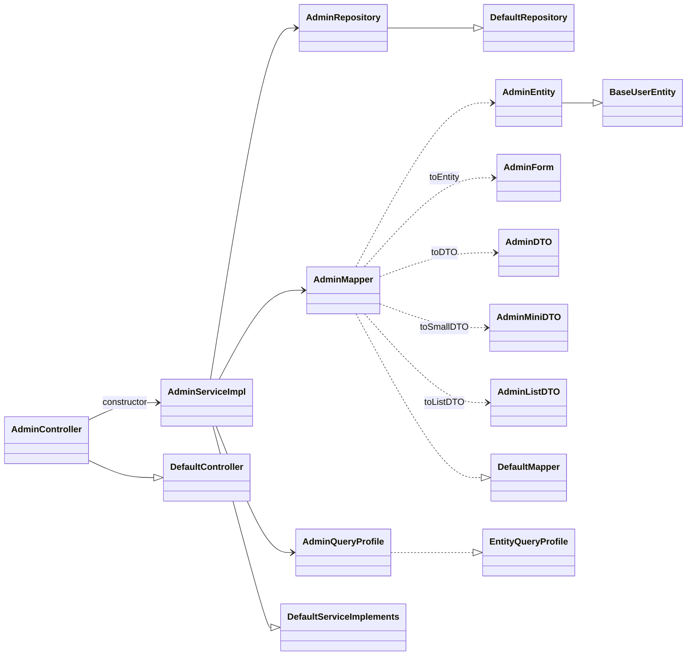

# Package Structure and Module Anatomy — backend

#doc #explanation #ref-backend #architecture

**Project:** `backend/` · **Stack:** Spring Boot 3.4.1, Java 21 · **Index:** [[Docs/backend/backend-Index]]

## Summary

The code is organized **package-by-layer at the top and package-by-feature underneath**:
`configuration/`, `constant/`, `exceptions/` and `shared/` are technical layers, while `models/hq/`
holds one package per feature. Every feature package contains the same ten file roles — controller,
three response DTOs, entity, form, mapper, query profile, repository and service — and each role
extends or implements a generic type from `shared/`. That fixed file set is the unit of work in this
codebase: adding a feature means writing those ten files.

## Why It Is Built This Way

- **Stated intent:** none in comments. The structure itself is the statement.
- **Inferred:** the ten-file set exists because the generic base types need exactly these type arguments.
  `DefaultServiceImplements<DTO, MINIDTO, LISTDTO, FORM, ENTITY, ID>` asks for four data shapes plus the
  entity and its id
  (`backend/src/main/java/com/agentForgeBackend/shared/defaultImplements/DefaultServiceImplements.java:31-32`),
  and the base service's constructor asks for a repository, a mapper and a query profile
  (`backend/src/main/java/com/agentForgeBackend/shared/defaultImplements/DefaultServiceImplements.java:40-44`).
  One file per type argument and per collaborator yields the ten files.
- **Inferred:** `models/hq/` ("headquarters") leaves room for other top-level domains next to `hq`; only
  `hq` exists today.

## How It Works

### Package tree (main sources, 69 files)

| Package | Files | Lines | Contents |
|---|---|---|---|
| `com.agentForgeBackend` | 1 | 17 | `agentForgeBackendApplication` |
| `configuration.boostrap` | 1 | 52 | `AdminBoostrap` (seed admin on start-up) |
| `configuration.filter` | 2 | 149 | `JwtTokenService`, `JWTTokenValidatorFilter` |
| `configuration.security` | 4 | 221 | `SecurityConfig`, `SecurityController`, `LoginForm`, `LoginResponseDTO` |
| `constant` | 1 | 9 | `ApplicationConstants` (JWT header/issuer, string limits) |
| `exceptions` | 6 | 239 | five checked exceptions + `GlobalExceptionHandler` |
| `models.hq.admin` | 10 | 350 | Admin feature module |
| `models.hq.client` | 10 | 469 | Client feature module |
| `shared.defaultImplements` | 2 | 162 | `DefaultController`, `DefaultServiceImplements` |
| `shared.defaultInterfaces` | 4 | 54 | `DefaultService`, `DefaultRepository`, `DefaultMapper`, `DownloadableParent` |
| `shared.functional` | 1 | 20 | `ThrowingSupplier` |
| `shared.models.baseUser` | 5 | 156 | `BaseUserEntity`, `UserRoles`, `BaseUserMapper`, two DTOs |
| `shared.query` | 10 | 908 | List query engine |
| `shared.securityUser` | 3 | 100 | `SecurityUser`, `SecurityUserServiceImpl`, `BaseUserRepository` |
| `shared.tools` | 9 | 612 | `ErrorHTTPRes`, `FileSigner`, `AuthUserUtil`, validators, upload helpers |

Test sources mirror the main tree under `backend/src/test/java/com/agentForgeBackend` (see
[[Docs/backend/Explanations/10-Testing-Strategy]]).

### The ten-file feature module

| Role | Admin file | Client file | What it is | Extends / implements |
|---|---|---|---|---|
| Controller | `backend/src/main/java/com/agentForgeBackend/models/hq/admin/AdminController.java` | `backend/src/main/java/com/agentForgeBackend/models/hq/client/ClientController.java` | `@RestController` + `@RequestMapping("/<feature>")`; constructor passes the service up | `DefaultController<DTO, MINIDTO, LISTDTO, FORM, Long>` |
| Service | `backend/src/main/java/com/agentForgeBackend/models/hq/admin/AdminServiceImpl.java` | `backend/src/main/java/com/agentForgeBackend/models/hq/client/ClientService.java` | `@Service`; overrides the CRUD methods whose rules differ | `DefaultServiceImplements<…, ENTITY, Long>` |
| Repository | `backend/src/main/java/com/agentForgeBackend/models/hq/admin/AdminRepository.java` | `backend/src/main/java/com/agentForgeBackend/models/hq/client/ClientRepository.java` | Spring Data interface + derived finders | `DefaultRepository<ENTITY, Long>` |
| Entity | `backend/src/main/java/com/agentForgeBackend/models/hq/admin/AdminEntity.java` | `backend/src/main/java/com/agentForgeBackend/models/hq/client/ClientEntity.java` | `@Entity` + `@Table(name = "<feature>")` | `BaseUserEntity` |
| Form | `backend/src/main/java/com/agentForgeBackend/models/hq/admin/AdminForm.java` | `backend/src/main/java/com/agentForgeBackend/models/hq/client/ClientForm.java` | Request body for create and update | — |
| DTO | `backend/src/main/java/com/agentForgeBackend/models/hq/admin/AdminDTO.java` | `backend/src/main/java/com/agentForgeBackend/models/hq/client/ClientDTO.java` | Full response for `GET /{id}`, `PUT`, `DELETE` | — |
| MiniDTO | `backend/src/main/java/com/agentForgeBackend/models/hq/admin/AdminMiniDTO.java` | `backend/src/main/java/com/agentForgeBackend/models/hq/client/ClientMiniDTO.java` | Response for `POST` (create) | — |
| ListDTO | `backend/src/main/java/com/agentForgeBackend/models/hq/admin/AdminListDTO.java` | `backend/src/main/java/com/agentForgeBackend/models/hq/client/ClientListDTO.java` | Row shape for `POST /list` pages (includes `id`, `enabled`, dates) | — |
| Mapper | `backend/src/main/java/com/agentForgeBackend/models/hq/admin/AdminMapper.java` | `backend/src/main/java/com/agentForgeBackend/models/hq/client/ClientMapper.java` | `@Component`, hand-written entity ↔ DTO mapping | `DefaultMapper<DTO, MINIDTO, LISTDTO, FORM, ENTITY>` |
| Query profile | `backend/src/main/java/com/agentForgeBackend/models/hq/admin/AdminQueryProfile.java` | `backend/src/main/java/com/agentForgeBackend/models/hq/client/ClientQueryProfile.java` | `@Component` whitelist of filterable/sortable fields | `EntityQueryProfile<ENTITY>` |

### Request and response tiers

- **Request tier:** one `Form` per feature for both `POST` and `PUT`
  (`backend/src/main/java/com/agentForgeBackend/shared/defaultImplements/DefaultController.java:41-51`),
  plus the shared `PageableRequest` for lists
  (`backend/src/main/java/com/agentForgeBackend/shared/query/PageableRequest.java:19-37`).
- **Response tier:** three shapes, from smallest to richest in intent: `MiniDTO` (create acknowledgement),
  `ListDTO` (list rows, flat, sortable fields only), `DTO` (single-resource view). In practice the Admin
  `DTO` and `MiniDTO` have identical fields
  (`backend/src/main/java/com/agentForgeBackend/models/hq/admin/AdminDTO.java:13-19`,
  `backend/src/main/java/com/agentForgeBackend/models/hq/admin/AdminMiniDTO.java:13-19`), and only the
  `ListDTO` carries `id` for Admin
  (`backend/src/main/java/com/agentForgeBackend/models/hq/admin/AdminListDTO.java:19-29`).
- Entities never leave the service layer through the feature controllers. Mappers convert them first.

### Non-feature packages

- `shared/securityUser` hosts `BaseUserRepository`, a repository over the abstract root entity used only
  by login (`backend/src/main/java/com/agentForgeBackend/shared/securityUser/BaseUserRepository.java:8-12`).
- `shared/tools/AuthUserUtil` reaches *into* the feature packages (imports `AdminEntity`,
  `ClientRepository`, …), so `shared/` is not dependency-free
  (`backend/src/main/java/com/agentForgeBackend/shared/tools/AuthUserUtil.java:3-6`).
- `constant/ApplicationConstants` centralizes JWT header, issuer and subject strings plus text-field
  limits (`backend/src/main/java/com/agentForgeBackend/constant/ApplicationConstants.java:3-10`).

## Key Components

| Component | Path | Responsibility |
|---|---|---|
| Technical layers | `backend/src/main/java/com/agentForgeBackend/configuration` | Security, JWT, start-up seeding |
| Shared framework | `backend/src/main/java/com/agentForgeBackend/shared` | Generic CRUD, query engine, user root, tools |
| Error layer | `backend/src/main/java/com/agentForgeBackend/exceptions` | Exceptions and their HTTP mapping |
| Admin module | `backend/src/main/java/com/agentForgeBackend/models/hq/admin` | Reference 10-file module (no custom update) |
| Client module | `backend/src/main/java/com/agentForgeBackend/models/hq/client` | 10-file module with custom insert/update and a token endpoint |

## Conventions and Rules

| Rule | Example | Evidence |
|---|---|---|
| Feature package = `models/hq/<feature>/` (lowercase) | `models/hq/client` | `backend/src/main/java/com/agentForgeBackend/models/hq/client` |
| Class names = `<Feature><Role>` in PascalCase | `ClientQueryProfile` | `backend/src/main/java/com/agentForgeBackend/models/hq/client/ClientQueryProfile.java:14` |
| Service class is `<Feature>ServiceImpl` **or** `<Feature>Service` (both occur; no separate interface in either case) | `AdminServiceImpl`, `ClientService` | `backend/src/main/java/com/agentForgeBackend/models/hq/admin/AdminServiceImpl.java:17`, `backend/src/main/java/com/agentForgeBackend/models/hq/client/ClientService.java:26` |
| Mini response type is named `MiniDTO`, but the mapper method is `toSmallDTO` | `toSmallDTO` | `backend/src/main/java/com/agentForgeBackend/shared/defaultInterfaces/DefaultMapper.java:7` |
| Table name = feature name, set explicitly | `@Table (name = "admin")` | `backend/src/main/java/com/agentForgeBackend/models/hq/admin/AdminEntity.java:11` |
| Base path = `/<feature>` | `@RequestMapping("/client")` | `backend/src/main/java/com/agentForgeBackend/models/hq/client/ClientController.java:14` |
| ID type is `Long` for all features | `…, Long>` | `backend/src/main/java/com/agentForgeBackend/models/hq/admin/AdminController.java:9` |
| DTOs and forms use Lombok `@Data @Builder @NoArgsConstructor @AllArgsConstructor` | `ClientDTO` | `backend/src/main/java/com/agentForgeBackend/models/hq/client/ClientDTO.java:7-12` |
| Controllers receive the concrete service class, not an interface | `AdminController(AdminServiceImpl service)` | `backend/src/main/java/com/agentForgeBackend/models/hq/admin/AdminController.java:11` |

## How to Replicate

For a new feature `Widget` (entity with its own table):

1. Create package `models/hq/widget/`.
2. `WidgetEntity.java` — `@Entity @Table(name = "widget")`, Lombok `@Getter @Setter @NoArgsConstructor`.
3. `WidgetForm.java` — request body with Bean Validation constraints.
4. `WidgetDTO.java`, `WidgetMiniDTO.java`, `WidgetListDTO.java` — Lombok `@Data @Builder`.
5. `WidgetRepository.java` — `interface WidgetRepository extends DefaultRepository<WidgetEntity, Long>`.
6. `WidgetMapper.java` — `@Component implements DefaultMapper<WidgetDTO, WidgetMiniDTO, WidgetListDTO, WidgetForm, WidgetEntity>`.
7. `WidgetQueryProfile.java` — `@Component implements EntityQueryProfile<WidgetEntity>` using `QWidgetEntity`.
8. `WidgetService.java` — `@Service extends DefaultServiceImplements<…, WidgetEntity, Long>`; constructor
   takes repository, mapper, query profile, `PageableFactory<WidgetEntity>`,
   `QueryPredicateBuilder<WidgetEntity>`.
9. `WidgetController.java` — `@RestController @RequestMapping("/widget") extends DefaultController<…, Long>`.
10. Build once so APT generates `QWidgetEntity`.

Code sketches for each file are in [[Docs/backend/Explanations/11-Recipe-Build-a-Project-This-Way]].

## Known Limitations

- `shared/` depends on feature packages through `AuthUserUtil`
  ([[Docs/backend/Reviews/09-Code-Hygiene-Review#BE-R09-07|BE-R09-07]]).
- The three response DTO shapes overlap heavily; for Admin two are identical
  ([[Docs/backend/Reviews/02-CRUD-Framework-and-API-Design-Review#BE-R02-06|BE-R02-06]]).
- Mapper field coverage differs between the three DTOs of the same feature
  ([[Docs/backend/Reviews/04-Feature-Module-Correctness-Review#BE-R04-03|BE-R04-03]]).
- The bootstrap package and class are misspelled (`boostrap`)
  ([[Docs/backend/Reviews/09-Code-Hygiene-Review#BE-R09-02|BE-R09-02]]).

## Related Documents

- [[Docs/backend/Explanations/04-Generic-CRUD-Framework]]
- [[Docs/backend/Explanations/05-Dynamic-List-Query-Engine]]
- [[Docs/backend/Explanations/11-Recipe-Build-a-Project-This-Way]]
- [[Docs/backend/Reviews/04-Feature-Module-Correctness-Review]]
