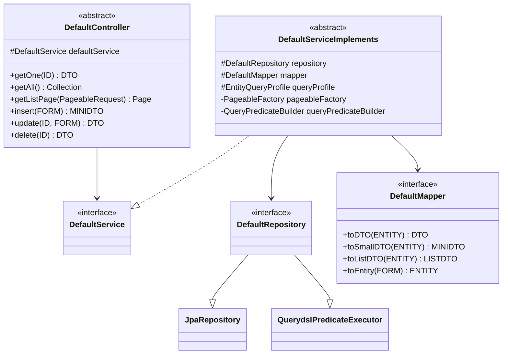

# Generic CRUD Framework — backend

#doc #explanation #ref-backend #architecture #api-design

**Project:** `backend/` · **Stack:** Spring Boot 3.4.1, Java 21 · **Index:** [[Docs/backend/backend-Index]]

## Summary

`shared/defaultImplements` and `shared/defaultInterfaces` form a small generic CRUD framework: an
abstract `DefaultController` that declares six REST endpoints once, an abstract
`DefaultServiceImplements` that implements them against a Spring Data repository, a mapper interface,
and a repository interface that combines `JpaRepository` with `QuerydslPredicateExecutor`. A feature
subclasses the controller and service, binds the type parameters, and overrides only the service methods
whose rules differ. The framework is parameterized by six types — `DTO, MINIDTO, LISTDTO, FORM, ENTITY,
ID` — and every domain failure is a checked exception declared on the generic signatures.

## Why It Is Built This Way

- **Inferred intent: write CRUD once.** The same six endpoints appear in every feature, so they live in
  one abstract controller
  (`backend/src/main/java/com/agentForgeBackend/shared/defaultImplements/DefaultController.java:25-57`).
- **Inferred intent: separate data shapes per use.** Distinct type parameters for the full view, the
  create acknowledgement, the list row and the input form let each endpoint return a purpose-built shape
  (`backend/src/main/java/com/agentForgeBackend/shared/defaultInterfaces/DefaultService.java:13-25`).
- **Inferred intent: transactional safety with checked exceptions.** Spring rolls back only on unchecked
  exceptions by default, so the base service lists every project exception in `rollbackFor`
  (`backend/src/main/java/com/agentForgeBackend/shared/defaultImplements/DefaultServiceImplements.java:24-30`).
- **Lineage:** BugTracker's version already used the six-parameter service
  (`BugTracker/src/main/java/com/bgsystem/bugtracker/shared/service/DefaultServiceImplements.java:20`);
  wpmanager reduced it to five (`wpmanager/src/main/java/com/wpmanager/shared/defaultImplements/DefaultServiceImplements.java:22`);
  `backend/` restored `LISTDTO` to type the new list endpoint.

## How It Works

### Type-parameter map



| Parameter | Meaning | Admin binding | Client binding |
|---|---|---|---|
| `DTO` | Full single-resource response | `AdminDTO` | `ClientDTO` |
| `MINIDTO` | Create response | `AdminMiniDTO` | `ClientMiniDTO` |
| `LISTDTO` | List row | `AdminListDTO` | `ClientListDTO` |
| `FORM` | Create/update request body | `AdminForm` | `ClientForm` |
| `ENTITY` | JPA entity (service/mapper/repository only) | `AdminEntity` | `ClientEntity` |
| `ID` | Primary key type | `Long` | `Long` |

`DefaultRepository` is marked `@NoRepositoryBean` so Spring Data does not try to instantiate it
(`backend/src/main/java/com/agentForgeBackend/shared/defaultInterfaces/DefaultRepository.java:7-8`).

### Inherited endpoints

| Method + path | Handler | Service call | Response | Evidence |
|---|---|---|---|---|
| `GET /{id}` | `getOne` | `getOne(id)` | `200` + `DTO` | `backend/src/main/java/com/agentForgeBackend/shared/defaultImplements/DefaultController.java:25-28` |
| `GET ""` or `GET /` | `getAll` | `getAll()` | `200` + `Collection<DTO>` (a `Set`) | `backend/src/main/java/com/agentForgeBackend/shared/defaultImplements/DefaultController.java:30-33` |
| `POST /list` | `getListPage` | `getListPage(request)` | `200` + `Page<LISTDTO>` | `backend/src/main/java/com/agentForgeBackend/shared/defaultImplements/DefaultController.java:35-39` |
| `POST ""` or `POST /` | `insert` | `insert(form)` | `200` + `MINIDTO` | `backend/src/main/java/com/agentForgeBackend/shared/defaultImplements/DefaultController.java:41-45` |
| `PUT /{id}` | `update` | `update(id, form)` | `200` + `DTO` | `backend/src/main/java/com/agentForgeBackend/shared/defaultImplements/DefaultController.java:47-51` |
| `DELETE /{id}` | `delete` | `delete(id)` | `200` + deleted `DTO` | `backend/src/main/java/com/agentForgeBackend/shared/defaultImplements/DefaultController.java:53-57` |

Request bodies are validated with `@Valid` before the service is called.

### Base service behavior

`backend/src/main/java/com/agentForgeBackend/shared/defaultImplements/DefaultServiceImplements.java:81-102`
```java
@Override
@PreAuthorize("isAuthenticated()")
public MINIDTO insert (FORM form) throws ItemNotFoundException, ItemAlreadyExist,
        InvalidInsertDetails{
    return mapper.toSmallDTO(repository.save(mapper.toEntity(form)));
}

@Override
@PreAuthorize("isAuthenticated()")
public DTO update(ID id, FORM form) throws ItemNotFoundException, InvalidInsertDetails{
    ENTITY toUpdate = repository.findById(id).orElseThrow(ItemNotFoundException::new);
    repository.save(toUpdate);
    return mapper.toDTO(toUpdate);
}

@Override
@PreAuthorize("isAuthenticated()")
public DTO delete(ID id) throws ItemNotFoundException, InvalidDeleteOperation {
    ENTITY toDelete = repository.findById(id).orElseThrow(ItemNotFoundException::new);
    repository.delete(toDelete);
    return mapper.toDTO(toDelete);
}
```

- `insert` maps the form to an entity, saves it, and returns the mini DTO.
- `update` loads the entity and saves it **unchanged**: the `form` argument is never read. A feature that
  does not override `update` (Admin) gets a `PUT` endpoint that returns `200` without modifying anything.
- `delete` removes the entity and returns its DTO.
- `getAll` maps every row to a DTO and collects into a `Set`
  (`backend/src/main/java/com/agentForgeBackend/shared/defaultImplements/DefaultServiceImplements.java:61-68`).
- `getListPage` delegates to the query engine and is the only method marked `readOnly`
  (`backend/src/main/java/com/agentForgeBackend/shared/defaultImplements/DefaultServiceImplements.java:70-79`).
- Every method carries `@PreAuthorize("isAuthenticated()")`. Method security is not enabled, so these
  annotations are not evaluated (see [[Docs/backend/Explanations/07-Authentication-and-Authorization]]).

The class-level `@Transactional(rollbackFor = {…})` covers all five project exceptions. `@Transactional`
is `@Inherited`, so subclass methods run inside the same transaction semantics.

### Feature overrides

| Service | Overridden method | Why | Evidence |
|---|---|---|---|
| `AdminServiceImpl` | `insert` | Require username/email/password, reject duplicates, BCrypt the password, force role `ADMIN` | `backend/src/main/java/com/agentForgeBackend/models/hq/admin/AdminServiceImpl.java:33-59` |
| `AdminServiceImpl` | `getOne` | Custom not-found message, `hasRole('ADMIN')` | `backend/src/main/java/com/agentForgeBackend/models/hq/admin/AdminServiceImpl.java:61-67` |
| `ClientService` | `getOne` | Log and custom not-found message | `backend/src/main/java/com/agentForgeBackend/models/hq/client/ClientService.java:48-57` |
| `ClientService` | `insert` | Manual field validation, uniqueness checks, role `CLIENT`, derived password | `backend/src/main/java/com/agentForgeBackend/models/hq/client/ClientService.java:59-104` |
| `ClientService` | `update` | Partial update with uniqueness checks | `backend/src/main/java/com/agentForgeBackend/models/hq/client/ClientService.java:106-159` |
| `ClientService` | *(new)* `generateTokenForClient` | Mint a JWT for a client | `backend/src/main/java/com/agentForgeBackend/models/hq/client/ClientService.java:161-172` |

### Reaching the feature-specific repository

The base field is typed `DefaultRepository<ENTITY, ID>`. To call a feature finder such as
`findByUsername`, services downcast it:

`backend/src/main/java/com/agentForgeBackend/models/hq/admin/AdminServiceImpl.java:44-46`
```java
AdminRepository repository = (AdminRepository) this.repository;
//Check if user already exist in our DB, if user exist, throws ItemAlreadyExist exception
if (repository.findByUsername(toSave.getUsername()) != null || repository.findByEmail(toSave.getEmail()) != null)
```

`ClientService` does the same (`backend/src/main/java/com/agentForgeBackend/models/hq/client/ClientService.java:80`),
and `ClientController` downcasts the inherited service field to reach `generateTokenForClient`
(`backend/src/main/java/com/agentForgeBackend/models/hq/client/ClientController.java:25`).

### Extension points

1. **Override a service method** (most common).
2. **Add a new controller endpoint** in the feature controller (`GET /client/token/{username}`).
3. **Add finders** to the feature repository.
4. **Choose the response shape** by what the mapper puts in each DTO.

There is no hook for pre/post-save logic in the base class; any variation means overriding the whole
method.

## Key Components

| Component | Path | Responsibility |
|---|---|---|
| `DefaultController` | `backend/src/main/java/com/agentForgeBackend/shared/defaultImplements/DefaultController.java` | Six generic REST handlers |
| `DefaultServiceImplements` | `backend/src/main/java/com/agentForgeBackend/shared/defaultImplements/DefaultServiceImplements.java` | Generic CRUD + list implementation, transactions |
| `DefaultService` | `backend/src/main/java/com/agentForgeBackend/shared/defaultInterfaces/DefaultService.java` | Service contract used by the controller |
| `DefaultRepository` | `backend/src/main/java/com/agentForgeBackend/shared/defaultInterfaces/DefaultRepository.java` | `JpaRepository` + `QuerydslPredicateExecutor` |
| `DefaultMapper` | `backend/src/main/java/com/agentForgeBackend/shared/defaultInterfaces/DefaultMapper.java` | Four mapping methods |

## Conventions and Rules

- Feature controllers contain no CRUD code; they only bind types and pass the service to `super`.
- Feature services pass all five collaborators to `super(...)` in a fixed order: repository, mapper,
  query profile, pageable factory, predicate builder.
- Domain errors are thrown as the project's checked exceptions
  (`ItemNotFoundException`, `ItemAlreadyExist`, `InvalidInsertDetails`, `InvalidDeleteOperation`,
  `InvalidQueryRequestException`), which the base signatures already declare.
- Authorization intent is expressed with `@PreAuthorize` on service methods, never on controllers.
- A feature that needs feature-specific repository methods downcasts `this.repository`.

## How to Replicate

1. Create `shared/defaultInterfaces/DefaultRepository.java`:
   `@NoRepositoryBean interface DefaultRepository<ENTITY, ID> extends JpaRepository<ENTITY, ID>, QuerydslPredicateExecutor<ENTITY>`.
2. Create `DefaultMapper<DTO, MINIDTO, LISTDTO, FORM, ENTITY>` with `toDTO`, `toSmallDTO`, `toListDTO`,
   `toEntity`.
3. Create `DefaultService<DTO, MINIDTO, LISTDTO, FORM, ID>` with `getOne`, `getAll`, `insert`, `update`,
   `delete`, `getListPage`, each declaring the checked exceptions it may throw.
4. Create `shared/defaultImplements/DefaultServiceImplements.java` — abstract, class-level
   `@Transactional(rollbackFor = {all project exceptions})`, constructor taking repository, mapper, query
   profile, `PageableFactory<ENTITY>`, `QueryPredicateBuilder<ENTITY>`.
5. Create `DefaultController.java` — abstract, one field `DefaultService`, the six mappings shown above,
   `@Valid @RequestBody` on bodies.
6. For each feature, subclass both and bind the six type arguments (see
   [[Docs/backend/Explanations/03-Package-Structure-and-Module-Anatomy]]).

## Known Limitations

- The base `update` ignores the form
  ([[Docs/backend/Reviews/02-CRUD-Framework-and-API-Design-Review#BE-R02-01|BE-R02-01]]).
- Services downcast the repository and the controller downcasts the service
  ([[Docs/backend/Reviews/02-CRUD-Framework-and-API-Design-Review#BE-R02-02|BE-R02-02]]).
- `getAll` is unpaginated and returns a `Set`
  ([[Docs/backend/Reviews/02-CRUD-Framework-and-API-Design-Review#BE-R02-03|BE-R02-03]]).
- Every success is `200`, including create and delete
  ([[Docs/backend/Reviews/02-CRUD-Framework-and-API-Design-Review#BE-R02-04|BE-R02-04]]).
- The `@PreAuthorize` annotations are inert
  ([[Docs/backend/Reviews/01-Security-Review#BE-R01-01|BE-R01-01]]).
- Checked exceptions are part of every generic signature
  ([[Docs/backend/Reviews/02-CRUD-Framework-and-API-Design-Review#BE-R02-07|BE-R02-07]]).

## Related Documents

- [[Docs/backend/Explanations/03-Package-Structure-and-Module-Anatomy]]
- [[Docs/backend/Explanations/05-Dynamic-List-Query-Engine]]
- [[Docs/backend/Explanations/08-Error-Handling]]
- [[Docs/backend/Reviews/02-CRUD-Framework-and-API-Design-Review]]
