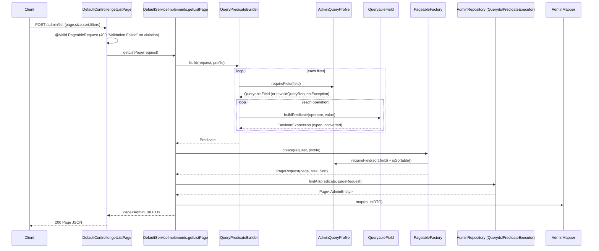

# Dynamic List Query Engine — backend

#doc #explanation #ref-backend #api-design #persistence

**Project:** `backend/` · **Stack:** Spring Boot 3.4.1, Java 21 · **Index:** [[Docs/backend/backend-Index]]

## Summary

`shared/query/` turns a JSON request body — page, size, sort list, filter list — into a QueryDSL
`Predicate` and a Spring Data `PageRequest`, runs it through `QuerydslPredicateExecutor.findAll`, and
returns a `Page` of list DTOs. Nothing is reflective or string-built: a client can only filter and sort
on fields that the entity's **query profile** registers, each registered field knows its value type and
its allowed operators, and every raw JSON value is converted to that type before it reaches QueryDSL. It
is the largest (≈900 lines) and most carefully built subsystem in the project, and it is covered by unit,
repository, service and MockMvc tests.

## Why It Is Built This Way

- **Stated intent (tests):** the test names spell out the design goals: sensitive fields cannot be
  filtered (`unknownPasswordFilterFieldReturnsBadRequest`,
  `backend/src/test/java/com/agentForgeBackend/models/hq/admin/AdminControllerListEndpointTest.java:93-102`),
  booleans are not guessed from strings (`booleanFieldRequiresBooleanValuesAndRejectsStringGuessing`,
  `backend/src/test/java/com/agentForgeBackend/shared/query/QueryableFieldTest.java:53`), and invalid page
  metadata is rejected before Spring Data throws
  (`backend/src/test/java/com/agentForgeBackend/shared/query/PageableFactoryTest.java:61`).
- **Inferred:** a whitelist is the only safe way to expose ad-hoc filtering without leaking columns such as
  `password` or `apikey`. The profile, not the entity, defines the API surface.
- **Inferred:** a typed field object (`QueryableField`) keeps all type-specific rules — conversion,
  operator set, predicate construction — behind one small interface (`buildPredicate`).

## How It Works

### Request contract (`POST /admin/list`, `POST /client/list`)

`PageableRequest` (`backend/src/main/java/com/agentForgeBackend/shared/query/PageableRequest.java:19-37`):

| Field | Type | Default | Validation |
|---|---|---|---|
| `page` | int | `0` | `@Min(0)` |
| `size` | int | `20` | `@Min(1) @Max(100)` |
| `sort` | `List<SortRequest>` | `[]` | `@NotNull`, each `{field: @NotBlank @Size(max=64), direction: ASC or DESC}` |
| `filters` | `List<FilterRequest>` | `[]` | `@NotNull`, each `{field: @NotBlank @Size(max=64), operations: @NotNull @Size(min=1)}` |

Each operation is `{operator: FilterOperator (@NotNull), value: any JSON}`
(`backend/src/main/java/com/agentForgeBackend/shared/query/FilterOperationRequest.java:13-19`).

A complete example body:

```json
{
  "page": 0,
  "size": 25,
  "sort": [
    { "field": "dateCreated", "direction": "DESC" },
    { "field": "username", "direction": "ASC" }
  ],
  "filters": [
    {
      "field": "email",
      "operations": [
        { "operator": "ENDS_WITH", "value": "@example.com" },
        { "operator": "ENDS_WITH", "value": "@example.org" }
      ]
    },
    { "field": "enabled", "operations": [ { "operator": "EQUALS", "value": true } ] },
    {
      "field": "dateCreated",
      "operations": [ { "operator": "GREATER_THAN_OR_EQUAL", "value": "2024-01-01T00:00:00Z" } ]
    }
  ]
}
```

Meaning: `(email ends with @example.com OR email ends with @example.org) AND enabled = true AND
dateCreated >= 2024-01-01T00:00:00Z`, sorted by `dateCreated` descending then `username` ascending,
page 0 of size 25. The response is Spring Data's serialized `Page` (`content`, `totalElements`, `size`,
`number`, …) of `AdminListDTO` rows, as asserted by
`backend/src/test/java/com/agentForgeBackend/models/hq/admin/AdminControllerListEndpointTest.java:61-69`.

### Semantics

- **OR within a filter, AND across filters.** Each `FilterRequest` becomes a `BooleanBuilder` whose
  operations are `or`-ed; the groups are `and`-ed together
  (`backend/src/main/java/com/agentForgeBackend/shared/query/QueryPredicateBuilder.java:33-38`,
  `backend/src/main/java/com/agentForgeBackend/shared/query/QueryPredicateBuilder.java:52-61`).
  Tested in `operationsWithinFilterUseOrAndSeparateFiltersUseAnd`
  (`backend/src/test/java/com/agentForgeBackend/shared/query/QueryPredicateBuilderTest.java:48`).
- **No filters** yields an empty `BooleanBuilder`, which matches every row.
- **Default sort** from the profile applies only when the request's sort list is empty
  (`backend/src/main/java/com/agentForgeBackend/shared/query/PageableFactory.java:22-24`). An invalid
  *default* sort is a programming error (`IllegalStateException`); an invalid *requested* sort is a client
  error (`InvalidQueryRequestException`)
  (`backend/src/main/java/com/agentForgeBackend/shared/query/PageableFactory.java:65-69`).
- **Paging bounds** are checked twice: by Bean Validation on the DTO and again in `PageableFactory`
  (`backend/src/main/java/com/agentForgeBackend/shared/query/PageableFactory.java:73-86`).

### Operators per field type

Defined in `QueryableField`
(`backend/src/main/java/com/agentForgeBackend/shared/query/QueryableField.java:30-62`):

| Field factory | JSON value required | Operators | Notes |
|---|---|---|---|
| `string` | string | `EQUALS`, `NOT_EQUALS`, `CONTAINS`, `STARTS_WITH`, `ENDS_WITH`, `IN` | Text operators are case-insensitive (`containsIgnoreCase`, …) |
| `number` | number (integral types reject fractions) | `EQUALS`, `NOT_EQUALS`, `GREATER_THAN(_OR_EQUAL)`, `LESS_THAN(_OR_EQUAL)`, `IN` | Exact conversion via `BigDecimal` |
| `booleanField` | boolean | `EQUALS`, `NOT_EQUALS` | `"true"` as a string is rejected |
| `enumField` | exact enum name string | `EQUALS`, `NOT_EQUALS`, `IN` | |
| `dateTime` / `date` | ISO-8601 string | `EQUALS`, `NOT_EQUALS`, `GREATER_THAN(_OR_EQUAL)`, `LESS_THAN(_OR_EQUAL)` | Zone-less strings are read as UTC |
| any, after `.nullable()` | none | adds `IS_NULL`, `IS_NOT_NULL` | Opt-in per field |

`IN` requires a non-empty JSON array; each element goes through the same converter
(`backend/src/main/java/com/agentForgeBackend/shared/query/QueryableField.java:542-560`). Every
conversion failure becomes a descriptive `InvalidQueryRequestException`, e.g. "Field 'id' requires a JSON
number; received String." (`backend/src/main/java/com/agentForgeBackend/shared/query/QueryableField.java:562-569`).

### Whitelisting with a profile

`backend/src/main/java/com/agentForgeBackend/models/hq/admin/AdminQueryProfile.java:18-34`
```java
private static final Map<String, QueryableField<AdminEntity, ?>> FIELDS = Map.of(
        "id", QueryableField.<AdminEntity, Long>number("id", ADMIN.id, Long.class).sortable("id"),
        "firstName", QueryableField.<AdminEntity>string("firstName", ADMIN.firstName).sortable("firstName"),
        "lastName", QueryableField.<AdminEntity>string("lastName", ADMIN.lastName).sortable("lastName"),
        "email", QueryableField.<AdminEntity>string("email", ADMIN.email).sortable("email"),
        "username", QueryableField.<AdminEntity>string("username", ADMIN.username).sortable("username"),
        "enabled", QueryableField.<AdminEntity>booleanField("enabled", ADMIN.enabled).sortable("enabled"),
        "dateCreated", QueryableField.<AdminEntity, Date>dateTime("dateCreated", ADMIN.dateCreated, Date.class)
                .sortable("dateCreated"),
        "lastLogin", QueryableField.<AdminEntity, Date>dateTime("lastLogin", ADMIN.lastLogin, Date.class)
                .sortable("lastLogin")
);

private static final List<SortRequest> DEFAULT_SORT = List.of(SortRequest.builder()
        .field("id")
        .direction(SortDirection.ASC)
        .build());
```

`password`, `roles`, `apikey` and the account flags other than `enabled` are simply absent, so
`profile.requireField("password")` throws "Unknown query field 'password'."
(`backend/src/main/java/com/agentForgeBackend/shared/query/EntityQueryProfile.java:16-32`). Sorting is a
separate opt-in: a field is sortable only if `.sortable(property)` was called, and the sort uses that
**profile-controlled** property name, not the client's string
(`backend/src/main/java/com/agentForgeBackend/shared/query/PageableFactory.java:59-64`).

### Traced request



(`backend/src/main/java/com/agentForgeBackend/shared/defaultImplements/DefaultServiceImplements.java:70-79`.)

### Wiring

`PageableFactory<ENTITY>` and `QueryPredicateBuilder<ENTITY>` are stateless generic `@Component`s
(`backend/src/main/java/com/agentForgeBackend/shared/query/PageableFactory.java:11-12`,
`backend/src/main/java/com/agentForgeBackend/shared/query/QueryPredicateBuilder.java:10-11`). Each is a
single bean injected into every feature service as `PageableFactory<AdminEntity>`,
`PageableFactory<ClientEntity>`, … — the type argument only documents intent; the same instance serves
all features. That is safe because neither class holds any state.

## Key Components

| Component | Path | Responsibility |
|---|---|---|
| `PageableRequest`, `SortRequest`, `FilterRequest`, `FilterOperationRequest` | `backend/src/main/java/com/agentForgeBackend/shared/query` | Request DTOs with Bean Validation |
| `FilterOperator`, `SortDirection` | `backend/src/main/java/com/agentForgeBackend/shared/query/FilterOperator.java` | Closed vocabularies (enum names are the JSON values) |
| `QueryableField` | `backend/src/main/java/com/agentForgeBackend/shared/query/QueryableField.java` | Typed field: operators, conversion, predicate |
| `EntityQueryProfile` | `backend/src/main/java/com/agentForgeBackend/shared/query/EntityQueryProfile.java` | Whitelist + default sort per entity |
| `QueryPredicateBuilder` | `backend/src/main/java/com/agentForgeBackend/shared/query/QueryPredicateBuilder.java` | Filters → `Predicate` |
| `PageableFactory` | `backend/src/main/java/com/agentForgeBackend/shared/query/PageableFactory.java` | Page/size/sort → `PageRequest` |
| Feature profiles | `backend/src/main/java/com/agentForgeBackend/models/hq/admin/AdminQueryProfile.java` | Admin whitelist (Client is identical in shape) |

## Conventions and Rules

- The map key and the `apiName` passed to the factory are the same string, and the sort property equals the
  entity attribute name.
- Every exposed field must be explicitly listed; never expose `password`, secrets or tokens.
- Mark a field `.sortable("<entityProperty>")` only when sorting on it is intended; call `.nullable()`
  only when `IS_NULL` / `IS_NOT_NULL` should be allowed.
- Provide a deterministic `defaultSort()` (by `id`) so pages are stable.
- Client errors are `InvalidQueryRequestException` (→ 400); profile misconfiguration is
  `IllegalStateException` / `IllegalArgumentException` (programming errors).
- List rows are a dedicated `ListDTO`, never the entity.

## How to Replicate

1. Copy the ten `shared/query` classes (`PageableRequest`, `SortRequest`, `SortDirection`,
   `FilterRequest`, `FilterOperationRequest`, `FilterOperator`, `QueryableField`, `EntityQueryProfile`,
   `QueryPredicateBuilder`, `PageableFactory`) and `InvalidQueryRequestException`.
2. Make the feature repository extend `QuerydslPredicateExecutor<ENTITY>` (via `DefaultRepository`).
3. Build once so `Q<Entity>` exists.
4. Create `<Feature>QueryProfile implements EntityQueryProfile<<Feature>Entity>` as a `@Component` with a
   static `Map.of(...)` of `QueryableField`s built from `Q<Entity>` paths, and a `DEFAULT_SORT` by `id`.
5. Inject the profile, `PageableFactory<ENTITY>` and `QueryPredicateBuilder<ENTITY>` into the service and
   pass them to the base constructor; `POST /<feature>/list` then works.
6. Add a `<Feature>ListDTO` and `toListDTO` in the mapper.
7. Map `InvalidQueryRequestException` to 400 in the exception handler.
8. Test at four levels as the project does: `QueryableField` unit tests, `@DataJpaTest` with predicates,
   service integration, MockMvc on `/list`.

**Adding a queryable field** to an existing profile: add one `Map.of` entry using the right factory
(`string`, `number`, `booleanField`, `enumField`, `dateTime`, `date`), optionally `.sortable(...)` /
`.nullable()`, and expose the property on the `ListDTO` if clients should see it. Note that `Map.of`
accepts at most ten entries; larger profiles need `Map.ofEntries`.

## Known Limitations

- `.nullable()` exists but no profile uses it, although several columns are nullable
  ([[Docs/backend/Reviews/06-Query-Engine-Review#BE-R06-01|BE-R06-01]]).
- Collection-valued fields such as `roles` cannot be filtered
  ([[Docs/backend/Reviews/06-Query-Engine-Review#BE-R06-02|BE-R06-02]]).
- Reads go through `POST`
  ([[Docs/backend/Reviews/06-Query-Engine-Review#BE-R06-03|BE-R06-03]]).
- The number of filters, operations and `IN` values is unbounded
  ([[Docs/backend/Reviews/06-Query-Engine-Review#BE-R06-04|BE-R06-04]]).

## Related Documents

- [[Docs/backend/Explanations/04-Generic-CRUD-Framework]]
- [[Docs/backend/Explanations/08-Error-Handling]]
- [[Docs/backend/Explanations/10-Testing-Strategy]]
- [[Docs/backend/Reviews/06-Query-Engine-Review]]
