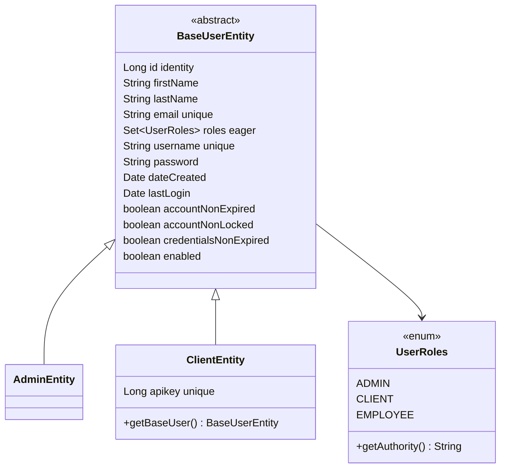

# Domain Model and Persistence — backend

#doc #explanation #ref-backend #persistence

**Project:** `backend/` · **Stack:** Spring Boot 3.4.1, Java 21 · **Index:** [[Docs/backend/backend-Index]]

## Summary

The domain is a single user hierarchy. `BaseUserEntity` is an abstract JPA entity mapped to table
`base_user` with `JOINED` inheritance; `AdminEntity` (table `admin`) adds nothing and `ClientEntity`
(table `client`) adds one `apikey` column. Roles are an eagerly loaded `@ElementCollection` of the
`UserRoles` enum in table `user_roles`. Entities are plain Lombok data holders; all rules live in
services and mappers. Persistence is Spring Data JPA with QueryDSL on PostgreSQL in production and an
in-memory H2 database (MySQL compatibility mode) in tests, with the schema generated by Hibernate.

## Why It Is Built This Way

- **Inferred:** login must find any user by username regardless of type. With `JOINED` inheritance one
  repository over the root (`BaseUserRepository`) can do that, while each subtype keeps its own table
  (`backend/src/main/java/com/agentForgeBackend/shared/securityUser/BaseUserRepository.java:8-12`).
- **Inferred:** putting `email` and `username` on the root makes them unique **across all user types**,
  enforced by a single unique index each
  (`backend/src/main/java/com/agentForgeBackend/shared/models/baseUser/BaseUserEntity.java:33-47`).
- **Inferred:** the account-status columns mirror Spring Security's `UserDetails` flags so they can be
  surfaced through the security adapter
  (`backend/src/main/java/com/agentForgeBackend/shared/models/baseUser/BaseUserEntity.java:58-68`).

## How It Works

### Entity hierarchy



`backend/src/main/java/com/agentForgeBackend/shared/models/baseUser/BaseUserEntity.java:11-43`
```java
@Table (name = "base_user")
@Entity
@AllArgsConstructor
@NoArgsConstructor
@Getter
@Setter
@Inheritance(strategy = InheritanceType.JOINED)
public abstract class BaseUserEntity {

    @Id
    @GeneratedValue(strategy = GenerationType.IDENTITY)
    @Column(name = "id")
    private Long id;

    @Column
    @Size(min = 2, max = 100)
    private String firstName;

    @Column(length = 100)
    @Size(min = 2, max = 100)
    private String lastName;

    @Column(nullable = false, unique = true)
    @Size(min = 4, max = 100)
    private String email;

    @ElementCollection(fetch = FetchType.EAGER)
    @CollectionTable(
            name = "user_roles",
            joinColumns = @JoinColumn(name = "user_id")
    )
    @Column(name = "role")
    private Set<UserRoles> roles = new HashSet<>();
```

Facts worth knowing:

- `roles` has no `@Enumerated`, so JPA's default applies: roles are stored as **ordinals** (`0` = ADMIN,
  `1` = CLIENT, `2` = EMPLOYEE) (`backend/src/main/java/com/agentForgeBackend/shared/models/baseUser/UserRoles.java:3-7`).
- `UserRoles.getAuthority()` prefixes `ROLE_`, which is what Spring Security's `hasRole('ADMIN')` expects
  (`backend/src/main/java/com/agentForgeBackend/shared/models/baseUser/UserRoles.java:8-10`).
- `dateCreated` and `lastLogin` are columns without any code in `src/main` that sets them (no
  `@PrePersist`, no auditing, no setter call). They are populated only by test fixtures
  (`backend/src/test/java/com/agentForgeBackend/models/hq/ListQueryTestDataFactory.java:37-38`).
- Bean Validation constraints (`@Size`) sit on the entity. They are checked by Hibernate Validator when
  the entity is persisted, not when the request is bound.
- `ClientEntity.apikey` is a unique `Long` column that no code assigns
  (`backend/src/main/java/com/agentForgeBackend/models/hq/client/ClientEntity.java:19-20`).
- `ClientEntity.getBaseUser()` returns `this.getBaseUser()` — it calls itself
  (`backend/src/main/java/com/agentForgeBackend/models/hq/client/ClientEntity.java:33-35`). Nothing in
  `src/main` calls it.

### Tables produced

| Table | Columns (beyond FK) | Source |
|---|---|---|
| `base_user` | `id`, names, `email`, `username`, `password`, dates, four flags | `backend/src/main/java/com/agentForgeBackend/shared/models/baseUser/BaseUserEntity.java:20-68` |
| `user_roles` | `user_id` → `base_user.id`, `role` (int) | `backend/src/main/java/com/agentForgeBackend/shared/models/baseUser/BaseUserEntity.java:37-43` |
| `admin` | `id` → `base_user.id` | `backend/src/main/java/com/agentForgeBackend/models/hq/admin/AdminEntity.java:11-16` |
| `client` | `id` → `base_user.id`, `apikey` (unique) | `backend/src/main/java/com/agentForgeBackend/models/hq/client/ClientEntity.java:12-20` |

### Repositories

| Repository | Extends | Finders | Return convention | Evidence |
|---|---|---|---|---|
| `AdminRepository` | `DefaultRepository<AdminEntity, Long>` | `findByUsername`, `findByEmail` | **nullable** entity | `backend/src/main/java/com/agentForgeBackend/models/hq/admin/AdminRepository.java:6-12` |
| `ClientRepository` | `DefaultRepository<ClientEntity, Long>` | `findByUsername`, `findByEmail` | `Optional` | `backend/src/main/java/com/agentForgeBackend/models/hq/client/ClientRepository.java:8-14` |
| `BaseUserRepository` | `DefaultRepository<BaseUserEntity, Long>` | `findByUsername` | `Optional` | `backend/src/main/java/com/agentForgeBackend/shared/securityUser/BaseUserRepository.java:8-12` |

All finders are derived queries; there is no `@Query`. Every repository inherits
`QuerydslPredicateExecutor` for the list engine.

### Transactions

- Class-level `@Transactional(rollbackFor = {…five project exceptions…})` on the base service
  (`backend/src/main/java/com/agentForgeBackend/shared/defaultImplements/DefaultServiceImplements.java:24-30`).
- `getListPage` adds `readOnly = true`
  (`backend/src/main/java/com/agentForgeBackend/shared/defaultImplements/DefaultServiceImplements.java:72`).
- `ClientService.update` re-declares `@Transactional` with a narrower `rollbackFor` list
  (`backend/src/main/java/com/agentForgeBackend/models/hq/client/ClientService.java:108`).
- `spring.jpa.open-in-view=false`: lazy loading outside a service transaction fails fast
  (`backend/src/main/resources/application.properties:19`). Roles are `EAGER`, so mappers can read them
  after the transaction.

### Database configuration

| Setting | Production | Test | Evidence |
|---|---|---|---|
| Database | PostgreSQL at host `db`, DB/user/password from env | H2 in-memory, `MODE=MySQL`, `DATABASE_TO_LOWER=TRUE` | `backend/src/main/resources/application.properties:5-8`, `backend/src/main/resources/application-test.properties:4-7` |
| Schema management | `ddl-auto=update` | `ddl-auto=create-drop` | `backend/src/main/resources/application.properties:16`, `backend/src/main/resources/application-test.properties:10` |
| Dialect | `PostgreSQLDialect` | `H2Dialect` | `backend/src/main/resources/application.properties:17`, `backend/src/main/resources/application-test.properties:12` |
| Pool | Hikari max 10, min idle 5 | defaults | `backend/src/main/resources/application.properties:20-22` |

There are no migration scripts (no Flyway or Liquibase dependency, no `db/migration` folder).

### Seed data

`AdminBoostrap` is a `CommandLineRunner` that inserts one admin when the `admin` table is empty, using a
fixed username, e-mail and a hardcoded password (value `<redacted>`), bypassing the service layer
(`backend/src/main/java/com/agentForgeBackend/configuration/boostrap/AdminBoostrap.java:33-51`).

## Key Components

| Component | Path | Responsibility |
|---|---|---|
| `BaseUserEntity` | `backend/src/main/java/com/agentForgeBackend/shared/models/baseUser/BaseUserEntity.java` | Root entity, shared columns |
| `UserRoles` | `backend/src/main/java/com/agentForgeBackend/shared/models/baseUser/UserRoles.java` | Role enum + authority name |
| `AdminEntity`, `ClientEntity` | `backend/src/main/java/com/agentForgeBackend/models/hq` | Subtypes |
| `BaseUserRepository` | `backend/src/main/java/com/agentForgeBackend/shared/securityUser/BaseUserRepository.java` | Polymorphic lookup for login |
| `AdminBoostrap` | `backend/src/main/java/com/agentForgeBackend/configuration/boostrap/AdminBoostrap.java` | Seed first admin |

## Conventions and Rules

- New user types extend `BaseUserEntity`, get their own `@Table`, and pass the six common fields to the
  `super(...)` constructor.
- `id` is `Long` with `IDENTITY` generation.
- Tables are named explicitly in singular snake case (`base_user`, `user_roles`, `admin`, `client`).
- Entities use Lombok `@Getter @Setter @NoArgsConstructor` (no `@Data`, which would generate
  `equals`/`hashCode` over all fields).
- Uniqueness is enforced by DB constraints **and** checked in services before saving.

## How to Replicate

1. Create `shared/models/baseUser/BaseUserEntity.java` — abstract, `@Entity @Table(name = "base_user")
   @Inheritance(strategy = InheritanceType.JOINED)`, fields as above.
2. Create `UserRoles` enum with `getAuthority()` returning `"ROLE_" + name()`.
3. For each user type, create `<Type>Entity extends BaseUserEntity` with `@Entity @Table(name = "<type>")`.
4. Create a `BaseUserRepository extends DefaultRepository<BaseUserEntity, Long>` with
   `Optional<BaseUserEntity> findByUsername(String)` for login.
5. Create per-type repositories with derived finders.
6. Configure `spring.jpa.open-in-view=false`, the production datasource from env variables, and an H2
   datasource in the `test` profile.
7. Optionally add a `CommandLineRunner` seed, reading credentials from configuration.

## Known Limitations

- Roles are stored by ordinal
  ([[Docs/backend/Reviews/03-Domain-Model-and-Persistence-Review#BE-R03-03|BE-R03-03]]).
- Audit dates are never written
  ([[Docs/backend/Reviews/03-Domain-Model-and-Persistence-Review#BE-R03-02|BE-R03-02]]).
- Schema changes rely on `ddl-auto=update`
  ([[Docs/backend/Reviews/03-Domain-Model-and-Persistence-Review#BE-R03-04|BE-R03-04]]).
- Repository return conventions differ
  ([[Docs/backend/Reviews/03-Domain-Model-and-Persistence-Review#BE-R03-05|BE-R03-05]]).
- Tests run on H2 in MySQL mode, production on PostgreSQL
  ([[Docs/backend/Reviews/03-Domain-Model-and-Persistence-Review#BE-R03-06|BE-R03-06]]).
- `ClientEntity.getBaseUser()` recurses forever if called
  ([[Docs/backend/Reviews/04-Feature-Module-Correctness-Review#BE-R04-01|BE-R04-01]]).
- The seed admin has a hardcoded password
  ([[Docs/backend/Reviews/01-Security-Review#BE-R01-04|BE-R01-04]]).

## Related Documents

- [[Docs/backend/Explanations/07-Authentication-and-Authorization]]
- [[Docs/backend/Explanations/09-Configuration-and-Secrets]]
- [[Docs/backend/Reviews/03-Domain-Model-and-Persistence-Review]]
