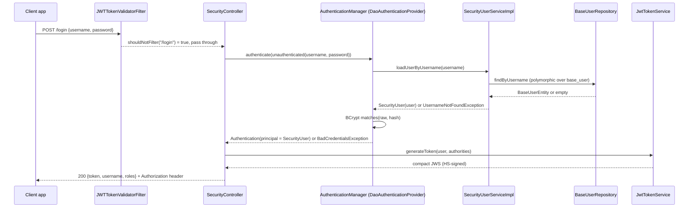
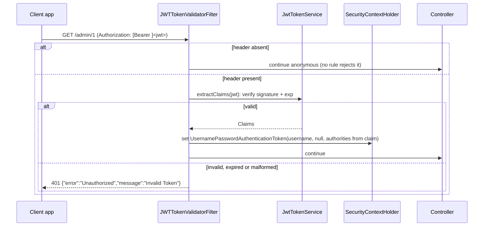

# Authentication and Authorization — backend

#doc #explanation #ref-backend #security

**Project:** `backend/` · **Stack:** Spring Boot 3.4.1, Java 21 · **Index:** [[Docs/backend/backend-Index]]

## Summary

Authentication is a JSON login (`POST /login`) that checks the username and BCrypt password through
Spring Security's `AuthenticationManager` and returns an HMAC-signed JWT (JJWT 0.12.5) that is valid for
24 hours. On every other request, `JWTTokenValidatorFilter` verifies the token's signature and builds an
`Authentication` purely from the token's claims. Authorization is *intended* to be declared with
`@PreAuthorize` on service methods. However, method security is **not enabled** and the filter chain
declares **no URL rules**, so in the running application no endpoint requires a token. Clients are a
special user type: their password is derived from their e-mail with an HMAC, and admins are meant to
mint API tokens for them through `GET /client/token/{username}`.

## Why It Is Built This Way

- **Stated intent:** the login controller comments each step, and notes that the token is also put in the
  `Authorization` response header "for compatibility"
  (`backend/src/main/java/com/agentForgeBackend/configuration/security/SecurityController.java:36-65`).
  The CORS comments say the API serves a React app on `localhost:3000`
  (`backend/src/main/java/com/agentForgeBackend/configuration/security/SecurityConfig.java:96-105`).
- **Inferred:** stateless JWT with claims-only validation avoids a database hit per request.
- **Inferred:** authorization on services (`@PreAuthorize("hasRole('ADMIN')")`) rather than URLs keeps
  rules next to the business operation and makes them apply no matter which controller calls the service
  (`backend/src/main/java/com/agentForgeBackend/models/hq/admin/AdminServiceImpl.java:33-35`).
- **Inferred:** clients are machine users. They never choose a password; admins hand them a token.

## How It Works

### Filter chain

`backend/src/main/java/com/agentForgeBackend/configuration/security/SecurityConfig.java:47-59`
```java
@Bean
public SecurityFilterChain securityFilterChain(HttpSecurity http, CorsConfigurationSource corsConfigurationSource) throws Exception{
    http
            .csrf(AbstractHttpConfigurer::disable)
            .cors(cors -> cors.configurationSource(corsConfigurationSource()))
            .sessionManagement(session ->
                    session.sessionCreationPolicy(SessionCreationPolicy.STATELESS))
            .exceptionHandling(ex ->
                    ex.authenticationEntryPoint(authenticationEntryPoint())
                            .accessDeniedHandler(accessDeniedHandler()))
            .addFilterBefore(jwtTokenValidatorFilter, BasicAuthenticationFilter.class);
    return http.build();
}
```

- CSRF off, sessions `STATELESS`, CORS from the bean below.
- JSON `401`/`403` bodies via a custom entry point and access-denied handler
  (`backend/src/main/java/com/agentForgeBackend/configuration/security/SecurityConfig.java:61-91`).
- **No `authorizeHttpRequests(...)` call.** A `SecurityFilterChain` built without it has no
  authorization filter, so anonymous requests pass through to every controller, and the entry point is
  never triggered for a missing token.
- The application class and `SecurityConfig` both carry `@EnableWebSecurity`
  (`backend/src/main/java/com/agentForgeBackend/agentForgeBackendApplication.java:10`,
  `backend/src/main/java/com/agentForgeBackend/configuration/security/SecurityConfig.java:30`). Neither
  class, nor any other, carries `@EnableMethodSecurity`.

### (a) Login — `POST /login`



- The `AuthenticationManager` is Boot's default, exposed as a bean
  (`backend/src/main/java/com/agentForgeBackend/configuration/security/SecurityConfig.java:112-115`). It
  is built from the only `UserDetailsService` bean and the `BCryptPasswordEncoder` bean
  (`backend/src/main/java/com/agentForgeBackend/configuration/security/SecurityConfig.java:42-45`).
- A wrong password raises `BadCredentialsException`, mapped to `401` by `GlobalExceptionHandler`
  (`backend/src/main/java/com/agentForgeBackend/exceptions/GlobalExceptionHandler.java:122-134`).
- `lastLogin` is not updated on success.

### (b) Authenticated request



`backend/src/main/java/com/agentForgeBackend/configuration/filter/JWTTokenValidatorFilter.java:39-46`
```java
String jwt = request.getHeader(ApplicationConstants.TK_HEADER);
if (jwt != null && jwt.startsWith("Bearer ")){
    jwt = jwt.substring("Bearer ".length());
}
if (jwt != null){
    try{
        Claims claims = jwtTokenService.extractClaims(jwt);
        String username = String.valueOf(claims.get("username"));
```

- The `Bearer ` prefix is optional; a bare token is accepted.
- Authorities are rebuilt from the claim, handling both `{"authority": "ROLE_X"}` objects (how Jackson
  serializes `SimpleGrantedAuthority`) and plain strings
  (`backend/src/main/java/com/agentForgeBackend/configuration/filter/JWTTokenValidatorFilter.java:48-64`).
- The principal is the **username string**, not a `UserDetails`; no database lookup happens
  (`backend/src/main/java/com/agentForgeBackend/configuration/filter/JWTTokenValidatorFilter.java:66-72`).
- Paths starting with `/login` skip the filter
  (`backend/src/main/java/com/agentForgeBackend/configuration/filter/JWTTokenValidatorFilter.java:94-97`).
- The filter is a `@Component` and is also added to the security chain
  (`backend/src/main/java/com/agentForgeBackend/configuration/filter/JWTTokenValidatorFilter.java:26-27`).

### Token claims

Issued by `JwtTokenService.generateToken`
(`backend/src/main/java/com/agentForgeBackend/configuration/filter/JwtTokenService.java:31-44`):

| Claim | Value | Source |
|---|---|---|
| `iss` | constant `ApplicationConstants.ISSUER` | `backend/src/main/java/com/agentForgeBackend/constant/ApplicationConstants.java:6` |
| `sub` | constant `ApplicationConstants.TK_SUBJECT` (same for every user) | `backend/src/main/java/com/agentForgeBackend/constant/ApplicationConstants.java:7` |
| `id` | user id | `backend/src/main/java/com/agentForgeBackend/configuration/filter/JwtTokenService.java:37` |
| `username` | username | `backend/src/main/java/com/agentForgeBackend/configuration/filter/JwtTokenService.java:38` |
| `authorities` | list of granted authorities (`ROLE_ADMIN`, …) | `backend/src/main/java/com/agentForgeBackend/configuration/filter/JwtTokenService.java:39` |
| `iat` / `exp` | now / now + 86 400 000 ms (24 h, hardcoded) | `backend/src/main/java/com/agentForgeBackend/configuration/filter/JwtTokenService.java:40-41` |

Signing key: `Keys.hmacShaKeyFor(<TK_KEY bytes>)`, built once in `@PostConstruct`
(`backend/src/main/java/com/agentForgeBackend/configuration/filter/JwtTokenService.java:21-29`). Parsing
verifies the signature and expiry only (`verifyWith(secretKey)`); issuer and subject are not required
(`backend/src/main/java/com/agentForgeBackend/configuration/filter/JwtTokenService.java:46-52`).

### `SecurityUser` and the user-details service

`SecurityUser` adapts a `BaseUserEntity` to `UserDetails`: authorities from roles, password, username
(`backend/src/main/java/com/agentForgeBackend/shared/securityUser/SecurityUser.java:19-34`). The account
flags are exposed as `getAccountNonExpired()`, `getAccountNonLocked()`, `getCredentialsNonExpired()` and
`getEnabled()` (`backend/src/main/java/com/agentForgeBackend/shared/securityUser/SecurityUser.java:36-50`).
In Spring Security 6.4 the `UserDetails` methods are `isAccountNonExpired()`, `isAccountNonLocked()`,
`isCredentialsNonExpired()` and `isEnabled()`, declared as `default` methods returning `true`
(verified with `javap` on `spring-security-core-6.4.2.jar`). `SecurityUser` does not override them, so
the authentication provider always sees an enabled, unlocked account.

`SecurityUserServiceImpl.loadUserByUsername` looks the user up polymorphically through
`BaseUserRepository` (`backend/src/main/java/com/agentForgeBackend/shared/securityUser/SecurityUserServiceImpl.java:18-25`).

### Client API tokens

1. `ClientService.insert` computes `hash = FileSigner.sign(email)` (Base64 HMAC-SHA256 keyed with
   `file.signature.secret`) and stores `BCrypt(hash)` as the client's password
   (`backend/src/main/java/com/agentForgeBackend/models/hq/client/ClientService.java:93-102`,
   `backend/src/main/java/com/agentForgeBackend/shared/tools/FileSigner.java:37-55`).
2. `GET /client/token/{username}` calls `generateTokenForClient`, which loads the client and returns a
   normal 24-hour JWT with the client's roles
   (`backend/src/main/java/com/agentForgeBackend/models/hq/client/ClientController.java:23-29`,
   `backend/src/main/java/com/agentForgeBackend/models/hq/client/ClientService.java:161-172`).
3. The service method is annotated `@PreAuthorize("hasRole('ADMIN')")`, which is not evaluated.
4. `ClientService.update` contains code meant to re-derive the password when the e-mail changes
   (`backend/src/main/java/com/agentForgeBackend/models/hq/client/ClientService.java:153-156`). Because
   the e-mail is copied onto the entity first (line 130), the condition compares the new e-mail with
   itself and is always false.

### CORS, CSRF, sessions

| Setting | Value | Evidence |
|---|---|---|
| Allowed origins | `http://localhost:3000` only (hardcoded) | `backend/src/main/java/com/agentForgeBackend/configuration/security/SecurityConfig.java:97` |
| Methods | `GET`, `POST`, `PUT`, `DELETE` | `backend/src/main/java/com/agentForgeBackend/configuration/security/SecurityConfig.java:99` |
| Headers / exposed | `Authorization`, `Content-Type` / `Authorization` | `backend/src/main/java/com/agentForgeBackend/configuration/security/SecurityConfig.java:101-103` |
| Credentials | allowed | `backend/src/main/java/com/agentForgeBackend/configuration/security/SecurityConfig.java:105` |
| CSRF | disabled | `backend/src/main/java/com/agentForgeBackend/configuration/security/SecurityConfig.java:50` |
| Sessions | stateless | `backend/src/main/java/com/agentForgeBackend/configuration/security/SecurityConfig.java:52-53` |

The chain calls `corsConfigurationSource()` directly instead of using the injected parameter of the same
type (`backend/src/main/java/com/agentForgeBackend/configuration/security/SecurityConfig.java:48-51`).

### Intended authorization model vs. actual behavior

| Operation | Intended rule (annotation) | Evidence | Enforced today? |
|---|---|---|---|
| Base CRUD + list | `isAuthenticated()` | `backend/src/main/java/com/agentForgeBackend/shared/defaultImplements/DefaultServiceImplements.java:53-98` | No |
| Admin insert / getOne | `hasRole('ADMIN')` | `backend/src/main/java/com/agentForgeBackend/models/hq/admin/AdminServiceImpl.java:34`, `backend/src/main/java/com/agentForgeBackend/models/hq/admin/AdminServiceImpl.java:62` | No |
| Client insert / update / token | `hasRole('ADMIN')` | `backend/src/main/java/com/agentForgeBackend/models/hq/client/ClientService.java:60`, `backend/src/main/java/com/agentForgeBackend/models/hq/client/ClientService.java:107`, `backend/src/main/java/com/agentForgeBackend/models/hq/client/ClientService.java:161` | No |
| Client getOne | *(none — override drops the annotation)* | `backend/src/main/java/com/agentForgeBackend/models/hq/client/ClientService.java:48-49` | No |
| `GET /test` | none | `backend/src/main/java/com/agentForgeBackend/configuration/security/SecurityController.java:68-71` | Public |

`AuthUserUtil` offers helpers for ownership checks (`getAuthUsername`, `isAuthUserAdmin`, …) but nothing
calls it (`backend/src/main/java/com/agentForgeBackend/shared/tools/AuthUserUtil.java:30-63`).

### Seed admin

On start-up, if no admin exists, `AdminBoostrap` saves one with a fixed username/e-mail and a hardcoded
password (value `<redacted>`)
(`backend/src/main/java/com/agentForgeBackend/configuration/boostrap/AdminBoostrap.java:37-45`).

## Key Components

| Component | Path | Responsibility |
|---|---|---|
| `SecurityConfig` | `backend/src/main/java/com/agentForgeBackend/configuration/security/SecurityConfig.java` | Chain, CORS, encoder, JSON 401/403 |
| `SecurityController` | `backend/src/main/java/com/agentForgeBackend/configuration/security/SecurityController.java` | `POST /login` |
| `LoginForm` / `LoginResponseDTO` | `backend/src/main/java/com/agentForgeBackend/configuration/security/LoginForm.java` | Login request/response |
| `JwtTokenService` | `backend/src/main/java/com/agentForgeBackend/configuration/filter/JwtTokenService.java` | Sign / parse JWT |
| `JWTTokenValidatorFilter` | `backend/src/main/java/com/agentForgeBackend/configuration/filter/JWTTokenValidatorFilter.java` | Header → `SecurityContext` |
| `SecurityUser` | `backend/src/main/java/com/agentForgeBackend/shared/securityUser/SecurityUser.java` | `UserDetails` adapter |
| `SecurityUserServiceImpl` | `backend/src/main/java/com/agentForgeBackend/shared/securityUser/SecurityUserServiceImpl.java` | `UserDetailsService` |
| `FileSigner` | `backend/src/main/java/com/agentForgeBackend/shared/tools/FileSigner.java` | HMAC used for client passwords |
| `ApplicationConstants` | `backend/src/main/java/com/agentForgeBackend/constant/ApplicationConstants.java` | Header name, issuer, subject, property key |

## Conventions and Rules

- Login is a controller endpoint, not a Spring Security form/basic login.
- Tokens are read from the `Authorization` header, with or without `Bearer `.
- Role names in the database are enum constants; authorities are `ROLE_<NAME>`.
- Authorization rules go on service methods with `@PreAuthorize` (`hasRole('ADMIN')`,
  `isAuthenticated()`).
- Security errors are returned in the same `ErrorHTTPRes` JSON shape as application errors.

## How to Replicate

1. `configuration/security/SecurityConfig.java` — `@Configuration @EnableWebSecurity`; beans:
   `PasswordEncoder` (BCrypt), `SecurityFilterChain` as above, `CorsConfigurationSource`,
   `AuthenticationEntryPoint`, `AccessDeniedHandler`, `AuthenticationManager` from
   `AuthenticationConfiguration`.
2. `configuration/filter/JwtTokenService.java` — HMAC key from a property, `generateToken`,
   `extractClaims`.
3. `configuration/filter/JWTTokenValidatorFilter.java` — `OncePerRequestFilter` that parses the header and
   sets the `SecurityContext`; skip `/login`.
4. `configuration/security/SecurityController.java` + `LoginForm` + `LoginResponseDTO` — `POST /login`.
5. `shared/securityUser/SecurityUser.java` (`UserDetails`) and `SecurityUserServiceImpl`
   (`UserDetailsService`) over `BaseUserRepository`.
6. `constant/ApplicationConstants.java` for header/issuer/subject names.
7. Annotate service methods with `@PreAuthorize`. **To make them effective the project would also need
   `@EnableMethodSecurity` and URL rules**; `backend/` has neither (see Known Limitations).

## Known Limitations

- No authorization is enforced
  ([[Docs/backend/Reviews/01-Security-Review#BE-R01-01|BE-R01-01]]); the client-token endpoint is
  therefore anonymous ([[Docs/backend/Reviews/01-Security-Review#BE-R01-02|BE-R01-02]]).
- Account flags are ignored ([[Docs/backend/Reviews/01-Security-Review#BE-R01-08|BE-R01-08]]).
- JWT validation trusts claims only, does not check issuer, and cannot be revoked
  ([[Docs/backend/Reviews/01-Security-Review#BE-R01-07|BE-R01-07]]).
- The same secret signs JWTs and derives client passwords
  ([[Docs/backend/Reviews/01-Security-Review#BE-R01-05|BE-R01-05]],
  [[Docs/backend/Reviews/01-Security-Review#BE-R01-06|BE-R01-06]]).
- Hardcoded seed admin ([[Docs/backend/Reviews/01-Security-Review#BE-R01-04|BE-R01-04]]).
- Filter double registration and hardcoded CORS
  ([[Docs/backend/Reviews/01-Security-Review#BE-R01-09|BE-R01-09]],
  [[Docs/backend/Reviews/01-Security-Review#BE-R01-10|BE-R01-10]]).

## Related Documents

- [[Docs/backend/Explanations/06-Domain-Model-and-Persistence]]
- [[Docs/backend/Explanations/08-Error-Handling]]
- [[Docs/backend/Explanations/09-Configuration-and-Secrets]]
- [[Docs/backend/Reviews/01-Security-Review]]
