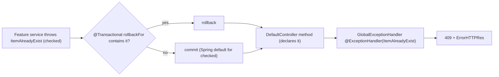

# Error Handling — backend

#doc #explanation #ref-backend #error-handling

**Project:** `backend/` · **Stack:** Spring Boot 3.4.1, Java 21 · **Index:** [[Docs/backend/backend-Index]]

## Summary

Domain failures are five **checked** exceptions in `exceptions/`, declared on the generic service and
controller signatures and translated to HTTP by one `@ControllerAdvice`, `GlobalExceptionHandler`. Every
handled error — including the 401/403 responses produced by the security layer and the JWT filter —
uses the same five-field JSON body, `ErrorHTTPRes {timestamp, status, error, message, path}`. Because
the exceptions are checked, the base service lists them all in `@Transactional(rollbackFor = …)` so a
thrown domain error rolls the transaction back. Exceptions the handler does not list fall through to
Spring Boot's default error response, which has a different shape.

## Why It Is Built This Way

- **Inferred:** checked exceptions force every caller to acknowledge domain failures at compile time;
  the generic signatures carry them from service to controller
  (`backend/src/main/java/com/agentForgeBackend/shared/defaultInterfaces/DefaultService.java:15-25`).
- **Inferred:** a single response shape for application and security errors lets a frontend parse every
  error the same way (`backend/src/main/java/com/agentForgeBackend/configuration/security/SecurityConfig.java:61-91`).
- **Stated intent (tests):** the query-related handlers are specified by
  `GlobalExceptionHandlerQueryTest` (`backend/src/test/java/com/agentForgeBackend/exceptions/GlobalExceptionHandlerQueryTest.java:27-67`).

## How It Works

### Exception → HTTP mapping

| Exception | Kind | Status | `error` text | `message` | Handler |
|---|---|---|---|---|---|
| `InvalidQueryRequestException` | checked, project | 400 | `Invalid Query Request` | exception message | `backend/src/main/java/com/agentForgeBackend/exceptions/GlobalExceptionHandler.java:19-30` |
| `MethodArgumentNotValidException` | Spring | 400 | `Validation Failed` | `field: message; …` | `backend/src/main/java/com/agentForgeBackend/exceptions/GlobalExceptionHandler.java:32-47` |
| `HttpMessageNotReadableException` | Spring | 400 | `Malformed Request` | fixed `Malformed request body.` | `backend/src/main/java/com/agentForgeBackend/exceptions/GlobalExceptionHandler.java:49-60` |
| `InvalidInsertDetails` | checked, project | 400 | `Invalid Details` | exception message | `backend/src/main/java/com/agentForgeBackend/exceptions/GlobalExceptionHandler.java:62-75` |
| `ItemAlreadyExist` | checked, project | 409 | `Conflict` | exception message | `backend/src/main/java/com/agentForgeBackend/exceptions/GlobalExceptionHandler.java:77-90` |
| `ItemNotFoundException` | checked, project | 404 | `Not Found` | exception message | `backend/src/main/java/com/agentForgeBackend/exceptions/GlobalExceptionHandler.java:92-105` |
| `InvalidDeleteOperation` | checked, project | 400 | `Bad Request` | exception message | `backend/src/main/java/com/agentForgeBackend/exceptions/GlobalExceptionHandler.java:107-120` |
| `BadCredentialsException` | Spring Security | 401 | `Unauthorized` | exception message | `backend/src/main/java/com/agentForgeBackend/exceptions/GlobalExceptionHandler.java:122-134` |
| `IllegalStateException` | JDK | 500 | `Internal Server Error` | exception message | `backend/src/main/java/com/agentForgeBackend/exceptions/GlobalExceptionHandler.java:136-149` |
| `IllegalArgumentException` | JDK | 400 | `Bad Request` | exception message | `backend/src/main/java/com/agentForgeBackend/exceptions/GlobalExceptionHandler.java:151-164` |
| Invalid/expired JWT | filter | 401 | `Unauthorized` | `Invalid Token` | `backend/src/main/java/com/agentForgeBackend/configuration/filter/JWTTokenValidatorFilter.java:74-89` |
| Unauthenticated (entry point) | security | 401 | `Unauthorized` | `Invalid Credentials` | `backend/src/main/java/com/agentForgeBackend/configuration/security/SecurityConfig.java:61-75` |
| Access denied | security | 403 | `Forbidden` | `Access Denied` | `backend/src/main/java/com/agentForgeBackend/configuration/security/SecurityConfig.java:77-91` |
| Anything else (NPE, `DataIntegrityViolationException`, `HttpRequestMethodNotSupportedException`, …) | — | Boot default (usually 500/405/415) | Boot's `/error` body | — | none |

All five project exceptions extend `java.lang.Exception` directly, with a message constructor and a
default-message constructor (`backend/src/main/java/com/agentForgeBackend/exceptions/ItemNotFoundException.java:3-12`).
There is no common base class.

### Response shape

`backend/src/main/java/com/agentForgeBackend/shared/tools/ErrorHTTPRes.java:5-18`
```java
@Builder
@AllArgsConstructor
@NoArgsConstructor
@Getter
@Setter
public class ErrorHTTPRes {

    private String timestamp;
    private int status;
    private String error;
    private String message;
    private String path;

}
```

Example body for `POST /admin/list` with an unknown filter field:

```json
{
  "timestamp": "2024-05-07T12:35:00.123456",
  "status": 400,
  "error": "Invalid Query Request",
  "message": "Unknown query field 'password'.",
  "path": "/admin/list"
}
```

`timestamp` is `LocalDateTime.now().toString()` (server local time, no zone). `path` is derived from
`WebRequest.getDescription(false)` with the `uri=` prefix stripped
(`backend/src/main/java/com/agentForgeBackend/exceptions/GlobalExceptionHandler.java:166-179`).

### Construction

A private helper `buildErrorResponse(...)` exists
(`backend/src/main/java/com/agentForgeBackend/exceptions/GlobalExceptionHandler.java:166-179`), but only
the first three handlers use it. The other seven build `ErrorHTTPRes` inline with the builder, and the
two security handlers and the JWT filter build it a third and fourth way, each with its own
`ObjectMapper` (`backend/src/main/java/com/agentForgeBackend/configuration/security/SecurityConfig.java:34`,
`backend/src/main/java/com/agentForgeBackend/configuration/filter/JWTTokenValidatorFilter.java:86-87`).
Return types alternate between `ResponseEntity<ErrorHTTPRes>` and `ResponseEntity<Object>`.

### Checked exceptions and transactions



The base service declares all five in `rollbackFor`
(`backend/src/main/java/com/agentForgeBackend/shared/defaultImplements/DefaultServiceImplements.java:24-30`).
`ClientService.update` overrides the annotation with a three-exception list
(`backend/src/main/java/com/agentForgeBackend/models/hq/client/ClientService.java:108`).

### Validation errors

Request DTOs annotated with Bean Validation raise `MethodArgumentNotValidException`, flattened into one
`field: message` string (`backend/src/main/java/com/agentForgeBackend/exceptions/GlobalExceptionHandler.java:36-38`).
Constraints on entities (`@Size` on `BaseUserEntity`) fire later, when Hibernate Validator checks the
entity on persist/flush, as a `ConstraintViolationException` (possibly wrapped in a
`TransactionSystemException` at commit). Neither has a handler.

## Key Components

| Component | Path | Responsibility |
|---|---|---|
| `GlobalExceptionHandler` | `backend/src/main/java/com/agentForgeBackend/exceptions/GlobalExceptionHandler.java` | Exception → status + body |
| Project exceptions | `backend/src/main/java/com/agentForgeBackend/exceptions` | Five checked domain exceptions |
| `ErrorHTTPRes` | `backend/src/main/java/com/agentForgeBackend/shared/tools/ErrorHTTPRes.java` | Error body |
| Security error handlers | `backend/src/main/java/com/agentForgeBackend/configuration/security/SecurityConfig.java` | JSON 401/403 |
| Filter error branch | `backend/src/main/java/com/agentForgeBackend/configuration/filter/JWTTokenValidatorFilter.java` | JSON 401 on bad token |

## Conventions and Rules

- Throw a project checked exception for every expected domain failure: not found → `ItemNotFoundException`,
  duplicate → `ItemAlreadyExist`, invalid input → `InvalidInsertDetails`, invalid list query →
  `InvalidQueryRequestException`.
- Add the exception to the service's `rollbackFor` list and to the relevant method signatures.
- Add a handler method to `GlobalExceptionHandler` that returns `ErrorHTTPRes`.
- Programming errors are `IllegalStateException` (500); illegal arguments are `IllegalArgumentException`
  (400).

## How to Replicate

1. Create `exceptions/` with one class per domain failure extending `Exception`, each with `(String)` and
   no-arg constructors.
2. Create `shared/tools/ErrorHTTPRes.java` (Lombok builder, five fields).
3. Create `exceptions/GlobalExceptionHandler.java` (`@ControllerAdvice`) with one `@ExceptionHandler`
   per exception, all building the body through one private helper.
4. In `SecurityConfig`, add an `AuthenticationEntryPoint` and an `AccessDeniedHandler` that write the
   same body.
5. In the JWT filter's failure branch, write the same body with status 401.
6. Put `@Transactional(rollbackFor = {…all project exceptions…})` on the base service.

## Known Limitations

- No common base exception; each type needs its own handler and `rollbackFor` entry
  ([[Docs/backend/Reviews/05-Error-Handling-Review#BE-R05-01|BE-R05-01]]).
- The helper exists but most handlers duplicate it
  ([[Docs/backend/Reviews/05-Error-Handling-Review#BE-R05-02|BE-R05-02]]).
- No catch-all handler, so unlisted exceptions use Boot's default shape
  ([[Docs/backend/Reviews/05-Error-Handling-Review#BE-R05-03|BE-R05-03]]).
- `IllegalStateException` messages are returned to clients
  ([[Docs/backend/Reviews/05-Error-Handling-Review#BE-R05-04|BE-R05-04]]).
- The body is not RFC 9457 `ProblemDetail`
  ([[Docs/backend/Reviews/05-Error-Handling-Review#BE-R05-06|BE-R05-06]]).

## Related Documents

- [[Docs/backend/Explanations/04-Generic-CRUD-Framework]]
- [[Docs/backend/Explanations/07-Authentication-and-Authorization]]
- [[Docs/backend/Reviews/05-Error-Handling-Review]]
