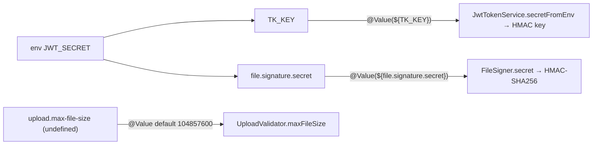

# Configuration and Secrets — backend

#doc #explanation #ref-backend #configuration #security

**Project:** `backend/` · **Stack:** Spring Boot 3.4.1, Java 21 · **Index:** [[Docs/backend/backend-Index]]

## Summary

Configuration is two `.properties` files in `src/main/resources`: `application.properties` (the only
non-test configuration, aimed at a Docker/PostgreSQL environment) and `application-test.properties`
(H2, activated by `@ActiveProfiles("test")` in tests). Production secrets and database credentials are
`${ENV_VAR}` placeholders without defaults, so the application fails fast when they are missing. Both
application secrets — the JWT signing key (`TK_KEY`) and the HMAC secret (`file.signature.secret`) —
resolve to the **same** environment variable, `JWT_SECRET`. Two classes read configuration with
`@Value`; there are no `@ConfigurationProperties` classes.

## Why It Is Built This Way

- **Stated intent:** comments in `application.properties` say secrets "MUST be set via environment
  variable" in production (`backend/src/main/resources/application.properties:24-30`), and the test file
  says the test profile "uses fixed secret for reproducibility"
  (`backend/src/main/resources/application-test.properties:24`).
- **Stated intent:** the datasource comment says the configuration targets "PostgreSQL in Docker
  environment" (`backend/src/main/resources/application.properties:4`), which explains the compose-style
  host name `db`.
- **Inferred:** the move to one `JWT_SECRET` variable simplified deployment when the project was
  forked from wpmanager (see [[Docs/backend/Explanations/01-Overview-and-Design-Philosophy]]).

## How It Works

### Property inventory — `application.properties`

| Key | Value / source | Purpose | Line |
|---|---|---|---|
| `spring.application.name` | `agentForgeBackend` | App name | `backend/src/main/resources/application.properties:1` |
| `spring.datasource.url` | `jdbc:postgresql://db:5432/${POSTGRES_DB}` | Postgres at host `db` | `backend/src/main/resources/application.properties:5` |
| `spring.datasource.username` | `${POSTGRES_USER}` | DB user | `backend/src/main/resources/application.properties:6` |
| `spring.datasource.password` | `${POSTGRES_PASSWORD}` | DB password (env) | `backend/src/main/resources/application.properties:7` |
| `spring.datasource.driver-class-name` | `org.postgresql.Driver` | Driver | `backend/src/main/resources/application.properties:8` |
| `spring.servlet.multipart.*` | enabled, 100MB file, 100MB request | Upload limits (no upload endpoint exists) | `backend/src/main/resources/application.properties:11-13` |
| `spring.jpa.hibernate.ddl-auto` | `update` | Schema auto-update | `backend/src/main/resources/application.properties:16` |
| `spring.jpa.database-platform` | `PostgreSQLDialect` | Dialect | `backend/src/main/resources/application.properties:17` |
| `spring.jpa.show-sql` | `true` | SQL to stdout | `backend/src/main/resources/application.properties:18` |
| `spring.jpa.open-in-view` | `false` | No OSIV | `backend/src/main/resources/application.properties:19` |
| `spring.datasource.hikari.*` | max 10, min idle 5, idle timeout 300 s | Pool sizing | `backend/src/main/resources/application.properties:20-22` |
| `file.signature.secret` | `${JWT_SECRET}` | HMAC key for `FileSigner` | `backend/src/main/resources/application.properties:26` |
| `TK_KEY` | `${JWT_SECRET}` | JWT signing key | `backend/src/main/resources/application.properties:30` |
| `logging.level.org.hibernate.SQL` | `DEBUG` | SQL via logger | `backend/src/main/resources/application.properties:35` |
| `logging.level.org.hibernate.type.descriptor.sql.BasicBinder` | `TRACE` | Bind-parameter logging (Hibernate 5 category name) | `backend/src/main/resources/application.properties:36` |

In the resolved Hibernate 6.6.4 jar, parameter-binding logs use the category
`org.hibernate.orm.jdbc.bind` (constant `JdbcBindingLogging.NAME`); the `BasicBinder` class no longer
exists, so line 36 has no effect (verified with `javap` on `hibernate-core-6.6.4.Final.jar`).

### Property inventory — `application-test.properties`

| Key | Value / source | Line |
|---|---|---|
| `spring.application.name` | `agentForgeBackend-TEST-SUITE` | `backend/src/main/resources/application-test.properties:1` |
| `spring.datasource.*` | H2 `mem:testdb`, `MODE=MySQL`, user `sa`, empty password | `backend/src/main/resources/application-test.properties:4-7` |
| `spring.jpa.hibernate.ddl-auto` | `create-drop` | `backend/src/main/resources/application-test.properties:10` |
| `spring.jpa.show-sql`, `format_sql` | `true` | `backend/src/main/resources/application-test.properties:11-13` |
| `TK_KEY` | literal test key `<redacted>` | `backend/src/main/resources/application-test.properties:22` |
| `file.signature.secret` | literal test secret `<redacted>` | `backend/src/main/resources/application-test.properties:25` |
| `spring.task.scheduling.enabled` | `false` — comment mentions a `FileDuplicator` job that does not exist in `backend/` | `backend/src/main/resources/application-test.properties:27-28` |

`spring.task.scheduling.enabled` is not a property that Spring Boot 3.4.1 defines (checked against the
configuration metadata in `spring-boot-autoconfigure-3.4.1.jar`), so it has no effect; since there are no
`@Scheduled` methods, nothing depends on it.

### Environment variables

| Variable | Read by | Required? |
|---|---|---|
| `POSTGRES_DB`, `POSTGRES_USER`, `POSTGRES_PASSWORD` | datasource | Yes (no defaults) |
| `JWT_SECRET` | `TK_KEY` **and** `file.signature.secret` | Yes (no default) |

The local env file `backend/.nvm` defines `FILE_SIGNATURE_SECRET` and `JWT_SECRET_KEY` (values
`<redacted>`, `backend/.nvm:1-2`). Neither is read by the current properties; the comment at
`backend/src/main/resources/application.properties:25` still names `FILE_SIGNATURE_SECRET`.

### Injection points

| Class | Property | Evidence |
|---|---|---|
| `JwtTokenService` | `${TK_KEY}` (key name from `ApplicationConstants.TK_ENV_KEY`) | `backend/src/main/java/com/agentForgeBackend/configuration/filter/JwtTokenService.java:21-22`, `backend/src/main/java/com/agentForgeBackend/constant/ApplicationConstants.java:4` |
| `FileSigner` | `${file.signature.secret}`; fails start-up if blank or equal to a known placeholder value (`<redacted>`), warns under 32 chars | `backend/src/main/java/com/agentForgeBackend/shared/tools/FileSigner.java:21-35` |
| `UploadValidator` | `${upload.max-file-size:104857600}` — key not defined anywhere, so the 100 MB default applies | `backend/src/main/java/com/agentForgeBackend/shared/tools/UploadValidator.java:11-12` |

`Keys.hmacShaKeyFor` rejects keys shorter than 256 bits, so a short `JWT_SECRET` also fails at start-up
(`backend/src/main/java/com/agentForgeBackend/configuration/filter/JwtTokenService.java:26-29`).

### Profile activation

There is no `spring.profiles.active` in either file. Tests opt into H2 with `@ActiveProfiles("test")`
(for example `backend/src/test/java/com/agentForgeBackend/models/hq/admin/AdminControllerListEndpointTest.java:28`).
A test without that annotation loads `application.properties` and tries to reach `db:5432`
(see [[Docs/backend/Explanations/10-Testing-Strategy]]). `application-test.properties` lives in
`src/main/resources`, so it is packaged in the application jar.

## Key Components

| Component | Path | Responsibility |
|---|---|---|
| Main properties | `backend/src/main/resources/application.properties` | Runtime configuration |
| Test properties | `backend/src/main/resources/application-test.properties` | `test` profile |
| Env file | `backend/.nvm` | Local variables (not referenced by properties) |
| `ApplicationConstants` | `backend/src/main/java/com/agentForgeBackend/constant/ApplicationConstants.java` | Property key for the JWT secret |

## Conventions and Rules

- Secrets and credentials are `${ENV}` placeholders **without** defaults in the main file.
- Test-only values live in the `test` profile file and are activated per test class.
- Services read single values with field `@Value`; a missing key without default fails start-up.
- Secret-consuming beans validate their secret at start-up (`@PostConstruct`).

## How to Replicate

1. `application.properties`: datasource from `POSTGRES_*`, `ddl-auto` choice, `open-in-view=false`, Hikari
   sizing, and one property per secret mapped to an environment variable without default.
2. `application-test.properties`: H2 datasource, `create-drop`, fixed test secrets.
3. In secret-consuming beans, inject with `@Value("${key}")` and validate in `@PostConstruct`.
4. Annotate integration tests with `@ActiveProfiles("test")`.
5. Keep an env file for local runs whose variable names match the placeholders.

## Known Limitations

- One secret serves two cryptographic purposes
  ([[Docs/backend/Reviews/01-Security-Review#BE-R01-05|BE-R01-05]]).
- The env file and property comments name variables the properties do not read
  ([[Docs/backend/Reviews/07-Build-Dependencies-and-Configuration-Review#BE-R07-11|BE-R07-11]]).
- SQL logging is on in the only non-test configuration, and the bind-logging line is inert
  ([[Docs/backend/Reviews/07-Build-Dependencies-and-Configuration-Review#BE-R07-05|BE-R07-05]]).
- Test properties ship in the application jar
  ([[Docs/backend/Reviews/07-Build-Dependencies-and-Configuration-Review#BE-R07-06|BE-R07-06]]).
- The database host is fixed to `db`
  ([[Docs/backend/Reviews/07-Build-Dependencies-and-Configuration-Review#BE-R07-07|BE-R07-07]]).
- Literal secrets exist in the working tree and in git history
  ([[Docs/backend/Reviews/01-Security-Review#BE-R01-11|BE-R01-11]]).

## Related Documents

- [[Docs/backend/Explanations/02-Build-Tooling-and-Dependencies]]
- [[Docs/backend/Explanations/07-Authentication-and-Authorization]]
- [[Docs/backend/Reviews/07-Build-Dependencies-and-Configuration-Review]]
