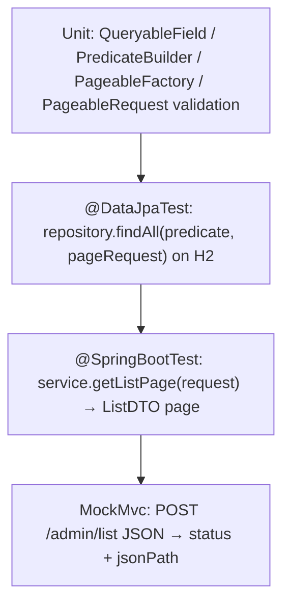

# Testing Strategy — backend

#doc #explanation #ref-backend #testing

**Project:** `backend/` · **Stack:** Spring Boot 3.4.1, Java 21 · **Index:** [[Docs/backend/backend-Index]]

## Summary

`backend/` has 21 test files and 79 test methods. They concentrate almost entirely on the list query
engine, which is tested at every layer: pure unit tests of `QueryableField`, `QueryPredicateBuilder`,
`PageableFactory` and request validation; `@DataJpaTest` repository tests that run real QueryDSL
predicates against H2; `@SpringBootTest` service tests; and MockMvc tests of `POST /<feature>/list`.
Integration tests use an H2 database in MySQL mode through the `test` profile and authenticate with
`@WithMockUser`. The last recorded run executed 79 tests: 78 passed and the default `contextLoads`
test errored. Login, JWT handling, authorization and CRUD writes have no tests.

## Why It Is Built This Way

- **Inferred:** the query engine was built test-first as a vertical slice. The test class names read as
  a specification ("…RejectsStringGuessing", "…BeforeSpringDataFactoryThrows"), and the MockMvc tests
  carry `task6-…` user names, suggesting a task-by-task plan
  (`backend/src/test/java/com/agentForgeBackend/models/hq/admin/AdminControllerListEndpointTest.java:29`).
- **Inferred:** H2 keeps the suite self-contained (no database container needed).
- **Inferred:** tag suites (`repository`, `utils`, `e2e`) were meant for running a slice of the tree;
  they were inherited from wpmanager.

## How It Works

### Inventory by layer

| Layer | Test classes | Methods | Annotations | Evidence |
|---|---|---|---|---|
| Unit (no Spring context) | `GlobalExceptionHandlerQueryTest`, `DefaultControllerListEndpointTest`, `DefaultServiceImplementsListQueryTest`, `PageableFactoryTest`, `PageableRequestValidationTest`, `QueryableFieldTest`, `QueryPredicateBuilderTest` | 38 | plain JUnit 5, Mockito (`@ExtendWith(MockitoExtension.class)`) | `backend/src/test/java/com/agentForgeBackend/shared/defaultImplements/DefaultServiceImplementsListQueryTest.java:31-32` |
| Repository (`@DataJpaTest`) | `ClientRepositoryTest`, `AdminRepositoryQuerydslIntegrationTest`, `ClientRepositoryQuerydslIntegrationTest` | 18 | `@DataJpaTest @ActiveProfiles("test") @Tag("repository")` | `backend/src/test/java/com/agentForgeBackend/models/client/ClientRepositoryTest.java:21-24` |
| Service integration | `AdminServiceListQueryIntegrationTest`, `ClientServiceListQueryIntegrationTest` | 6 | `@SpringBootTest @ActiveProfiles("test") @WithMockUser(roles = "ADMIN")` | `backend/src/test/java/com/agentForgeBackend/models/hq/admin/AdminServiceListQueryIntegrationTest.java:23-26` |
| Web (MockMvc, full context) | `AdminControllerListEndpointTest`, `ClientControllerListEndpointTest` | 16 | `@SpringBootTest @AutoConfigureMockMvc @ActiveProfiles("test") @WithMockUser` | `backend/src/test/java/com/agentForgeBackend/models/hq/admin/AdminControllerListEndpointTest.java:26-30` |
| Context smoke test | `authServerApplicationTests` | 1 | `@SpringBootTest` (no profile) | `backend/src/test/java/com/agentForgeBackend/authServerApplicationTests.java:6-11` |
| Infrastructure | `TestLauncher`, `E2ESuiteTest`, `RepositorySuiteTest`, `UtilsSuiteTest`, `ListQueryTestDataFactory`, `TestAuthenticationHelper` | — | `@Suite`, helpers | `backend/src/test/java/com/agentForgeBackend/suites` |

### The layered query tests



A representative web test checks the whole contract including the error body:

`backend/src/test/java/com/agentForgeBackend/models/hq/admin/AdminControllerListEndpointTest.java:93-102`
```java
@Test
void unknownPasswordFilterFieldReturnsBadRequest() throws Exception {
    mockMvc.perform(post("/admin/list")
                    .contentType(MediaType.APPLICATION_JSON)
                    .content(queryRequest("password", "EQUALS", "\"secret\"")))
            .andExpect(status().isBadRequest())
            .andExpect(jsonPath("$.status").value(400))
            .andExpect(jsonPath("$.error").value("Invalid Query Request"))
            .andExpect(jsonPath("$.message").value("Unknown query field 'password'."));
}
```

Test data comes from a static factory with fixed instants so sorting and date filters are deterministic
(`backend/src/test/java/com/agentForgeBackend/models/hq/ListQueryTestDataFactory.java:21-40`). Integration
tests reset state with `deleteAll()` in `@BeforeEach`
(`backend/src/test/java/com/agentForgeBackend/models/hq/admin/AdminControllerListEndpointTest.java:45-54`).

### Tags, suites and launchers

| Runner | Selects | Runs in `mvn test`? | Evidence |
|---|---|---|---|
| Surefire default | every `*Test` class except `*SuiteTest` | Yes | `backend/pom.xml:177-182` |
| `TestLauncher` (`test.sh`) | whole `com.agentForgeBackend` package, excluding `suites` | Via `test.sh` | `backend/src/test/java/com/agentForgeBackend/TestLauncher.java:8-12`, `backend/test.sh:15` |
| `RepositorySuiteTest` | `@Tag("repository")` — 3 classes | No (excluded) | `backend/src/test/java/com/agentForgeBackend/suites/RepositorySuiteTest.java:5-10` |
| `UtilsSuiteTest` | `@Tag("utils")` — **no class has this tag** | No | `backend/src/test/java/com/agentForgeBackend/suites/UtilsSuiteTest.java:9` |
| `E2ESuiteTest` | `@Tag("e2e")` — **no class has this tag** | No | `backend/src/test/java/com/agentForgeBackend/suites/E2ESuiteTest.java:9` |

### Test profile

`@ActiveProfiles("test")` switches to `application-test.properties`: H2 `MODE=MySQL`, `create-drop`,
fixed secrets (`backend/src/main/resources/application-test.properties:4-25`). The `test` profile file
lives in `src/main/resources`, not `src/test/resources`.

### Last recorded run

The surefire reports in `backend/target/surefire-reports` (build output, not modified here) record:

| Class | Tests | Result | Report |
|---|---|---|---|
| `authServerApplicationTests` | 1 | **1 error** | `backend/target/surefire-reports/com.agentForgeBackend.authServerApplicationTests.txt:4` |
| All 14 other test classes | 78 | pass | `backend/target/surefire-reports/com.agentForgeBackend.models.hq.admin.AdminControllerListEndpointTest.txt:4` (one example) |

The `contextLoads` error chain: `entityManagerFactory` → `batchDataSourceInitializer` → "Failed to
determine DatabaseDriver" → PostgreSQL connection attempt → `UnknownHostException: db`
(`backend/target/surefire-reports/com.agentForgeBackend.authServerApplicationTests.txt:27`,
`backend/target/surefire-reports/com.agentForgeBackend.authServerApplicationTests.txt:45`,
`backend/target/surefire-reports/com.agentForgeBackend.authServerApplicationTests.txt:102`). The test has
no `@ActiveProfiles("test")`, so it uses the production datasource, and the unused batch starter's
initializer is the first bean to touch it.

### What is covered and what is not

| Area | Covered? | Notes |
|---|---|---|
| Query engine (fields, predicates, paging, validation, error mapping) | Yes, at four layers | 38 unit + 6 repository + 6 service + 16 web |
| Client repository finders and CRUD persistence | Yes | `backend/src/test/java/com/agentForgeBackend/models/client/ClientRepositoryTest.java:53-306` |
| `POST /login`, `JwtTokenService`, `JWTTokenValidatorFilter` | No | `TestAuthenticationHelper` can mint tokens but no test uses it (`backend/src/test/java/com/agentForgeBackend/testUtils/TestAuthenticationHelper.java:35-84`) |
| Authorization (anonymous → 401, wrong role → 403) | No | All web/service tests run as `@WithMockUser(roles = "ADMIN")` |
| `insert` / `update` / `delete` through services or HTTP | No | |
| Client token endpoint | No | |
| Mappers | Indirectly for `toListDTO` only | |
| Application context start-up | Test exists but fails | See above |

## Key Components

| Component | Path | Responsibility |
|---|---|---|
| Unit tests | `backend/src/test/java/com/agentForgeBackend/shared/query` | Query engine rules |
| Repository tests | `backend/src/test/java/com/agentForgeBackend/models/hq/admin/AdminRepositoryQuerydslIntegrationTest.java` | QueryDSL on H2 |
| Web tests | `backend/src/test/java/com/agentForgeBackend/models/hq/client/ClientControllerListEndpointTest.java` | HTTP contract of `/list` |
| Test data factory | `backend/src/test/java/com/agentForgeBackend/models/hq/ListQueryTestDataFactory.java` | Deterministic fixtures |
| Launcher | `backend/src/test/java/com/agentForgeBackend/TestLauncher.java` | One-suite entry point |
| Token helper (unused) | `backend/src/test/java/com/agentForgeBackend/testUtils/TestAuthenticationHelper.java` | Persist users + mint JWTs |

## Conventions and Rules

- Test packages mirror main packages, except `ClientRepositoryTest`, which sits in `models.client`
  instead of `models.hq.client`.
- Integration tests always add `@ActiveProfiles("test")`.
- Repository tests carry `@Tag("repository")`.
- Tests authenticate with `@WithMockUser`, not with real tokens.
- Test names describe behavior (`listWithFilterSortAndPaginationReturnsMatchingAdminPage`).

## How to Replicate

1. Put a `test` profile with an in-memory database next to the main config (preferably in
   `src/test/resources`).
2. Write unit tests for every pure component first (field conversion, predicate building, paging).
3. Add `@DataJpaTest @ActiveProfiles("test")` tests that execute real predicates.
4. Add `@SpringBootTest` service tests and `@SpringBootTest @AutoConfigureMockMvc` web tests asserting
   status and `jsonPath` on success and error bodies.
5. Provide a fixed-date test data factory.
6. Optionally add `junit-platform-suite` suites (`TestLauncher`, tag suites) and a `test.sh`.

## Known Limitations

- `@WithMockUser` hides the missing authorization; no negative security tests exist
  ([[Docs/backend/Reviews/08-Testing-Review#BE-R08-01|BE-R08-01]]).
- Login, JWT and CRUD writes are untested
  ([[Docs/backend/Reviews/08-Testing-Review#BE-R08-02|BE-R08-02]]).
- `contextLoads` fails outside Docker
  ([[Docs/backend/Reviews/08-Testing-Review#BE-R08-03|BE-R08-03]]).
- Two tag suites select nothing and the token helper is unused
  ([[Docs/backend/Reviews/08-Testing-Review#BE-R08-04|BE-R08-04]]).
- Tests run on H2, not PostgreSQL
  ([[Docs/backend/Reviews/08-Testing-Review#BE-R08-05|BE-R08-05]]).

## Related Documents

- [[Docs/backend/Explanations/05-Dynamic-List-Query-Engine]]
- [[Docs/backend/Explanations/09-Configuration-and-Secrets]]
- [[Docs/backend/Reviews/08-Testing-Review]]
