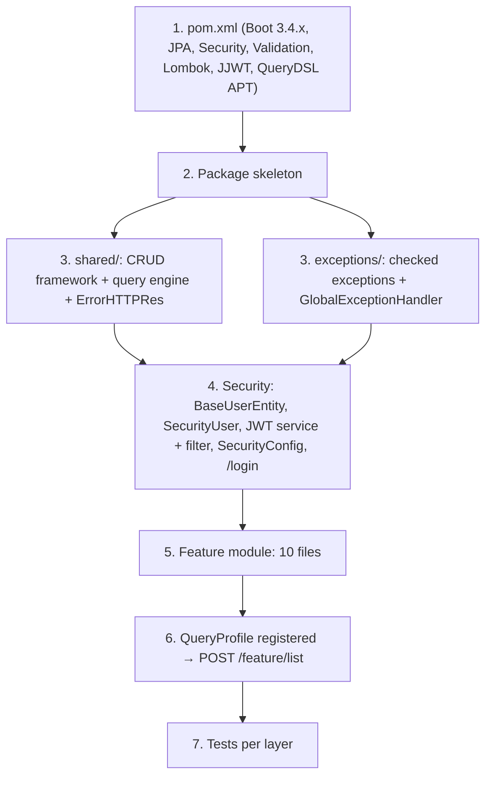

# Recipe: Build a Project This Way — backend

#doc #explanation #ref-backend #architecture

**Project:** `backend/` · **Stack:** Spring Boot 3.4.1, Java 21 · **Index:** [[Docs/backend/backend-Index]]

## Summary

This recipe answers "how do I create a new project, and a new feature, the `backend/` way?". It
condenses explanations 01–10 into one ordered procedure: set up the POM, lay out the packages, build the
`shared/` framework (generic CRUD, query engine, error contract), wire security, then add a feature as ten
files and register its query profile. The recipe is **faithful to how `backend/` is built**. Where a step
copies a pattern that a Review flags, a ⚠️ callout names the finding so it is not copied blindly.

## Why It Is Built This Way

The project's economy comes from doing the expensive work once in `shared/` and making each feature a
set of small typed classes (see [[Docs/backend/Explanations/01-Overview-and-Design-Philosophy]]). A recipe
therefore front-loads the framework and makes the per-feature part mechanical.

## How It Works



## Key Components

| Component | Path | Responsibility |
|---|---|---|
| Framework to copy | `backend/src/main/java/com/agentForgeBackend/shared` | CRUD + query engine + user root |
| Security to copy | `backend/src/main/java/com/agentForgeBackend/configuration` | JWT, login, chain |
| Error contract to copy | `backend/src/main/java/com/agentForgeBackend/exceptions` | Exceptions + handler |
| Reference feature | `backend/src/main/java/com/agentForgeBackend/models/hq/client` | Most complete 10-file module |
| Reference tests | `backend/src/test/java/com/agentForgeBackend/models/hq/admin` | Repository, service, MockMvc tests |

## Conventions and Rules

- Build order is fixed: POM → packages → `shared/` → `exceptions/` → security → features → tests.
- A feature never contains CRUD code that the base classes already provide.
- A feature always ships with a query profile, even if it only whitelists `id`.
- All secrets come from environment placeholders.

## How to Replicate

### 1. `pom.xml` essentials

Keep only what the design uses (`backend/pom.xml:5-10`, `backend/pom.xml:57-65`, `backend/pom.xml:74-85`, `backend/pom.xml:110-136`,
`backend/pom.xml:184-201`):

```xml
<parent>spring-boot-starter-parent 3.4.x</parent>
<properties><java.version>21</java.version><openfeign.querydsl.version>6.12</openfeign.querydsl.version></properties>
<!-- compile: starter-web, starter-data-jpa, starter-security, starter-validation,
     io.github.openfeign.querydsl:querydsl-jpa, io.jsonwebtoken:jjwt-api:0.12.5, lombok (optional) -->
<!-- runtime: postgresql, jjwt-impl, jjwt-jackson -->
<!-- test: starter-test, spring-security-test, h2, junit-platform-suite-engine -->
<!-- maven-compiler-plugin annotationProcessorPaths: lombok + querydsl-apt (classifier jpa) -->
```

> ⚠️ Review: [[Docs/backend/Reviews/07-Build-Dependencies-and-Configuration-Review#BE-R07-01|BE-R07-01]] — do not copy the unused batch/data-rest/webflux/websocket/web-services/jdbc starters or the S3 SDK.

> ⚠️ Review: [[Docs/backend/Reviews/07-Build-Dependencies-and-Configuration-Review#BE-R07-03|BE-R07-03]] — `backend/` puts H2 at runtime scope; use test scope.

### 2. Package skeleton

```
com.<org>.<app>/
├── <App>Application.java
├── configuration/{security,filter,bootstrap}/
├── constant/ApplicationConstants.java
├── exceptions/
├── models/hq/<feature>/
└── shared/{defaultImplements,defaultInterfaces,models/baseUser,query,securityUser,tools}/
```

> ⚠️ Review: [[Docs/backend/Reviews/09-Code-Hygiene-Review#BE-R09-02|BE-R09-02]] / [[Docs/backend/Reviews/09-Code-Hygiene-Review#BE-R09-03|BE-R09-03]] — spell `bootstrap` correctly and use conventional class/package names.

### 3. Recreate `shared/` and `exceptions/`

1. `shared/defaultInterfaces/`: `DefaultRepository`, `DefaultMapper`, `DefaultService`
   ([[Docs/backend/Explanations/04-Generic-CRUD-Framework]]).
2. `shared/defaultImplements/`: `DefaultServiceImplements`, `DefaultController`.
3. `shared/query/`: the ten query classes
   ([[Docs/backend/Explanations/05-Dynamic-List-Query-Engine]]).
4. `shared/tools/ErrorHTTPRes.java` and `exceptions/` with `GlobalExceptionHandler`
   ([[Docs/backend/Explanations/08-Error-Handling]]).
5. Copy only the tools a feature needs; `backend/` carries many unused ones.

> ⚠️ Review: [[Docs/backend/Reviews/02-CRUD-Framework-and-API-Design-Review#BE-R02-01|BE-R02-01]] — the base `update` must apply the form; `backend/`'s does not.

> ⚠️ Review: [[Docs/backend/Reviews/02-CRUD-Framework-and-API-Design-Review#BE-R02-07|BE-R02-07]] / [[Docs/backend/Reviews/05-Error-Handling-Review#BE-R05-01|BE-R05-01]] — checked exceptions on generic signatures are costly; prefer an unchecked hierarchy.

> ⚠️ Review: [[Docs/backend/Reviews/06-Query-Engine-Review#BE-R06-04|BE-R06-04]] — add size limits to filters, operations and `IN` lists.

> ⚠️ Review: [[Docs/backend/Reviews/09-Code-Hygiene-Review#BE-R09-01|BE-R09-01]] — do not copy the unused `shared/tools` classes.

### 4. Security wiring

1. `shared/models/baseUser/BaseUserEntity` (JOINED) and `UserRoles`
   ([[Docs/backend/Explanations/06-Domain-Model-and-Persistence]]).
2. `shared/securityUser/`: `BaseUserRepository`, `SecurityUser`, `SecurityUserServiceImpl`.
3. `configuration/filter/`: `JwtTokenService`, `JWTTokenValidatorFilter`.
4. `configuration/security/`: `SecurityConfig`, `SecurityController` (`POST /login`), `LoginForm`,
   `LoginResponseDTO` ([[Docs/backend/Explanations/07-Authentication-and-Authorization]]).
5. `application.properties`: `TK_KEY=${JWT_SECRET}` and the datasource from `POSTGRES_*`
   ([[Docs/backend/Explanations/09-Configuration-and-Secrets]]).

> ⚠️ Review: [[Docs/backend/Reviews/01-Security-Review#BE-R01-01|BE-R01-01]] — `backend/` never enables method security or URL rules. Add `@EnableMethodSecurity` and `authorizeHttpRequests(... anyRequest().authenticated())`.

> ⚠️ Review: [[Docs/backend/Reviews/01-Security-Review#BE-R01-08|BE-R01-08]] — override `isEnabled()` & co. in `SecurityUser`.

> ⚠️ Review: [[Docs/backend/Reviews/01-Security-Review#BE-R01-07|BE-R01-07]] — put the user id in `sub`, require the issuer, keep tokens short-lived.

> ⚠️ Review: [[Docs/backend/Reviews/03-Domain-Model-and-Persistence-Review#BE-R03-03|BE-R03-03]] — annotate the roles collection with `@Enumerated(EnumType.STRING)`.

> ⚠️ Review: [[Docs/backend/Reviews/01-Security-Review#BE-R01-04|BE-R01-04]] — do not hardcode a seed admin password.

### 5. Add one feature module end to end (`Widget`)

Minimal sketches in the project's style (compare `backend/src/main/java/com/agentForgeBackend/models/hq/client`).

`WidgetEntity.java`
```java
@Entity @Table(name = "widget")
@NoArgsConstructor @Getter @Setter
public class WidgetEntity {
    @Id @GeneratedValue(strategy = GenerationType.IDENTITY) private Long id;
    @Column(nullable = false, unique = true, length = 100) private String name;
    @Column private Date dateCreated;
}
```

`WidgetForm.java`
```java
@Data @NoArgsConstructor @AllArgsConstructor
public class WidgetForm {
    @NotBlank @Size(max = 100) private String name;   // backend/ mostly omits these (BE-R03-07)
}
```

`WidgetDTO.java`, `WidgetMiniDTO.java`, `WidgetListDTO.java`
```java
@Data @Builder @NoArgsConstructor @AllArgsConstructor
public class WidgetDTO { private Long id; private String name; }
// WidgetMiniDTO: same shape as the create acknowledgement; WidgetListDTO: id, name, dateCreated
```

`WidgetRepository.java`
```java
@Repository
public interface WidgetRepository extends DefaultRepository<WidgetEntity, Long> {
    Optional<WidgetEntity> findByName(String name);
}
```

`WidgetMapper.java`
```java
@Component
public class WidgetMapper implements DefaultMapper<WidgetDTO, WidgetMiniDTO, WidgetListDTO, WidgetForm, WidgetEntity> {
    public WidgetDTO toDTO(WidgetEntity e)          { return WidgetDTO.builder().id(e.getId()).name(e.getName()).build(); }
    public WidgetMiniDTO toSmallDTO(WidgetEntity e) { return WidgetMiniDTO.builder().id(e.getId()).name(e.getName()).build(); }
    public WidgetListDTO toListDTO(WidgetEntity e)  { return WidgetListDTO.builder().id(e.getId()).name(e.getName()).dateCreated(e.getDateCreated()).build(); }
    public WidgetEntity toEntity(WidgetForm f)      { WidgetEntity e = new WidgetEntity(); e.setName(f.getName()); return e; }
}
```

`WidgetQueryProfile.java`
```java
@Component
public class WidgetQueryProfile implements EntityQueryProfile<WidgetEntity> {
    private static final QWidgetEntity W = QWidgetEntity.widgetEntity;
    private static final Map<String, QueryableField<WidgetEntity, ?>> FIELDS = Map.of(
            "id",   QueryableField.<WidgetEntity, Long>number("id", W.id, Long.class).sortable("id"),
            "name", QueryableField.<WidgetEntity>string("name", W.name).sortable("name"));
    private static final List<SortRequest> DEFAULT_SORT =
            List.of(SortRequest.builder().field("id").direction(SortDirection.ASC).build());
    public Map<String, QueryableField<WidgetEntity, ?>> fields() { return FIELDS; }
    public List<SortRequest> defaultSort() { return DEFAULT_SORT; }
}
```

`WidgetService.java`
```java
@Service
public class WidgetService extends DefaultServiceImplements<WidgetDTO, WidgetMiniDTO, WidgetListDTO, WidgetForm, WidgetEntity, Long> {
    public WidgetService(WidgetRepository repository, WidgetMapper mapper, WidgetQueryProfile profile,
                         PageableFactory<WidgetEntity> pageableFactory, QueryPredicateBuilder<WidgetEntity> predicateBuilder) {
        super(repository, mapper, profile, pageableFactory, predicateBuilder);
    }
    @Override
    @PreAuthorize("hasRole('ADMIN')")
    public WidgetMiniDTO insert(WidgetForm form) throws ItemNotFoundException, ItemAlreadyExist, InvalidInsertDetails {
        WidgetRepository repo = (WidgetRepository) this.repository;          // the project's pattern
        if (repo.findByName(form.getName()).isPresent()) throw new ItemAlreadyExist("Widget already exists");
        return mapper.toSmallDTO(repo.save(mapper.toEntity(form)));
    }
}
```

`WidgetController.java`
```java
@RestController
@RequestMapping("/widget")
public class WidgetController extends DefaultController<WidgetDTO, WidgetMiniDTO, WidgetListDTO, WidgetForm, Long> {
    public WidgetController(WidgetService service) { super(service); }
}
```

> ⚠️ Review: [[Docs/backend/Reviews/02-CRUD-Framework-and-API-Design-Review#BE-R02-02|BE-R02-02]] — the repository downcast in the service is the project's pattern; prefer a typed repository field.

> ⚠️ Review: [[Docs/backend/Reviews/02-CRUD-Framework-and-API-Design-Review#BE-R02-06|BE-R02-06]] / [[Docs/backend/Reviews/04-Feature-Module-Correctness-Review#BE-R04-03|BE-R04-03]] — three near-identical DTOs drift apart; include `id` everywhere and test every mapper method.

> ⚠️ Review: [[Docs/backend/Reviews/03-Domain-Model-and-Persistence-Review#BE-R03-02|BE-R03-02]] — nothing fills `dateCreated` in `backend/`; enable JPA auditing.

### 6. Register the query profile

The profile is a `@Component`; passing it to the service constructor is the registration. Build once
(`./mvnw compile`) so `QWidgetEntity` exists. `POST /widget/list` now accepts the JSON contract in
[[Docs/backend/Explanations/05-Dynamic-List-Query-Engine]]. Map `InvalidQueryRequestException` to 400 (already
done by the copied handler).

### 7. Tests to write per layer

| Layer | What `backend/` does | Add for a new feature |
|---|---|---|
| Unit | `QueryableField`, builder, factory, request validation | Mapper round-trip test |
| `@DataJpaTest @ActiveProfiles("test")` | Predicate execution on H2 | Finders + one predicate test |
| `@SpringBootTest` service | `getListPage` with default sort | `insert` / `update` / `delete` persistence |
| `@SpringBootTest @AutoConfigureMockMvc` | `/list` success and 400 bodies | CRUD endpoints + 401/403 cases |

> ⚠️ Review: [[Docs/backend/Reviews/08-Testing-Review#BE-R08-01|BE-R08-01]] — `backend/` tests only as `@WithMockUser(roles = "ADMIN")`; add anonymous and wrong-role tests.

> ⚠️ Review: [[Docs/backend/Reviews/08-Testing-Review#BE-R08-05|BE-R08-05]] — prefer PostgreSQL via Testcontainers over H2.

## Known Limitations

This recipe reproduces `backend/`, including its weaknesses; every callout above links the finding. The
consolidated improved patterns are listed in [[Docs/backend/Reviews/00-Review-Summary]] under
"Candidate Patterns for the Skill".

## Related Documents

- [[Docs/backend/Explanations/03-Package-Structure-and-Module-Anatomy]]
- [[Docs/backend/Explanations/04-Generic-CRUD-Framework]]
- [[Docs/backend/Explanations/05-Dynamic-List-Query-Engine]]
- [[Docs/backend/Explanations/07-Authentication-and-Authorization]]
- [[Docs/backend/Reviews/00-Review-Summary]]
