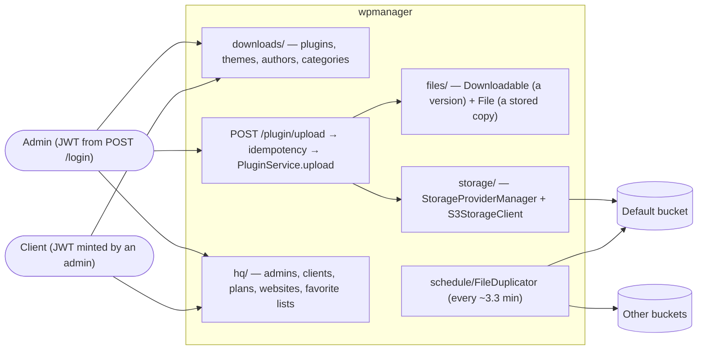

# Overview and Design Philosophy — wpmanager

#doc #explanation #ref-wpmanager #architecture

**Project:** `wpmanager/` · **Stack:** Spring Boot 3.4.1, Java 21 · **Index:** [[Docs/wpmanager/wpmanager-Index]]

## Summary

Despite its name, wpmanager does not manage WordPress sites. It is the backend of a **premium WordPress
plugin and theme repository**. Admins register plugins and themes, upload versioned ZIP files, and the
files are stored in one or more S3-compatible buckets (AWS S3, Wasabi) and copied between them by a
scheduled job. Clients hold a plan (which WordPress product IDs they may use and how many websites they may
register), register websites and keep favorite lists. WordPress only appears as data: a client's `wpID`, a
website's `wpVersion`, a plan's `wpIDs`. The one idea to take away: **a generic CRUD framework carries the
catalog, and three hand-built subsystems carry the real engineering** — the upload pipeline, upload
idempotency, and multi-provider storage with replication.

## Why It Is Built This Way

### What the project really is

There is no WordPress REST client, SSH client or remote-execution code anywhere. The only outbound HTTP code
is the `HEAD` probe that checks a website's URL
(`wpmanager/src/main/java/com/wpmanager/shared/tools/URLValidator.java:61-118`) and the AWS SDK S3 client
(`wpmanager/src/main/java/com/wpmanager/models/storage/s3/S3StorageClient.java:45-61`). WordPress concepts
are plain columns: `ClientEntity.wpID`
(`wpmanager/src/main/java/com/wpmanager/models/hq/client/ClientEntity.java:25-26`),
`WebsiteEntity.wpVersion` (`wpmanager/src/main/java/com/wpmanager/models/hq/website/WebsiteEntity.java:39-40`)
and `PlanEntity.wpIDs` (`wpmanager/src/main/java/com/wpmanager/models/hq/plan/PlanEntity.java:26-32`).

### Stated intent

The project ships its own Obsidian vault, `wpmanager/wpManagerDocs`, with 4 system docs, 151 per-class notes,
9 done and 30 open bug notes, 12 done tasks and a login architecture report. The vault states the intent
behind the non-CRUD parts:

- the two-phase upload with compensation "prevents orphaned files in storage when database operations
  fail" (`wpmanager/wpManagerDocs/Docs/File Upload Process.md:211-215`);
- idempotency is automatic and content-based, keyed on the file's SHA-256
  (`wpmanager/wpManagerDocs/Docs/Upload Idempotency System.md:440-462`);
- token validation is "100% self-contained" with zero database hits
  (`wpmanager/wpManagerDocs/Docs/Login and Security Architecture.md:18-22`).

Several of these statements have drifted from the code. The explanations below follow the code and point to
[[Docs/wpmanager/Reviews/11-Code-Hygiene-and-Docs-Drift-Review#WP-R11-04|WP-R11-04]] where the vault
disagrees.

### Inferred design philosophy

1. **Generic CRUD for the catalog.** Every entity module extends `DefaultController` and
   `DefaultServiceImplements`
   (`wpmanager/src/main/java/com/wpmanager/shared/defaultImplements/DefaultController.java:14-49`,
   `wpmanager/src/main/java/com/wpmanager/shared/defaultImplements/DefaultServiceImplements.java:16-73`) and
   overrides what differs.
2. **Hand-built flows where CRUD does not fit.** Upload
   (`wpmanager/src/main/java/com/wpmanager/models/downloads/plugin/PluginService.java:158-207`), idempotency
   (`wpmanager/src/main/java/com/wpmanager/shared/idempotency/IdempotencyManager.java:19-519`) and storage
   (`wpmanager/src/main/java/com/wpmanager/models/storage/storageProviderManager/StorageProviderManager.java:40-323`)
   are written directly against repositories and the S3 SDK.
3. **Reliability added in response to bug reports.** The vault's `Bugs/done/` folder records the history:
   idempotency, compensation, duplicate-version prevention, size validation and HMAC signing were all added
   after a bug note (`wpmanager/wpManagerDocs/Bugs/done/Implement Idempotency for Upload Operations.md`,
   `wpmanager/wpManagerDocs/Bugs/done/Partial Upload Orphans Files.md`,
   `wpmanager/wpManagerDocs/Bugs/done/No Duplicate Version Prevention.md`,
   `wpmanager/wpManagerDocs/Bugs/done/Weak Signature Generation.md`).
4. **Authorization on service methods.** Rules are `@PreAuthorize` annotations on services (35 of them), not
   URL rules. Method security is switched on by `@EnableMethodSecurity` on three service classes; see
   [[Docs/wpmanager/Explanations/06-Authentication-and-Authorization]].

### Lineage

wpmanager sits between BugTracker and `backend/`:

- **From BugTracker** it inherited the generic `DefaultController`/`DefaultServiceImplements` stack, but
  dropped the list-DTO type parameter: BugTracker's controller is
  `DefaultController <DTO, MINIDTO, LISTDTO, FORM, ID>`
  (`BugTracker/src/main/java/com/bgsystem/bugtracker/shared/controller/DefaultController.java:17`), wpmanager's
  is `DefaultController <DTO, MINIDTO, FORM, ID>`
  (`wpmanager/src/main/java/com/wpmanager/shared/defaultImplements/DefaultController.java:14`). It moved from
  Spring Boot 2.7 to 3.4.1 (`wpmanager/pom.xml:5-10`).
- **To backend/** it passed its `configuration/`, `shared/`, `constant/` and `exceptions/` packages almost
  unchanged. A package-normalised diff of the 37 files the two projects share in those packages shows 27 identical files,
  including `SecurityConfig`, `SecurityController`, `JwtTokenService`, `AuthUserUtil`, `FileSigner` and
  every `shared/tools` class (`wpmanager/src/main/java/com/wpmanager/configuration/security/SecurityConfig.java`,
  `backend/src/main/java/com/agentForgeBackend/configuration/security/SecurityConfig.java`).
- **backend/ removed** the `shared/idempotency` package, the `DuplicateUploadException` and `FailUpload`
  exceptions and the whole downloads/files/storage domain, and **added** the QueryDSL list engine
  (`backend/src/main/java/com/agentForgeBackend/shared/query`) and a `LISTDTO` parameter again
  (`backend/src/main/java/com/agentForgeBackend/shared/defaultImplements/DefaultController.java:17`).
- One consequence of that removal: wpmanager switches on method security from three services
  (`wpmanager/src/main/java/com/wpmanager/models/downloads/plugin/PluginService.java:36`,
  `wpmanager/src/main/java/com/wpmanager/models/downloads/author/AuthorService.java:29`,
  `wpmanager/src/main/java/com/wpmanager/models/hq/plan/PlanService.java:20`). `backend/` did not keep those
  services, so it lost method security altogether while keeping every `@PreAuthorize`.

## How It Works

The four domain areas are packages under `models/`:

| Area | Package | Contents |
|---|---|---|
| Catalog | `wpmanager/src/main/java/com/wpmanager/models/downloads` | plugins, themes, authors, plugin and theme categories |
| Files | `wpmanager/src/main/java/com/wpmanager/models/files` | `Downloadable` (one uploaded version), `File` (one copy in one provider), `Image` (entity only) |
| Customers (HQ) | `wpmanager/src/main/java/com/wpmanager/models/hq` | admins, clients, plans, websites, favorite lists |
| Storage | `wpmanager/src/main/java/com/wpmanager/models/storage` | provider hierarchy, S3 client, upload manager, FTP stub |

Two scheduled jobs run beside the request path: `FileDuplicator` copies each version to every provider
(`wpmanager/src/main/java/com/wpmanager/schedule/FileDuplicator.java:51-77`) and `IdempotencyKeyCleanup`
removes expired idempotency keys (`wpmanager/src/main/java/com/wpmanager/schedule/IdempotencyKeyCleanup.java:50-77`).
Scheduling and web security are enabled on the application class
(`wpmanager/src/main/java/com/wpmanager/WpmanagerApplication.java:8-11`).

### Stack

| Concern | Choice | Version | Source |
|---|---|---|---|
| Framework | Spring Boot (parent POM) | 3.4.1 | `wpmanager/pom.xml:5-10` |
| Language | Java | 21 | `wpmanager/pom.xml:30` |
| Persistence | Spring Data JPA (Hibernate, Boot-managed) | 6.6.x | `wpmanager/pom.xml:56-59` |
| Security | Spring Security (Boot-managed) | 6.4.x | `wpmanager/pom.xml:68-71` |
| JWT | JJWT (`api`, `impl`, `jackson`) | 0.12.5 | `wpmanager/pom.xml:109-125` |
| Object storage | AWS SDK for Java v2 `s3` | 2.20.12 | `wpmanager/pom.xml:152-157` |
| Database | MySQL (`mysql-connector-j`) | Boot-managed | `wpmanager/pom.xml:99-103`, `wpmanager/src/main/resources/application.properties:3` |
| Test database | H2 in MySQL mode | Boot-managed | `wpmanager/pom.xml:147-151`, `wpmanager/src/main/resources/application-test.properties:4` |
| Boilerplate | Lombok | Boot-managed | `wpmanager/pom.xml:104-108` |
| Tests | JUnit 5, Spring Security Test, JUnit Platform Suite | Boot-managed | `wpmanager/pom.xml:127-146`, `wpmanager/pom.xml:158-162` |

Six further starters are declared but unused; see
[[Docs/wpmanager/Explanations/02-Build-Tooling-and-Dependencies]].

## Key Components

| Component | Path | Responsibility |
|---|---|---|
| Application class | `wpmanager/src/main/java/com/wpmanager/WpmanagerApplication.java` | Boot entry point; enables scheduling and web security |
| Security wiring | `wpmanager/src/main/java/com/wpmanager/configuration` | Filter chain, JSON login, JWT service and filter, seed admin |
| Generic CRUD | `wpmanager/src/main/java/com/wpmanager/shared/defaultImplements` | Base controller and service |
| Idempotency | `wpmanager/src/main/java/com/wpmanager/shared/idempotency` | Upload de-duplication and result replay |
| Upload manager | `wpmanager/src/main/java/com/wpmanager/models/storage/storageProviderManager/StorageProviderManager.java` | Upload to the default provider, persist, compensate |
| S3 adapter | `wpmanager/src/main/java/com/wpmanager/models/storage/s3/S3StorageClient.java` | Put, head, get and delete objects |
| Replication job | `wpmanager/src/main/java/com/wpmanager/schedule/FileDuplicator.java` | Copy every version to every provider |
| Error mapping | `wpmanager/src/main/java/com/wpmanager/exceptions/GlobalExceptionHandler.java` | Exception → status + `ErrorHTTPRes` |
| Project vault | `wpmanager/wpManagerDocs` | Authors' own docs, bug backlog and tasks |

## Conventions and Rules

- Catalog and customer entities are feature modules under `models/<area>/<feature>/` built on the generic
  stack (see [[Docs/wpmanager/Explanations/03-Package-Structure-and-Module-Anatomy]]).
- Anything reusable goes under `shared/`; framework wiring goes under `configuration/`; scheduled jobs go under
  `schedule/`.
- Uploads always go through `IdempotentUploadService` in the controller and through
  `StorageProviderManager` in the service.
- Business failures are the project's checked exceptions, mapped centrally
  ([[Docs/wpmanager/Explanations/11-Error-Handling]]).
- Authorization is declared per service method with `@PreAuthorize`.

## How to Replicate

1. Create a Spring Boot 3.4.x / Java 21 Maven project with web, data-jpa, security, validation, Lombok,
   JJWT 0.12.x and the AWS SDK v2 `s3` module ([[Docs/wpmanager/Explanations/02-Build-Tooling-and-Dependencies]]).
2. Create `configuration/`, `constant/`, `exceptions/`, `models/`, `schedule/` and `shared/`.
3. Build the generic CRUD stack ([[Docs/wpmanager/Explanations/04-Generic-CRUD-Framework]]) and the user root
   entity with security ([[Docs/wpmanager/Explanations/05-Domain-Model-and-Persistence]],
   [[Docs/wpmanager/Explanations/06-Authentication-and-Authorization]]).
4. Add the storage abstraction, upload manager and replication job
   ([[Docs/wpmanager/Explanations/09-Storage-Providers-and-Replication]]).
5. Add the upload flow and idempotency ([[Docs/wpmanager/Explanations/07-Upload-Pipeline]],
   [[Docs/wpmanager/Explanations/08-Upload-Idempotency]]).
6. Add catalog and customer modules. The full walkthrough is
   [[Docs/wpmanager/Explanations/14-Recipe-Build-a-Project-This-Way]].

## Known Limitations

- Endpoints without a service-level annotation are anonymous, and inherited CRUD operations only require a
  login, so clients can delete admins
  ([[Docs/wpmanager/Reviews/01-Security-Review#WP-R01-01|WP-R01-01]],
  [[Docs/wpmanager/Reviews/01-Security-Review#WP-R01-03|WP-R01-03]]).
- Theme upload never succeeds ([[Docs/wpmanager/Reviews/07-Service-Design-Review#WP-R07-01|WP-R07-01]]), and a
  failed plugin upload can block that version permanently
  ([[Docs/wpmanager/Reviews/03-Upload-Transactions-and-Consistency-Review#WP-R03-01|WP-R03-01]]).
- The vault describes several behaviors the code does not have
  ([[Docs/wpmanager/Reviews/11-Code-Hygiene-and-Docs-Drift-Review#WP-R11-04|WP-R11-04]]).

## Related Documents

- [[Docs/wpmanager/wpmanager-Index]]
- [[Docs/wpmanager/Explanations/02-Build-Tooling-and-Dependencies]]
- [[Docs/wpmanager/Explanations/03-Package-Structure-and-Module-Anatomy]]
- [[Docs/wpmanager/Reviews/00-Review-Summary]]
- [[Docs/backend/Explanations/01-Overview-and-Design-Philosophy]] — the descendant project
- [[Docs/BugTracker/Explanations/01-Overview-and-Design-Philosophy]] — the ancestor project
- [[Docs/Analysis-Doc-Conventions]]
