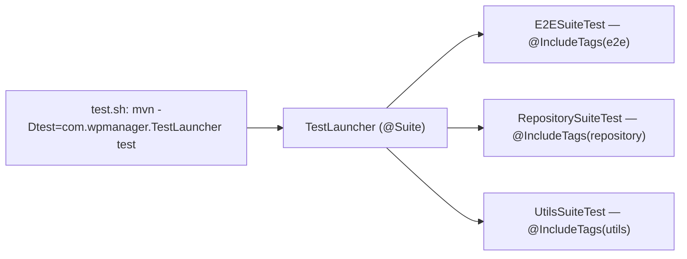

# Build, Tooling and Dependencies — wpmanager

#doc #explanation #ref-wpmanager #build

**Project:** `wpmanager/` · **Stack:** Spring Boot 3.4.1, Java 21 · **Index:** [[Docs/wpmanager/wpmanager-Index]]

## Summary

wpmanager is a single-module Maven project on the Spring Boot 3.4.1 parent, compiled for Java 21, with the
Maven wrapper checked in. It uses Lombok as its only annotation processor (there is no QueryDSL). The POM
declares more than the code uses: six starters (batch, data-jdbc, jdbc, web-services, webflux, websocket) and
two test libraries have no reference in the sources. Tests are run through a JUnit Platform suite launcher,
`TestLauncher`, which groups tests by tag. There is no Dockerfile, no CI configuration and no README beyond
Spring Initializr's `HELP.md`.

## Why It Is Built This Way

The POM still carries Spring Initializr's empty `<url/>`, `<licenses>`, `<developers>` and `<scm>` blocks
(`wpmanager/pom.xml:16-28`), so it was generated with a broad set of starters and trimmed only by adding.
The explicit Mockito pin is commented "Explicit Mockito dependencies" (`wpmanager/pom.xml:35-47`), and the
Surefire `argLine` enables dynamic agent loading (`wpmanager/pom.xml:172`) — both look like workarounds for
Mockito's inline agent warnings on Java 21. Mockito itself is not used by any test (see below). The
suite-based test run (`wpmanager/test.sh`) was added so the E2E, repository and utility tests can be run as
named groups.

## How It Works

### Dependencies and whether they are used

"Used" means at least one import or configuration in `wpmanager/src` depends on the artifact (checked with
`grep` on package names).

| Dependency | Scope | Used? | Evidence |
|---|---|---|---|
| `spring-boot-starter-web` | compile | yes | controllers, e.g. `wpmanager/src/main/java/com/wpmanager/models/downloads/plugin/PluginController.java:14-16` |
| `spring-boot-starter-data-jpa` | compile | yes | repositories and entities |
| `spring-boot-starter-security` | compile | yes | `wpmanager/src/main/java/com/wpmanager/configuration/security/SecurityConfig.java:29-59` |
| `spring-boot-starter-validation` | compile | partly | `@Valid` on the base controller, a handful of constraints (`wpmanager/src/main/java/com/wpmanager/shared/defaultImplements/DefaultController.java:33`) |
| `spring-boot-starter-data-rest` | compile | no code reference, **active at runtime** | auto-configures REST endpoints for repositories; see [[Docs/wpmanager/Reviews/01-Security-Review#WP-R01-05\|WP-R01-05]] |
| `spring-boot-starter-batch` | compile | no | no `org.springframework.batch` import (`wpmanager/pom.xml:48-51`) |
| `spring-boot-starter-data-jdbc`, `spring-boot-starter-jdbc` | compile | no | no Spring JDBC or Data JDBC import (`wpmanager/pom.xml:52-55`, `wpmanager/pom.xml:64-67`) |
| `spring-boot-starter-web-services` | compile | no | no `org.springframework.ws` import (`wpmanager/pom.xml:80-83`) |
| `spring-boot-starter-webflux` | compile | no | no reactive code (`wpmanager/pom.xml:84-87`) |
| `spring-boot-starter-websocket` | compile | no | no WebSocket code (`wpmanager/pom.xml:88-91`) |
| `spring-boot-devtools` | runtime, optional | dev only | `wpmanager/pom.xml:93-98` |
| `mysql-connector-j` | runtime | yes | `wpmanager/src/main/resources/application.properties:3-6` |
| `lombok` | optional | yes | also the only annotation processor (`wpmanager/pom.xml:181-188`) |
| `jjwt-api/impl/jackson` 0.12.5 | compile/runtime | yes | `wpmanager/src/main/java/com/wpmanager/configuration/filter/JwtTokenService.java:34-51` |
| `software.amazon.awssdk:s3` 2.20.12 | compile | yes | `wpmanager/src/main/java/com/wpmanager/models/storage/s3/S3StorageClient.java:45-61` |
| `spring-boot-starter-test`, `spring-security-test` | test | yes | MockMvc E2E tests |
| `h2` | test | yes | `wpmanager/src/main/resources/application-test.properties:4-7` |
| `junit-platform-suite-engine` | test | yes | `wpmanager/src/test/java/com/wpmanager/TestLauncher.java:11-17` |
| `mockito-core`, `mockito-junit-jupiter` 5.14.2 | test | no | no test imports `org.mockito` (`wpmanager/pom.xml:36-47`) |
| `reactor-test`, `spring-batch-test` | test | no | `wpmanager/pom.xml:132-141` |

The comment above the S3 dependency still names the version 1 SDK, `aws-java-sdk`, while the artifact is the
version 2 `software.amazon.awssdk:s3` (`wpmanager/pom.xml:152-157`). The Mockito pin equals the version Spring
Boot 3.4.1 already manages (5.14.2); Surefire is pinned to 3.2.5 (`wpmanager/pom.xml:31-32`), below Boot 3.4.1's
managed 3.5.2.

### Build plugins

```xml
<!-- wpmanager/pom.xml:167-177 -->
<plugin>
    <groupId>org.apache.maven.plugins</groupId>
    <artifactId>maven-surefire-plugin</artifactId>
    <version>${maven.surefire.version}</version>
    <configuration>
        <argLine>-XX:+EnableDynamicAgentLoading -Djdk.instrument.traceUsage=false</argLine>
        <excludes>
            <exclude>**/*SuiteTest.java</exclude>
        </excludes>
    </configuration>
</plugin>
```

The compiler plugin lists Lombok under `annotationProcessorPaths`, and the Boot plugin excludes Lombok from the
fat jar (`wpmanager/pom.xml:178-201`).

### Test launch path



`wpmanager/test.sh:1` runs `TestLauncher` (`wpmanager/src/test/java/com/wpmanager/TestLauncher.java:11-17`),
which selects three suites; each suite selects all classes in `com.wpmanager` with one tag
(`wpmanager/src/test/java/com/wpmanager/suites/E2ESuiteTest.java:5-11`). A plain `mvn test` runs every test
class except `*SuiteTest` classes, including the untagged `WpmanagerApplicationTests`, which needs MySQL.

### Tooling outside Maven

- No Dockerfile, no compose file and no CI workflow exist in `wpmanager/`.
- `wpmanager/HELP.md` is the unedited Spring Initializr help file.
- `wpmanager/.continue/rules/spring-dev-rule.md` is an AI-assistant rule for the Continue IDE extension. It
  lists technologies the project does not use (MongoDB, Elasticsearch, Neo4j, Redis, Cassandra, QueryDSL,
  Docker) (`wpmanager/.continue/rules/spring-dev-rule.md:5-21`).
  `wpmanager/.continue/mcpServers/new-mcp-server.yaml` is an unfilled MCP server template.

## Key Components

| Component | Path | Responsibility |
|---|---|---|
| POM | `wpmanager/pom.xml` | Parent, dependencies, Surefire/compiler/Boot plugins |
| Maven wrapper | `wpmanager/mvnw` | Reproducible Maven |
| Test script | `wpmanager/test.sh` | Runs `TestLauncher` |
| Suite launcher | `wpmanager/src/test/java/com/wpmanager/TestLauncher.java` | Runs the three tag suites |
| Tag suites | `wpmanager/src/test/java/com/wpmanager/suites` | `e2e`, `repository`, `utils` |
| AI rule | `wpmanager/.continue/rules/spring-dev-rule.md` | Continue IDE instructions |

## Conventions and Rules

- Versions come from the Boot parent unless there is a reason to pin (JJWT and the AWS SDK are pinned because
  Boot does not manage them).
- Every test class carries exactly one suite tag (`e2e`, `repository` or `utils`) so the launcher finds it.
- Lombok is the only annotation processor; add new processors under `annotationProcessorPaths`.

## How to Replicate

1. Generate a Boot 3.4.x project with only web, data-jpa, security, validation, Lombok and your JDBC driver.
2. Add `jjwt-api` (compile) and `jjwt-impl` + `jjwt-jackson` (runtime) 0.12.x, and `software.amazon.awssdk:s3`.
   Prefer importing the AWS SDK BOM (`software.amazon.awssdk:bom`) over pinning one module.
3. Keep Lombok under `annotationProcessorPaths` and excluded from the Boot jar, as in `wpmanager/pom.xml:178-201`.
4. Add `junit-platform-suite-engine` (test), create `suites/<Tag>SuiteTest.java` with `@IncludeTags`, and a
   `TestLauncher` that selects them; exclude `*SuiteTest.java` from the default Surefire run.
5. Do not add batch, webflux, websocket, web-services, JDBC or Data REST starters unless a feature needs them.

## Known Limitations

- Unused starters and test dependencies
  ([[Docs/wpmanager/Reviews/09-Build-Dependencies-and-Configuration-Review#WP-R09-01|WP-R09-01]]); Data REST is
  active with no code using it ([[Docs/wpmanager/Reviews/01-Security-Review#WP-R01-05|WP-R01-05]]).
- Surefire pinned below Boot's version, a redundant Mockito pin and a stale SDK comment
  ([[Docs/wpmanager/Reviews/09-Build-Dependencies-and-Configuration-Review#WP-R09-06|WP-R09-06]]).
- No README, Docker or CI ([[Docs/wpmanager/Reviews/09-Build-Dependencies-and-Configuration-Review#WP-R09-07|WP-R09-07]]).
- The AI rule and MCP placeholder are leftovers
  ([[Docs/wpmanager/Reviews/11-Code-Hygiene-and-Docs-Drift-Review#WP-R11-05|WP-R11-05]]).

## Related Documents

- [[Docs/wpmanager/Explanations/01-Overview-and-Design-Philosophy]]
- [[Docs/wpmanager/Explanations/12-Configuration-and-Secrets]]
- [[Docs/wpmanager/Explanations/13-Testing-Strategy]]
- [[Docs/wpmanager/Reviews/09-Build-Dependencies-and-Configuration-Review]]
- [[Docs/backend/Explanations/02-Build-Tooling-and-Dependencies]]
