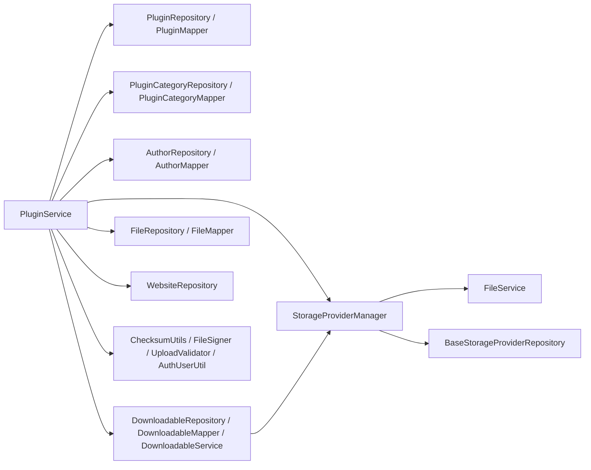

# Package Structure and Module Anatomy — wpmanager

#doc #explanation #ref-wpmanager #architecture

**Project:** `wpmanager/` · **Stack:** Spring Boot 3.4.1, Java 21 · **Index:** [[Docs/wpmanager/wpmanager-Index]]

## Summary

The main source tree has 161 Java files (about 9,100 lines) under `com.wpmanager`, split into `configuration/`,
`constant/`, `exceptions/`, `models/`, `schedule/` and `shared/`, plus an empty `services/` directory. Feature
code lives in `models/<area>/<feature>/`, one package per entity. The standard feature module has **eight
files** — Controller, Service, Repository, Entity, Form, DTO, MiniDTO, Mapper — two fewer than `backend/`'s
ten-file module, because wpmanager has no list DTO and no query profile. Twelve entity modules follow the
pattern with small variations; the storage and files areas break it on purpose.

## Why It Is Built This Way

The layout is package-by-feature inside package-by-area: the area (`downloads`, `files`, `hq`, `storage`)
groups related features, and each feature holds all its layers. No document states this rule; it is inferred
from the tree. The vault's open note "Package Structure Violations" argues for package-by-layer instead
(`wpmanager/wpManagerDocs/Bugs/to-do/Package Structure Violations.md`); the code has not changed.

The eight-file set follows directly from the generic stack's type parameters: `DefaultController<DTO, MINIDTO,
FORM, ID>` needs a DTO, MiniDTO and Form, and `DefaultServiceImplements<…, ENTITY, ID>` needs an entity,
repository and mapper (`wpmanager/src/main/java/com/wpmanager/shared/defaultImplements/DefaultServiceImplements.java:22-32`).

## How It Works

### Package tree

| Package | Files | Lines | Role |
|---|---|---|---|
| `configuration/boostrap` | 1 | 53 | Seed admin (`AdminBoostrap`) |
| `configuration/filter` | 2 | 149 | `JwtTokenService`, `JWTTokenValidatorFilter` |
| `configuration/security` | 4 | 221 | `SecurityConfig`, `SecurityController` (`POST /login`), login DTOs |
| `constant` | 1 | 9 | `ApplicationConstants` |
| `exceptions` | 7 | 227 | Checked domain exceptions, `DuplicateUploadException`, `GlobalExceptionHandler` |
| `models/downloads/*` | 41 | 2,367 | author, plugin, pluginCategory, theme, themeCategory |
| `models/files/*` | 16 | 726 | downloadable, file, image |
| `models/hq/*` | 40 | 2,008 | admin, client, favoriteList, plan, website |
| `models/storage/*` | 17 | 1,281 | ftp, s3, storageProvider, storageProviderManager |
| `schedule` | 2 | 296 | `FileDuplicator`, `IdempotencyKeyCleanup` |
| `shared/defaultImplements`, `shared/defaultInterfaces` | 6 | 164 | Generic CRUD |
| `shared/functional` | 1 | 20 | `ThrowingSupplier` |
| `shared/idempotency` | 5 | 722 | Upload idempotency |
| `shared/models/baseUser`, `shared/securityUser` | 8 | 257 | User root entity, `UserDetails` adapter |
| `shared/tools` | 9 | 614 | `AuthUserUtil`, `ChecksumUtils`, `FileSigner`, validators, `ErrorHTTPRes` |
| `services` | 0 | 0 | Empty directory (`wpmanager/src/main/java/com/wpmanager/services`) |

### The eight-file module

Using `hq/plan` as the example (`wpmanager/src/main/java/com/wpmanager/models/hq/plan`):

| File | Role |
|---|---|
| `PlanController` | `@RestController @RequestMapping("/plan")`, extends `DefaultController`, usually empty (`wpmanager/src/main/java/com/wpmanager/models/hq/plan/PlanController.java:7-15`) |
| `PlanService` | extends `DefaultServiceImplements`, overrides `insert`/`update`/`delete` with validation and `@PreAuthorize` |
| `PlanRepository` | extends `DefaultRepository` (a `JpaRepository`) with derived finders |
| `PlanEntity` | JPA entity, Lombok `@Builder`, hand-written `equals`/`hashCode` |
| `PlanForm` | request body for insert and update |
| `PlanDTO` | full response, including related mini DTOs |
| `PlanMiniDTO` | flat response used in lists of related items and as the insert response |
| `PlanMapper` | `DefaultMapper` implementation; `@Lazy` constructor to break mapper cycles |

`backend/` has the same files plus `ListDTO` and `QueryProfile`
(`backend/src/main/java/com/agentForgeBackend/models/hq/client`).

### Module catalogue

"Inherited" means the base-class handler runs unchanged, guarded only by `isAuthenticated()`. Controllers
live at the route shown; every one extends `DefaultController`.

| Module | Route | Service overrides | Custom endpoints | Missing / unusual |
|---|---|---|---|---|
| `downloads/author` | `/author` | `insert`, `update`, `delete` (ADMIN) | — | uses `TextFieldValidator` (`wpmanager/src/main/java/com/wpmanager/models/downloads/author/AuthorService.java:50-98`) |
| `downloads/plugin` | `/plugin` | `getAll` (no annotation), `insert`, `update`, `delete`, `upload` (ADMIN) | `POST /plugin/upload` | extra `PluginUploadForm`; 17 constructor dependencies (`wpmanager/src/main/java/com/wpmanager/models/downloads/plugin/PluginService.java:56-74`) |
| `downloads/pluginCategory` | `/plugin-category` | `insert`, `update`, `delete` (ADMIN) | — | — |
| `downloads/theme` | `/theme` | `insert`, `update`, `delete`, `upload` (ADMIN) | `POST /theme/upload` | extra `ThemeUploadForm`; near-copy of plugin |
| `downloads/themeCategory` | none | `insert`, `update`, `delete` (ADMIN) | — | **no controller**: 7 files (`wpmanager/src/main/java/com/wpmanager/models/downloads/themeCategory`) |
| `files/downloadable` | `downloadable` (no leading slash) | `deleteDownloadable` (ADMIN) | `DELETE /downloadable` with a body | the inherited `DELETE /downloadable/{id}` also exists (`wpmanager/src/main/java/com/wpmanager/models/files/downloadable/DownloadableController.java:12-24`) |
| `files/file` | none | not a `DefaultServiceImplements`; internal `FileService` | — | no controller by design (`wpmanager/src/main/java/com/wpmanager/models/files/file/FileService.java:18-36`) |
| `files/image` | none | none | — | entity only (`wpmanager/src/main/java/com/wpmanager/models/files/image/ImageEntity.java`) |
| `hq/admin` | `/admin` | `insert`, `getOne` (ADMIN) | — | service named `AdminServiceImpl` |
| `hq/client` | `/client` | `getOne` (no annotation), `insert`, `update` (ADMIN) | `GET /client/token/{username}` | mapper marked `//TODO Finish mapper` (`wpmanager/src/main/java/com/wpmanager/models/hq/client/ClientMapper.java:14`) |
| `hq/favoriteList` | `/fav_list` | `insert`, `update` (ownership via `AuthUserUtil`) | — | — |
| `hq/plan` | `/plan` | `insert`, `update`, `delete` (ADMIN) | — | — |
| `hq/website` | `/website` | `insert` (no annotation, client via `AuthUserUtil`), `update` (ownership) | — | `jakarta.transaction.Transactional` (`wpmanager/src/main/java/com/wpmanager/models/hq/website/WebsiteService.java:15`) |
| `storage/s3` | `/s3` | `insert` (ADMIN) | — | extra `S3StorageClient` and debug `S3FileUploadController` at `/tests3` |
| `storage/ftp` | none | none | — | entity only; `getClient()` returns `null` (`wpmanager/src/main/java/com/wpmanager/models/storage/ftp/FTPProviderEntity.java:73-76`) |
| `storage/storageProvider` | none | none | — | abstract entity, client base class, repository, empty `BaseStorageProviderService` |
| `storage/storageProviderManager` | none | — | — | one service, `StorageProviderManager` |

### Cross-module coupling

`PluginService` depends on repositories, mappers and services from five other modules:

Source: the constructor at `wpmanager/src/main/java/com/wpmanager/models/downloads/plugin/PluginService.java:56-91`.
`ThemeService` has the same shape minus `AuthUserUtil`
(`wpmanager/src/main/java/com/wpmanager/models/downloads/theme/ThemeService.java:51-84`). Mappers reference
each other in cycles (plugin → website → client → plan → client), resolved with `@Lazy` on eleven mapper
constructors, e.g. `wpmanager/src/main/java/com/wpmanager/models/hq/website/WebsiteMapper.java:19-28`.

## Key Components

| Component | Path | Responsibility |
|---|---|---|
| Catalog modules | `wpmanager/src/main/java/com/wpmanager/models/downloads` | Plugins, themes, authors, categories |
| File modules | `wpmanager/src/main/java/com/wpmanager/models/files` | Versions and stored copies |
| Customer modules | `wpmanager/src/main/java/com/wpmanager/models/hq` | Admins, clients, plans, websites, favorite lists |
| Storage modules | `wpmanager/src/main/java/com/wpmanager/models/storage` | Providers and upload manager |
| Generic stack | `wpmanager/src/main/java/com/wpmanager/shared/defaultImplements` | Base controller and service |

## Conventions and Rules

- One package per entity: `models/<area>/<feature>/`, files named `<Feature><Role>.java`.
- Controllers are thin; business rules go in service overrides.
- Services may inject other modules' repositories and mappers directly (this is how plugin, theme and
  favorite-list code work today).
- Mapper constructors that reference other mappers are annotated `@Lazy`.
- A module without external API (file, image, FTP) has no controller.

## How to Replicate

1. Create `models/<area>/<feature>/` for each entity.
2. Add the eight files: `<F>Entity`, `<F>Repository extends DefaultRepository<<F>Entity, Long>`, `<F>Form`,
   `<F>DTO`, `<F>MiniDTO`, `<F>Mapper implements DefaultMapper<…>`, `<F>Service extends
   DefaultServiceImplements<…>`, `<F>Controller extends DefaultController<…>` with `@RequestMapping("/<f>")`.
3. Override service methods whose rules differ from the base, each with its own `@PreAuthorize`.
4. Put upload-style or other non-CRUD endpoints in the same controller, with a dedicated form class.

## Known Limitations

- Theme categories cannot be managed through the API
  ([[Docs/wpmanager/Reviews/07-Service-Design-Review#WP-R07-10|WP-R07-10]]).
- Cross-module repository access and `@Lazy` mapper cycles
  ([[Docs/wpmanager/Reviews/07-Service-Design-Review#WP-R07-05|WP-R07-05]]); `PluginService` is a god class
  ([[Docs/wpmanager/Reviews/07-Service-Design-Review#WP-R07-04|WP-R07-04]]).
- Inconsistent route names ([[Docs/wpmanager/Reviews/02-CRUD-Framework-and-API-Design-Review#WP-R02-07|WP-R02-07]]).
- The empty `services/` directory and other dead code
  ([[Docs/wpmanager/Reviews/11-Code-Hygiene-and-Docs-Drift-Review#WP-R11-03|WP-R11-03]]).

## Related Documents

- [[Docs/wpmanager/Explanations/04-Generic-CRUD-Framework]]
- [[Docs/wpmanager/Explanations/05-Domain-Model-and-Persistence]]
- [[Docs/wpmanager/Reviews/07-Service-Design-Review]]
- [[Docs/backend/Explanations/03-Package-Structure-and-Module-Anatomy]]
