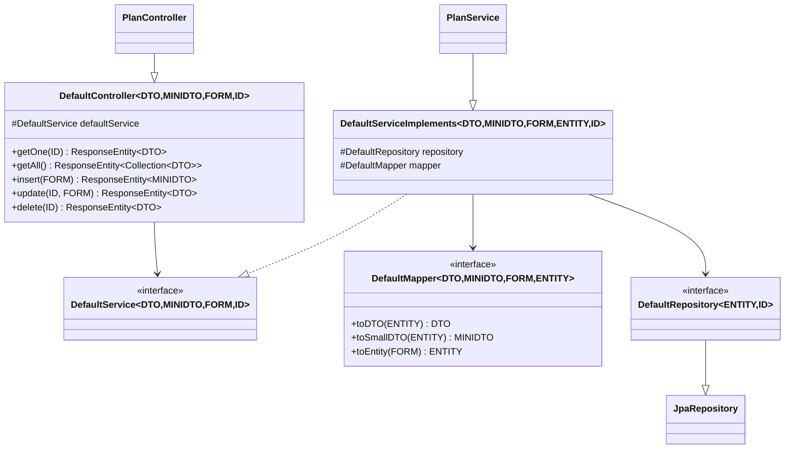

# Generic CRUD Framework — wpmanager

#doc #explanation #ref-wpmanager #architecture #api-design

**Project:** `wpmanager/` · **Stack:** Spring Boot 3.4.1, Java 21 · **Index:** [[Docs/wpmanager/wpmanager-Index]]

## Summary

Every catalog and customer module is built on four generic types in `shared/`: `DefaultController<DTO,
MINIDTO, FORM, ID>`, `DefaultService<DTO, MINIDTO, FORM, ID>`, `DefaultServiceImplements<DTO, MINIDTO, FORM,
ENTITY, ID>` and `DefaultMapper<DTO, MINIDTO, FORM, ENTITY>`, over a `DefaultRepository<ENTITY, ID>` that is
simply a `JpaRepository`. The base controller exposes five endpoints; the base service implements them with a
class-level transaction and `@PreAuthorize("isAuthenticated()")` on each method. Feature services override the
methods whose rules differ. The base `update` loads the entity and saves it back without applying the form.

## Why It Is Built This Way

The stack exists so a new entity needs only type bindings: `PlanController` is a constructor and nothing else
(`wpmanager/src/main/java/com/wpmanager/models/hq/plan/PlanController.java:7-15`). It is the middle generation
of the lineage: BugTracker's version had a `LISTDTO` parameter and a list endpoint, which wpmanager dropped;
`backend/` later added it back with a query engine
([[Docs/wpmanager/Explanations/01-Overview-and-Design-Philosophy]]). Security intent is visible in the base
class: every inherited operation requires an authenticated user, and stricter rules are expected on overrides.

## How It Works



### Inherited endpoints

| Method and path | Handler | Base service behavior |
|---|---|---|
| `GET /{id}` | `getOne` | `findById` → `toDTO`, else `ItemNotFoundException` (404) |
| `GET ""` or `/` | `getAll` | `findAll()` → `toDTO` → collected into a `Set` |
| `POST ""` or `/` | `insert(@Valid @RequestBody FORM)` | `toEntity` → `save` → `toSmallDTO`; responds 200 |
| `PUT /{id}` | `update(@Valid @RequestBody FORM)` | `findById` → `save` the unchanged entity → `toDTO` |
| `DELETE /{id}` | `delete` | `findById` → `delete` → `toDTO` of the deleted entity |

Source: `wpmanager/src/main/java/com/wpmanager/shared/defaultImplements/DefaultController.java:22-48` and:

```java
// wpmanager/src/main/java/com/wpmanager/shared/defaultImplements/DefaultServiceImplements.java:16-22
@Transactional(rollbackFor = {
        ItemNotFoundException.class,
        InvalidInsertDetails.class,
        InvalidDeleteOperation.class,
        ItemAlreadyExist.class
})
public abstract class DefaultServiceImplements <DTO, MINIDTO, FORM, ENTITY, ID> implements DefaultService  <DTO, MINIDTO, FORM, ID>{
```

```java
// wpmanager/src/main/java/com/wpmanager/shared/defaultImplements/DefaultServiceImplements.java:58-64
@Override
@PreAuthorize("isAuthenticated()")
public DTO update(ID id, FORM form) throws ItemNotFoundException, InvalidInsertDetails{
   ENTITY toUpdate = repository.findById(id).orElseThrow(ItemNotFoundException::new);
   repository.save(toUpdate);
   return mapper.toDTO(toUpdate);
}
```

Because Spring's `@Transactional` is `@Inherited`, the class-level rule applies to every subclass method that
does not declare its own transaction. The rollback list includes the four checked domain exceptions, so an
override that throws one of them rolls back.

### Override catalogue

| Service | Overrides (rule) | Inherited, `isAuthenticated()` only |
|---|---|---|
| `AdminServiceImpl` | `insert`, `getOne` (ADMIN) | `getAll`, `update` (no-op), `delete` |
| `ClientService` | `getOne` (no annotation), `insert`, `update` (ADMIN); plus `generateTokenForClient` (ADMIN) | `getAll`, `delete` |
| `PlanService` | `insert`, `update`, `delete` (ADMIN) | `getOne`, `getAll` |
| `WebsiteService` | `insert` (no annotation), `update` (no annotation, ownership check) | `getOne`, `getAll`, `delete` |
| `FavoriteListService` | `insert`, `update` (no annotation, ownership check) | `getOne`, `getAll`, `delete` |
| `AuthorService` | `insert`, `update`, `delete` (ADMIN) | `getOne`, `getAll` |
| `PluginService` | `getAll` (no annotation), `insert`, `update`, `delete` (ADMIN); plus `upload` | `getOne` |
| `ThemeService` | `insert`, `update`, `delete` (ADMIN); plus `upload` | `getOne`, `getAll` |
| `PluginCategoryService`, `ThemeCategoryService` | `insert`, `update`, `delete` (ADMIN) | `getOne`, `getAll` |
| `DownloadableService` | none; adds `deleteDownloadable` (ADMIN) | all five, including `insert`, `update` (no-op), `delete` |
| `S3ProviderService` | `insert` (ADMIN) | `getOne`, `getAll`, `update` (no-op), `delete` |

Sources: the service classes under `wpmanager/src/main/java/com/wpmanager/models`, e.g.
`wpmanager/src/main/java/com/wpmanager/models/hq/admin/AdminServiceImpl.java:28-62` and
`wpmanager/src/main/java/com/wpmanager/models/storage/s3/S3ProviderService.java:29-63`. Whether an override
without an annotation inherits the base method's `@PreAuthorize` depends on how Spring Security resolves the
generic bridge method; the explicit rule is missing either way.

### Typed repository access through casts

The base holds `DefaultRepository<ENTITY, ID>`, so a service that needs a derived finder casts:
`((PluginRepository) repository).findByName(...)`
(`wpmanager/src/main/java/com/wpmanager/models/downloads/plugin/PluginService.java:113`). Controllers that need
a service-specific method cast the service the same way:
`((ClientService)defaultService).generateTokenForClient(username)`
(`wpmanager/src/main/java/com/wpmanager/models/hq/client/ClientController.java:24-30`). `PluginController`
and `ThemeController` avoid the cast by keeping a second, typed field
(`wpmanager/src/main/java/com/wpmanager/models/downloads/plugin/PluginController.java:18-31`).

## Key Components

| Component | Path | Responsibility |
|---|---|---|
| `DefaultController` | `wpmanager/src/main/java/com/wpmanager/shared/defaultImplements/DefaultController.java` | Five REST handlers |
| `DefaultServiceImplements` | `wpmanager/src/main/java/com/wpmanager/shared/defaultImplements/DefaultServiceImplements.java` | Base behavior, transaction, default authorization |
| `DefaultService` | `wpmanager/src/main/java/com/wpmanager/shared/defaultInterfaces/DefaultService.java` | Service contract with checked exceptions |
| `DefaultMapper` | `wpmanager/src/main/java/com/wpmanager/shared/defaultInterfaces/DefaultMapper.java` | Entity ↔ DTO/MiniDTO/Form |
| `DefaultRepository` | `wpmanager/src/main/java/com/wpmanager/shared/defaultInterfaces/DefaultRepository.java` | `@NoRepositoryBean` `JpaRepository` |

## Conventions and Rules

- Bind all type parameters in the class declaration; never use raw types.
- Insert returns the MiniDTO; get, update and delete return the full DTO.
- Override `insert` and `update` whenever the entity has relations or invariants; the base `update` does not
  apply fields.
- Put `@PreAuthorize` on every override; the base class supplies only `isAuthenticated()`.
- Access feature-specific finders by casting `repository` to the concrete repository type.

## How to Replicate

1. Create `shared/defaultInterfaces/{DefaultRepository, DefaultService, DefaultMapper}.java` with the
   signatures above.
2. Create `shared/defaultImplements/DefaultServiceImplements.java` with the class-level `@Transactional`
   rollback list and `@PreAuthorize("isAuthenticated()")` on each method.
3. Create `shared/defaultImplements/DefaultController.java` with the five handlers.
4. For each module, bind the types and override the service methods whose rules differ, as in
   [[Docs/wpmanager/Explanations/14-Recipe-Build-a-Project-This-Way]].

## Known Limitations

- Base `update` does not apply the form
  ([[Docs/wpmanager/Reviews/02-CRUD-Framework-and-API-Design-Review#WP-R02-01|WP-R02-01]]).
- Inherited operations are open to any logged-in user, including clients
  ([[Docs/wpmanager/Reviews/01-Security-Review#WP-R01-03|WP-R01-03]]).
- Casts, unbounded `getAll`, 200 for every success, and the depth of the stack are reviewed in
  [[Docs/wpmanager/Reviews/02-CRUD-Framework-and-API-Design-Review]] (WP-R02-02 to WP-R02-06).

## Related Documents

- [[Docs/wpmanager/Explanations/03-Package-Structure-and-Module-Anatomy]]
- [[Docs/wpmanager/Reviews/02-CRUD-Framework-and-API-Design-Review]]
- [[Docs/backend/Explanations/04-Generic-CRUD-Framework]]
- [[Docs/BugTracker/Explanations/04-Generic-CRUD-Framework]]
