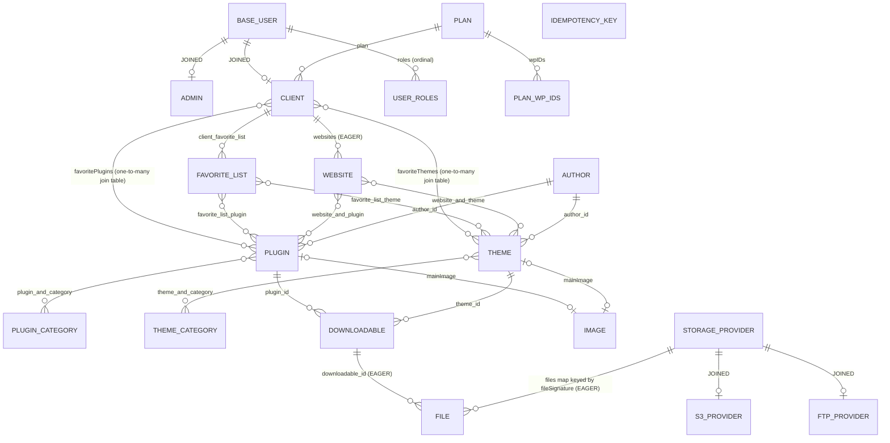

# Domain Model and Persistence — wpmanager

#doc #explanation #ref-wpmanager #persistence

**Project:** `wpmanager/` · **Stack:** Spring Boot 3.4.1, Java 21 · **Index:** [[Docs/wpmanager/wpmanager-Index]]

## Summary

The model has 18 entities in two `JOINED` inheritance trees plus flat entities. Users (`BaseUserEntity` →
`AdminEntity`, `ClientEntity`) share one `base_user` table; storage providers (`StorageProviderEntity` →
`S3ProviderEntity`, `FTPProviderEntity`) share one provider table. The catalog links plugins and themes to
authors, categories and **downloadables** (one uploaded version each); a downloadable has one **file** row per
storage provider that holds a copy. Every table uses `IDENTITY` keys. Persistence is plain Spring Data JPA on
MySQL with `ddl-auto=update`, four `@Query` methods, and transactions declared on services.

## Why It Is Built This Way

The two JOINED trees let one query path serve all subtypes: login loads any user through
`BaseUserRepository.findByUsername`
(`wpmanager/src/main/java/com/wpmanager/shared/securityUser/BaseUserRepository.java:9-13`), and the upload
manager loads "the default provider" whatever its type through
`BaseStorageProviderRepository.findFirstByDefaultProviderTrue`
(`wpmanager/src/main/java/com/wpmanager/models/storage/storageProvider/BaseStorageProviderRepository.java:9-16`).
Separating *version* (`DownloadableEntity`) from *copy* (`FileEntity`) is what makes multi-provider
replication possible: the job compares a version's file count with the provider count
(`wpmanager/src/main/java/com/wpmanager/schedule/FileDuplicator.java:64-72`).

## How It Works

### Entity relationships



Mappings behind the diagram:

- User root: `@Inheritance(JOINED)`, `IDENTITY` id, unique `email` and `username`, roles as an EAGER
  `@ElementCollection` of the `UserRoles` enum with no `@Enumerated`, so stored as ordinals
  (`wpmanager/src/main/java/com/wpmanager/shared/models/baseUser/BaseUserEntity.java:11-68`).
- Client: unique `wpID`, optional plan, EAGER websites with `orphanRemoval`, favorites
  (`wpmanager/src/main/java/com/wpmanager/models/hq/client/ClientEntity.java:18-64`).
- Plan: `wpIDs` element collection, EAGER clients
  (`wpmanager/src/main/java/com/wpmanager/models/hq/plan/PlanEntity.java:26-44`).
- Plugin: unique `name` and `original_project_name`, LAZY categories and websites, `@OneToMany
  @JoinColumn(name = "plugin_id")` downloadables, and a `@OneToOne` main image whose join column is also named
  `plugin_id` (`wpmanager/src/main/java/com/wpmanager/models/downloads/plugin/PluginEntity.java:29-74`).
  `ThemeEntity` mirrors it with `theme_id`
  (`wpmanager/src/main/java/com/wpmanager/models/downloads/theme/ThemeEntity.java:30-75`).
- Downloadable: `name` (built as `pluginName_version`), `version`, 64-char `check_sum`, `files_signature`,
  EAGER `files` (`wpmanager/src/main/java/com/wpmanager/models/files/downloadable/DownloadableEntity.java:10-45`).
- File: `url`, `public_url`, `file_signature`, many-to-one downloadable
  (`wpmanager/src/main/java/com/wpmanager/models/files/file/FileEntity.java:10-40`).

### The provider's file map

```java
// wpmanager/src/main/java/com/wpmanager/models/storage/storageProvider/StorageProviderEntity.java:57-66
@Column(name = "defaultProvider", nullable = false)
private Boolean defaultProvider;

@OneToMany(
        fetch = FetchType.EAGER
)
@MapKey(name = "fileSignature")
private Map<String, FileEntity> files;

public abstract BaseStorageProviderClient getClient();
```

With no `mappedBy` and no join column, Hibernate maps this as a join table between provider and file. Each
provider holds at most one file per signature, and the signature is per version, so the map answers "does
this provider hold this version?" (`wpmanager/src/main/java/com/wpmanager/models/storage/s3/S3StorageClient.java:146-149`).
The class Javadoc still says `@MappedSuperclass` ("no separate table is created"), which is no longer true
(`wpmanager/src/main/java/com/wpmanager/models/storage/storageProvider/StorageProviderEntity.java:13-27`).

### Equality

Four styles coexist:

| Style | Entities | Source |
|---|---|---|
| id-based `equals`, `Objects.hash(id)` | Plugin, Theme, Author | `wpmanager/src/main/java/com/wpmanager/models/downloads/plugin/PluginEntity.java:76-86` |
| id-based `equals`, constant `hashCode()` = 42 | PluginCategory, ThemeCategory, Website | `wpmanager/src/main/java/com/wpmanager/models/hq/website/WebsiteEntity.java:83-93` |
| id-based `equals`, `id == null ? 0 : id.hashCode()` | Plan, FavoriteList | `wpmanager/src/main/java/com/wpmanager/models/hq/plan/PlanEntity.java:46-56` |
| Lombok `@Data` (all fields, including the EAGER map) | StorageProvider, S3Provider, FTPProvider | `wpmanager/src/main/java/com/wpmanager/models/storage/s3/S3ProviderEntity.java:27-34` |

The remaining entities (users, downloadable, file, image, idempotency key) use object identity.

### Repositories and queries

Repositories extend `DefaultRepository` (or `JpaRepository` for the storage and idempotency ones) and rely on
derived queries (`findByName`, `findByNameAndVersion`, `existsByWpIDsContaining`, `countByAuthorId`…). There
are four `@Query` methods: two case-insensitive existence checks on authors
(`wpmanager/src/main/java/com/wpmanager/models/downloads/author/AuthorRepository.java:16-20`) and the
idempotency key expiry query and bulk delete
(`wpmanager/src/main/java/com/wpmanager/shared/idempotency/IdempotencyKeyRepository.java:16-21`). Some
services filter in memory instead, e.g. `pluginCategoryRepository.findAll().stream().filter(...)`
(`wpmanager/src/main/java/com/wpmanager/models/downloads/plugin/PluginService.java:144-148`) and
`repository.findAll()` for an author-name check
(`wpmanager/src/main/java/com/wpmanager/models/downloads/author/AuthorService.java:122-125`).

### Transactions

| Where | Declaration | Source |
|---|---|---|
| Every generic service method | class-level Spring `@Transactional(rollbackFor = 4 domain exceptions)` | `wpmanager/src/main/java/com/wpmanager/shared/defaultImplements/DefaultServiceImplements.java:16-21` |
| Plugin upload | `@Transactional(rollbackFor = InvalidInsertDetails.class)` | `wpmanager/src/main/java/com/wpmanager/models/downloads/plugin/PluginService.java:158-160` |
| Theme upload | `@Transactional` (defaults) | `wpmanager/src/main/java/com/wpmanager/models/downloads/theme/ThemeService.java:145-147` |
| Client update | `@Transactional(rollbackFor = {…})` | `wpmanager/src/main/java/com/wpmanager/models/hq/client/ClientService.java:119-122` |
| Website update | **`jakarta.transaction.Transactional`** | `wpmanager/src/main/java/com/wpmanager/models/hq/website/WebsiteService.java:15`, `wpmanager/src/main/java/com/wpmanager/models/hq/website/WebsiteService.java:113-115` |
| File persistence and deletion | `@Transactional` | `wpmanager/src/main/java/com/wpmanager/models/files/file/FileService.java:78-79`, `wpmanager/src/main/java/com/wpmanager/models/files/file/FileService.java:154-155` |
| Idempotency state changes | `@Transactional` per method | `wpmanager/src/main/java/com/wpmanager/shared/idempotency/IdempotencyManager.java:34`, `wpmanager/src/main/java/com/wpmanager/shared/idempotency/IdempotencyManager.java:178` |
| Key cleanup job | `@Transactional` | `wpmanager/src/main/java/com/wpmanager/schedule/IdempotencyKeyCleanup.java:50-52` |
| Replication job | none | `wpmanager/src/main/java/com/wpmanager/schedule/FileDuplicator.java:51-52` |

Open-in-view is off (`wpmanager/src/main/resources/application.properties:17`), so services initialise lazy
collections they need, e.g. `optClient.get().getPlan().getWpIDs().size()`
(`wpmanager/src/main/java/com/wpmanager/models/hq/client/ClientService.java:57-58`).

### Database settings

MySQL at `localhost:3306/wp_manager`, schema managed by `ddl-auto=update`, dialect set explicitly to
`org.hibernate.dialect.MySQL8Dialect`, Hikari pool of 10
(`wpmanager/src/main/resources/application.properties:3-20`). `MySQL8Dialect` is deprecated in Hibernate 6.6
(verified with `javap` on `hibernate-core-6.6.4.Final.jar`). Tests use H2 in MySQL mode with `create-drop`
(`wpmanager/src/main/resources/application-test.properties:4-14`). There are no migration files.

## Key Components

| Component | Path | Responsibility |
|---|---|---|
| User root | `wpmanager/src/main/java/com/wpmanager/shared/models/baseUser/BaseUserEntity.java` | Credentials, roles, account flags |
| Provider root | `wpmanager/src/main/java/com/wpmanager/models/storage/storageProvider/StorageProviderEntity.java` | Provider config, file map, client factory |
| Version | `wpmanager/src/main/java/com/wpmanager/models/files/downloadable/DownloadableEntity.java` | One uploaded version |
| Copy | `wpmanager/src/main/java/com/wpmanager/models/files/file/FileEntity.java` | One stored copy |
| Idempotency key | `wpmanager/src/main/java/com/wpmanager/shared/idempotency/IdempotencyKeyEntity.java` | Upload de-duplication record |

## Conventions and Rules

- Every entity uses `@GeneratedValue(strategy = IDENTITY)` and a `Long` id.
- Collections are initialised by services before first use (`if (x.getY() == null) x.setY(new HashSet<>())`).
- Both sides of bidirectional relations are updated by hand in services, e.g. author ↔ plugin
  (`wpmanager/src/main/java/com/wpmanager/models/downloads/plugin/PluginService.java:136-140`).
- Lazy collections needed after the service returns are touched with `.size()` inside the transaction.

## How to Replicate

1. Create the abstract `BaseUserEntity` (`JOINED`) and one subclass per user type.
2. Create the abstract `StorageProviderEntity` (`JOINED`) with the `files` map and an abstract `getClient()`,
   and one subclass per provider type.
3. Create `DownloadableEntity` and `FileEntity`, and link each downloadable-type entity (plugin, theme) with
   `@OneToMany @JoinColumn(name = "<type>_id")`.
4. Put `@Transactional` on the generic base service; add method-level transactions where rollback rules
   differ.
5. Configure MySQL and a dialect; keep `open-in-view=false`.

## Known Limitations

- Ordinal roles ([[Docs/wpmanager/Reviews/06-Domain-Model-and-Persistence-Review#WP-R06-01|WP-R06-01]]), no
  migrations ([[Docs/wpmanager/Reviews/06-Domain-Model-and-Persistence-Review#WP-R06-02|WP-R06-02]]) and EAGER
  collections ([[Docs/wpmanager/Reviews/06-Domain-Model-and-Persistence-Review#WP-R06-03|WP-R06-03]]).
- Equality styles ([[Docs/wpmanager/Reviews/06-Domain-Model-and-Persistence-Review#WP-R06-04|WP-R06-04]],
  [[Docs/wpmanager/Reviews/06-Domain-Model-and-Persistence-Review#WP-R06-05|WP-R06-05]]).
- Favorites modeled as one-to-many
  ([[Docs/wpmanager/Reviews/06-Domain-Model-and-Persistence-Review#WP-R06-06|WP-R06-06]]); version identity by
  name ([[Docs/wpmanager/Reviews/06-Domain-Model-and-Persistence-Review#WP-R06-07|WP-R06-07]]).
- The `jakarta` transaction outlier
  ([[Docs/wpmanager/Reviews/03-Upload-Transactions-and-Consistency-Review#WP-R03-06|WP-R03-06]]).

## Related Documents

- [[Docs/wpmanager/Explanations/09-Storage-Providers-and-Replication]]
- [[Docs/wpmanager/Explanations/10-Customer-Domain]]
- [[Docs/wpmanager/Reviews/06-Domain-Model-and-Persistence-Review]]
- [[Docs/backend/Explanations/06-Domain-Model-and-Persistence]]
