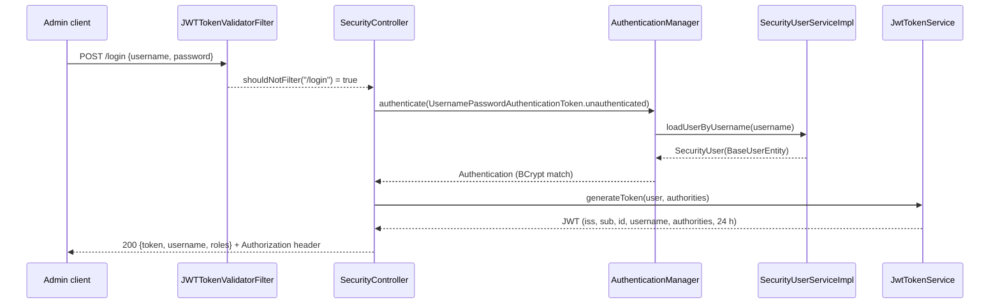
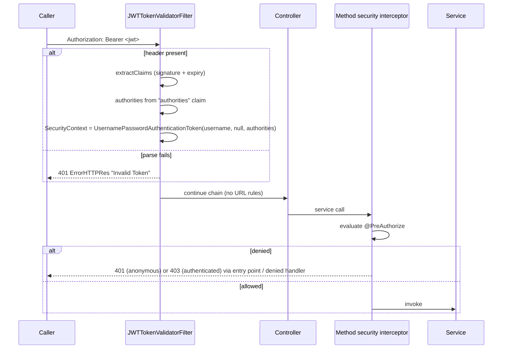

# Authentication and Authorization — wpmanager

#doc #explanation #ref-wpmanager #security

**Project:** `wpmanager/` · **Stack:** Spring Boot 3.4.1, Java 21 · **Index:** [[Docs/wpmanager/wpmanager-Index]]

## Summary

Admins log in with a JSON `POST /login` and receive a 24-hour HMAC-signed JWT carrying their id, username and
authorities. Clients never log in: their password is derived by the server, and an admin mints their token
through `GET /client/token/{username}`. On every request a filter verifies the token and rebuilds the
authentication from its claims alone, with no database lookup. The filter chain has **no URL rules**; all
authorization is `@PreAuthorize` on service methods. Method security **is active**: `@EnableMethodSecurity`
sits on three `@Service` classes and Spring processes it there, which switches method security on for the
whole application. Anything that is not behind an annotated service method is therefore anonymous.

## Why It Is Built This Way

The vault's security doc describes a stateless design tuned for zero database hits per request
(`wpmanager/wpManagerDocs/Docs/Login and Security Architecture.md:18-26`). The database lookup was removed by
a vault task that moved authority rebuilding from the database into the token
(`wpmanager/wpManagerDocs/Tasks/done/Optimize-JWT-Validation-step-1-1-Remove-DB-Hits.md`), and HTTP Basic login
was replaced with a JSON endpoint (`wpmanager/wpManagerDocs/Tasks/done/Optimize-Login-Architecture-step-2-1-JSON-Login.md`).
Authorization on services rather than URLs lets each module declare its own rules next to its logic. No
document explains why `@EnableMethodSecurity` is on services rather than on `SecurityConfig`.

## How It Works

### Login



Sources: `wpmanager/src/main/java/com/wpmanager/configuration/security/SecurityController.java:34-66`,
`wpmanager/src/main/java/com/wpmanager/shared/securityUser/SecurityUserServiceImpl.java:18-25`,
`wpmanager/src/main/java/com/wpmanager/configuration/filter/JwtTokenService.java:31-44`,
`wpmanager/src/main/java/com/wpmanager/configuration/filter/JWTTokenValidatorFilter.java:94-97`. The signing key
is `Keys.hmacShaKeyFor` over the `TK_KEY` property
(`wpmanager/src/main/java/com/wpmanager/configuration/filter/JwtTokenService.java:21-29`); issuer and subject
are constants (`wpmanager/src/main/java/com/wpmanager/constant/ApplicationConstants.java:4-7`).

### Authenticated request



The filter accepts the token with or without the `Bearer ` prefix and never touches the database
(`wpmanager/src/main/java/com/wpmanager/configuration/filter/JWTTokenValidatorFilter.java:35-92`). The
principal is the username string.

### The filter chain

```java
// wpmanager/src/main/java/com/wpmanager/configuration/security/SecurityConfig.java:47-58
@Bean
public SecurityFilterChain securityFilterChain(HttpSecurity http, CorsConfigurationSource corsConfigurationSource) throws Exception{
    http
            .csrf(AbstractHttpConfigurer::disable)
            .cors(cors -> cors.configurationSource(corsConfigurationSource()))
            .sessionManagement(session ->
                    session.sessionCreationPolicy(SessionCreationPolicy.STATELESS))
            .exceptionHandling(ex ->
                    ex.authenticationEntryPoint(authenticationEntryPoint())
                            .accessDeniedHandler(accessDeniedHandler()))
            .addFilterBefore(jwtTokenValidatorFilter, BasicAuthenticationFilter.class);
    return http.build();
}
```

There is no `authorizeHttpRequests(...)`, so the chain permits every request. The CORS source used is the one
built by calling `corsConfigurationSource()` directly, not the injected bean parameter; it allows only
`http://localhost:3000` (`wpmanager/src/main/java/com/wpmanager/configuration/security/SecurityConfig.java:93-110`).
`@EnableWebSecurity` appears on both the application class and `SecurityConfig`
(`wpmanager/src/main/java/com/wpmanager/WpmanagerApplication.java:10`,
`wpmanager/src/main/java/com/wpmanager/configuration/security/SecurityConfig.java:30`).

### Method-security activation

`@EnableMethodSecurity` is on three `@Service` classes and on no `@Configuration` class
(`wpmanager/src/main/java/com/wpmanager/models/downloads/plugin/PluginService.java:35-37`,
`wpmanager/src/main/java/com/wpmanager/models/downloads/author/AuthorService.java:28-30`,
`wpmanager/src/main/java/com/wpmanager/models/hq/plan/PlanService.java:19-21`). It is honored, and globally:

- `@EnableMethodSecurity` is meta-annotated with `@Import(MethodSecuritySelector.class)` (verified with
  `javap` on `spring-security-config-6.4.2.jar`).
- Spring's configuration-class processing treats any class annotated with `@Component` (and so `@Service`),
  `@ComponentScan`, `@Import` or `@ImportResource` as a "lite" configuration candidate and processes its
  imports: the `candidateIndicators` set in `ConfigurationClassUtils` contains exactly those four annotations
  (verified with `javap` on `spring-context-6.2.1.jar`).
- The imported registrars define the method-security advisors as ordinary beans, and the auto-proxy creator
  applies them to every bean, not just the annotated service.
- Runtime evidence: the recorded Surefire run of `E2EAuthorTest` passed 68 tests with no failures
  (`wpmanager/target/surefire-reports`), including a CLIENT token receiving 403 on `POST /author` and an
  anonymous caller receiving 401 on `GET /author/{id}`
  (`wpmanager/src/test/java/com/wpmanager/models/author/E2EAuthorTest.java:120-132`,
  `wpmanager/src/test/java/com/wpmanager/models/author/E2EAuthorTest.java:382-401`). Both results require
  method security to be evaluated.

The same mechanism explains `backend/`: it inherited `SecurityConfig` unchanged but none of these three
services, so it has no `@EnableMethodSecurity` anywhere and its annotations are inert
([[Docs/backend/Reviews/01-Security-Review#BE-R01-01|BE-R01-01]]).

### `@PreAuthorize` inventory (35)

| Rule | Count | Where |
|---|---|---|
| `isAuthenticated()` | 5 | every method of `DefaultServiceImplements` (`wpmanager/src/main/java/com/wpmanager/shared/defaultImplements/DefaultServiceImplements.java:34-72`) |
| `hasRole('ADMIN')` on services | 27 | Admin (2), Client (3), Plan (3), S3Provider (1), Downloadable (1), Author (3), Plugin (4), Theme (4), PluginCategory (3), ThemeCategory (3) |
| `hasRole('ADMIN')` on controllers | 2 | `PluginController.upload`, `ThemeController.upload` (`wpmanager/src/main/java/com/wpmanager/models/downloads/plugin/PluginController.java:45-46`) |
| `hasRole('ADMIN')` on a non-bean | 1 | `S3StorageClient.uploadFile` (`wpmanager/src/main/java/com/wpmanager/models/storage/s3/S3StorageClient.java:63-65`); the class is created with `new`, so no proxy evaluates it |

Endpoints with no service method behind them — `/tests3/*`
(`wpmanager/src/main/java/com/wpmanager/models/storage/s3/S3FileUploadController.java:26-161`), `GET /test`
(`wpmanager/src/main/java/com/wpmanager/configuration/security/SecurityController.java:68-71`) and anything Spring
Data REST exports — have no rule at all.

### Ownership checks

`AuthUserUtil` reads the username from the `SecurityContext` and loads the matching `ClientEntity` or
`AdminEntity` (`wpmanager/src/main/java/com/wpmanager/shared/tools/AuthUserUtil.java:30-63`). Two services use
it to scope data to the caller:

- `WebsiteService.insert` attaches the website to the calling client and enforces the plan's website limit;
  `update` rejects websites owned by another client
  (`wpmanager/src/main/java/com/wpmanager/models/hq/website/WebsiteService.java:55-69`,
  `wpmanager/src/main/java/com/wpmanager/models/hq/website/WebsiteService.java:134-137`).
- `FavoriteListService.insert` adds the list to the caller; `update` requires the list to be one of the
  caller's (`wpmanager/src/main/java/com/wpmanager/models/hq/favoriteList/FavoriteListService.java:64-130`).

`getOne`, `getAll` and `delete` for these modules are inherited and have no ownership check.

### Client credentials and tokens

- On insert the client's password is `BCrypt(HMAC-SHA256(email + wpID))` using the file-signature secret; the
  raw value is never returned (`wpmanager/src/main/java/com/wpmanager/models/hq/client/ClientService.java:106-116`).
  It is recomputed when the e-mail or wpID changes
  (`wpmanager/src/main/java/com/wpmanager/models/hq/client/ClientService.java:232-236`).
- An admin mints a client token with `GET /client/token/{username}`; the service method is `hasRole('ADMIN')`
  (`wpmanager/src/main/java/com/wpmanager/models/hq/client/ClientController.java:24-30`,
  `wpmanager/src/main/java/com/wpmanager/models/hq/client/ClientService.java:241-252`).

### Seed admin

On start-up, if there are no admins, `AdminBoostrap` creates one with a fixed username and password
(`wpmanager/src/main/java/com/wpmanager/configuration/boostrap/AdminBoostrap.java:34-52`; password value
`<redacted>`).

### Account flags

`SecurityUser` defines `getAccountNonExpired()`, `getAccountNonLocked()`, `getCredentialsNonExpired()` and
`getEnabled()` (`wpmanager/src/main/java/com/wpmanager/shared/securityUser/SecurityUser.java:36-50`), but
`UserDetails` declares `isAccountNonExpired()` and friends as `default` methods returning `true` in Spring
Security 6.4, so the entity's flags are never consulted.

## Key Components

| Component | Path | Responsibility |
|---|---|---|
| Filter chain | `wpmanager/src/main/java/com/wpmanager/configuration/security/SecurityConfig.java` | CSRF off, CORS, stateless, JSON 401/403, JWT filter |
| Login | `wpmanager/src/main/java/com/wpmanager/configuration/security/SecurityController.java` | `POST /login` |
| Token service | `wpmanager/src/main/java/com/wpmanager/configuration/filter/JwtTokenService.java` | Sign and parse JWTs |
| Token filter | `wpmanager/src/main/java/com/wpmanager/configuration/filter/JWTTokenValidatorFilter.java` | Rebuild authentication from claims |
| User adapter | `wpmanager/src/main/java/com/wpmanager/shared/securityUser/SecurityUser.java` | `UserDetails` over `BaseUserEntity` |
| Caller lookup | `wpmanager/src/main/java/com/wpmanager/shared/tools/AuthUserUtil.java` | Current admin/client entity |
| Seed admin | `wpmanager/src/main/java/com/wpmanager/configuration/boostrap/AdminBoostrap.java` | First admin |

## Conventions and Rules

- Put `@PreAuthorize` on every service method a controller calls; the base service supplies
  `isAuthenticated()`.
- Resolve "who is calling" with `AuthUserUtil`, never from request parameters.
- Admin-only features use `hasRole('ADMIN')`; roles are stored without the `ROLE_` prefix and
  `UserRoles.getAuthority()` adds it (`wpmanager/src/main/java/com/wpmanager/shared/models/baseUser/UserRoles.java:3-11`).
- Security errors use the same `ErrorHTTPRes` JSON shape as application errors.

## How to Replicate

1. Create `SecurityConfig` with the chain above, a `BCryptPasswordEncoder` bean, JSON entry point and denied
   handler, and an `AuthenticationManager` bean.
2. Create `JwtTokenService` (JJWT 0.12 `signWith`/`verifyWith`) and `JWTTokenValidatorFilter`
   (`OncePerRequestFilter`, skip `/login`).
3. Create `SecurityUser` and `SecurityUserServiceImpl` over the user root entity.
4. Create `SecurityController` with `POST /login`.
5. Put `@EnableMethodSecurity` on `SecurityConfig` (wpmanager puts it on services; see the review), and add
   `authorizeHttpRequests` rules as the outer layer.

## Known Limitations

- No URL rules: unannotated endpoints are anonymous
  ([[Docs/wpmanager/Reviews/01-Security-Review#WP-R01-01|WP-R01-01]],
  [[Docs/wpmanager/Reviews/01-Security-Review#WP-R01-02|WP-R01-02]]).
- Inherited operations and missing ownership checks let clients act on others' data and on admin data
  ([[Docs/wpmanager/Reviews/01-Security-Review#WP-R01-03|WP-R01-03]]).
- Method security depends on three service classes
  ([[Docs/wpmanager/Reviews/01-Security-Review#WP-R01-11|WP-R01-11]]).
- JWT design, ignored account flags, derived client passwords and the seed admin
  ([[Docs/wpmanager/Reviews/01-Security-Review#WP-R01-08|WP-R01-08]],
  [[Docs/wpmanager/Reviews/01-Security-Review#WP-R01-09|WP-R01-09]],
  [[Docs/wpmanager/Reviews/01-Security-Review#WP-R01-10|WP-R01-10]],
  [[Docs/wpmanager/Reviews/01-Security-Review#WP-R01-07|WP-R01-07]]).

## Related Documents

- [[Docs/wpmanager/Explanations/10-Customer-Domain]]
- [[Docs/wpmanager/Explanations/12-Configuration-and-Secrets]]
- [[Docs/wpmanager/Reviews/01-Security-Review]]
- [[Docs/backend/Explanations/07-Authentication-and-Authorization]]
