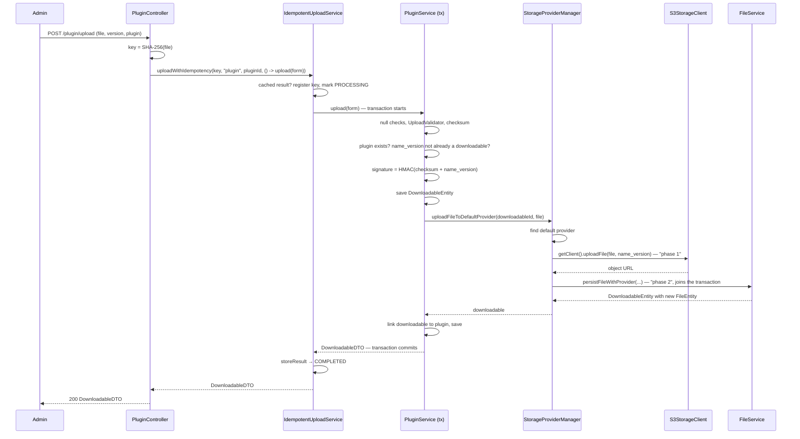
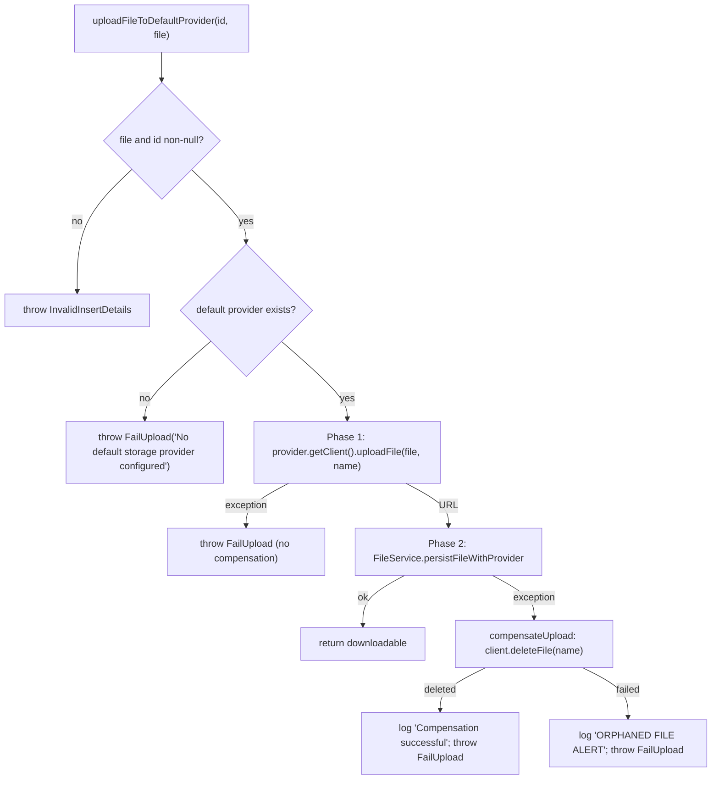

# Upload Pipeline — wpmanager

#doc #explanation #ref-wpmanager #architecture

**Project:** `wpmanager/` · **Stack:** Spring Boot 3.4.1, Java 21 · **Index:** [[Docs/wpmanager/wpmanager-Index]]

## Summary

`POST /plugin/upload` turns a multipart ZIP into a new plugin version. The controller hashes the file and
hands the work to the idempotency wrapper; `PluginService.upload` validates the request and the file, derives
a checksum and an HMAC signature, rejects duplicate versions, saves a `DownloadableEntity`, and asks
`StorageProviderManager` to upload the file to the default storage provider and record a `FileEntity` for it.
If recording the file fails after the object was stored, the manager deletes the object again
(**compensation**). The manager calls this a two-phase upload; both phases run inside the transaction opened
by `PluginService.upload`. Theme upload has the same shape but never saves the downloadable first.

## Why It Is Built This Way

The vault's "File Upload Process" explains the intent: upload to the provider first, outside any transaction,
then persist in a short transaction, and delete the object if persistence fails, so no orphaned objects remain
(`wpmanager/wpManagerDocs/Docs/File Upload Process.md:211-280`). The design was a response to two bug notes,
"Transaction Boundary Violation in StorageProviderManager" and "Partial Upload Orphans Files", both now in
`Bugs/done` (`wpmanager/wpManagerDocs/Bugs/done/Transaction Boundary Violation in StorageProviderManager.md`,
`wpmanager/wpManagerDocs/Bugs/done/Partial Upload Orphans Files.md`). The code implements the compensation;
it does not implement the "outside any transaction" part, because the caller is transactional (see below).

## How It Works

### Sequence

Sources: `wpmanager/src/main/java/com/wpmanager/models/downloads/plugin/PluginController.java:45-73`,
`wpmanager/src/main/java/com/wpmanager/models/downloads/plugin/PluginService.java:158-207`,
`wpmanager/src/main/java/com/wpmanager/models/storage/storageProviderManager/StorageProviderManager.java:75-159`,
`wpmanager/src/main/java/com/wpmanager/models/files/file/FileService.java:78-134`.

### Validation

1. Form, version, plugin id and file must be non-null
   (`wpmanager/src/main/java/com/wpmanager/models/downloads/plugin/PluginService.java:161-176`).
2. `UploadValidator` checks size against `upload.max-file-size` (default 100 MB), a `.zip` file name, and a
   `Content-Type` of `application/zip` or `application/x-zip-compressed`
   (`wpmanager/src/main/java/com/wpmanager/shared/tools/UploadValidator.java:11-32`). Spring's multipart limit
   is also 100 MB (`wpmanager/src/main/resources/application.properties:9-11`).
3. The plugin must exist (`wpmanager/src/main/java/com/wpmanager/models/downloads/plugin/PluginService.java:180-185`).

### Checksum, name and signature

- Checksum: streaming SHA-256 of the file, lower-case hex
  (`wpmanager/src/main/java/com/wpmanager/shared/tools/ChecksumUtils.java:12-33`). It is computed twice per
  request, once in the controller for the idempotency key and once in the service.
- Version name: `pluginName + "_" + version`
  (`wpmanager/src/main/java/com/wpmanager/models/downloads/plugin/PluginService.java:186`). It doubles as the
  object key in the bucket.
- Signature: `FileSigner.sign(checksum + name)`, HMAC-SHA256 with `file.signature.secret`, Base64
  (`wpmanager/src/main/java/com/wpmanager/shared/tools/FileSigner.java:37-55`). The signature identifies the
  version in every provider's file map.

### Duplicate-version check

`downloadableRepository.findByNameAndVersion(name_version, version)` must be empty, otherwise
`InvalidInsertDetails("Version … already exists …")`
(`wpmanager/src/main/java/com/wpmanager/models/downloads/plugin/PluginService.java:187-190`). There is no unique
constraint behind it.

### The two phases and compensation

Source: `wpmanager/src/main/java/com/wpmanager/models/storage/storageProviderManager/StorageProviderManager.java:84-158`
and `wpmanager/src/main/java/com/wpmanager/models/storage/storageProviderManager/StorageProviderManager.java:291-321`.
Phase 2 creates the `FileEntity`, puts it into the provider's file map and into the downloadable's file set
(`wpmanager/src/main/java/com/wpmanager/models/files/file/FileService.java:91-133`).

### Transaction boundaries as written

`PluginService.upload` is `@Transactional(rollbackFor = InvalidInsertDetails.class)`
(`wpmanager/src/main/java/com/wpmanager/models/downloads/plugin/PluginService.java:158-160`), so the downloadable
save, the provider upload and phase 2 all run in one transaction. `StorageProviderManager` has no
transaction annotation on the upload method, and `FileService.persistFileWithProvider` uses the default
`REQUIRED` propagation, so it joins the caller's transaction. With Spring's default rules a checked
exception commits unless listed in `rollbackFor`; `FailUpload` is checked
(`wpmanager/src/main/java/com/wpmanager/exceptions/FailUpload.java:3`) and not listed.

### How theme upload differs

`ThemeService.upload` performs the same validation and derivations but builds the `DownloadableEntity` without
saving it and passes its `null` id to the manager, and it has no duplicate-version check
(`wpmanager/src/main/java/com/wpmanager/models/downloads/theme/ThemeService.java:172-189`). The manager rejects a
`null` id with `InvalidInsertDetails("File or details are null")`
(`wpmanager/src/main/java/com/wpmanager/models/storage/storageProviderManager/StorageProviderManager.java:85-88`).
Its transaction uses default rollback rules (`wpmanager/src/main/java/com/wpmanager/models/downloads/theme/ThemeService.java:145-147`).

### Response

The response body is the `DownloadableDTO`: id, version, name, checksum, signature, date and the mini DTOs of
its files (`wpmanager/src/main/java/com/wpmanager/models/files/downloadable/DownloadableDTO.java:15-25`).

## Key Components

| Component | Path | Responsibility |
|---|---|---|
| Upload endpoint | `wpmanager/src/main/java/com/wpmanager/models/downloads/plugin/PluginController.java` | Hash file, call idempotency wrapper |
| Upload service | `wpmanager/src/main/java/com/wpmanager/models/downloads/plugin/PluginService.java` | Validate, derive, save version, link |
| Upload manager | `wpmanager/src/main/java/com/wpmanager/models/storage/storageProviderManager/StorageProviderManager.java` | Provider upload, persist, compensate |
| File persistence | `wpmanager/src/main/java/com/wpmanager/models/files/file/FileService.java` | File row, provider map, downloadable set |
| File checks | `wpmanager/src/main/java/com/wpmanager/shared/tools/UploadValidator.java` | Size, extension, MIME |
| Hash and signature | `wpmanager/src/main/java/com/wpmanager/shared/tools/ChecksumUtils.java`, `wpmanager/src/main/java/com/wpmanager/shared/tools/FileSigner.java` | SHA-256, HMAC-SHA256 |

## Conventions and Rules

- Every upload endpoint goes through `IdempotentUploadService` with the file checksum as key.
- Versions are named `<parentName>_<version>`, and that name is the object key in every bucket.
- Only the default provider receives the upload synchronously; the other providers get the file from the
  replication job.
- Compensation is best effort: failures are logged with "ORPHANED FILE ALERT" and not rethrown.

## How to Replicate

1. Add `POST /<type>/upload` taking `file`, `version` and the parent id as request parameters.
2. In the controller compute the SHA-256 key and call `IdempotentUploadService.uploadWithIdempotency`.
3. In the service: validate, hash, sign, check `findByNameAndVersion`, save the `DownloadableEntity`, call
   `StorageProviderManager.uploadFileToDefaultProvider(savedId, file)`, link to the parent, return the DTO.
4. Keep the manager's compensation on persistence failure.
5. Follow the review's recommended pattern for the transaction boundary rather than wrapping the whole service
   method in one transaction.

## Known Limitations

- A provider failure commits the saved downloadable, which then blocks that version
  ([[Docs/wpmanager/Reviews/03-Upload-Transactions-and-Consistency-Review#WP-R03-01|WP-R03-01]]).
- Both phases share one transaction
  ([[Docs/wpmanager/Reviews/03-Upload-Transactions-and-Consistency-Review#WP-R03-02|WP-R03-02]]), and
  compensation misses failures after phase 2
  ([[Docs/wpmanager/Reviews/03-Upload-Transactions-and-Consistency-Review#WP-R03-03|WP-R03-03]]).
- Theme upload never succeeds ([[Docs/wpmanager/Reviews/07-Service-Design-Review#WP-R07-01|WP-R07-01]]).
- The MIME check trusts the client ([[Docs/wpmanager/Reviews/08-Error-Handling-and-Validation-Review#WP-R08-05|WP-R08-05]]).

## Related Documents

- [[Docs/wpmanager/Explanations/08-Upload-Idempotency]]
- [[Docs/wpmanager/Explanations/09-Storage-Providers-and-Replication]]
- [[Docs/wpmanager/Reviews/03-Upload-Transactions-and-Consistency-Review]]
- [[Docs/wpmanager/Reviews/04-Idempotency-Review]]
